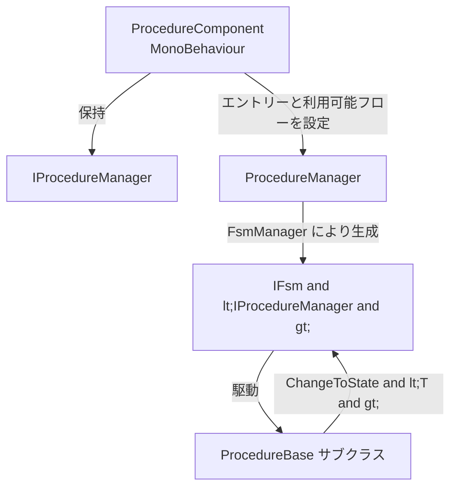

# Procedure とは

Procedure は、GameFrameX が Unity 向けに提供する、有限状態機械（FSM）に基づくゲームフロー管理ソリューションです。ゲームライフサイクルを切り替え可能な「フロー状態」（スプラッシュ、プリロード、ログイン、メインメニューなど）の集合に分解し、`ProcedureComponent` が `ProcedureManager` 内部の FSM を駆動して状態間の自動切り替えを行います。これにより、起動順序、リソース読み込み、シーン遷移を散在する `MonoBehaviour` ではなくコードで制御できます。

## クイックスタート

1. Unity プロジェクトの `Packages/manifest.json` に依存関係を追加します（いずれかの方法を選択）：
   - scoped registry 経由：`https://gameframex.upm.alianblank.uk`、スコープ `com.gameframex`、依存関係 `com.gameframex.unity.procedure`。
   - 直接 Git URL：`https://github.com/gameframex/com.gameframex.unity.procedure.git`。
2. 独自のフロークラスを作成し、[ProcedureBase.cs](https://github.com/GameFrameX/com.gameframex.unity.procedure/blob/main/Runtime/Procedure/ProcedureBase.cs#L38-L99) を継承してライフサイクルコールバックをオーバーライドします。
3. シーン内でメニュー `GameFrameX/Procedure` から `ProcedureComponent` を追加し、フロークラス名を Inspector の *Available Procedures* に記入し、*Entrance Procedure* を指定します。
4. ゲームを実行すると、フレームワークはエントリーフローで起動し、`OnUpdate` 内で `ChangeToState<T>` により次のフェーズへ切り替えます。

以下は「スプラッシュ → プリロード → メインメニュー」の最小三段階フロー例です：

```csharp
using GameFrameX.Procedure.Runtime;
using GameFrameX.Fsm.Runtime;

public class ProcedureSplash : ProcedureBase
{
    protected internal override void OnEnter(IFsm<IProcedureManager> procedureOwner)
    {
        // スプラッシュ画面を表示
    }

    protected internal override void OnUpdate(IFsm<IProcedureManager> procedureOwner, float elapseSeconds, float realElapseSeconds)
    {
        ChangeToState<ProcedurePreload>(procedureOwner);
    }
}

public class ProcedurePreload : ProcedureBase
{
    protected internal override void OnEnter(IFsm<IProcedureManager> procedureOwner)
    {
        // ゲームリソースを読み込む
    }

    protected internal override void OnUpdate(IFsm<IProcedureManager> procedureOwner, float elapseSeconds, float realElapseSeconds)
    {
        ChangeToState<ProcedureMain>(procedureOwner);
    }
}

public class ProcedureMain : ProcedureBase
{
    protected internal override void OnEnter(IFsm<IProcedureManager> procedureOwner)
    {
        // メインメニューを表示
    }
}
```

出典: [README.zh-CN.md](https://github.com/GameFrameX/com.gameframex.unity.procedure/blob/main/README.zh-CN.md#L86-L110)

## 仕組みの概要

Procedure パッケージは 3 つの中心的なタイプの連携に基づいています：



- **ProcedureComponent** — ゲームオブジェクトにアタッチするエントリポイント。`IProcedureManager` の登録、Inspector 設定の読み取り、起動のトリガーを担当します。[ProcedureComponent.cs](https://github.com/GameFrameX/com.gameframex.unity.procedure/blob/main/Runtime/Procedure/ProcedureComponent.cs#L46-L99) を参照。
- **ProcedureManager** — FSM の実際の保持者で、すべてのフローインスタンスと状態遷移を管理します。
- **ProcedureBase** — `FsmState<IProcedureManager>` を継承し、`OnInit / OnEnter / OnUpdate / OnFixedUpdate / OnLeave / OnDestroy` の 6 つのライフサイクルコールバックを提供します。

各フロークラスは `ChangeToState<T>(procedureOwner)` を呼び出して「条件を満たした後にどこへ遷移するか」を能動的に宣言します。これにより遷移ロジックがフロー自身に集約され、個々の UI / リソーススクリプトに散らかるのを防ぎます。

## 次に読むべきドキュメント

- ライフサイクルコールバックの全リストと典型的な使い方については、《フロー生命周期（フローライフサイクル）》を参照。
- 初期化フェーズにカスタムロジックを挿入したい、または `Already exist FSM` 競合を回避したい場合は、《UseStartupRunner パターン》を参照。
- すべての公開 API（プロパティ、メソッドシグネチャ）については、《API リファレンス》を参照。
- `Procedure not found` やフローが切り替わらないなどの問題に遭遇した場合は、《よくあるエラーとトラブルシューティング》を参照。