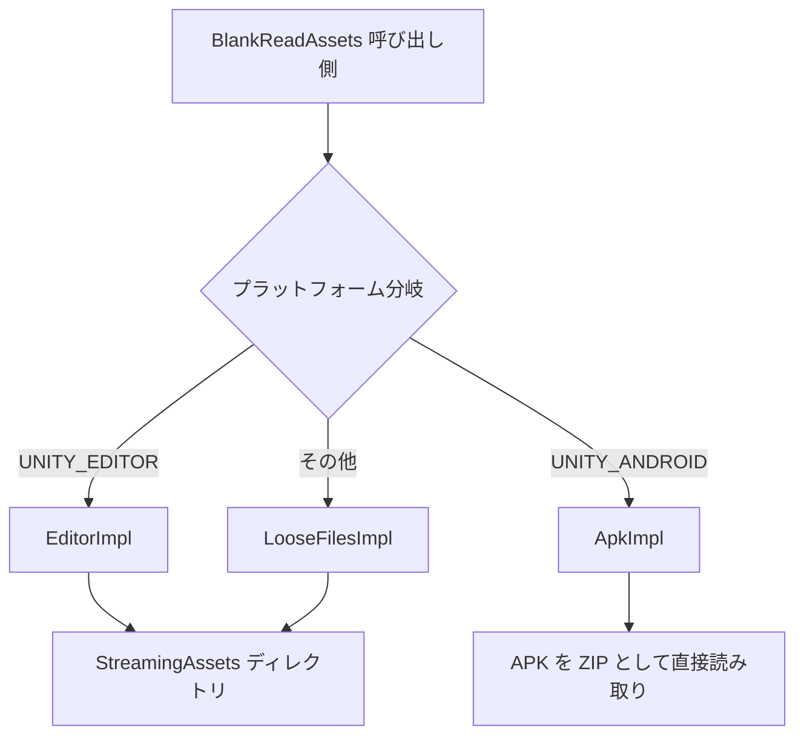

# 仕組みの概要:StreamingAssets と APK の統一アクセス

GameFrameX.ReadAssets は、統一された `System.IO` スタイルの API によって、「通常のプラットフォームで StreamingAssets ディレクトリを読み取る」シナリオと「Android 上で APK 内の `assets/` を直接読み取る」シナリオの両方を同時にサポートし、ランタイム時にプラットフォームに応じて自動的に実装を切り替え、初回 API 呼び出し時に自動的に初期化されます。

## クイックスタート

1. UPM でパッケージをインストール:
   ```json
   {
     "scopedRegistries": [
       {
         "name": "GameFrameX",
         "url": "https://gameframex.upm.alianblank.uk",
         "scopes": ["com.gameframex"]
       }
     ],
     "dependencies": {
       "com.gameframex.unity.readassets": "1.2.0"
     }
   }
   ```
2. コード内で直接静的 API を呼び出します。手動での `Initialize` は不要です(初回アクセス時に自動初期化されます):
   ```csharp
   using GameFrameX.ReadAssets.Runtime;
   using System.IO;

   // テキストの読み込み
   string text = BlankReadAssets.ReadAllText("config/game.json");

   // ストリームでの読み込み
   using (Stream s = BlankReadAssets.OpenRead("data/level1.bin"))
   {
       // ...
   }

   // AssetBundle を直接ロード(事前の APK 解凍不要)
   var ab = BlankReadAssets.LoadAssetBundle("bundles/ui.ab");
   ```

> すべての公開 API には `[Preserve]` 属性が付与されており、IL2CPP / AOT ビルドでも安全に使用できます。

## 仕組みの概要

エントリーポイント `BlankReadAssets` は `partial class` であり、`using` エイリアスによってプラットフォームごとに内部実装クラスを選択し、コンパイル時にどのロジックを呼び出すかを決定します:

```csharp
#if UNITY_EDITOR
using BlankReadAssetsImpl = GameFrameX.ReadAssets.Runtime.BlankReadAssets.EditorImpl;
#elif UNITY_ANDROID
using BlankReadAssetsImpl = GameFrameX.ReadAssets.Runtime.BlankReadAssets.ApkImpl;
#else
using BlankReadAssetsImpl = GameFrameX.ReadAssets.Runtime.BlankReadAssets.LooseFilesImpl;
#endif
```

Source: [BlankReadAssets.cs](https://github.com/GameFrameX/com.gameframex.unity.readassets/blob/main/Runtime/BlankReadAssets.cs#L11-L17)

3 つの実装はそれぞれ以下の役割を担います:

| 実装クラス | プラットフォーム | 読み取り方式 |
|--------|------|----------|
| `EditorImpl` | Unity Editor | `StreamingAssets` の実際ディレクトリを使用 |
| `ApkImpl` | Android(および Editor での APK デバッグ) | APK ファイルを直接開き、ZIP ローカルファイルヘッダーで位置を特定して `assets/` 内のエントリを読み取る |
| `LooseFilesImpl` | その他のプラットフォーム(PC、iOS、WebGL など) | ファイルシステムを使用 |



### Android APK 読み取りのキーアイデア

Android では `StreamingAssets` は実際には APK 内の `assets/` パスに存在します。`ApkImpl` は初期化時に APK の ZIP セントラルディレクトリを解析し、`assets/` 配下のすべてのエントリをパス順にソートして `s_paths` / `s_streamingAssets` の 2 つの配列にキャッシュします:

```csharp
public static void Initialize(string dataPath, string streamingAssetsPath)
{
    s_root = dataPath;
    // ...
    GetStreamingAssetsInfoFromJar(s_root, paths, parts);
    s_paths = paths.ToArray();
    s_streamingAssets = parts.ToArray();
}
```

Source: [BlankReadAssets.ApkImpl.cs](https://github.com/GameFrameX/com.gameframex.unity.readassets/blob/main/Runtime/BlankReadAssets.ApkImpl.cs#L27-L56)

読み取り時、`TryGetInfo` は二分探索でエントリを位置特定し、そのファイルの `offset` / `size` / `crc32` を取得します。次に `File.OpenRead` で APK 本体のファイルを開き、`SubReadOnlyStream` を使って `offset` / `size` の範囲を読み取り専用のサブストリームとして公開します:

```csharp
public static Stream OpenRead(string path)
{
    ReadInfo info;
    if (!TryGetInfo(path, out info))
    {
        ThrowFileNotFound(path);
    }

    Stream fileStream = File.OpenRead(info.readPath);
    try
    {
        return new SubReadOnlyStream(fileStream, info.offset, info.size, leaveOpen: false);
    }
    catch (System.Exception)
    {
        fileStream.Dispose();
        throw;
    }
}
```

Source: [BlankReadAssets.ApkImpl.cs](https://github.com/GameFrameX/com.gameframex.unity.readassets/blob/main/Runtime/BlankReadAssets.ApkImpl.cs#L208-L226)

> これが Android 上で `AssetBundle.LoadFromFileAsync` が動作する理由です。これは「読み取り可能 + オフセットが分かっている」だけを必要とし、`ApkImpl` は ZIP セントラルディレクトリから事前にオフセットを取得しているため、APK 全体を解凍する必要がありません。

### 遅延初期化とスレッドセーフ

`BlankReadAssets` は `s_initialized` フラグによって `Initialize` が 1 回しか実行されないことを保証しています:

```csharp
private static void EnsureInitialized()
{
    if (!s_initialized)
    {
        Initialize();
        s_initialized = true;
    }
}
```

Source: [BlankReadAssets.cs](https://github.com/GameFrameX/com.gameframex.unity.readassets/blob/main/Runtime/BlankReadAssets.cs#L37-L44)

すべての読み取り系 API(`FileExists` / `OpenRead` / `ReadAllBytes` / `GetFiles` など)は、まず `EnsureInitialized()` を呼び出してから `BlankReadAssetsImpl` に処理を委任します。そのため、ほとんどのシナリオでは呼び出し側が初期化のタイミングを意識する必要はありません。

## 次に

- ファイルやテキストを直接読み取りたい場合は、『StreamingAssets のテキストとバイナリの読み取り方』を参照してください
- AssetBundle を直接ロードしたい場合は、『StreamingAssets 内の AssetBundle のロード方法』を参照してください
- "ファイルが存在しない" や "圧縮リソースが読み取れない" などの問題が発生した場合は、『よくある質問とトラブルシューティング』を参照してください