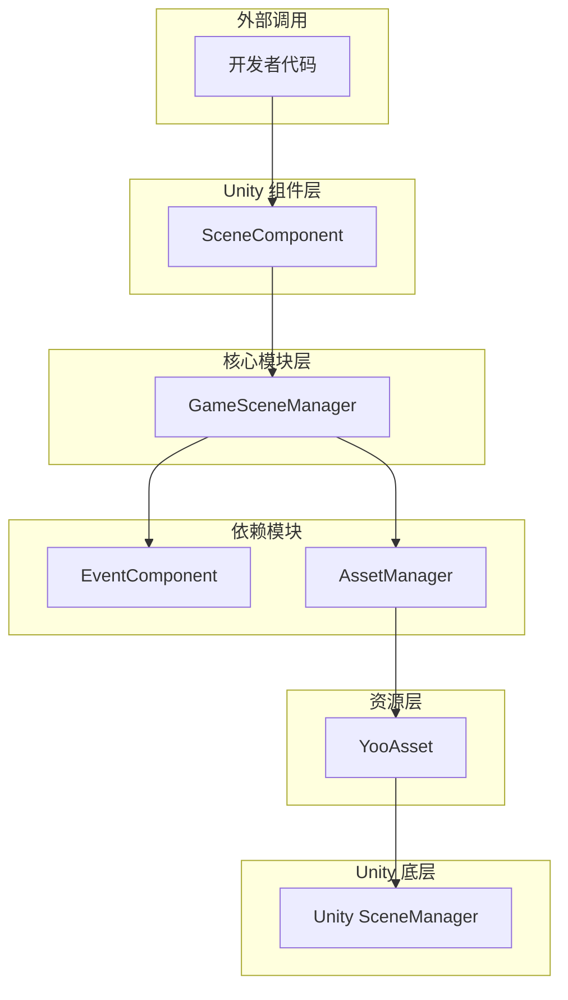
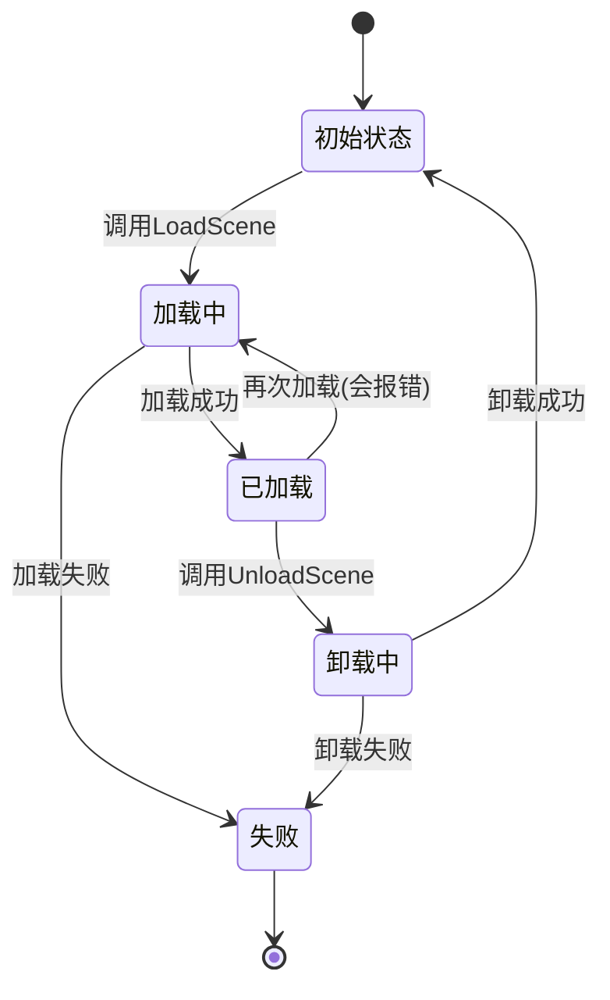

# 概要

GameFrameX Scene シーン管理コンポーネント是 GameFrameX 游戏フレームワーク的コアモジュール之一，提供します一套完全な的 Unity シーン管理解決策。该コンポーネントサポート异步シーンロード与アンロード、ロード進捗跟踪、シーンステータス查询およびイベントコールバック等機能。

## 概要

Scene シーン管理コンポーネント是 GameFrameX フレームワーク中专门负责処理 Unity シーンロード与アンロード的モジュール。它カプセル化了底层的リソースロード机制，通过 YooAsset リソース管理系统実装効率的的异步シーンロード，同時に提供します完善的イベント机制用于监听シーンステータス变化。

### コア职责

Scene コンポーネント的主な职责含みます：

- **异步シーンロード**：サポート非同期ロード Unity シーン，不阻塞主线程
- **シーンアンロード管理**：安全アンロード已ロード的シーンリソース
- **ステータス追踪**：维护所有シーン的ロードステータス（已ロード、ロード中、アンロード中）
- **イベント通知**：通过イベント系统通知シーンステータス变化
- **主摄像机管理**：自动追踪和管理主摄像机
- **シーン顺序控制**：サポート設定シーン激活顺序

### 設計意图

该コンポーネント采用分层アーキテクチャ設計，将シーン管理的コア逻辑与 Unity コンポーネント进行分离。`GameSceneManager` 作为コアモジュール処理所有シーン操作，而 `SceneComponent` 作为 Unity コンポーネント提供面向開発者的便捷インターフェース。这种設計使得コア逻辑更加清晰，便于单元テスト和モジュール复用。

コンポーネント使用 YooAsset 作为底层リソースロード系统，这保证了シーンロード的効率的性和可靠性。同時に，通过イベント系统与其他 GameFrameX コンポーネント（如 EventComponent、AssetComponent）进行解耦，実装了良好的モジュール化設計。

## アーキテクチャ



### コンポーネント層级説明

**Unity コンポーネント層（SceneComponent）**

`SceneComponent` 是継承自 `GameFrameworkComponent` 的 Unity コンポーネント，挂在到 GameObject 上つまり可使用。它负责初期化 `GameSceneManager` モジュール，并将シーンイベント转发给 `EventComponent`。

> Source: [SceneComponent.cs](https://github.com/GameFrameX/com.gameframex.unity.scene/blob/main/Runtime/Scene/SceneComponent.cs#L49-L50)

**コアモジュール层（GameSceneManager）**

`GameSceneManager` 是継承自 `GameFrameworkModule` 的コアモジュール，実装了 `IGameSceneManager` インターフェース。它负责所有シーン管理相关的コア逻辑，含みますシーンロード、アンロード、ステータス追踪等。

> Source: [GameSceneManager.cs](https://github.com/GameFrameX/com.gameframex.unity.scene/blob/main/Runtime/Scene/Scene/GameSceneManager.cs#L47-L47)

**依赖モジュール**

- **EventComponent**：负责イベント的发送和受信
- **AssetManager（IAssetManager）**：リソース管理インターフェース，由 YooAsset 実装

## コアコンセプト

### シーンロードモード

コンポーネントサポート两种 Unity シーンロードモード：

| モード | 説明 | 使用シーン |
|------|------|----------|
| `LoadSceneMode.Single` | 单一モード，ロード新シーン时自动アンロード当前シーン | 主シーン切换 |
| `LoadSceneMode.Additive` | 叠加モード，新シーン与现有シーン共存 | 多人游戏子シーン、UI 层叠 |

### シーンステータス

コンポーネント通过三个字典维护シーンステータス：



### イベント系统

コンポーネント定義了五个コアイベント用于监听シーンステータス变化：

| イベント | 説明 | トリガー时机 |
|------|------|----------|
| `LoadSceneSuccess` | ロード成功イベント | シーン成功ロード完成后 |
| `LoadSceneFailure` | ロード失敗イベント | シーンロード失敗时 |
| `LoadSceneUpdate` | ロード進捗アップデートイベント | シーンロード过程中 |
| `UnloadSceneSuccess` | アンロード成功イベント | シーン成功アンロード后 |
| `UnloadSceneFailure` | アンロード失敗イベント | シーンアンロード失敗时 |

## シーンロードフロー


## コア機能特性

### 1. 异步シーンロード

コンポーネント完全基于异步設計，所有シーンロード操作都返す `Task<SceneHandle>`，不会阻塞主线程。这对于〜する必要があります表示ロード界面的游戏尤为重要な。

```csharp
// 异步加载场景
var handle = await sceneComponent.LoadScene("Assets/Scenes/Main.unity");
```
> Source: [SceneComponent.cs#L280-L283](https://github.com/GameFrameX/com.gameframex.unity.scene/blob/main/Runtime/Scene/SceneComponent.cs#L280-L283)

### 2. シーンステータス查询

開発者〜できます随时查询シーン的当前ステータス：

```csharp
// 检查场景是否已加载
if (sceneComponent.SceneIsLoaded("Assets/Scenes/Main.unity"))
{
    // 场景已加载
}

// 检查场景是否正在加载
if (sceneComponent.SceneIsLoading("Assets/Scenes/Main.unity"))
{
    // 场景正在加载
}

// 获取所有已加载场景
var loadedScenes = sceneComponent.GetLoadedSceneAssetNames();
```
> Source: [SceneComponent.cs#L174-L186](https://github.com/GameFrameX/com.gameframex.unity.scene/blob/main/Runtime/Scene/SceneComponent.cs#L174-L186)

### 3. シーン顺序管理

コンポーネントサポート設定シーン的激活顺序，確認してください多个叠加シーン按照正确的顺序激活：

```csharp
// 设置场景顺序，数值越大越优先激活
sceneComponent.SetSceneOrder("Assets/Scenes/Game.unity", 100);
```
> Source: [SceneComponent.cs#L338-L367](https://github.com/GameFrameX/com.gameframex.unity.scene/blob/main/Runtime/Scene/SceneComponent.cs#L338-L367)

### 4. 主摄像机管理

コンポーネント自动追踪当前激活シーン中的主摄像机：

```csharp
// 刷新主摄像机引用
sceneComponent.RefreshMainCamera();

// 获取当前主摄像机
var mainCamera = sceneComponent.MainCamera;
```
> Source: [SceneComponent.cs#L369-L375](https://github.com/GameFrameX/com.gameframex.unity.scene/blob/main/Runtime/Scene/SceneComponent.cs#L369-L375)

### 5. イベント监听

開発者〜できます購読シーンイベント来响应ステータス变化：

```csharp
// 订阅场景加载成功事件
sceneComponent.LoadSceneSuccess += OnLoadSceneSuccess;

private void OnLoadSceneSuccess(object sender, LoadSceneSuccessEventArgs e)
{
    Debug.Log($"场景 {e.SceneAssetName} 加载成功，耗时 {e.Duration} 秒");
}
```
> Source: [SceneComponent.cs#L89-L95](https://github.com/GameFrameX/com.gameframex.unity.scene/blob/main/Runtime/Scene/SceneComponent.cs#L89-L95)

## 依赖关系

Scene コンポーネント依赖于以下 GameFrameX モジュール：

| 依赖モジュール | 説明 | 依赖タイプ |
|----------|------|----------|
| GameFrameX.Runtime | フレームワークコアランタイム | 强依赖 |
| GameFrameX.Event.Runtime | イベント系统 | 强依赖 |
| GameFrameX.Asset.Runtime | リソース管理系统 | 强依赖 |
| YooAsset | リソースロード底层実装 | 强依赖 |

> Source: [GameFrameX.Scene.Runtime.asmdef](https://github.com/GameFrameX/com.gameframex.unity.scene/blob/main/Runtime/GameFrameX.Scene.Runtime.asmdef#L3-L8)

## バージョン情報

| バージョン | リリース日期 | 主な变更 |
|------|----------|----------|
| 2.1.2 | 2026-03-16 | 修复ロード成功コールバックパラメータ |
| 2.1.1 | 2026-03-13 | 修复シーンロードステータス判断 |
| 2.1.0 | 2025-12-23 | アップデートシーンマネージャー |
| 2.0.0 | 2025-10-25 | アーキテクチャ重大升级 |

> Source: [CHANGELOG.md](https://github.com/GameFrameX/com.gameframex.unity.scene/blob/main/CHANGELOG.md)

## 関連リンク

- [インストールガイド](./02.installation)
- [快速入门](./03.getting-started)
- [コア機能](./04.core-features)
- [API リファレンス](./05.api-reference)
- [イベント系统](./06.events)
<!-- - [常见問題](./07.troubleshooting) -->
- [GitHub リポジトリ](https://github.com/GameFrameX/com.gameframex.unity.scene.git)
- [官方ドキュメント](https://gameframex.doc.alianblank.com/)
