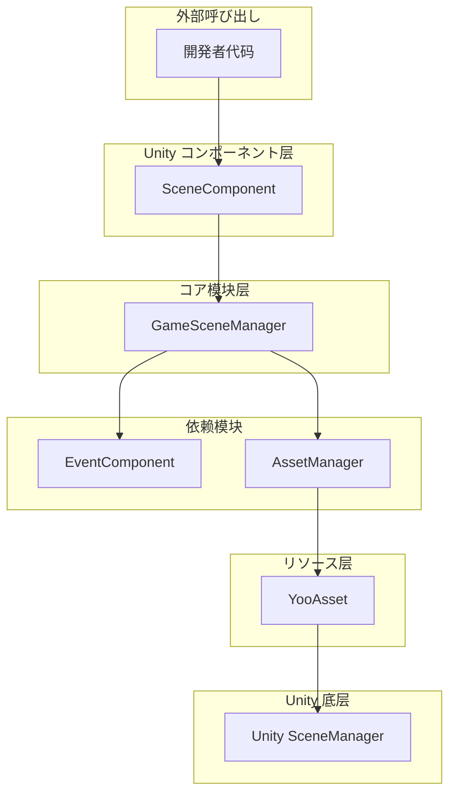
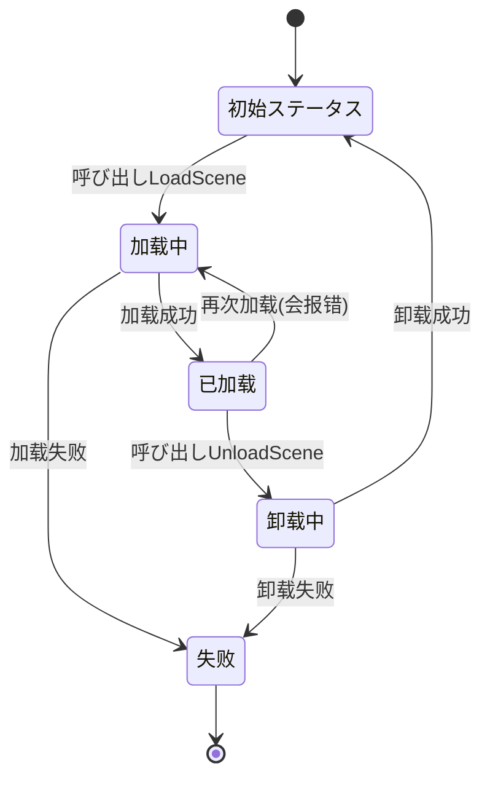
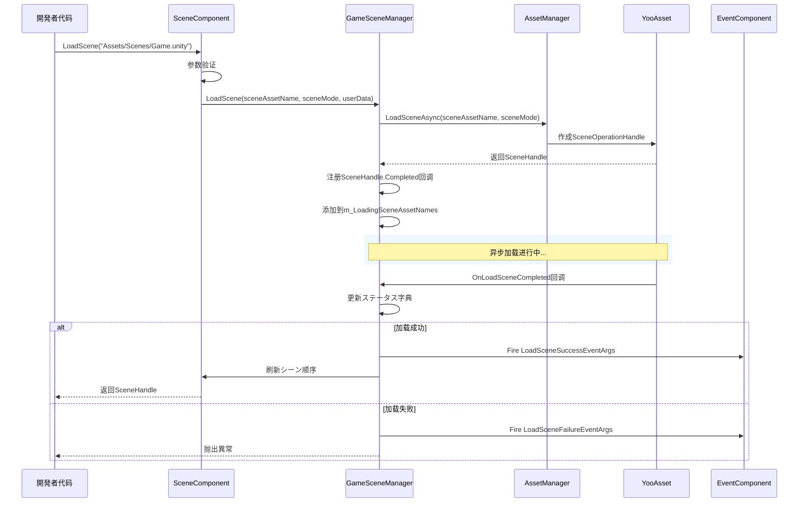

# 概要

GameFrameX Scene シーン管理コンポーネント是 GameFrameX ゲームフレームワーク的コア模块之一，提供します一套完整的 Unity シーン管理解決策。该コンポーネントサポート异步シーン加载与卸载、加载进度跟踪、シーンステータス查询以及イベント回调等機能。

## 概要

Scene シーン管理コンポーネント是 GameFrameX フレームワーク中专门负责处理 Unity シーン加载与卸载的模块。它封装了底层的リソース加载机制，を通じて YooAsset リソース管理系统実装高效的异步シーン加载，同时提供します完善的イベント机制に使用监听シーンステータス变化。

### コア职责

Scene コンポーネント的主要职责包括：

- **异步シーン加载**：サポート异步加载 Unity シーン，不阻塞主线程
- **シーン卸载管理**：安全卸载已加载的シーンリソース
- **ステータス追踪**：维护所有シーン的加载ステータス（已加载、加载中、卸载中）
- **イベント通知**：を通じてイベント系统通知シーンステータス变化
- **主摄像机管理**：自动追踪和管理主摄像机
- **シーン顺序控制**：サポート設定シーン激活顺序

### 设计意图

该コンポーネント采用分层アーキテクチャ設計，将シーン管理的コア逻辑与 Unity コンポーネント进行分离。`GameSceneManager` 作为コア模块处理所有シーン操作，而 `SceneComponent` 作为 Unity コンポーネント提供面向開発者的便捷インターフェース。这种设计使得コア逻辑更加清晰，便于单元测试和模块复用。

コンポーネント使用 YooAsset 作为底层リソース加载系统，这保证了シーン加载的高效性和可靠性。同时，を通じてイベント系统与其他 GameFrameX コンポーネント（如 EventComponent、AssetComponent）进行解耦，実装了良好的モジュラー設計。

## 架构



### コンポーネント层级説明

**Unity コンポーネント层（SceneComponent）**

`SceneComponent` 是を継承 `GameFrameworkComponent` 的 Unity コンポーネント，挂在到 GameObject 上即可使用。它负责初期化 `GameSceneManager` 模块，并将シーンイベント转发给 `EventComponent`。

> Source: [SceneComponent.cs](https://github.com/GameFrameX/com.gameframex.unity.scene/blob/main/Runtime/Scene/SceneComponent.cs#L49-L50)

**コア模块层（GameSceneManager）**

`GameSceneManager` 是を継承 `GameFrameworkModule` 的コア模块，実装了 `IGameSceneManager` インターフェース。它负责所有シーン管理関連的コア逻辑，包括シーン加载、卸载、ステータス追踪等。

> Source: [GameSceneManager.cs](https://github.com/GameFrameX/com.gameframex.unity.scene/blob/main/Runtime/Scene/Scene/GameSceneManager.cs#L47-L47)

**依赖模块**

- **EventComponent**：负责イベント的发送和接收
- **AssetManager（IAssetManager）**：リソース管理インターフェース，由 YooAsset 実装

## コアコンセプト

### シーン加载模式

コンポーネントサポート两种 Unity シーン加载模式：

| 模式 | 説明 | 使用シーン |
|------|------|----------|
| `LoadSceneMode.Single` | 单一模式，加载新シーン时自动卸载当前シーン | 主シーン切换 |
| `LoadSceneMode.Additive` | 叠加模式，新シーン与现有シーン共存 | 多人ゲーム子シーン、UI 层叠 |

### シーンステータス

コンポーネントを通じて三个字典维护シーンステータス：



### イベント系统

コンポーネント定义了五个コアイベントに使用监听シーンステータス变化：

| イベント | 説明 | 触发时机 |
|------|------|----------|
| `LoadSceneSuccess` | 加载成功イベント | シーン成功加载完成后 |
| `LoadSceneFailure` | 加载失败イベント | シーン加载失败时 |
| `LoadSceneUpdate` | 加载进度更新イベント | シーン加载过程中 |
| `UnloadSceneSuccess` | 卸载成功イベント | シーン成功卸载后 |
| `UnloadSceneFailure` | 卸载失败イベント | シーン卸载失败时 |

## シーン加载フロー



## コア機能特性

### 1. 异步シーン加载

コンポーネント完全基づく异步设计，所有シーン加载操作都返回 `Task<SceneHandle>`，不会阻塞主线程。这对于必要展示加载界面的ゲーム尤为重要。

```csharp
// 异步加载シーン
var handle = await sceneComponent.LoadScene("Assets/Scenes/Main.unity");
```
> Source: [SceneComponent.cs#L280-L283](https://github.com/GameFrameX/com.gameframex.unity.scene/blob/main/Runtime/Scene/SceneComponent.cs#L280-L283)

### 2. シーンステータス查询

開発者可能随时查询シーン的当前ステータス：

```csharp
// 检查シーン是否已加载
if (sceneComponent.SceneIsLoaded("Assets/Scenes/Main.unity"))
{
    // シーン已加载
}

// 检查シーン是否正在加载
if (sceneComponent.SceneIsLoading("Assets/Scenes/Main.unity"))
{
    // シーン正在加载
}

// 取得所有已加载シーン
var loadedScenes = sceneComponent.GetLoadedSceneAssetNames();
```
> Source: [SceneComponent.cs#L174-L186](https://github.com/GameFrameX/com.gameframex.unity.scene/blob/main/Runtime/Scene/SceneComponent.cs#L174-L186)

### 3. シーン顺序管理

コンポーネントサポート設定シーン的激活顺序，确保多个叠加シーン按照正确的顺序激活：

```csharp
// 設定シーン顺序，数值越大越优先激活
sceneComponent.SetSceneOrder("Assets/Scenes/Game.unity", 100);
```
> Source: [SceneComponent.cs#L338-L367](https://github.com/GameFrameX/com.gameframex.unity.scene/blob/main/Runtime/Scene/SceneComponent.cs#L338-L367)

### 4. 主摄像机管理

コンポーネント自动追踪当前激活シーン中的主摄像机：

```csharp
// 刷新主摄像机引用
sceneComponent.RefreshMainCamera();

// 取得当前主摄像机
var mainCamera = sceneComponent.MainCamera;
```
> Source: [SceneComponent.cs#L369-L375](https://github.com/GameFrameX/com.gameframex.unity.scene/blob/main/Runtime/Scene/SceneComponent.cs#L369-L375)

### 5. イベント监听

開発者可能订阅シーンイベント来响应ステータス变化：

```csharp
// 订阅シーン加载成功イベント
sceneComponent.LoadSceneSuccess += OnLoadSceneSuccess;

private void OnLoadSceneSuccess(object sender, LoadSceneSuccessEventArgs e)
{
    Debug.Log($"シーン {e.SceneAssetName} 加载成功，耗时 {e.Duration} 秒");
}
```
> Source: [SceneComponent.cs#L89-L95](https://github.com/GameFrameX/com.gameframex.unity.scene/blob/main/Runtime/Scene/SceneComponent.cs#L89-L95)

## 依赖关系

Scene コンポーネント依赖于以下 GameFrameX 模块：

| 依赖模块 | 説明 | 依赖クラス型 |
|----------|------|----------|
| GameFrameX.Runtime | フレームワークコア运行时 | 强依赖 |
| GameFrameX.Event.Runtime | イベント系统 | 强依赖 |
| GameFrameX.Asset.Runtime | リソース管理系统 | 强依赖 |
| YooAsset | リソース加载底层実装 | 强依赖 |

> Source: [GameFrameX.Scene.Runtime.asmdef](https://github.com/GameFrameX/com.gameframex.unity.scene/blob/main/Runtime/GameFrameX.Scene.Runtime.asmdef#L3-L8)

## バージョン情報

| 版本 | 发布日期 | 主要变更 |
|------|----------|----------|
| 2.1.2 | 2026-03-16 | 修复加载成功回调参数 |
| 2.1.1 | 2026-03-13 | 修复シーン加载ステータス判断 |
| 2.1.0 | 2025-12-23 | 更新シーン管理器 |
| 2.0.0 | 2025-10-25 | 架构重大升级 |

> Source: [CHANGELOG.md](https://github.com/GameFrameX/com.gameframex.unity.scene/blob/main/CHANGELOG.md)

## 関連リンク

- [安装指南](./02.installation)
- [快速入门](./03.getting-started)
- [コア機能](./04.core-features)
- [API 参考](./05.api-reference)
- [イベント系统](./06.events)
<!-- - [常见问题](./07.troubleshooting) -->
- [GitHub 仓库](https://github.com/GameFrameX/com.gameframex.unity.scene.git)
- [官方文档](https://gameframex.doc.alianblank.com/)
