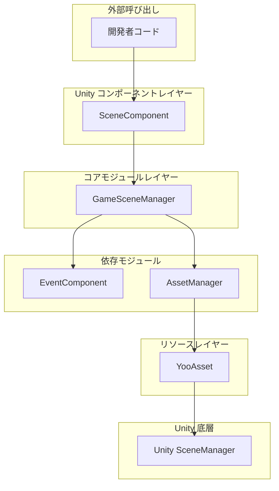
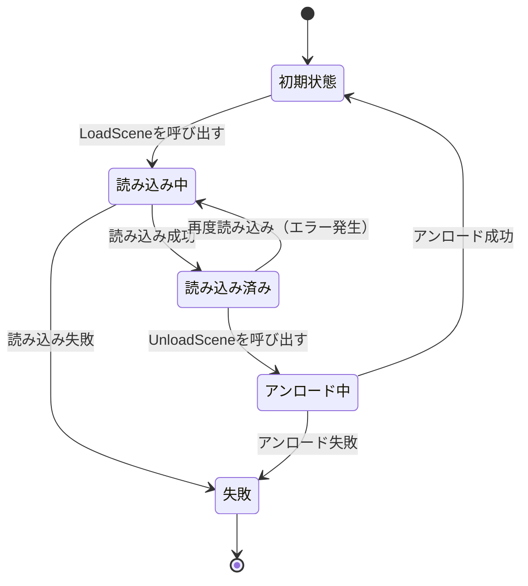
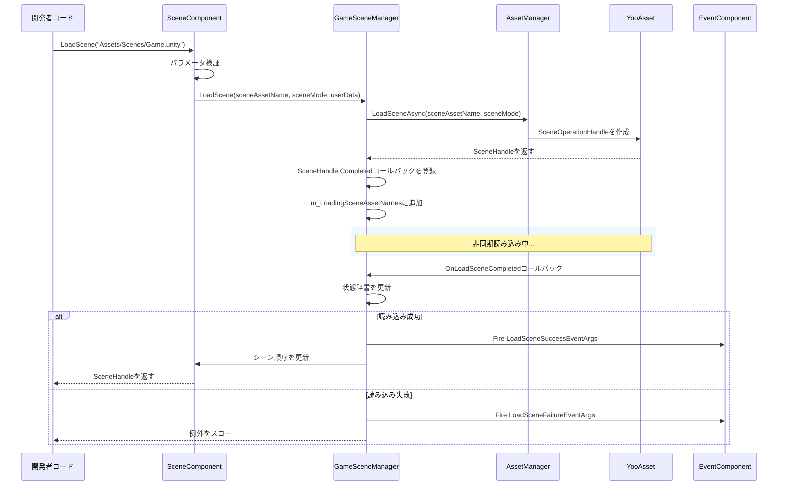

# 概要

GameFrameX Scene シーンマネージャーは、GameFrameX ゲームフレームワークのコアモジュールの1つであり、Unity シーンマネジメントの完全なソリューションを提供します。このコンポーネントは、非同期シーン読み込みとアンロード、読み込み進捗追跡、シー状態查询、イベントコールバックなどの機能をサポートします。

## 概要

Scene シーンマネジメントコンポーネントは、GameFrameX フレームワークにおいて Unity シーンの読み込みとアンロードを专门に処理するモジュールです。底層のリソース読み込みメカニズムを封装し、YooAsset リソース管理システムを通じて高效な非同期シーン読み込みを実現すると同時に、シー状態変化を监听するための完全なイベントメカニズムを提供します。

### コア責務

Scene コンポーネントの主な責務は以下を含みます：

- **非同期シーン読み込み**：Unity シーンの非同期読み込みをサポートし、メインスレッドをブロックしない
- **シーンアンロード管理**：読み込まれたシーンリソースを安全にアンロード
- **状態追跡**：すべてのシーンの読み込み状態を維持（読み込み済み、読み込み中、アンロード中）
- **イベント通知**：イベントシステムを通じてシー状態変化を通知
- **メインカメラ管理**：メインカメラの追踪と管理を自動実行
- **シーン順序制御**：シーンアクティブ順序の設定をサポート

### 設計意図

このコンポーネントは階層型アーキテクチャ設計を採用し、シーンマネジメントのコアロジックと Unity コンポーネントを分離します。`GameSceneManager` はコアモジュールとしてすべてのシーン操作を処理し、`SceneComponent` は Unity コンポーネントとして開発者向けの便捷な接口を提供します。この設計により、コアロジックがさらに明確になり、ユニットテストとモジュール再利用が容易になります。

コンポーネントは YooAsset を底層リソース読み込みシステムとして使用し、シー読み込みの効率性と信頼性を確保します。同時に、イベントシステムを通じて EventComponent や AssetComponent などの他の GameFrameX コンポーネントと疎結合化し、優れたモジュール設計を実現します。

## アーキテクチャ



### コンポーネントレイヤー説明

**Unity コンポーネントレイヤー（SceneComponent）**

`SceneComponent` は `GameFrameworkComponent` を継承した Unity コンポーネントであり、GameObject にマウントして使用します。`GameSceneManager` モジュールを初期化し、シーイベントを `EventComponent` に転送する职责を果たします。

> Source: [SceneComponent.cs](https://github.com/GameFrameX/com.gameframex.unity.scene/blob/main/Runtime/Scene/SceneComponent.cs#L49-L50)

**コアモジュールレイヤー（GameSceneManager）**

`GameSceneManager` は `GameFrameworkModule` を継承したコアモジュールであり、`IGameSceneManager` インターフェースを実装します。すべてのシーンマネジメント関連のコアロジック、シー読み込み、アンロード、状態追跡などを担当します。

> Source: [GameSceneManager.cs](https://github.com/GameFrameX/com.gameframex.unity.scene/blob/main/Runtime/Scene/Scene/GameSceneManager.cs#L47-L47)

**依存モジュール**

- **EventComponent**：イベントの送信と受信を担当
- **AssetManager（IAssetManager）**：リソース管理インターフェース、YooAsset によって実装

## コアコンセプト

### シーン読み込みモード

コンポーネントは2種類の Unity シーン読み込みモードをサポートします：

| モード | 説明 | 使用シナリオ |
|------|------|----------|
| `LoadSceneMode.Single` | シングルモード、新シーンを読み込むと自動的に現在のシーンをアンロード | メインシーン切り替え |
| `LoadSceneMode.Additive` | 加算モード、新シーンと既存のシーンが共存 | 多人ゲームサブシーン、UI レイヤー |

### シー状態

コンポーネントは3つの辞書を通じてシー状態を維持します：



### イベントシステム

コンポーネントは5つのコアイベントを定義し、シー状態変化を监听します：

| イベント | 説明 | トリガータイミング |
|------|------|----------|
| `LoadSceneSuccess` | 読み込み成功イベント | シーンの読み込みが正常に完了した後 |
| `LoadSceneFailure` | 読み込み失敗イベント | シーンの読み込みに失敗した時 |
| `LoadSceneUpdate` | 読み込み進捗更新イベント | シーンの読み込み進行中 |
| `UnloadSceneSuccess` | アンロード成功イベント | シーンのアンロードが正常に完了した後 |
| `UnloadSceneFailure` | アンロード失敗イベント | シーンのアンロードに失敗した時 |

## シーン読み込みフロー



## コア機能特性

### 1. 非同期シーン読み込み

コンポーネントは完全に非同期設計であり、すべてのシー読み込み操作は `Task<SceneHandle>` を返し、メインスレッドをブロックしません。これは加载画面を表示する必要があるゲームにとって特に重要です。

```csharp
// 非同期シーン読み込み
var handle = await sceneComponent.LoadScene("Assets/Scenes/Main.unity");
```
> Source: [SceneComponent.cs#L280-L283](https://github.com/GameFrameX/com.gameframex.unity.scene/blob/main/Runtime/Scene/SceneComponent.cs#L280-L283)

### 2. シー状態查询

開発者はいつでもシーンの現在状態を查询できます：

```csharp
// シーンが読み込まれているか確認
if (sceneComponent.SceneIsLoaded("Assets/Scenes/Main.unity"))
{
    // シーンは読み込まれている
}

// シーンが読み込み中か確認
if (sceneComponent.SceneIsLoading("Assets/Scenes/Main.unity"))
{
    // シーンは読み込み中
}

// すべての読み込み済みシーンを取得
var loadedScenes = sceneComponent.GetLoadedSceneAssetNames();
```
> Source: [SceneComponent.cs#L174-L186](https://github.com/GameFrameX/com.gameframex.unity.scene/blob/main/Runtime/Scene/SceneComponent.cs#L174-L186)

### 3. シーン順序管理

コンポーネントはシーンのアクティブ順序の設定をサポートし、複数の加算シーンが正しい順序でアクティブであることを確保します：

```csharp
// シーン順序を設定、数値が大きいほど優先的にアクティブ
sceneComponent.SetSceneOrder("Assets/Scenes/Game.unity", 100);
```
> Source: [SceneComponent.cs#L338-L367](https://github.com/GameFrameX/com.gameframex.unity.scene/blob/main/Runtime/Scene/SceneComponent.cs#L338-L367)

### 4. メインカメラ管理

コンポーネントは現在のアクティブシーンのメインカメラを自動的に追跡します：

```csharp
// メインカメラ参照を更新
sceneComponent.RefreshMainCamera();

// 現在のメインカメラを取得
var mainCamera = sceneComponent.MainCamera;
```
> Source: [SceneComponent.cs#L369-L375](https://github.com/GameFrameX/com.gameframex.unity.scene/blob/main/Runtime/Scene/SceneComponent.cs#L369-L375)

### 5. イベント监听

開発者はシーイベントを購読して状態変化に応答できます：

```csharp
// シーン読み込み成功イベントを購読
sceneComponent.LoadSceneSuccess += OnLoadSceneSuccess;

private void OnLoadSceneSuccess(object sender, LoadSceneSuccessEventArgs e)
{
    Debug.Log($"シーン {e.SceneAssetName} の読み込みが成功しました。所要時間 {e.Duration} 秒");
}
```
> Source: [SceneComponent.cs#L89-L95](https://github.com/GameFrameX/com.gameframex.unity.scene/blob/main/Runtime/Scene/SceneComponent.cs#L89-L95)

## 依存関係

Scene コンポーネントは次の GameFrameX モジュールに依存します：

| 依存モジュール | 説明 | 依存タイプ |
|----------|------|----------|
| GameFrameX.Runtime | フレームワークコアランタイム | 強い依存 |
| GameFrameX.Event.Runtime | イベントシステム | 強い依存 |
| GameFrameX.Asset.Runtime | リソース管理系统 | 強い依存 |
| YooAsset | リソース読み込み底層実装 | 強い依存 |

> Source: [GameFrameX.Scene.Runtime.asmdef](https://github.com/GameFrameX/com.gameframex.unity.scene/blob/main/Runtime/GameFrameX.Scene.Runtime.asmdef#L3-L8)

## バージョン情報

| バージョン | リリース日 | 主な変更 |
|------|----------|----------|
| 2.1.2 | 2026-03-16 | 読み込み成功コールバックパラメータを修正 |
| 2.1.1 | 2026-03-13 | シーン読み込み状態判断を修正 |
| 2.1.0 | 2025-12-23 | シーンマネージャーを更新 |
| 2.0.0 | 2025-10-25 | アーキテクチャ большой アップグレード |

> Source: [CHANGELOG.md](https://github.com/GameFrameX/com.gameframex.unity.scene/blob/main/CHANGELOG.md)

## 関連リンク

- [インストール](./02.installation)
- [クイックスタート](./03.getting-started)
- [コア機能](./04.core-features)
- [APIリファレンス](./05.api-reference)
- [イベントシステム](./06.events)
- [GitHubリポジトリ](https://github.com/GameFrameX/com.gameframex.unity.scene.git)
- [公式サイト](https://gameframex.doc.alianblank.com/)
