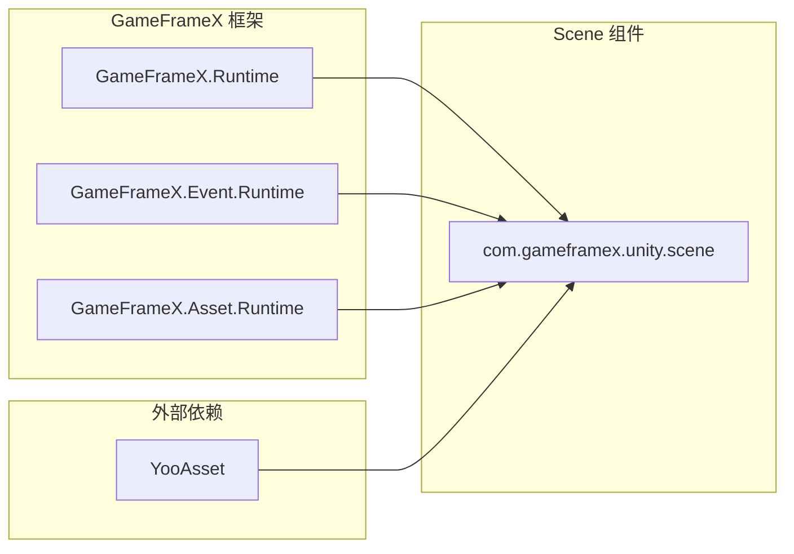
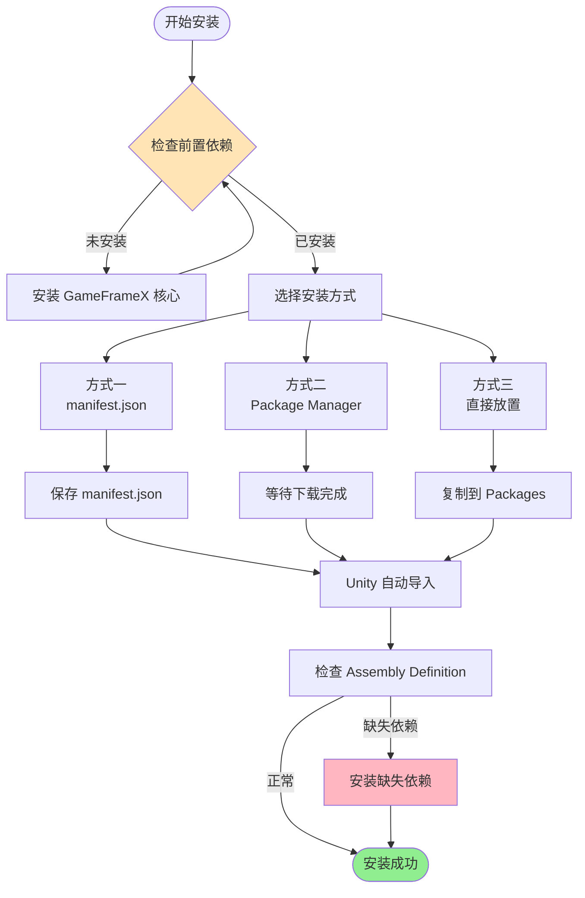

# インストール

GameFrameX Scene シーン管理コンポーネント的インストールガイド。

## 概要

GameFrameX Scene 是 GameFrameX フレームワーク的シーン管理コンポーネント，提供統一された的シーンロード、アンロード和管理機能。在使用本コンポーネント前，〜する必要があります先完成インストール設定。このドキュメント将介绍三种推奨的インストール方法および依赖项設定。

> 当前バージョン：2.1.2
> 最低 Unity バージョン：2017.1

## 前提条件

在インストール Scene コンポーネント前，请確認してください您的プロジェクト满足以下要求：

| 要求 | 説明 |
|------|------|
| Unity バージョン | 2017.1 或更高バージョン |
| GameFrameX コア | 〜する必要があります先インストール GameFrameX.Runtime |
| YooAsset | 〜する必要がありますインストール YooAsset リソース管理系统 |

### 依赖项説明

Scene コンポーネント依赖于以下コアモジュール：



**コア依赖**：
- **GameFrameX.Runtime**: フレームワークコアランタイム
- **GameFrameX.Event.Runtime**: イベント系统ランタイム
- **GameFrameX.Asset.Runtime**: リソース管理ランタイム
- **YooAsset**: リソース打パッケージ和管理解決策

## インストールメソッド

### 方法一：通过 manifest.json インストール（推奨）

这是最推奨的インストール方法，方便バージョン管理和アップデート。

1. 打开 Unity プロジェクト中的 `Packages/manifest.json` ファイル
2. 在 `dependencies` 节点下追加以下内容：

```json
{
  "dependencies": {
    "com.gameframex.unity.scene": "https://github.com/GameFrameX/com.gameframex.unity.scene.git"
  }
}
```

3. 保存ファイル后，Unity 会自动下载并导入パッケージ

> Source: [README.md](https://github.com/GameFrameX/com.gameframex.unity.scene/blob/main/README.md#L11-L14)

### 方法二：通过 Unity Package Manager インストール

1. 打开 Unity エディタ
2. 选择 **Window > Package Manager** 打开パッケージマネージャー
3. 点击左上角的 **+** ボタン
4. 选择 **Add package from git URL**
5. 输入以下 Git URL：
   ```
   https://github.com/GameFrameX/com.gameframex.unity.scene.git
   ```
6. 点击 **Add** ボタン等待インストール完成

> Source: [README.md](https://github.com/GameFrameX/com.gameframex.unity.scene/blob/main/README.md#L15-L15)

### 方法三：直接放置到 Packages ファイル夹

1. 克隆或下载本リポジトリ：
   ```
   https://github.com/GameFrameX/com.gameframex.unity.scene.git
   ```
2. 将整个リポジトリファイル夹复制到您 Unity プロジェクト的 `Packages` ディレクトリ下
3. Unity 会自动识别并ロードパッケージ

> Source: [README.md](https://github.com/GameFrameX/com.gameframex.unity.scene/blob/main/README.md#L16-L16)

## インストールフロー



## インストールの確認

インストール完成后，〜できます通过以下方法検証：

1. **確認 Package Manager**：在 Package Manager 中確認 `com.gameframex.unity.scene` 已显示
2. **確認アセンブリ**：確認 `GameFrameX.Scene.Runtime` 和 `GameFrameX.Scene.Editor` アセンブリ已生成
3. **確認メニュー**：確認 Unity メニュー中出现了 Scene 相关的機能メニュー

## 依赖项インストール

Scene コンポーネント〜する必要があります预先インストール以下依赖パッケージ，请按顺序インストール：

1. **GameFrameX.Runtime** - コアランタイム
2. **GameFrameX.Event.Runtime** - イベント系统
3. **GameFrameX.Asset.Runtime** - リソース管理
4. **YooAsset** - リソース打パッケージ系统

这些依赖项〜できます通过相同的方法インストール：

```json
{
  "dependencies": {
    "com.gameframex.unity.core": "https://github.com/GameFrameX/com.gameframex.unity.core.git",
    "com.gameframex.unity.event": "https://github.com/GameFrameX/com.gameframex.unity.event.git",
    "com.gameframex.unity.asset": "https://github.com/GameFrameX/com.gameframex.unity.asset.git",
    "com.yooasset.rm": "https://github.com/yoopackage/yoosee.git"
  }
}
```

## パッケージ情報

| プロパティ | 值 |
|------|------|
| パッケージ名 | com.gameframex.unity.scene |
| 显示名称 | Game Frame X Scene |
| バージョン | 2.1.2 |
| 分类 | Game Framework X |
| リポジトリ | https://github.com/GameFrameX/com.gameframex.unity.scene.git |

> Source: [package.json](https://github.com/GameFrameX/com.gameframex.unity.scene/blob/main/package.json#L2-L8)

## 関連リンク

- [概要](./1-overview) - 理解する Scene コンポーネント的コア機能
- [快速入门](./3-getting-started) - 开始使用 Scene コンポーネント
- [コア機能](./4-core-features) - 理解する更多機能特性
- [API リファレンス](./5-api-reference) - 完全な的 API ドキュメント
- [GitHub リポジトリ](https://github.com/GameFrameX/com.gameframex.unity.scene.git) - ソースコード和アップデートログ
