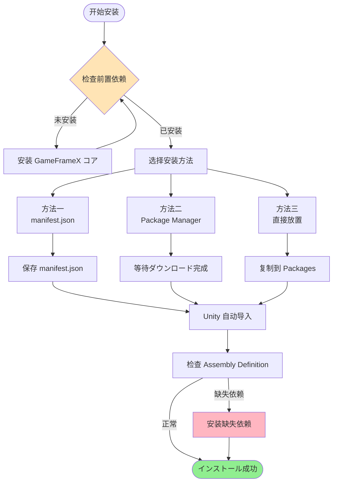

# 安装

GameFrameX Scene シーン管理コンポーネント的安装指南。

## 概要

GameFrameX Scene 是 GameFrameX フレームワーク的シーン管理コンポーネント，提供统一的シーン加载、卸载和管理機能。在使用本コンポーネント前，必要先完成安装配置。本文档将介绍三种推荐的安装方法以及依赖项配置。

> 当前版本：2.1.2
> 最低 Unity 版本：2017.1

## 前置要求

在安装 Scene コンポーネント前，必ず您的プロジェクト满足以下要求：

| 要求 | 説明 |
|------|------|
| Unity 版本 | 2017.1 或更高版本 |
| GameFrameX コア | 必要先安装 GameFrameX.Runtime |
| YooAsset | 必要安装 YooAsset リソース管理系统 |

### 依赖项説明

Scene コンポーネント依赖于以下コア模块：


**コア依赖**：
- **GameFrameX.Runtime**: フレームワークコア运行时
- **GameFrameX.Event.Runtime**: イベント系统运行时
- **GameFrameX.Asset.Runtime**: リソース管理运行时
- **YooAsset**: リソース打包和管理解決策

## インストールメソッド

### メソッド一：を通じて manifest.json 安装（推荐）

这是最推荐的安装方法，方便版本管理和更新。

1. 打开 Unity プロジェクト中的 `Packages/manifest.json` ファイル
2. 在 `dependencies` ノードに追加以下の内容：

```json
{
  "dependencies": {
    "com.gameframex.unity.scene": "https://github.com/GameFrameX/com.gameframex.unity.scene.git"
  }
}
```

3. 保存ファイル后，Unity 会自动ダウンロード并导入包

> Source: [README.md](https://github.com/GameFrameX/com.gameframex.unity.scene/blob/main/README.md#L11-L14)

### メソッド二：を通じて Unity Package Manager 安装

1. 打开 Unity 编辑器
2. 选择 **Window > Package Manager** 打开パッケージ管理器
3. 点击左上角的 **+** 按钮
4. 选择 **Add package from git URL**
5. 输入以下 Git URL：
   ```
   https://github.com/GameFrameX/com.gameframex.unity.scene.git
   ```
6. 点击 **Add** 按钮等待安装完成

> Source: [README.md](https://github.com/GameFrameX/com.gameframex.unity.scene/blob/main/README.md#L15-L15)

### メソッド三：直接放置到 Packages ファイル夹

1. 克隆或ダウンロード本仓库：
   ```
   https://github.com/GameFrameX/com.gameframex.unity.scene.git
   ```
2. 将整个仓库ファイル夹复制到您 Unity プロジェクト的 `Packages` ディレクトリ下
3. Unity 会自动识别并加载包

> Source: [README.md](https://github.com/GameFrameX/com.gameframex.unity.scene/blob/main/README.md#L16-L16)

## 安装フロー



## インストール確認

インストール完了後，以下のメソッドで確認可能：

1. **检查 Package Manager**：在 Package Manager 中确认 `com.gameframex.unity.scene` 已显示
2. **检查程序集**：确认 `GameFrameX.Scene.Runtime` 和 `GameFrameX.Scene.Editor` 程序集已生成
3. **检查菜单**：确认 Unity 菜单中出现了 Scene 関連的機能菜单

## 依赖项安装

Scene コンポーネント必要预先安装以下依赖包，お願いします按顺序安装：

1. **GameFrameX.Runtime** - コア运行时
2. **GameFrameX.Event.Runtime** - イベント系统
3. **GameFrameX.Asset.Runtime** - リソース管理
4. **YooAsset** - リソース打包系统

这些依赖项可能を通じて相同的方法安装：

```json
{
  "dependencies": {
    "com.gameframex.unity.core": "https://github.com/GameFrameX/com.gameframex.unity.core.git",
    "com.gameframex.unity.event": "https://github.com/GameFrameX/com.gameframex.unity.event.git",
    "com.gameframex.unity.asset": "https://github.com/GameFrameX/com.gameframex.unity.asset.git",
    "com.yooasset.rm": "https://github.com/yoopackage/yoosee.git"
  }
}
```

## 包信息

| プロパティ | 值 |
|------|------|
| 包名 | com.gameframex.unity.scene |
| 显示名称 | Game Frame X Scene |
| 版本 | 2.1.2 |
| 分クラス | Game Framework X |
| 仓库 | https://github.com/GameFrameX/com.gameframex.unity.scene.git |

> Source: [package.json](https://github.com/GameFrameX/com.gameframex.unity.scene/blob/main/package.json#L2-L8)

## 関連リンク

- [概述](./1-overview) - 了解 Scene コンポーネント的コア機能
- [快速入门](./3-getting-started) - 开始使用 Scene コンポーネント
- [コア機能](./4-core-features) - 了解更多機能特性
- [API 参考](./5-api-reference) - 完整的 API 文档
- [GitHub 仓库](https://github.com/GameFrameX/com.gameframex.unity.scene.git) - 源码和更新日志
