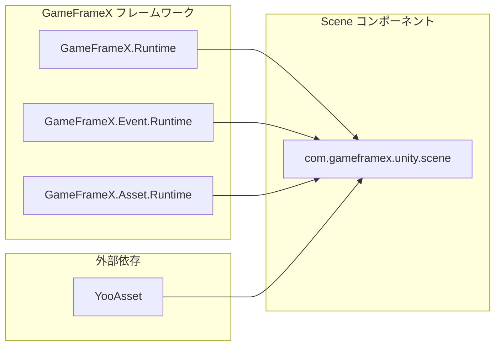
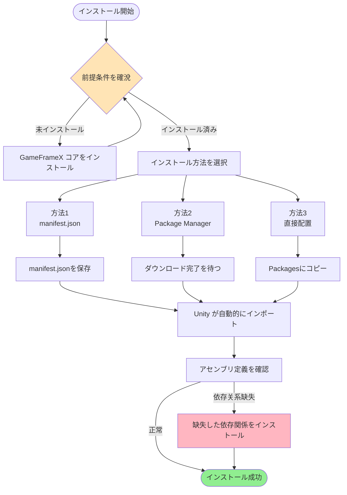

# インストール

GameFrameX Scene シーンマネジメントコンポーネントのインストールガイド。

## 概要

GameFrameX Scene は GameFrameX フレームワークのシーンマネジメントコンポーネントであり、统一されたシーン読み込み、アンロード、管理機能を提供します。このコンポーネントを使用する前に、インストール設定を完了する必要があります。本ドキュメントでは、3つの推奨インストール方法やすべての依存関係設定を紹介します。

> 現在のバージョン：2.1.2
> 最低 Unityバージョン：2017.1

## 前提条件

Scene コンポーネントをインストールする前に、プロジェクトが以下の要件満たしていることを確認してください：

| 要件 | 説明 |
|------|------|
| Unityバージョン | 2017.1 またはそれ以上 |
| GameFrameXコア | GameFrameX.Runtime を先にインストールする必要があります |
| YooAsset | YooAsset リソース管理系统をインストールする必要があります |

### 依存関係説明

Scene コンポーネントは次のコアモジュールに依存します：



**コア依存**：
- **GameFrameX.Runtime**: フレームワークコアランタイム
- **GameFrameX.Event.Runtime**: イベントシステムランタイム
- **GameFrameX.Asset.Runtime**: リソース管理ランタイム
- **YooAsset**: リソースパック与管理ソリューション

## インストール方法

### 方法1：manifest.json 経由でインストール（推奨）

これが最も推奨されるインストール方法であり、版本管理和更新が容易です。

1. Unity プロジェクトの `Packages/manifest.json` ファイルを開きます
2. `dependencies` ノードの下に以下を追加します：

```json
{
  "dependencies": {
    "com.gameframex.unity.scene": "https://github.com/GameFrameX/com.gameframex.unity.scene.git"
  }
}
```

3. ファイルを保存すると、Unity は自動的にパッケージをダウンロードしてインポートします

> Source: [README.md](https://github.com/GameFrameX/com.gameframex.unity.scene/blob/main/README.md#L11-L14)

### 方法2：Unity Package Manager 経由でインストール

1. Unity エディターを開きます
2. **Window > Package Manager** を選んでパッケージマネージャーを開きます
3. 左上の **+** ボタンをクリックします
4. **Add package from git URL** を選びます
5. 次の Git URL を入力します：
   ```
   https://github.com/GameFrameX/com.gameframex.unity.scene.git
   ```
6. **Add** ボタンをクリックしてインストールが完了するのを待ちます

> Source: [README.md](https://github.com/GameFrameX/com.gameframex.unity.scene/blob/main/README.md#L15-L15)

### 方法3：Packages フォルダに直接配置

1. このリポジトリをクローンまたはダウンロードします：
   ```
   https://github.com/GameFrameX/com.gameframex.unity.scene.git
   ```
2. リポジトリ全体を Unity プロジェクトの `Packages` ディレクトリにコピーします
3. Unity は自動的にパッケージを認識してロードします

> Source: [README.md](https://github.com/GameFrameX/com.gameframex.unity.scene/blob/main/README.md#L16-L16)

## インストールフロー



## インストール検証

インストール完了後、以下の方法で確認できます：

1. **Package Manager を確認**：Package Manager で `com.gameframex.unity.scene` が表示されていることを確認します
2. **アセンブリを確認**：`GameFrameX.Scene.Runtime` と `GameFrameX.Scene.Editor` アセンブリが生成されていることを確認します
3. **メニューを確認**：Unity メニューに Scene 関連の 功能メニューが表示されていることを確認します

## 依存関係のインストール

Scene コンポーネントは次の依存パッケージを事前にインストールする必要があります。以下の順序でインストールしてください：

1. **GameFrameX.Runtime** - コアランタイム
2. **GameFrameX.Event.Runtime** - イベントシステム
3. **GameFrameX.Asset.Runtime** - リソース管理
4. **YooAsset** - リソースパックシステム

これらの依存関係は 동일한 方法でインストールできます：

```json
{
  "dependencies": {
    "com.gameframex.unity.core": "https://github.com/GameFrameX/com.gameframex.unity.core.git",
    "com.gameframex.unity.event": "https://github.com/GameFrameX/com.gameframex.unity.event.git",
    "com.gameframex.unity.asset": "https://github.com/GameFrameX/com.gameframex.unity.asset.git",
    "com.yooasset.rm": "https://github.com/yoopackage/yoosee.git"
  }
}
```

## パッケージ情報

| 属性 | 値 |
|------|------|
| パッケージ名 | com.gameframex.unity.scene |
| 表示名 | Game Frame X Scene |
| バージョン | 2.1.2 |
| 分類 | Game Framework X |
| リポジトリ | https://github.com/GameFrameX/com.gameframex.unity.scene.git |

> Source: [package.json](https://github.com/GameFrameX/com.gameframex.unity.scene/blob/main/package.json#L2-L8)

## 関連リンク

- [概要](./1-overview) - Scene コンポーネントのコア機能了解
- [クイックスタート](./3-getting-started) - Scene コンポーネントの使用開始
- [コア機能](./4-core-features) - 詳細な機能特性了解
- [APIリファレンス](./5-api-reference) - 完全な API ドキュメント
- [GitHubリポジトリ](https://github.com/GameFrameX/com.gameframex.unity.scene.git) - ソースコードと更新ログ
