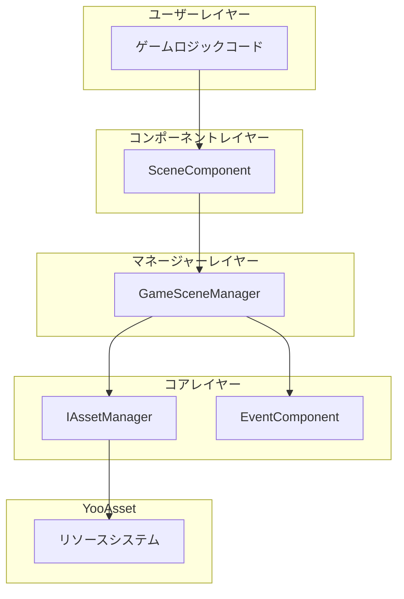
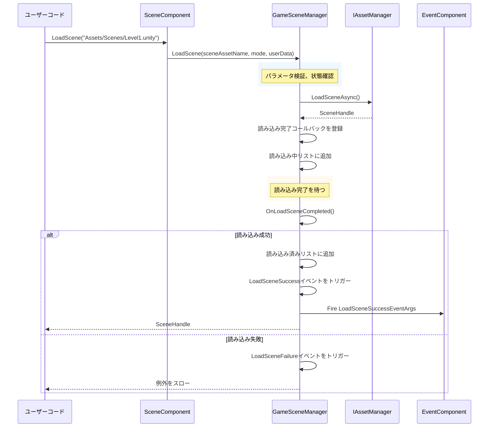

# クイックスタート

本ガイドでは、GameFrameX Scene シーンマネジメントコンポーネントを快速に使い始める方法を説明します。本ドキュメント读完すると、Unity プロジェクトでシーンマネジメントシステムを設定和使用する方法が理解できるようになります。

## 概要

GameFrameX Scene コンポーネントは、GameFrameX ゲームフレームワークのコアモジュールの1つであり、統一されたシーンマネジメント機能を提供します。このコンポーネントは YooAsset リソース管理系统に基づいて構築され、非同期シーン読み込み、アンロード、状態追跡、シーイベントコールバックなどをサポートします。コア機能は `SceneComponent` が統一して外部にサービスを提供し、イベントシステムを通じてシー状態変化に応答します。

## アーキテクチャ概要



上图展示了 Scene コンポーネントの階層構造です。ユーザーは `SceneComponent` コンポーネントを通じてシー操作を行い、このコンポーネントは内部で `GameSceneManager` を呼び出して實際の管理 작업을 수행하며、`GameSceneManager` は `IAssetManager` と YooAsset リソースシステムを介してやり取りします。`EventComponent` は各种シーイベントをトリガーし、ゲームロジックに応答します。

## 前提条件

Scene コンポーネントを使用する前に、プロジェクトが以下の条件を満たしていることを確認してください：

1. Unity 2020.3 以上がインストールされていること
2. YooAsset リソース管理系统がプロジェクトで正しく設定されていること
3. GameFrameX フレームワークの他の依存モジュールがプロジェクトに追加されていること（EventComponent、Asset モジュールなど）

## 基本使用フロー

### 手順1：Scene コンポーネントを追加

Unity シーの中に空のオブジェクトを作成するか、既存の GameEntry オブジェクトを使用して、`SceneComponent` コンポーネントを追加します。このコンポーネントは自動的に GameFrameX フレームワークに登録されます。

```csharp
// SceneComponent は MonoBehaviour であり、GameObject にマウントする必要があります
// Unity エディター内：右クリック -> GameFrameX -> Scene
// または直接将以下のスクリプトをシーオブシェクトに追加
```
> Source: [SceneComponent.cs](https://github.com/GameFrameX/com.gameframex.unity.scene/blob/main/Runtime/Scene/SceneComponent.cs#L47-L49)

コンポーネントプロパティの説明：
- `Enable LoadScene Update Event`：シーン読み込み進捗更新イベントを有効にする
- `Enable LoadScene Dependency Asset Event`：シーン依存リソース読み込みイベントを有効にする

### 手順2：コンポーネントインスタンスを取得

ゲームコードでは `GameEntry` を通じて SceneComponent インスタンスを取得できます：

```csharp
// シーコンポーネントインスタンスを取得
var sceneComponent = GameEntry.GetComponent<SceneComponent>();
if (sceneComponent == null)
{
    Debug.LogError("Scene component is not found.");
    return;
}
```
> Source: [SceneComponent.cs](https://github.com/GameFrameX/com.gameframex.unity.scene/blob/main/Runtime/Scene/SceneComponent.cs#L77-L87)

### 手順3：シーンを読み込む

Scene コンポーネントは2種類の読み込みモードをサポートします：

**シングルトンモード (LoadSceneMode.Single)**
新しいシーンを読み込む時にすべての読み込み済みシーンを先にアンロードし、ゲームメインダイヤ、レベル切り替えなどのシーンに適しています。

**加算モード (LoadSceneMode.Additive)**
既存のシーンに基づいて新しいシーンを加算して読み込み、オープンworld、動的レベル読み込みなどのシーンに適しています。

```csharp
// 単一シーンを読み込む（シングルトンモード、デフォルト）
// 注意：シーン名は "Assets/" で始まり ".unity" で終わる必要があります
string sceneAssetName = "Assets/Scenes/MainMenu.unity";
var handle = await sceneComponent.LoadScene(sceneAssetName, LoadSceneMode.Single);

// シーンを読み込んでカスタムデータを传递
string gameScene = "Assets/Scenes/GameLevel1.unity";
var handle2 = await sceneComponent.LoadScene(gameScene, LoadSceneMode.Single, "myUserData");
```
> Source: [SceneComponent.cs](https://github.com/GameFrameX/com.gameframex.unity.scene/blob/main/Runtime/Scene/SceneComponent.cs#L276-L307)

### 手順4：シーンをアンロード

あるシーンが不要になったら、メモリを解放するためにアンロードできます：

```csharp
// 指定したシーンをアンロード
string sceneAssetName = "Assets/Scenes/OldLevel.unity";
sceneComponent.UnloadScene(sceneAssetName);

// シーンをアンロードしてカスタムデータを传递
sceneComponent.UnloadScene(sceneAssetName, "cleanupData");
```
> Source: [SceneComponent.cs](https://github.com/GameFrameX/com.gameframex.unity.scene/blob/main/Runtime/Scene/SceneComponent.cs#L309-L331)

### 手順5：シーイベントを监听

Scene コンポーネントは完全なイベントシステムを提供し、シー状態変化に応答します：

```csharp
// シーン読み込み成功イベントを購読
sceneComponent.LoadSceneSuccess += OnLoadSceneSuccess;

// シーン読み込み失敗イベントを購読
sceneComponent.LoadSceneFailure += OnLoadSceneFailure;

// シーン読み込み進捗更新イベントを購読（EnableLoadSceneUpdateEventを有効にする必要がある）
sceneComponent.LoadSceneUpdate += OnLoadSceneUpdate;

// シーンアンロード成功イベントを購読
sceneComponent.UnloadSceneSuccess += OnUnloadSceneSuccess;

// シーンアンロード失敗イベントを購読
sceneComponent.UnloadSceneFailure += OnUnloadSceneFailure;

// シーン読み込み成功コールバック
private void OnLoadSceneSuccess(object sender, LoadSceneSuccessEventArgs e)
{
    Debug.Log($"Scene loaded successfully: {e.SceneAssetName}, duration: {e.Duration}");
}

// シーン読み込み失敗コールバック
private void OnLoadSceneFailure(object sender, LoadSceneFailureEventArgs e)
{
    Debug.LogError($"Scene load failed: {e.SceneAssetName}, error: {e.ErrorMessage}");
}

// シーン読み込み進捗更新コールバック
private void OnLoadSceneUpdate(object sender, LoadSceneUpdateEventArgs e)
{
    Debug.Log($"Loading progress: {e.Progress * 100}%");
}

// シーンアンロード成功コールバック
private void OnUnloadSceneSuccess(object sender, UnloadSceneSuccessEventArgs e)
{
    Debug.Log($"Scene unloaded: {e.SceneAssetName}");
}
```
> Source: [IGameSceneManager.cs](https://github.com/GameFrameX/com.gameframex.unity.scene/blob/main/Runtime/Scene/Scene/IGameSceneManager.cs#L44-L69)

## シー状態查询

Scene コンポーネントはシーン状態の查询等多种方法を提供します：

```csharp
// シーンが読み込まれているか確認
bool isLoaded = sceneComponent.SceneIsLoaded("Assets/Scenes/MainMenu.unity");

// シーンが読み込み中か確認
bool isLoading = sceneComponent.SceneIsLoading("Assets/Scenes/MainMenu.unity");

// シーンがアンロード中か確認
bool isUnloading = sceneComponent.SceneIsUnloading("Assets/Scenes/MainMenu.unity");

// すべての読み込み済みシーンの名称を取得
string[] loadedScenes = sceneComponent.GetLoadedSceneAssetNames();

// すべての読み込み中シーンの名称を取得
string[] loadingScenes = sceneComponent.GetLoadingSceneAssetNames();

// シーンパスが是否存在か確認
bool exists = sceneComponent.HasScene("Assets/Scenes/MainMenu.unity");
```
> Source: [SceneComponent.cs](https://github.com/GameFrameX/com.gameframex.unity.scene/blob/main/Runtime/Scene/SceneComponent.cs#L169-L274)

## シー順序管理

SceneComponent はシーンの表示順序を設定することをサポートし、メインカメラが現在のアクティブシーンを正しく指すことを確保します：

```csharp
// シーンの表示順序を設定（数値が大きいほど優先的に表示）
sceneComponent.SetSceneOrder("Assets/Scenes/GameLevel1.unity", 10);
sceneComponent.SetSceneOrder("Assets/Scenes/GameUI.unity", 20);

// メインカメラを更新
sceneComponent.RefreshMainCamera();
```
> Source: [SceneComponent.cs](https://github.com/GameFrameX/com.gameframex.unity.scene/blob/main/Runtime/Scene/SceneComponent.cs#L333-L376)

## シーン読み込みフロー



上图はシー読み込みの完全なフローを示しています。ユーザーによる LoadScene の呼び出しから始まり、パラメータ検証、リソース読み込み、状態管理を経て、最終的に相应的イベント通知をユーザーコードに送信します。

## 完全な使用例

以下はシーンマネジメントの完全な使用例です：

```csharp
using System;
using System.Threading.Tasks;
using UnityEngine;
using GameFrameX.Scene.Runtime;
using GameFrameX.Event.Runtime;

public class SceneManagerExample : MonoBehaviour
{
    private SceneComponent _sceneComponent;
    
    private void Start()
    {
        // シーコンポーネントを取得
        _sceneComponent = GameEntry.GetComponent<SceneComponent>();
        if (_sceneComponent == null)
        {
            Debug.LogError("Scene component not found!");
            return;
        }
        
        // イベントを購読
        _sceneComponent.LoadSceneSuccess += OnLoadSceneSuccess;
        _sceneComponent.LoadSceneFailure += OnLoadSceneFailure;
        _sceneComponent.UnloadSceneSuccess += OnUnloadSceneSuccess;
    }
    
    private void OnDestroy()
    {
        // イベントの購読を解除
        if (_sceneComponent != null)
        {
            _sceneComponent.LoadSceneSuccess -= OnLoadSceneSuccess;
            _sceneComponent.LoadSceneFailure -= OnLoadSceneFailure;
            _sceneComponent.UnloadSceneSuccess -= OnUnloadSceneSuccess;
        }
    }
    
    // ゲームシーンに切り替え
    public async void LoadGameScene(string sceneName)
    {
        string sceneAssetName = $"Assets/Scenes/{sceneName}.unity";
        
        try
        {
            Debug.Log($"シーン読み込み開始: {sceneAssetName}");
            var handle = await _sceneComponent.LoadScene(sceneAssetName, LoadSceneMode.Single);
            Debug.Log($"シーンハンドル: {handle}");
        }
        catch (Exception ex)
        {
            Debug.LogError($"シーンの読み込みに失敗: {ex.Message}");
        }
    }
    
    // 加算シーンを読み込む
    public async void LoadAdditiveScene(string sceneName)
    {
        string sceneAssetName = $"Assets/Scenes/{sceneName}.unity";
        
        try
        {
            var handle = await _sceneComponent.LoadScene(sceneAssetName, LoadSceneMode.Additive);
        }
        catch (Exception ex)
        {
            Debug.LogError($"加算シーンの読み込みに失敗: {ex.Message}");
        }
    }
    
    // シーンをアンロード
    public void UnloadScene(string sceneName)
    {
        string sceneAssetName = $"Assets/Scenes/{sceneName}.unity";
        _sceneComponent.UnloadScene(sceneAssetName);
    }
    
    // イベントコールバック
    private void OnLoadSceneSuccess(object sender, LoadSceneSuccessEventArgs e)
    {
        Debug.Log($"シーン読み込み完了: {e.SceneAssetName}, 所要時間: {e.Duration:F2}秒");
    }
    
    private void OnLoadSceneFailure(object sender, LoadSceneFailureEventArgs e)
    {
        Debug.LogError($"シーン読み込み失敗: {e.SceneAssetName}, エラー: {e.ErrorMessage}");
    }
    
    private void OnUnloadSceneSuccess(object sender, UnloadSceneSuccessEventArgs e)
    {
        Debug.Log($"シーンアンロード完了: {e.SceneAssetName}");
    }
}
```

## 注意事項

1. **シーンパス形式**：シーンパス名は `Assets/` で始まり `.unity` で終わる必要があります。例：`Assets/Scenes/MainMenu.unity`

2. **状態確認**：新しいシーンを読み込む前に、シーンが既に読み込み中または読み込み済みでないか確認することを推奨します。重複読み込みによる例外を避けるためです。

3. **リソース依存**：YooAsset がシーンの AssetBundle パックルールを正しく設定していることを確認します。

4. **イベント購読タイミング**：イベントの購読は Start またはそれより早いライフサイクルで推奨され、OnDestroy で購読を解除します。メモリリークを避けるためです。

5. **非同期操作**：LoadScene は非同期メソッドであり、await を使用して読み込み完了を待つ必要があります。

## 関連リンク

- [コア機能](./4-core-features) - シーンマネジメントの上級機能を了解更多
- [APIリファレンス](./5-api-reference) - 完全な API ドキュメントを参照
- [イベントシステム](./6-events) - シーイベントシステムの詳細信息了解
- [トラブルシューティング](./7-troubleshooting) - 一般的な問題の排查
- [インストール](./2-installation) - インストールと設定の説明を参照
