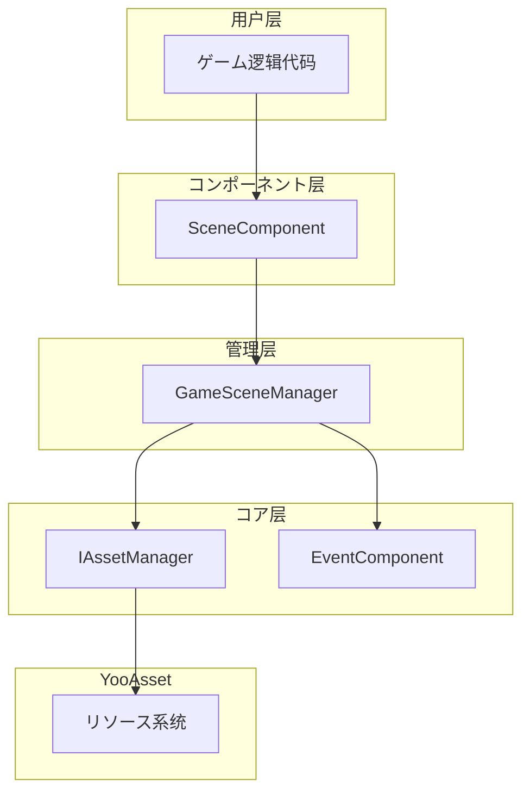

# 快速入门

本指南将帮助您快速上手 GameFrameX Scene シーン管理コンポーネント。を通じて本文档，您将了解如何在自己的 Unity プロジェクト中配置和使用シーン管理系统。

## 概要

GameFrameX Scene コンポーネント是 GameFrameX ゲームフレームワーク的コア模块之一，提供统一的シーン管理機能。该コンポーネント基づく YooAsset リソース管理系统构建，サポート异步シーン加载、卸载、ステータス追踪以及シーンイベント回调。コア機能由 `SceneComponent` 统一封装对外提供服务，を通じてイベント系统実装シーンステータス变化的响应。

## アーキテクチャ概要



上图展示了 Scene コンポーネント的层次结构。用户を通じて `SceneComponent` コンポーネント进行シーン操作，该コンポーネント内部呼び出し `GameSceneManager` 进行实际的管理工作，而 `GameSceneManager` 则依赖 `IAssetManager` 与 YooAsset リソース系统进行交互。`EventComponent` 负责触发各クラスシーンイベント，供ゲーム逻辑响应。

## 前置条件

在使用 Scene コンポーネント之前，必ずプロジェクト满足以下条件：

1. 已安装 Unity 2020.3 或更高版本
2. プロジェクト中已正确配置 YooAsset リソース管理系统
3. 已将 GameFrameX フレームワーク其他依赖模块添加到プロジェクト中（EventComponent、Asset 模块等）

## 基本使用フロー

### 手順一：添加 Scene コンポーネント

在 Unity シーン中作成一个空物体或使用现有的 GameEntry 物体，然后添加 `SceneComponent` コンポーネント。该コンポーネント会自动注册到 GameFrameX フレームワーク中。

```csharp
// SceneComponent は MonoBehaviour，必要挂载到 GameObject 上
// 在 Unity 编辑器中：右键 -> GameFrameX -> Scene
// 或者直接添加以下脚本到シーン物体上
```
> Source: [SceneComponent.cs](https://github.com/GameFrameX/com.gameframex.unity.scene/blob/main/Runtime/Scene/SceneComponent.cs#L47-L49)

コンポーネントプロパティ説明：
- `Enable LoadScene Update Event`：启用シーン加载进度更新イベント
- `Enable LoadScene Dependency Asset Event`：启用シーン依赖リソース加载イベント

### 手順二：取得コンポーネントインスタンス

在ゲーム代码中可能を通じて `GameEntry` 取得 SceneComponent インスタンス：

```csharp
// 取得シーンコンポーネントインスタンス
var sceneComponent = GameEntry.GetComponent<SceneComponent>();
if (sceneComponent == null)
{
    Debug.LogError("Scene component is not found.");
    return;
}
```
> Source: [SceneComponent.cs](https://github.com/GameFrameX/com.gameframex.unity.scene/blob/main/Runtime/Scene/SceneComponent.cs#L77-L87)

### 手順三：加载シーン

Scene コンポーネントサポート两种加载模式：

**单例模式 (LoadSceneMode.Single)**
加载新シーン时会先卸载所有已加载的シーン，适に使用ゲーム主菜单、关卡切换等シーン。

**累加模式 (LoadSceneMode.Additive)**
在现有シーン基础上叠加加载新シーン，适に使用开放世界、动态关卡加载等シーン。

```csharp
// 加载单个シーン（单例模式，默认）
// 注意：シーン名称必須以 "Assets/" 开头，以 ".unity" 结尾
string sceneAssetName = "Assets/Scenes/MainMenu.unity";
var handle = await sceneComponent.LoadScene(sceneAssetName, LoadSceneMode.Single);

// 加载シーン并传递自定义数据
string gameScene = "Assets/Scenes/GameLevel1.unity";
var handle2 = await sceneComponent.LoadScene(gameScene, LoadSceneMode.Single, "myUserData");
```
> Source: [SceneComponent.cs](https://github.com/GameFrameX/com.gameframex.unity.scene/blob/main/Runtime/Scene/SceneComponent.cs#L276-L307)

### 手順四：卸载シーン

当不再必要某个シーン时，可能将其卸载释放内存：

```csharp
// 卸载指定シーン
string sceneAssetName = "Assets/Scenes/OldLevel.unity";
sceneComponent.UnloadScene(sceneAssetName);

// 卸载シーン并传递自定义数据
sceneComponent.UnloadScene(sceneAssetName, "cleanupData");
```
> Source: [SceneComponent.cs](https://github.com/GameFrameX/com.gameframex.unity.scene/blob/main/Runtime/Scene/SceneComponent.cs#L309-L331)

### 手順五：监听シーンイベント

Scene コンポーネント提供します完善的イベント系统，に使用响应シーンステータス变化：

```csharp
// 订阅シーン加载成功イベント
sceneComponent.LoadSceneSuccess += OnLoadSceneSuccess;

// 订阅シーン加载失败イベント
sceneComponent.LoadSceneFailure += OnLoadSceneFailure;

// 订阅シーン加载进度更新イベント（必要启用 EnableLoadSceneUpdateEvent）
sceneComponent.LoadSceneUpdate += OnLoadSceneUpdate;

// 订阅シーン卸载成功イベント
sceneComponent.UnloadSceneSuccess += OnUnloadSceneSuccess;

// 订阅シーン卸载失败イベント
sceneComponent.UnloadSceneFailure += OnUnloadSceneFailure;

// シーン加载成功回调
private void OnLoadSceneSuccess(object sender, LoadSceneSuccessEventArgs e)
{
    Debug.Log($"Scene loaded successfully: {e.SceneAssetName}, duration: {e.Duration}");
}

// シーン加载失败回调
private void OnLoadSceneFailure(object sender, LoadSceneFailureEventArgs e)
{
    Debug.LogError($"Scene load failed: {e.SceneAssetName}, error: {e.ErrorMessage}");
}

// シーン加载进度更新回调
private void OnLoadSceneUpdate(object sender, LoadSceneUpdateEventArgs e)
{
    Debug.Log($"Loading progress: {e.Progress * 100}%");
}

// シーン卸载成功回调
private void OnUnloadSceneSuccess(object sender, UnloadSceneSuccessEventArgs e)
{
    Debug.Log($"Scene unloaded: {e.SceneAssetName}");
}
```
> Source: [IGameSceneManager.cs](https://github.com/GameFrameX/com.gameframex.unity.scene/blob/main/Runtime/Scene/Scene/IGameSceneManager.cs#L44-L69)

## シーンステータス查询

Scene コンポーネント提供します多种メソッドに使用查询シーンステータス：

```csharp
// 检查シーン是否已加载
bool isLoaded = sceneComponent.SceneIsLoaded("Assets/Scenes/MainMenu.unity");

// 检查シーン是否正在加载
bool isLoading = sceneComponent.SceneIsLoading("Assets/Scenes/MainMenu.unity");

// 检查シーン是否正在卸载
bool isUnloading = sceneComponent.SceneIsUnloading("Assets/Scenes/MainMenu.unity");

// 取得所有已加载シーン的名称
string[] loadedScenes = sceneComponent.GetLoadedSceneAssetNames();

// 取得所有正在加载シーン的名称
string[] loadingScenes = sceneComponent.GetLoadingSceneAssetNames();

// 检查シーンリソース是否存在
bool exists = sceneComponent.HasScene("Assets/Scenes/MainMenu.unity");
```
> Source: [SceneComponent.cs](https://github.com/GameFrameX/com.gameframex.unity.scene/blob/main/Runtime/Scene/SceneComponent.cs#L169-L274)

## シーン顺序管理

SceneComponent サポート設定シーン的显示顺序，确保主摄像机正确指向当前激活的シーン：

```csharp
// 設定シーン的显示顺序（数值越大越优先显示）
sceneComponent.SetSceneOrder("Assets/Scenes/GameLevel1.unity", 10);
sceneComponent.SetSceneOrder("Assets/Scenes/GameUI.unity", 20);

// 刷新主摄像机
sceneComponent.RefreshMainCamera();
```
> Source: [SceneComponent.cs](https://github.com/GameFrameX/com.gameframex.unity.scene/blob/main/Runtime/Scene/SceneComponent.cs#L333-L376)

## シーン加载フロー


上图展示了シーン加载的完整フロー。从用户呼び出し LoadScene 开始，经过参数验证、リソース加载、ステータス管理，最终触发相应イベント通知用户代码。

## 完整使用示例

以下は完整的シーン管理使用示例：

```csharp
using System;
using System.Threading.Tasks;
using UnityEngine;
using GameFrameX.Scene.Runtime;
using GameFrameX.Event.Runtime;

public class SceneManagerExample : MonoBehaviour
{
    private SceneComponent _sceneComponent;
    
    private void Start()
    {
        // 取得シーンコンポーネント
        _sceneComponent = GameEntry.GetComponent<SceneComponent>();
        if (_sceneComponent == null)
        {
            Debug.LogError("Scene component not found!");
            return;
        }
        
        // 订阅イベント
        _sceneComponent.LoadSceneSuccess += OnLoadSceneSuccess;
        _sceneComponent.LoadSceneFailure += OnLoadSceneFailure;
        _sceneComponent.UnloadSceneSuccess += OnUnloadSceneSuccess;
    }
    
    private void OnDestroy()
    {
        // 取消订阅イベント
        if (_sceneComponent != null)
        {
            _sceneComponent.LoadSceneSuccess -= OnLoadSceneSuccess;
            _sceneComponent.LoadSceneFailure -= OnLoadSceneFailure;
            _sceneComponent.UnloadSceneSuccess -= OnUnloadSceneSuccess;
        }
    }
    
    // 切换到ゲームシーン
    public async void LoadGameScene(string sceneName)
    {
        string sceneAssetName = $"Assets/Scenes/{sceneName}.unity";
        
        try
        {
            Debug.Log($"Start loading scene: {sceneAssetName}");
            var handle = await _sceneComponent.LoadScene(sceneAssetName, LoadSceneMode.Single);
            Debug.Log($"Scene handle: {handle}");
        }
        catch (Exception ex)
        {
            Debug.LogError($"Failed to load scene: {ex.Message}");
        }
    }
    
    // 加载附加シーン
    public async void LoadAdditiveScene(string sceneName)
    {
        string sceneAssetName = $"Assets/Scenes/{sceneName}.unity";
        
        try
        {
            var handle = await _sceneComponent.LoadScene(sceneAssetName, LoadSceneMode.Additive);
        }
        catch (Exception ex)
        {
            Debug.LogError($"Failed to load additive scene: {ex.Message}");
        }
    }
    
    // 卸载シーン
    public void UnloadScene(string sceneName)
    {
        string sceneAssetName = $"Assets/Scenes/{sceneName}.unity";
        _sceneComponent.UnloadScene(sceneAssetName);
    }
    
    // イベント回调
    private void OnLoadSceneSuccess(object sender, LoadSceneSuccessEventArgs e)
    {
        Debug.Log($"Scene loaded: {e.SceneAssetName}, duration: {e.Duration:F2}s");
    }
    
    private void OnLoadSceneFailure(object sender, LoadSceneFailureEventArgs e)
    {
        Debug.LogError($"Scene load failed: {e.SceneAssetName}, error: {e.ErrorMessage}");
    }
    
    private void OnUnloadSceneSuccess(object sender, UnloadSceneSuccessEventArgs e)
    {
        Debug.Log($"Scene unloaded: {e.SceneAssetName}");
    }
}
```

## 注意事项

1. **シーン路径格式**：シーンリソース名称必須以 `Assets/` 开头，以 `.unity` 结尾，例如：`Assets/Scenes/MainMenu.unity`

2. **ステータス检查**：在加载新シーン之前，建议先检查シーン是否已在加载中或已加载，避免重复加载导致異常

3. **リソース依赖**：确保 YooAsset 已正确配置シーン的 AssetBundle 打包规则

4. **イベント订阅时机**：建议在 Start 或更早的生命周期中订阅イベント，在 OnDestroy 中取消订阅，避免内存泄漏

5. **异步操作**：LoadScene 是异步メソッド，必要使用 await 等待加载完成

## 関連リンク

- [コア機能](./4-core-features) - 了解更多シーン管理的高级機能
- [API 参考](./5-api-reference) - 查看完整的 API 文档
- [イベント系统](./6-events) - 了解シーンイベント系统的详细信息
- [常见问题](./7-troubleshooting) - 排查常见问题
- [安装指南](./2-installation) - 查看安装配置説明
