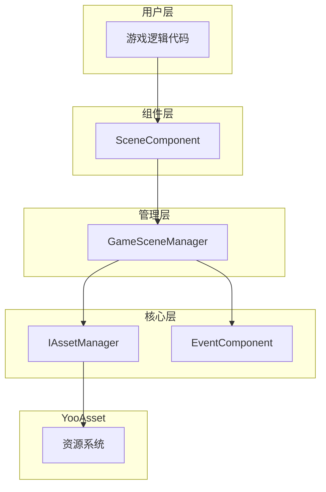
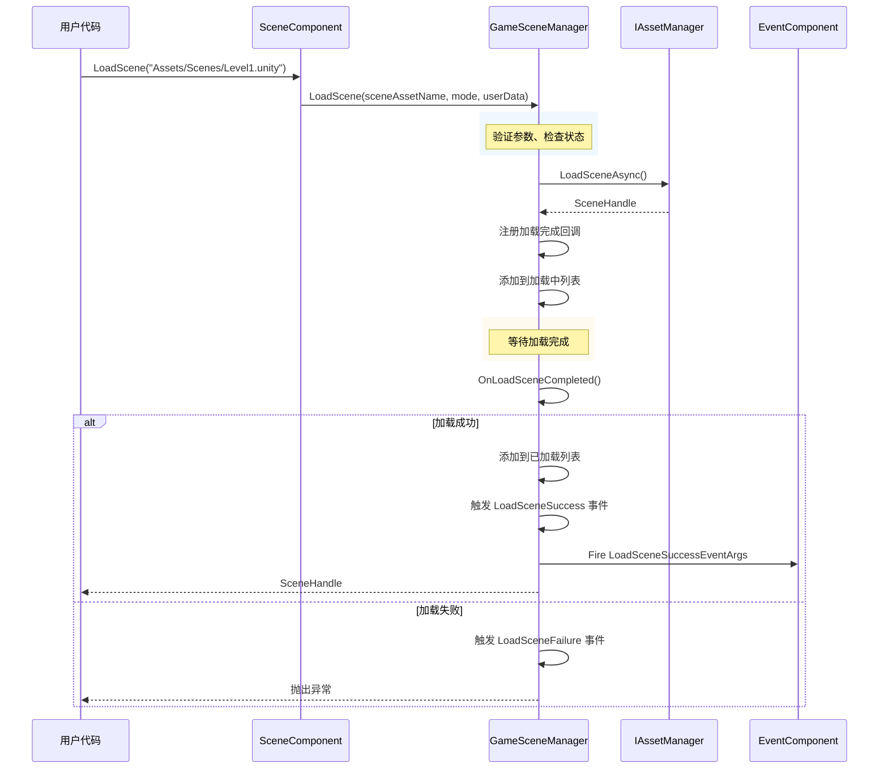

# クイックスタート

本ガイド将帮助您快速上手 GameFrameX Scene シーン管理コンポーネント。通过このドキュメント，您将理解する如何在自己的 Unity プロジェクト中設定和使用シーン管理系统。

## 概要

GameFrameX Scene コンポーネント是 GameFrameX 游戏フレームワーク的コアモジュール之一，提供統一された的シーン管理機能。该コンポーネント基于 YooAsset リソース管理系统ビルド，サポート异步シーンロード、アンロード、ステータス追踪およびシーンイベントコールバック。コア機能由 `SceneComponent` 統一されたカプセル化对外提供服务，通过イベント系统実装シーンステータス变化的响应。

## アーキテクチャ概览



上图表示了 Scene コンポーネント的层次结构。ユーザー通过 `SceneComponent` コンポーネント进行シーン操作，该コンポーネント内部呼び出し `GameSceneManager` 进行实际的管理工作，而 `GameSceneManager` 则依赖 `IAssetManager` 与 YooAsset リソースシステム进行交互。`EventComponent` 负责トリガー各类シーンイベント，供游戏逻辑响应。

## 前置条件

在使用 Scene コンポーネント之前，请確認してくださいプロジェクト满足以下条件：

1. 已インストール Unity 2020.3 或更高バージョン
2. プロジェクト中已正确設定 YooAsset リソース管理系统
3. 已将 GameFrameX フレームワーク其他依赖モジュール追加到プロジェクト中（EventComponent、Asset モジュール等）

## 基本使用フロー

### ステップ一：追加 Scene コンポーネント

在 Unity シーン中作成一个空物体或使用现有的 GameEntry 物体，次に追加 `SceneComponent` コンポーネント。该コンポーネント会自动登録到 GameFrameX フレームワーク中。

```csharp
// SceneComponent 是一个 MonoBehaviour，需要挂载到 GameObject 上
// 在 Unity 编辑器中：右键 -> GameFrameX -> Scene
// 或者直接添加以下脚本到场景物体上
```
> Source: [SceneComponent.cs](https://github.com/GameFrameX/com.gameframex.unity.scene/blob/main/Runtime/Scene/SceneComponent.cs#L47-L49)

コンポーネントプロパティ説明：
- `Enable LoadScene Update Event`：启用シーンロード進捗アップデートイベント
- `Enable LoadScene Dependency Asset Event`：启用シーン依赖リソースロードイベント

### ステップ二：取得コンポーネントインスタンス

在游戏コード中〜できます通过 `GameEntry` 取得 SceneComponent インスタンス：

```csharp
// 获取场景组件实例
var sceneComponent = GameEntry.GetComponent<SceneComponent>();
if (sceneComponent == null)
{
    Debug.LogError("Scene component is not found.");
    return;
}
```
> Source: [SceneComponent.cs](https://github.com/GameFrameX/com.gameframex.unity.scene/blob/main/Runtime/Scene/SceneComponent.cs#L77-L87)

### ステップ三：ロードシーン

Scene コンポーネントサポート两种ロードモード：

**单例モード (LoadSceneMode.Single)**
ロード新シーン时会先アンロード所有已ロード的シーン，適しています游戏主メニュー、关卡切换等シーン。

**累加モード (LoadSceneMode.Additive)**
在现有シーン基本上叠加ロード新シーン，適しています开放世界、动态关卡ロード等シーン。

```csharp
// 加载单个场景（单例模式，默认）
// 注意：场景名称必须以 "Assets/" 开头，以 ".unity" 结尾
string sceneAssetName = "Assets/Scenes/MainMenu.unity";
var handle = await sceneComponent.LoadScene(sceneAssetName, LoadSceneMode.Single);

// 加载场景并传递自定义数据
string gameScene = "Assets/Scenes/GameLevel1.unity";
var handle2 = await sceneComponent.LoadScene(gameScene, LoadSceneMode.Single, "myUserData");
```
> Source: [SceneComponent.cs](https://github.com/GameFrameX/com.gameframex.unity.scene/blob/main/Runtime/Scene/SceneComponent.cs#L276-L307)

### ステップ四：アンロードシーン

当不再〜する必要があります某个シーン时，〜できます将其アンロード解放内存：

```csharp
// 卸载指定场景
string sceneAssetName = "Assets/Scenes/OldLevel.unity";
sceneComponent.UnloadScene(sceneAssetName);

// 卸载场景并传递自定义数据
sceneComponent.UnloadScene(sceneAssetName, "cleanupData");
```
> Source: [SceneComponent.cs](https://github.com/GameFrameX/com.gameframex.unity.scene/blob/main/Runtime/Scene/SceneComponent.cs#L309-L331)

### ステップ五：监听シーンイベント

Scene コンポーネント提供します完善的イベント系统，用于响应シーンステータス变化：

```csharp
// 订阅场景加载成功事件
sceneComponent.LoadSceneSuccess += OnLoadSceneSuccess;

// 订阅场景加载失败事件
sceneComponent.LoadSceneFailure += OnLoadSceneFailure;

// 订阅场景加载进度更新事件（需要启用 EnableLoadSceneUpdateEvent）
sceneComponent.LoadSceneUpdate += OnLoadSceneUpdate;

// 订阅场景卸载成功事件
sceneComponent.UnloadSceneSuccess += OnUnloadSceneSuccess;

// 订阅场景卸载失败事件
sceneComponent.UnloadSceneFailure += OnUnloadSceneFailure;

// 场景加载成功回调
private void OnLoadSceneSuccess(object sender, LoadSceneSuccessEventArgs e)
{
    Debug.Log($"Scene loaded successfully: {e.SceneAssetName}, duration: {e.Duration}");
}

// 场景加载失败回调
private void OnLoadSceneFailure(object sender, LoadSceneFailureEventArgs e)
{
    Debug.LogError($"Scene load failed: {e.SceneAssetName}, error: {e.ErrorMessage}");
}

// 场景加载进度更新回调
private void OnLoadSceneUpdate(object sender, LoadSceneUpdateEventArgs e)
{
    Debug.Log($"Loading progress: {e.Progress * 100}%");
}

// 场景卸载成功回调
private void OnUnloadSceneSuccess(object sender, UnloadSceneSuccessEventArgs e)
{
    Debug.Log($"Scene unloaded: {e.SceneAssetName}");
}
```
> Source: [IGameSceneManager.cs](https://github.com/GameFrameX/com.gameframex.unity.scene/blob/main/Runtime/Scene/Scene/IGameSceneManager.cs#L44-L69)

## シーンステータス查询

Scene コンポーネント提供します多种メソッド用于查询シーンステータス：

```csharp
// 检查场景是否已加载
bool isLoaded = sceneComponent.SceneIsLoaded("Assets/Scenes/MainMenu.unity");

// 检查场景是否正在加载
bool isLoading = sceneComponent.SceneIsLoading("Assets/Scenes/MainMenu.unity");

// 检查场景是否正在卸载
bool isUnloading = sceneComponent.SceneIsUnloading("Assets/Scenes/MainMenu.unity");

// 获取所有已加载场景的名称
string[] loadedScenes = sceneComponent.GetLoadedSceneAssetNames();

// 获取所有正在加载场景的名称
string[] loadingScenes = sceneComponent.GetLoadingSceneAssetNames();

// 检查场景资源是否存在
bool exists = sceneComponent.HasScene("Assets/Scenes/MainMenu.unity");
```
> Source: [SceneComponent.cs](https://github.com/GameFrameX/com.gameframex.unity.scene/blob/main/Runtime/Scene/SceneComponent.cs#L169-L274)

## シーン顺序管理

SceneComponent サポート設定シーン的显示顺序，確認してください主摄像机正确指向当前激活的シーン：

```csharp
// 设置场景的显示顺序（数值越大越优先显示）
sceneComponent.SetSceneOrder("Assets/Scenes/GameLevel1.unity", 10);
sceneComponent.SetSceneOrder("Assets/Scenes/GameUI.unity", 20);

// 刷新主摄像机
sceneComponent.RefreshMainCamera();
```
> Source: [SceneComponent.cs](https://github.com/GameFrameX/com.gameframex.unity.scene/blob/main/Runtime/Scene/SceneComponent.cs#L333-L376)

## シーンロードフロー



上图表示了シーンロード的完全なフロー。从ユーザー呼び出し LoadScene 开始，经过パラメータ検証、リソースロード、ステータス管理，最终トリガー相应イベント通知ユーザーコード。

## 完全な使用例

以下は完全な的シーン管理使用例：

```csharp
using System;
using System.Threading.Tasks;
using UnityEngine;
using GameFrameX.Scene.Runtime;
using GameFrameX.Event.Runtime;

public class SceneManagerExample : MonoBehaviour
{
    private SceneComponent _sceneComponent;
    
    private void Start()
    {
        // 获取场景组件
        _sceneComponent = GameEntry.GetComponent<SceneComponent>();
        if (_sceneComponent == null)
        {
            Debug.LogError("Scene component not found!");
            return;
        }
        
        // 订阅事件
        _sceneComponent.LoadSceneSuccess += OnLoadSceneSuccess;
        _sceneComponent.LoadSceneFailure += OnLoadSceneFailure;
        _sceneComponent.UnloadSceneSuccess += OnUnloadSceneSuccess;
    }
    
    private void OnDestroy()
    {
        // 取消订阅事件
        if (_sceneComponent != null)
        {
            _sceneComponent.LoadSceneSuccess -= OnLoadSceneSuccess;
            _sceneComponent.LoadSceneFailure -= OnLoadSceneFailure;
            _sceneComponent.UnloadSceneSuccess -= OnUnloadSceneSuccess;
        }
    }
    
    // 切换到游戏场景
    public async void LoadGameScene(string sceneName)
    {
        string sceneAssetName = $"Assets/Scenes/{sceneName}.unity";
        
        try
        {
            Debug.Log($"Start loading scene: {sceneAssetName}");
            var handle = await _sceneComponent.LoadScene(sceneAssetName, LoadSceneMode.Single);
            Debug.Log($"Scene handle: {handle}");
        }
        catch (Exception ex)
        {
            Debug.LogError($"Failed to load scene: {ex.Message}");
        }
    }
    
    // 加载附加场景
    public async void LoadAdditiveScene(string sceneName)
    {
        string sceneAssetName = $"Assets/Scenes/{sceneName}.unity";
        
        try
        {
            var handle = await _sceneComponent.LoadScene(sceneAssetName, LoadSceneMode.Additive);
        }
        catch (Exception ex)
        {
            Debug.LogError($"Failed to load additive scene: {ex.Message}");
        }
    }
    
    // 卸载场景
    public void UnloadScene(string sceneName)
    {
        string sceneAssetName = $"Assets/Scenes/{sceneName}.unity";
        _sceneComponent.UnloadScene(sceneAssetName);
    }
    
    // 事件回调
    private void OnLoadSceneSuccess(object sender, LoadSceneSuccessEventArgs e)
    {
        Debug.Log($"Scene loaded: {e.SceneAssetName}, duration: {e.Duration:F2}s");
    }
    
    private void OnLoadSceneFailure(object sender, LoadSceneFailureEventArgs e)
    {
        Debug.LogError($"Scene load failed: {e.SceneAssetName}, error: {e.ErrorMessage}");
    }
    
    private void OnUnloadSceneSuccess(object sender, UnloadSceneSuccessEventArgs e)
    {
        Debug.Log($"Scene unloaded: {e.SceneAssetName}");
    }
}
```

## 注意事项

1. **シーン路径フォーマット**：シーンリソース名称〜しなければなりません以 `Assets/` 开头，以 `.unity` 结尾，例えば：`Assets/Scenes/MainMenu.unity`

2. **ステータス確認**：在ロード新シーン之前，お勧め先確認シーン是否已在ロード中或已ロード，避免重复ロード导致例外

3. **リソース依赖**：確認してください YooAsset 已正确設定シーン的 AssetBundle 打パッケージ规则

4. **イベント購読时机**：お勧め在 Start 或更早的ライフサイクル中購読イベント，在 OnDestroy 中取消購読，避免内存泄漏

5. **异步操作**：LoadScene 是异步メソッド，〜する必要があります使用 await 等待ロード完成

## 関連リンク

- [コア機能](./4-core-features) - 理解する更多シーン管理的高级機能
- [API リファレンス](./5-api-reference) - 確認完全な的 API ドキュメント
- [イベント系统](./6-events) - 理解するシーンイベント系统的詳細情報
- [常见問題](./7-troubleshooting) - 排查常见問題
- [インストールガイド](./2-installation) - 確認インストール設定説明
