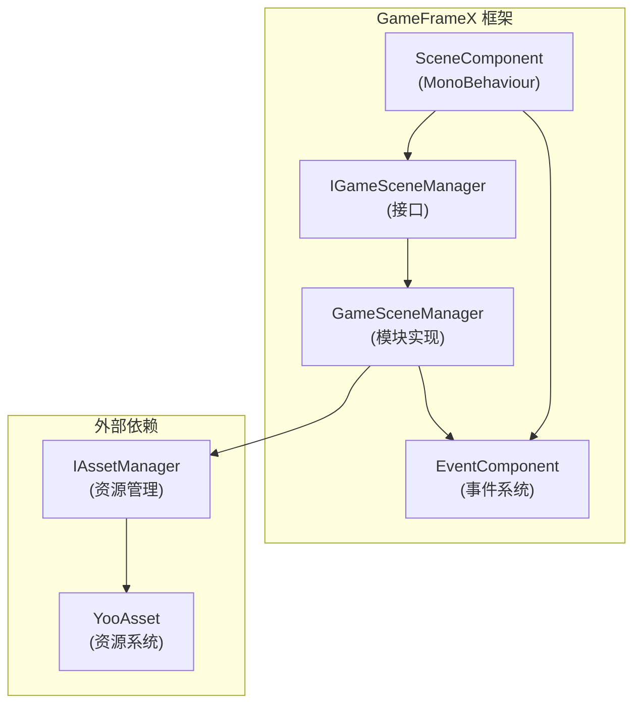
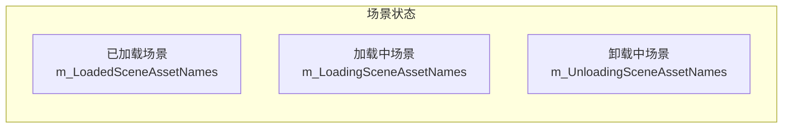
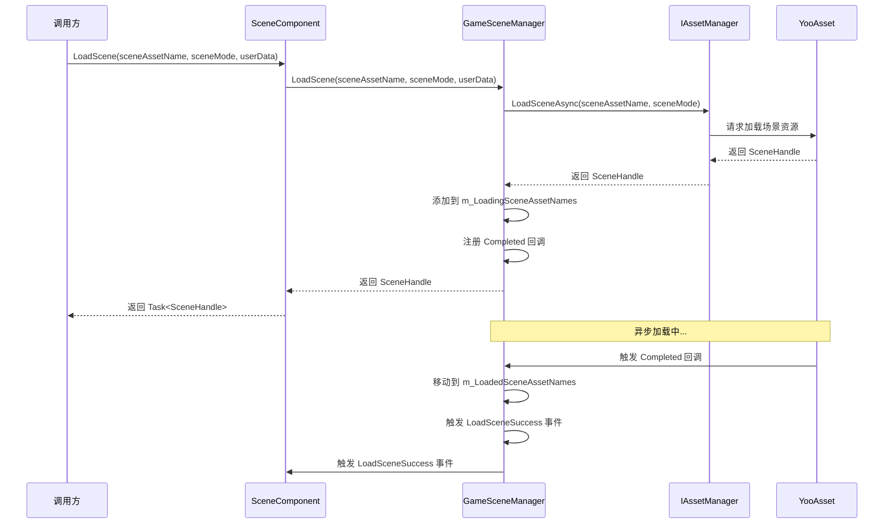
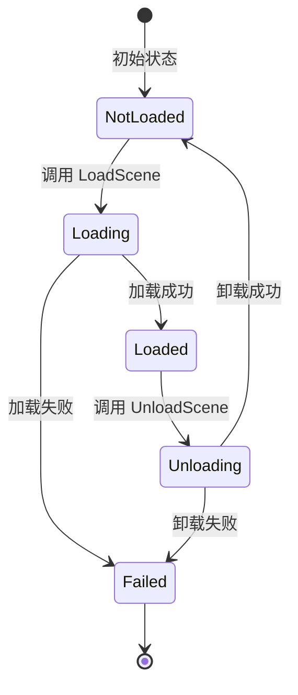
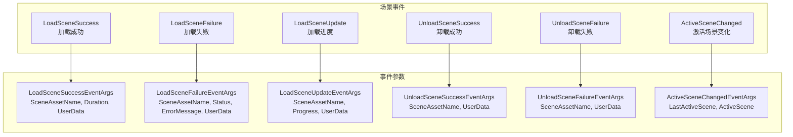

# コア機能

GameFrameX Scene シーン管理コンポーネント提供します完全な的异步シーンロード、アンロード、ステータス查询和イベント通知機能，是游戏开发中管理多个シーン的コアモジュール。

## 概要

Scene コンポーネント是 GameFrameX フレームワーク的コアモジュール之一，专门用于管理 Unity 游戏中的シーンリソース。该コンポーネント基于 YooAsset リソース管理系统ビルド，提供します以下コア能力：

- **异步シーンロード**：サポート非同期ロードシーンリソース，无需阻塞主线程
- **シーンステータス管理**：查询シーン的ロード、アンロードステータス
- **シーン激活控制**：管理当前激活的シーン和主摄像机
- **イベント驱动**：完全な的イベント系统用于监听シーンステータス变化
- **シーン优先级**：サポート設定シーンロード优先级，控制激活顺序

### コア設計理念

Scene コンポーネント采用モジュール化設計，将业务逻辑与 Unity コンポーネント分离。`SceneComponent` 作为 Unity コンポーネント挂载到 GameObject 上，而コア逻辑由 `GameSceneManager` モジュール処理。这种設計使得コード更加清晰，便于テスト和维护。



## シーンステータス管理

Scene コンポーネント维护了三个内部字典来追踪シーンステータス，这种設計確認してください了効率的的ステータス查询：



### ステータス查询メソッド

Scene コンポーネント提供します完全な的シーンステータス查询 API，〜できます准确取得任意シーン的当前ステータス：

```csharp
// 检查场景是否已加载
bool isLoaded = sceneComponent.SceneIsLoaded("Assets/Scenes/MainMenu.unity");

// 检查场景是否正在加载
bool isLoading = sceneComponent.SceneIsLoading("Assets/Scenes/GamePlay.unity");

// 检查场景是否正在卸载
bool isUnloading = sceneComponent.SceneIsUnloading("Assets/Scenes/MainMenu.unity");

// 获取所有已加载场景的名称
string[] loadedScenes = sceneComponent.GetLoadedSceneAssetNames();

// 获取所有正在加载的场景名称
string[] loadingScenes = sceneComponent.GetLoadingSceneAssetNames();

// 获取所有正在卸载的场景名称
string[] unloadingScenes = sceneComponent.GetUnloadingSceneAssetNames();
```
> Source: [SceneComponent.cs](https://github.com/GameFrameX/com.gameframex.unity.scene/blob/main/Runtime/Scene/SceneComponent.cs#L174-L251)

### シーン存在性確認

在ロードシーン前，〜できます先確認シーンリソース是否存在：

```csharp
// 检查场景资源是否存在
bool hasScene = sceneComponent.HasScene("Assets/Scenes/GamePlay.unity");
```
> Source: [SceneComponent.cs](https://github.com/GameFrameX/com.gameframex.unity.scene/blob/main/Runtime/Scene/SceneComponent.cs#L258-L274)

## シーンロード与アンロード

### ロードシーン

Scene コンポーネントサポート多种ロードモード，〜できます根据游戏需求选择合适的ロード方法：



#### 基本ロード

最シンプル的シーンロード方法，无需指定ロードモード：

```csharp
// 加载单个场景（使用默认的 Additive 模式）
var handle = await sceneComponent.LoadScene("Assets/Scenes/GamePlay.unity");
```
> Source: [SceneComponent.cs](https://github.com/GameFrameX/com.gameframex.unity.scene/blob/main/Runtime/Scene/SceneComponent.cs#L280-L283)

#### 带モード的ロード

〜できます指定ロードモード（Single 或 Additive）和ユーザー自定義数据：

```csharp
// 使用 Single 模式加载（替换当前场景）
var handle = await sceneComponent.LoadScene(
    "Assets/Scenes/GamePlay.unity", 
    LoadSceneMode.Single, 
    null  // 用户自定义数据
);

// 使用 Additive 模式加载（叠加场景）
var handle = await sceneComponent.LoadScene(
    "Assets/Scenes/GamePlay.unity", 
    LoadSceneMode.Additive, 
    new { level = 1 }  // 自定义数据
);
```
> Source: [SceneComponent.cs](https://github.com/GameFrameX/com.gameframex.unity.scene/blob/main/Runtime/Scene/SceneComponent.cs#L291-L307)

**LoadSceneMode 説明：**
- **Single**：置換当前活动シーン，ロード完成后只保留新シーン
- **Additive**：将新シーン叠加到当前シーン，保留所有已ロード的シーン

### アンロードシーン

アンロードシーン是将已ロード的シーン从内存中移除的过程：

```csharp
// 卸载指定场景
sceneComponent.UnloadScene("Assets/Scenes/MainMenu.unity");

// 卸载场景并传递用户自定义数据
sceneComponent.UnloadScene("Assets/Scenes/MainMenu.unity", new { reason = "quit" });
```
> Source: [SceneComponent.cs](https://github.com/GameFrameX/com.gameframex.unity.scene/blob/main/Runtime/Scene/SceneComponent.cs#L314-L331)

### ロードフロー详解

シーンロード过程中，コンポーネント会经历多个ステータス转换。理解这些ステータス有助于更好地処理非同期ロード逻辑：

1. **初始ステータス**：シーン不在任何字典中
2. **ロード中**：シーン追加到 `m_LoadingSceneAssetNames`，トリガー `LoadSceneUpdate` イベント
3. **ロード完成**：シーン移动到 `m_LoadedSceneAssetNames`，トリガー `LoadSceneSuccess` イベント
4. **アンロード中**：シーン追加到 `m_UnloadingSceneAssetNames`
5. **アンロード完成**：シーン从所有字典中移除，トリガー `UnloadSceneSuccess` イベント



## シーン激活与主摄像机管理

### 活动シーン管理

Scene コンポーネントサポート設定シーン的ロード顺序，并根据顺序自动激活最优先的シーン：

```csharp
// 设置场景加载优先级（数值越大优先级越高）
sceneComponent.SetSceneOrder("Assets/Scenes/MainMenu.unity", 1);
sceneComponent.SetSceneOrder("Assets/Scenes/GamePlay.unity", 10);
```
> Source: [SceneComponent.cs](https://github.com/GameFrameX/com.gameframex.unity.scene/blob/main/Runtime/Scene/SceneComponent.cs#L338-L367)

当多个シーン叠加ロード时，优先级最高的シーン会自动成为活动シーン。

### 主摄像机刷新

コンポーネント会自动追踪当前活动シーン的主摄像机：

```csharp
// 刷新主摄像机引用
sceneComponent.RefreshMainCamera();

// 获取当前主摄像机
Camera mainCam = sceneComponent.MainCamera;
```
> Source: [SceneComponent.cs](https://github.com/GameFrameX/com.gameframex.unity.scene/blob/main/Runtime/Scene/SceneComponent.cs#L372-L375)

### 激活シーン变化イベント

当活动シーン发生变化时，会トリガー相应イベント：

```csharp
m_EventComponent.Fire(this, ActiveSceneChangedEventArgs.Create(lastActiveScene, activeScene));
```
> Source: [SceneComponent.cs](https://github.com/GameFrameX/com.gameframex.unity.scene/blob/main/Runtime/Scene/SceneComponent.cs#L431)

## イベント系统

Scene コンポーネント提供します完善的イベント系统，開発者〜できます通过購読イベント来响应シーンステータス变化。这种設計実装了松耦合的通信方法，使得不同モジュール〜できます独立响应シーンイベント。



### 購読シーンイベント

在 `SceneComponent` 初期化时，会自动購読内部イベント并转发给 `EventComponent`：

```csharp
_gameSceneManager.LoadSceneSuccess += OnLoadGameSceneSuccess;
_gameSceneManager.LoadSceneFailure += OnLoadGameSceneFailure;
_gameSceneManager.LoadSceneUpdate += OnLoadGameSceneUpdate;
_gameSceneManager.UnloadSceneSuccess += OnUnloadGameSceneSuccess;
_gameSceneManager.UnloadSceneFailure += OnUnloadGameSceneFailure;
```
> Source: [SceneComponent.cs](https://github.com/GameFrameX/com.gameframex.unity.scene/blob/main/Runtime/Scene/SceneComponent.cs#L89-L103)

### イベント使用例

```csharp
// 订阅加载成功事件
EventComponent.Subscribe<LoadSceneSuccessEventArgs>(OnLoadSceneSuccess);

private void OnLoadSceneSuccess(object sender, LoadSceneSuccessEventArgs e)
{
    Debug.Log($"场景加载成功: {e.SceneAssetName}, 耗时: {e.Duration}秒");
}

// 订阅加载进度事件
EventComponent.Subscribe<LoadSceneUpdateEventArgs>(OnLoadSceneUpdate);

private void OnLoadSceneUpdate(object sender, LoadSceneUpdateEventArgs e)
{
    Debug.Log($"加载进度: {e.SceneAssetName}, {e.Progress * 100}%");
}

// 订阅卸载成功事件
EventComponent.Subscribe<UnloadSceneSuccessEventArgs>(OnUnloadSceneSuccess);

private void OnUnloadSceneSuccess(object sender, UnloadSceneSuccessEventArgs e)
{
    Debug.Log($"场景卸载成功: {e.SceneAssetName}");
}
```

## コンポーネント設定

### SceneComponent プロパティ

`SceneComponent` 継承自 `GameFrameworkComponent`，挂载到 Unity シーン中时会自动初期化：

```csharp
[DisallowMultipleComponent]
[AddComponentMenu("GameFrameX/Scene")]
public sealed class SceneComponent : GameFrameworkComponent
{
    [SerializeField] private bool m_EnableLoadSceneUpdateEvent = true;
    [SerializeField] private bool m_EnableLoadSceneDependencyAssetEvent = true;
}
```
> Source: [SceneComponent.cs](https://github.com/GameFrameX/com.gameframex.unity.scene/blob/main/Runtime/Scene/SceneComponent.cs#L47-L64)

### 設定説明

| プロパティ | タイプ | デフォルト值 | 説明 |
|------|------|--------|------|
| `m_EnableLoadSceneUpdateEvent` | bool | true | 是否启用シーンロード進捗アップデートイベント |
| `m_EnableLoadSceneDependencyAssetEvent` | bool | true | 是否启用依赖リソースロードイベント |

### エディタ Inspector

在 Unity エディタ中，〜できます確認当前シーンステータス：

```csharp
// Inspector 中显示的信息
EditorGUILayout.LabelField("Loaded Scene Asset Names", GetSceneNameString(t.GetLoadedSceneAssetNames()));
EditorGUILayout.LabelField("Loading Scene Asset Names", GetSceneNameString(t.GetLoadingSceneAssetNames()));
EditorGUILayout.LabelField("Unloading Scene Asset Names", GetSceneNameString(t.GetUnloadingSceneAssetNames()));
EditorGUILayout.ObjectField("Main Camera", t.MainCamera, typeof(Camera), true);
```
> Source: [SceneComponentInspector.cs](https://github.com/GameFrameX/com.gameframex.unity.scene/blob/main/Editor/Inspector/SceneComponentInspector.cs#L64-L67)

## コアフロー

### 完全な的シーン切换フロー

以下は完全な的シーン切换例，表示了各个コンポーネント的协作过程：

```csharp
public class GameSceneController : MonoBehaviour
{
    private SceneComponent _sceneComponent;
    private EventComponent _eventComponent;

    private void Start()
    {
        _sceneComponent = GameEntry.GetComponent<SceneComponent>();
        _eventComponent = GameEntry.GetComponent<EventComponent>();
        
        // 订阅事件
        _eventComponent.Subscribe<LoadSceneSuccessEventArgs>(OnLoadSceneSuccess);
        _eventComponent.Subscribe<LoadSceneFailureEventArgs>(OnLoadSceneFailure);
    }

    // 切换到游戏场景
    public async void SwitchToGameScene()
    {
        try
        {
            // 设置场景优先级
            _sceneComponent.SetSceneOrder("Assets/Scenes/GamePlay.unity", 10);
            
            // 异步加载场景
            var handle = await _sceneComponent.LoadScene(
                "Assets/Scenes/GamePlay.unity",
                LoadSceneMode.Additive,
                new { timestamp = Time.time }
            );
            
            Debug.Log($"场景加载完成: {handle.Scene.name}");
        }
        catch (Exception ex)
        {
            Debug.LogError($"场景加载失败: {ex.Message}");
        }
    }

    private void OnLoadSceneSuccess(object sender, LoadSceneSuccessEventArgs e)
    {
        Debug.Log($"场景 {e.SceneAssetName} 加载成功，耗时 {e.Duration} 秒");
    }

    private void OnLoadSceneFailure(object sender, LoadSceneFailureEventArgs e)
    {
        Debug.LogError($"场景 {e.SceneAssetName} 加载失败: {e.ErrorMessage}");
    }
}
```

### エラー処理

`GameSceneManager` 在ロード和アンロードシーン时会进行多重ステータス確認，防止重复操作：

```csharp
if (SceneIsUnloading(sceneAssetName))
{
    throw new GameFrameworkException(Utility.Text.Format("Scene asset '{0}' is being unloaded.", sceneAssetName));
}

if (SceneIsLoading(sceneAssetName))
{
    throw new GameFrameworkException(Utility.Text.Format("Scene asset '{0}' is being loaded.", sceneAssetName));
}

if (SceneIsLoaded(sceneAssetName))
{
    throw new GameFrameworkException(Utility.Text.Format("Scene asset '{0}' is already loaded.", sceneAssetName));
}
```
> Source: [GameSceneManager.cs](https://github.com/GameFrameX/com.gameframex.unity.scene/blob/main/Runtime/Scene/Scene/GameSceneManager.cs#L360-L373)

## 関連リンク

- [快速入门](./3-getting-started) - 理解する如何快速集成 Scene コンポーネント
- [API リファレンス](./5-api-reference) - 完全な的 API インターフェースドキュメント
- [イベント系统](./6-events) - 詳細的イベント系统説明
- [常见問題](./7-troubleshooting) - 常见問題与解決策
- [GameFrameX 官网](https://gameframex.doc.alianblank.com/) - 官方ドキュメント
- [GitHub リポジトリ](https://github.com/GameFrameX/com.gameframex.unity.scene.git) - プロジェクトソースコード
