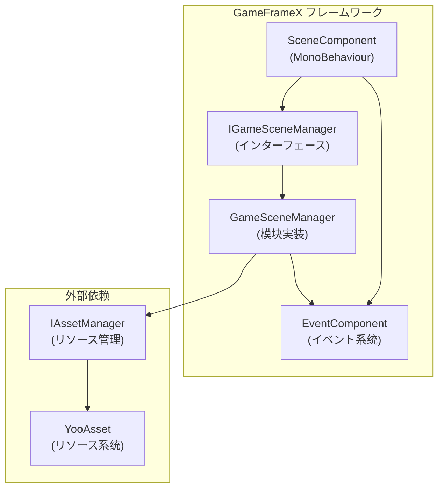
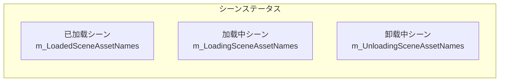
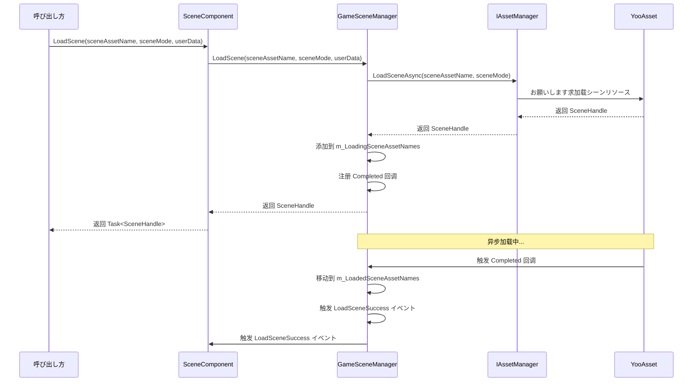
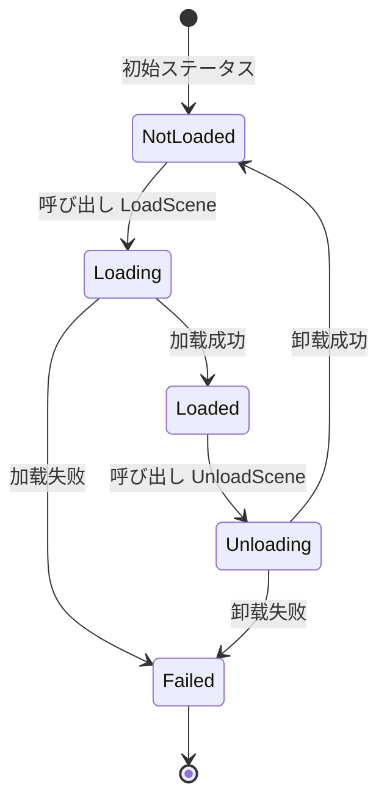
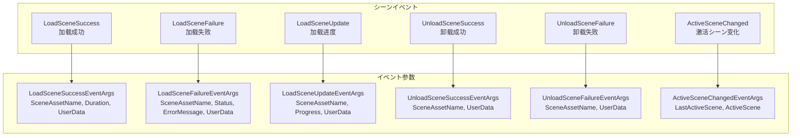

# コア機能

GameFrameX Scene シーン管理コンポーネント提供します完整的异步シーン加载、卸载、ステータス查询和イベント通知機能，是ゲーム开发中管理多个シーン的コア模块。

## 概要

Scene コンポーネント是 GameFrameX フレームワーク的コア模块之一，专门に使用管理 Unity ゲーム中的シーンリソース。该コンポーネント基づく YooAsset リソース管理系统构建，提供します以下コア能力：

- **异步シーン加载**：サポート异步加载シーンリソース，无需阻塞主线程
- **シーンステータス管理**：查询シーン的加载、卸载ステータス
- **シーン激活控制**：管理当前激活的シーン和主摄像机
- **イベント驱动**：完整的イベント系统に使用监听シーンステータス变化
- **シーン优先级**：サポート設定シーン加载优先级，控制激活顺序

### コア设计理念

Scene コンポーネント采用モジュラー設計，将业务逻辑与 Unity コンポーネント分离。`SceneComponent` 作为 Unity コンポーネント挂载到 GameObject 上，而コア逻辑由 `GameSceneManager` 模块处理。这种设计使得代码更加清晰，便于测试和维护。



## シーンステータス管理

Scene コンポーネント维护了三个内部字典来追踪シーンステータス，这种设计确保了高效的ステータス查询：



### ステータス查询メソッド

Scene コンポーネント提供します完整的シーンステータス查询 API，可能准确取得任意シーン的当前ステータス：

```csharp
// 检查シーン是否已加载
bool isLoaded = sceneComponent.SceneIsLoaded("Assets/Scenes/MainMenu.unity");

// 检查シーン是否正在加载
bool isLoading = sceneComponent.SceneIsLoading("Assets/Scenes/GamePlay.unity");

// 检查シーン是否正在卸载
bool isUnloading = sceneComponent.SceneIsUnloading("Assets/Scenes/MainMenu.unity");

// 取得所有已加载シーン的名称
string[] loadedScenes = sceneComponent.GetLoadedSceneAssetNames();

// 取得所有正在加载的シーン名称
string[] loadingScenes = sceneComponent.GetLoadingSceneAssetNames();

// 取得所有正在卸载的シーン名称
string[] unloadingScenes = sceneComponent.GetUnloadingSceneAssetNames();
```
> Source: [SceneComponent.cs](https://github.com/GameFrameX/com.gameframex.unity.scene/blob/main/Runtime/Scene/SceneComponent.cs#L174-L251)

### シーン存在性检查

在加载シーン前，可能先检查シーンリソース是否存在：

```csharp
// 检查シーンリソース是否存在
bool hasScene = sceneComponent.HasScene("Assets/Scenes/GamePlay.unity");
```
> Source: [SceneComponent.cs](https://github.com/GameFrameX/com.gameframex.unity.scene/blob/main/Runtime/Scene/SceneComponent.cs#L258-L274)

## シーン加载与卸载

### 加载シーン

Scene コンポーネントサポート多种加载模式，可能に基づいてゲーム需求选择合适的加载方法：



#### 基础加载

最简单的シーン加载方法，无需指定加载模式：

```csharp
// 加载单个シーン（使用默认的 Additive 模式）
var handle = await sceneComponent.LoadScene("Assets/Scenes/GamePlay.unity");
```
> Source: [SceneComponent.cs](https://github.com/GameFrameX/com.gameframex.unity.scene/blob/main/Runtime/Scene/SceneComponent.cs#L280-L283)

#### 带模式的加载

可能指定加载模式（Single 或 Additive）和用户自定义数据：

```csharp
// 使用 Single 模式加载（替换当前シーン）
var handle = await sceneComponent.LoadScene(
    "Assets/Scenes/GamePlay.unity", 
    LoadSceneMode.Single, 
    null  // 用户自定义数据
);

// 使用 Additive 模式加载（叠加シーン）
var handle = await sceneComponent.LoadScene(
    "Assets/Scenes/GamePlay.unity", 
    LoadSceneMode.Additive, 
    new { level = 1 }  // 自定义数据
);
```
> Source: [SceneComponent.cs](https://github.com/GameFrameX/com.gameframex.unity.scene/blob/main/Runtime/Scene/SceneComponent.cs#L291-L307)

**LoadSceneMode 説明：**
- **Single**：替换当前活动シーン，加载完成后只保留新シーン
- **Additive**：将新シーン叠加到当前シーン，保留所有已加载的シーン

### 卸载シーン

卸载シーン是将已加载的シーン从内存中移除的过程：

```csharp
// 卸载指定シーン
sceneComponent.UnloadScene("Assets/Scenes/MainMenu.unity");

// 卸载シーン并传递用户自定义数据
sceneComponent.UnloadScene("Assets/Scenes/MainMenu.unity", new { reason = "quit" });
```
> Source: [SceneComponent.cs](https://github.com/GameFrameX/com.gameframex.unity.scene/blob/main/Runtime/Scene/SceneComponent.cs#L314-L331)

### 加载フロー详解

シーン加载过程中，コンポーネント会经历多个ステータス转换。理解这些ステータス有助于更好地处理异步加载逻辑：

1. **初始ステータス**：シーン不在任何字典中
2. **加载中**：シーン添加到 `m_LoadingSceneAssetNames`，触发 `LoadSceneUpdate` イベント
3. **加载完成**：シーン移动到 `m_LoadedSceneAssetNames`，触发 `LoadSceneSuccess` イベント
4. **卸载中**：シーン添加到 `m_UnloadingSceneAssetNames`
5. **卸载完成**：シーン从所有字典中移除，触发 `UnloadSceneSuccess` イベント



## シーン激活与主摄像机管理

### 活动シーン管理

Scene コンポーネントサポート設定シーン的加载顺序，并に基づいて顺序自动激活最优先的シーン：

```csharp
// 設定シーン加载优先级（数值越大优先级越高）
sceneComponent.SetSceneOrder("Assets/Scenes/MainMenu.unity", 1);
sceneComponent.SetSceneOrder("Assets/Scenes/GamePlay.unity", 10);
```
> Source: [SceneComponent.cs](https://github.com/GameFrameX/com.gameframex.unity.scene/blob/main/Runtime/Scene/SceneComponent.cs#L338-L367)

当多个シーン叠加加载时，优先级最高的シーン会自动成为活动シーン。

### 主摄像机刷新

コンポーネント会自动追踪当前活动シーン的主摄像机：

```csharp
// 刷新主摄像机引用
sceneComponent.RefreshMainCamera();

// 取得当前主摄像机
Camera mainCam = sceneComponent.MainCamera;
```
> Source: [SceneComponent.cs](https://github.com/GameFrameX/com.gameframex.unity.scene/blob/main/Runtime/Scene/SceneComponent.cs#L372-L375)

### 激活シーン变化イベント

当活动シーン发生变化时，会触发相应イベント：

```csharp
m_EventComponent.Fire(this, ActiveSceneChangedEventArgs.Create(lastActiveScene, activeScene));
```
> Source: [SceneComponent.cs](https://github.com/GameFrameX/com.gameframex.unity.scene/blob/main/Runtime/Scene/SceneComponent.cs#L431)

## イベント系统

Scene コンポーネント提供します完善的イベント系统，開発者可能を通じて订阅イベント来响应シーンステータス变化。这种设计実装了松耦合的通信方法，使得不同模块可能独立响应シーンイベント。



### 订阅シーンイベント

在 `SceneComponent` 初期化时，会自动订阅内部イベント并转发给 `EventComponent`：

```csharp
_gameSceneManager.LoadSceneSuccess += OnLoadGameSceneSuccess;
_gameSceneManager.LoadSceneFailure += OnLoadGameSceneFailure;
_gameSceneManager.LoadSceneUpdate += OnLoadGameSceneUpdate;
_gameSceneManager.UnloadSceneSuccess += OnUnloadGameSceneSuccess;
_gameSceneManager.UnloadSceneFailure += OnUnloadGameSceneFailure;
```
> Source: [SceneComponent.cs](https://github.com/GameFrameX/com.gameframex.unity.scene/blob/main/Runtime/Scene/SceneComponent.cs#L89-L103)

### イベント使用示例

```csharp
// 订阅加载成功イベント
EventComponent.Subscribe<LoadSceneSuccessEventArgs>(OnLoadSceneSuccess);

private void OnLoadSceneSuccess(object sender, LoadSceneSuccessEventArgs e)
{
    Debug.Log($"シーン加载成功: {e.SceneAssetName}, 耗时: {e.Duration}秒");
}

// 订阅加载进度イベント
EventComponent.Subscribe<LoadSceneUpdateEventArgs>(OnLoadSceneUpdate);

private void OnLoadSceneUpdate(object sender, LoadSceneUpdateEventArgs e)
{
    Debug.Log($"加载进度: {e.SceneAssetName}, {e.Progress * 100}%");
}

// 订阅卸载成功イベント
EventComponent.Subscribe<UnloadSceneSuccessEventArgs>(OnUnloadSceneSuccess);

private void OnUnloadSceneSuccess(object sender, UnloadSceneSuccessEventArgs e)
{
    Debug.Log($"シーン卸载成功: {e.SceneAssetName}");
}
```

## コンポーネント配置

### SceneComponent プロパティ

`SceneComponent` を継承 `GameFrameworkComponent`，挂载到 Unity シーン中时会自动初期化：

```csharp
[DisallowMultipleComponent]
[AddComponentMenu("GameFrameX/Scene")]
public sealed class SceneComponent : GameFrameworkComponent
{
    [SerializeField] private bool m_EnableLoadSceneUpdateEvent = true;
    [SerializeField] private bool m_EnableLoadSceneDependencyAssetEvent = true;
}
```
> Source: [SceneComponent.cs](https://github.com/GameFrameX/com.gameframex.unity.scene/blob/main/Runtime/Scene/SceneComponent.cs#L47-L64)

### 設定説明

| プロパティ | クラス型 | 默认值 | 説明 |
|------|------|--------|------|
| `m_EnableLoadSceneUpdateEvent` | bool | true | 是否启用シーン加载进度更新イベント |
| `m_EnableLoadSceneDependencyAssetEvent` | bool | true | 是否启用依赖リソース加载イベント |

### 编辑器 Inspector

在 Unity 编辑器中，可能查看当前シーンステータス：

```csharp
// Inspector 中显示的信息
EditorGUILayout.LabelField("Loaded Scene Asset Names", GetSceneNameString(t.GetLoadedSceneAssetNames()));
EditorGUILayout.LabelField("Loading Scene Asset Names", GetSceneNameString(t.GetLoadingSceneAssetNames()));
EditorGUILayout.LabelField("Unloading Scene Asset Names", GetSceneNameString(t.GetUnloadingSceneAssetNames()));
EditorGUILayout.ObjectField("Main Camera", t.MainCamera, typeof(Camera), true);
```
> Source: [SceneComponentInspector.cs](https://github.com/GameFrameX/com.gameframex.unity.scene/blob/main/Editor/Inspector/SceneComponentInspector.cs#L64-L67)

## コアフロー

### 完整的シーン切换フロー

以下は完整的シーン切换示例，展示了各个コンポーネント的协作过程：

```csharp
public class GameSceneController : MonoBehaviour
{
    private SceneComponent _sceneComponent;
    private EventComponent _eventComponent;

    private void Start()
    {
        _sceneComponent = GameEntry.GetComponent<SceneComponent>();
        _eventComponent = GameEntry.GetComponent<EventComponent>();
        
        // 订阅イベント
        _eventComponent.Subscribe<LoadSceneSuccessEventArgs>(OnLoadSceneSuccess);
        _eventComponent.Subscribe<LoadSceneFailureEventArgs>(OnLoadSceneFailure);
    }

    // 切换到ゲームシーン
    public async void SwitchToGameScene()
    {
        try
        {
            // 設定シーン优先级
            _sceneComponent.SetSceneOrder("Assets/Scenes/GamePlay.unity", 10);
            
            // 异步加载シーン
            var handle = await _sceneComponent.LoadScene(
                "Assets/Scenes/GamePlay.unity",
                LoadSceneMode.Additive,
                new { timestamp = Time.time }
            );
            
            Debug.Log($"シーン加载完成: {handle.Scene.name}");
        }
        catch (Exception ex)
        {
            Debug.LogError($"シーン加载失败: {ex.Message}");
        }
    }

    private void OnLoadSceneSuccess(object sender, LoadSceneSuccessEventArgs e)
    {
        Debug.Log($"シーン {e.SceneAssetName} 加载成功，耗时 {e.Duration} 秒");
    }

    private void OnLoadSceneFailure(object sender, LoadSceneFailureEventArgs e)
    {
        Debug.LogError($"シーン {e.SceneAssetName} 加载失败: {e.ErrorMessage}");
    }
}
```

### 错误处理

`GameSceneManager` 在加载和卸载シーン时会进行多重ステータス检查，防止重复操作：

```csharp
if (SceneIsUnloading(sceneAssetName))
{
    throw new GameFrameworkException(Utility.Text.Format("Scene asset '{0}' is being unloaded.", sceneAssetName));
}

if (SceneIsLoading(sceneAssetName))
{
    throw new GameFrameworkException(Utility.Text.Format("Scene asset '{0}' is being loaded.", sceneAssetName));
}

if (SceneIsLoaded(sceneAssetName))
{
    throw new GameFrameworkException(Utility.Text.Format("Scene asset '{0}' is already loaded.", sceneAssetName));
}
```
> Source: [GameSceneManager.cs](https://github.com/GameFrameX/com.gameframex.unity.scene/blob/main/Runtime/Scene/Scene/GameSceneManager.cs#L360-L373)

## 関連リンク

- [快速入门](./3-getting-started) - 了解如何快速集成 Scene コンポーネント
- [API 参考](./5-api-reference) - 完整的 API インターフェース文档
- [イベント系统](./6-events) - 详细的イベント系统説明
- [常见问题](./7-troubleshooting) - 常见问题与解決策
- [GameFrameX 官网](https://gameframex.doc.alianblank.com/) - 官方文档
- [GitHub 仓库](https://github.com/GameFrameX/com.gameframex.unity.scene.git) - プロジェクトソースコード
