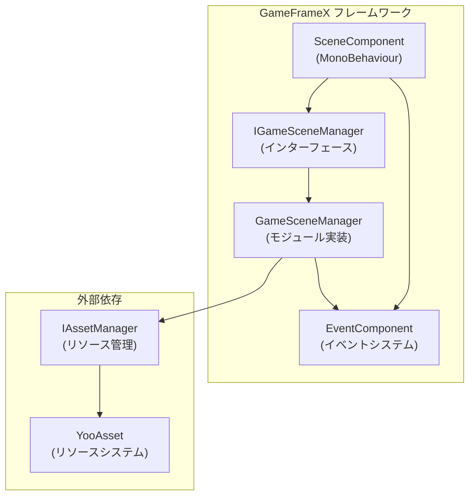
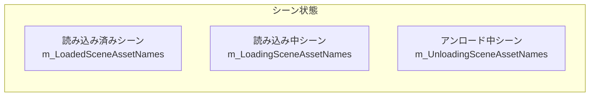
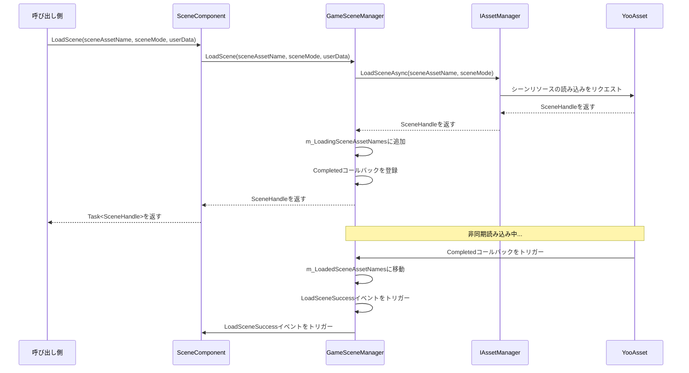
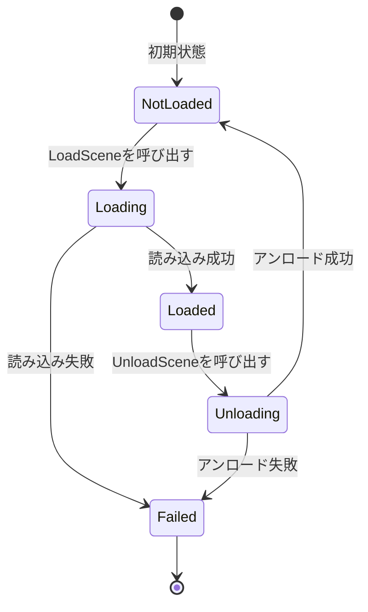
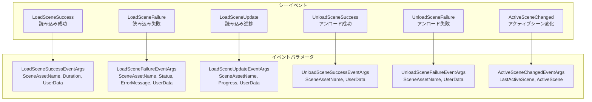

# コア機能

GameFrameX Scene シーンマネジメントコンポーネントは、完全な非同期シーン読み込み、アンロード、状態查询、イベント通知機能を提供し、ゲーム開発における複数のシーン管理のコアモジュールです。

## 概要

Scene コンポーネントは GameFrameX フレームワークのコアモジュールの1つであり、Unity ゲーム内のシーンパストラバーションの管理を専門とします。このコンポーネントは YooAsset リソース管理系统に基づいて構築され、以下のコア機能を提供します：

- **非同期シーン読み込み**：シーンリソースの非同期読み込みをサポートし、メインスレッドをブロックしない
- **シー状態管理**：シーンの読み込み、アンロード状態を查询
- **シーンアクティブ制御**：現在のアクティブシーンとメインカメラを管理
- **イベント駆動**：シーン状態変化を监听するための完全なイベントシステム
- **シーンパイオリティ**：シーン読み込みプライオリテイの設定をサポートし、アクティブ順序を制御

### コア設計理念

Scene コンポーネントはモジュール設計を採用し、ビジネスロジックと Unity コンポーネントを分離します。`SceneComponent` は Unity コンポーネントとして GameObject にマウントされ、コアロジックは `GameSceneManager` モジュールが処理します。この設計により、コードがさらに明確になり、テストとメンテナンスが容易になります。



## シー状態管理

Scene コンポーネントは3つの内部辞書を维持してシー状態を追跡します。この設計は高效な状態查询を確保します：



### 状態查询メソッド

Scene コンポーネントは完全なシー状態查询 API を提供し、任意シーンの現在状態を正確に取得できます：

```csharp
// シーンが読み込まれているか確認
bool isLoaded = sceneComponent.SceneIsLoaded("Assets/Scenes/MainMenu.unity");

// シーンが読み込み中か確認
bool isLoading = sceneComponent.SceneIsLoading("Assets/Scenes/GamePlay.unity");

// シーンがアンロード中か確認
bool isUnloading = sceneComponent.SceneIsUnloading("Assets/Scenes/MainMenu.unity");

// すべての読み込み済みシーンの名称を取得
string[] loadedScenes = sceneComponent.GetLoadedSceneAssetNames();

// すべての読み込み中シーンの名称を取得
string[] loadingScenes = sceneComponent.GetLoadingSceneAssetNames();

// すべてのアンロード中シーンの名称を取得
string[] unloadingScenes = sceneComponent.GetUnloadingSceneAssetNames();
```
> Source: [SceneComponent.cs](https://github.com/GameFrameX/com.gameframex.unity.scene/blob/main/Runtime/Scene/SceneComponent.cs#L174-L251)

### シーン存在性確認

シーンを読み込む前に、シーンパスが存在するかどうかを確認できます：

```csharp
// シーンパスが是否存在するか確認
bool hasScene = sceneComponent.HasScene("Assets/Scenes/GamePlay.unity");
```
> Source: [SceneComponent.cs](https://github.com/GameFrameX/com.gameframex.unity.scene/blob/main/Runtime/Scene/SceneComponent.cs#L258-L274)

## シーン読み込みとアンロード

### シーン読み込み

Scene コンポーネントは多种 읽기 モードをサポートし、ゲーム需求に応じて適切な読み込み方法を選択できます：



#### 基本読み込み

最もシンプルなシーン読み込み方法で、読み込みモードを指定する必要はありません：

```csharp
// 単一シーンを読み込む（デフォルトの Additive モードを使用）
var handle = await sceneComponent.LoadScene("Assets/Scenes/GamePlay.unity");
```
> Source: [SceneComponent.cs](https://github.com/GameFrameX/com.gameframex.unity.scene/blob/main/Runtime/Scene/SceneComponent.cs#L280-L283)

#### モード指定読み込み

読み込みモード（Single または Additive）やユーザー定義データを指定できます：

```csharp
// Single モードで読み込む（現在のシーンを置換）
var handle = await sceneComponent.LoadScene(
    "Assets/Scenes/GamePlay.unity", 
    LoadSceneMode.Single, 
    null  // ユーザー定義データ
);

// Additive モードで読み込む（シーンを加算）
var handle = await sceneComponent.LoadScene(
    "Assets/Scenes/GamePlay.unity", 
    LoadSceneMode.Additive, 
    new { level = 1 }  // カスタムデータ
);
```
> Source: [SceneComponent.cs](https://github.com/GameFrameX/com.gameframex.unity.scene/blob/main/Runtime/Scene/SceneComponent.cs#L291-L307)

**LoadSceneMode 説明：**
- **Single**：現在のアクティブシーンを置換し、読み込み完了後に新シーンのみを保持
- **Additive**：新シーンを現在のシーンに加算し、すべての読み込み済みシーンを保持

### シーンアンロード

シーンをアンロードすると、読み込まれたシーンがメモリから移除されます：

```csharp
// 指定したシーンをアンロード
sceneComponent.UnloadScene("Assets/Scenes/MainMenu.unity");

// シーンをアンロードしてユーザー定義データを传递
sceneComponent.UnloadScene("Assets/Scenes/MainMenu.unity", new { reason = "quit" });
```
> Source: [SceneComponent.cs](https://github.com/GameFrameX/com.gameframex.unity.scene/blob/main/Runtime/Scene/SceneComponent.cs#L314-L331)

### 読み込みフロー詳解

シーン読み込みプロセス中、コンポーネントは複数の状態変換を経験します。これらの状態を理解することが、非同期読み込みロジックの处理に 도움이ります：

1. **初期状態**：シーンがいずれの辞書にもない
2. **読み込み中**：シーンが `m_LoadingSceneAssetNames` に追加され、`LoadSceneUpdate` イベントがトリガー
3. **読み込み完了**：シーンが `m_LoadedSceneAssetNames` に移動し、`LoadSceneSuccess` イベントがトリガー
4. **アンロード中**：シーンが `m_UnloadingSceneAssetNames` に追加
5. **アンロード完了**：シーンがすべての辞書から移除され、`UnloadSceneSuccess` イベントがトリガー



## シーンアクティブとメインカメラ管理

### アクティブシーンマネジメント

Scene コンポーネントはシーンの読み込み順序の設定をサポートし、順序に従って最も優先度の高いシーンが自動的にアクティブになります：

```csharp
// シーン読み込みプライオリテイを設定（数値が大きいほどプライオリテイが高い）
sceneComponent.SetSceneOrder("Assets/Scenes/MainMenu.unity", 1);
sceneComponent.SetSceneOrder("Assets/Scenes/GamePlay.unity", 10);
```
> Source: [SceneComponent.cs](https://github.com/GameFrameX/com.gameframex.unity.scene/blob/main/Runtime/Scene/SceneComponent.cs#L338-L367)

複数のシーンを加算して読み込むと、プライオリテイが最も高いシーンが自動的にアクティブシーンになります。

### メインカメラ更新

コンポーネントは現在のアクティブシーンのメインカメラを自動的に追跡します：

```csharp
// メインカメラ参照を更新
sceneComponent.RefreshMainCamera();

// 現在のメインカメラを取得
Camera mainCam = sceneComponent.MainCamera;
```
> Source: [SceneComponent.cs](https://github.com/GameFrameX/com.gameframex.unity.scene/blob/main/Runtime/Scene/SceneComponent.cs#L372-L375)

### アクティブシーン変化イベント

アクティブシーンが变化すると、相应的イベントがトリガーされます：

```csharp
m_EventComponent.Fire(this, ActiveSceneChangedEventArgs.Create(lastActiveScene, activeScene));
```
> Source: [SceneComponent.cs](https://github.com/GameFrameX/com.gameframex.unity.scene/blob/main/Runtime/Scene/SceneComponent.cs#L431)

## イベントシステム

Scene コンポーネントは完全なイベントシステムを提供し、開発者はイベントの購読を通じてシー状態変化に応答できます。この設計は疎結合の通信方式を実現し、異なるモジュールが獨立してシーイベントに応答できます。



### シーイベントの購読

`SceneComponent` の初期化時、内部イベントが自動的に購読され `EventComponent` に転送されます：

```csharp
_gameSceneManager.LoadSceneSuccess += OnLoadGameSceneSuccess;
_gameSceneManager.LoadSceneFailure += OnLoadGameSceneFailure;
_gameSceneManager.LoadSceneUpdate += OnLoadGameSceneUpdate;
_gameSceneManager.UnloadSceneSuccess += OnUnloadGameSceneSuccess;
_gameSceneManager.UnloadSceneFailure += OnUnloadGameSceneFailure;
```
> Source: [SceneComponent.cs](https://github.com/GameFrameX/com.gameframex.unity.scene/blob/main/Runtime/Scene/SceneComponent.cs#L89-L103)

### イベント使用例

```csharp
// 読み込み成功イベントを購読
EventComponent.Subscribe<LoadSceneSuccessEventArgs>(OnLoadSceneSuccess);

private void OnLoadSceneSuccess(object sender, LoadSceneSuccessEventArgs e)
{
    Debug.Log($"シーン読み込み成功: {e.SceneAssetName}, 所要時間: {e.Duration}秒");
}

// 読み込み進捗イベントを購読
EventComponent.Subscribe<LoadSceneUpdateEventArgs>(OnLoadSceneUpdate);

private void OnLoadSceneUpdate(object sender, LoadSceneUpdateEventArgs e)
{
    Debug.Log($"読み込み進捗: {e.SceneAssetName}, {e.Progress * 100}%");
}

// アンロード成功イベントを購読
EventComponent.Subscribe<UnloadSceneSuccessEventArgs>(OnUnloadSceneSuccess);

private void OnUnloadSceneSuccess(object sender, UnloadSceneSuccessEventArgs e)
{
    Debug.Log($"シーンアンロード成功: {e.SceneAssetName}");
}
```

## コンポーネント設定

### SceneComponent プロパティ

`SceneComponent` は `GameFrameworkComponent` を継承し、Unity シーンにマウントすると自動的に初期化されます：

```csharp
[DisallowMultipleComponent]
[AddComponentMenu("GameFrameX/Scene")]
public sealed class SceneComponent : GameFrameworkComponent
{
    [SerializeField] private bool m_EnableLoadSceneUpdateEvent = true;
    [SerializeField] private bool m_EnableLoadSceneDependencyAssetEvent = true;
}
```
> Source: [SceneComponent.cs](https://github.com/GameFrameX/com.gameframex.unity.scene/blob/main/Runtime/Scene/SceneComponent.cs#L47-L64)

### 設定説明

| プロパティ | タイプ | デフォルト値 | 説明 |
|------|------|--------|------|
| `m_EnableLoadSceneUpdateEvent` | bool | true | シーン読み込み進捗更新イベントを有効にするかどうか |
| `m_EnableLoadSceneDependencyAssetEvent` | bool | true | 依存リソース読み込みイベントを有効にするかどうか |

### エディター Inspector

Unity エディターでは、現在のシーン状態を確認できます：

```csharp
// Inspector に表示する情報
EditorGUILayout.LabelField("Loaded Scene Asset Names", GetSceneNameString(t.GetLoadedSceneAssetNames()));
EditorGUILayout.LabelField("Loading Scene Asset Names", GetSceneNameString(t.GetLoadingSceneAssetNames()));
EditorGUILayout.LabelField("Unloading Scene Asset Names", GetSceneNameString(t.GetUnloadingSceneAssetNames()));
EditorGUILayout.ObjectField("Main Camera", t.MainCamera, typeof(Camera), true);
```
> Source: [SceneComponentInspector.cs](https://github.com/GameFrameX/com.gameframex.unity.scene/blob/main/Editor/Inspector/SceneComponentInspector.cs#L64-L67)

## コアフロー

### 完全なシーン切り替えフロー

以下は完全なシーン切り替え例であり、各コンポーネントの協力プロセスを示します：

```csharp
public class GameSceneController : MonoBehaviour
{
    private SceneComponent _sceneComponent;
    private EventComponent _eventComponent;

    private void Start()
    {
        _sceneComponent = GameEntry.GetComponent<SceneComponent>();
        _eventComponent = GameEntry.GetComponent<EventComponent>();
        
        // イベントを購読
        _eventComponent.Subscribe<LoadSceneSuccessEventArgs>(OnLoadSceneSuccess);
        _eventComponent.Subscribe<LoadSceneFailureEventArgs>(OnLoadSceneFailure);
    }

    // ゲームシーンに切り替え
    public async void SwitchToGameScene()
    {
        try
        {
            // シーンプライオリテイを設定
            _sceneComponent.SetSceneOrder("Assets/Scenes/GamePlay.unity", 10);
            
            // 非同期シーンを読み込む
            var handle = await _sceneComponent.LoadScene(
                "Assets/Scenes/GamePlay.unity",
                LoadSceneMode.Additive,
                new { timestamp = Time.time }
            );
            
            Debug.Log($"シーン読み込み完了: {handle.Scene.name}");
        }
        catch (Exception ex)
        {
            Debug.LogError($"シーン読み込み失敗: {ex.Message}");
        }
    }

    private void OnLoadSceneSuccess(object sender, LoadSceneSuccessEventArgs e)
    {
        Debug.Log($"シーン {e.SceneAssetName} の読み込みが成功しました。所要時間 {e.Duration} 秒");
    }

    private void OnLoadSceneFailure(object sender, LoadSceneFailureEventArgs e)
    {
        Debug.LogError($"シーン {e.SceneAssetName} の読み込みに失敗しました: {e.ErrorMessage}");
    }
}
```

### エラー処理

`GameSceneManager` はシーンの読み込みとアンロード時に multiple 状態チェックを実行し、重复操作を防ぎます：

```csharp
if (SceneIsUnloading(sceneAssetName))
{
    throw new GameFrameworkException(Utility.Text.Format("Scene asset '{0}' is being unloaded.", sceneAssetName));
}

if (SceneIsLoading(sceneAssetName))
{
    throw new GameFrameworkException(Utility.Text.Format("Scene asset '{0}' is being loaded.", sceneAssetName));
}

if (SceneIsLoaded(sceneAssetName))
{
    throw new GameFrameworkException(Utility.Text.Format("Scene asset '{0}' is already loaded.", sceneAssetName));
}
```
> Source: [GameSceneManager.cs](https://github.com/GameFrameX/com.gameframex.unity.scene/blob/main/Runtime/Scene/Scene/GameSceneManager.cs#L360-L373)

## 関連リンク

- [クイックスタート](./3-getting-started) - Scene コンポーネントのクイック統合方法を了解
- [APIリファレンス](./5-api-reference) - 完全な API 接口ドキュメント
- [イベントシステム](./6-events) - 詳細なイベントシステム説明
- [トラブルシューティング](./7-troubleshooting) - 一般的な問題と解決策
- [GameFrameX 公式サイト](https://gameframex.doc.alianblank.com/) - 公式ドキュメント
- [GitHubリポジトリ](https://github.com/GameFrameX/com.gameframex.unity.scene.git) - プロジェクトソースコード
