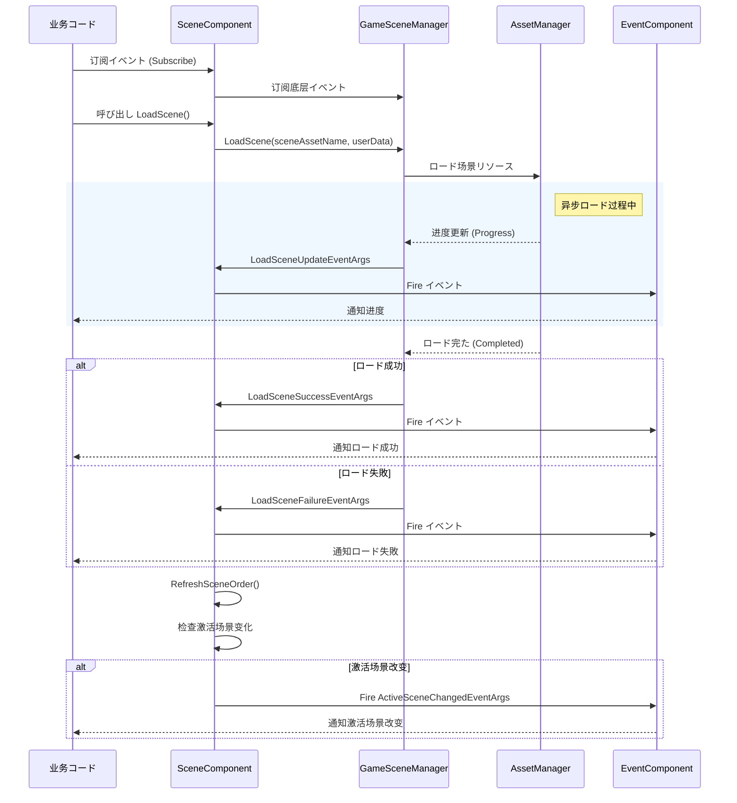

# イベント

GameFrameX Scene モジュールたのイベント，にロード、アンロードとの。ドキュメント Scene モジュールのイベントタイプ、イベントフローにプロジェクトイベント。

## 

イベントは Scene モジュールのコア，（Observer Pattern），にの。をじてイベント，：

- ****：マネージャーとをじてイベント，モジュールの
- **サポート**：ロードは，イベントたとた
- ****：たのロード、アンロード、
- **プール**： `ReferencePool` イベント，

Scene モジュールた 6 イベントタイプ，の：

| イベントタイプ |  |  |
|---------|------|---------|
| `LoadSceneSuccessEventArgs` | ロードイベント | ロードた |
| `LoadSceneFailureEventArgs` | ロードイベント | ロード |
| `LoadSceneUpdateEventArgs` | ロードイベント | ロード（） |
| `UnloadSceneSuccessEventArgs` | アンロードイベント | アンロードた |
| `UnloadSceneFailureEventArgs` | アンロードイベント | アンロード |
| `ActiveSceneChangedEventArgs` | イベント | の |

## アーキテクチャ

Scene モジュールのイベントアーキテクチャ，むコンポーネント：


### イベントフロー

イベントのフロー：



### イベントクラス

イベントクラス `GameEventArgs` クラス（ GameFrameX.Event モジュール），たプール：

```mermaid
classDiagram
    class GameEventArgs {
        <<abstract>>
        +Id: string { get; }
        +Clear() void
    }
    
    class LoadSceneSuccessEventArgs {
        +EventId: string
        +SceneAssetName: string
        +Duration: float
        +UserData: object
        +Create() LoadSceneSuccessEventArgs
    }
    
    class LoadSceneFailureEventArgs {
        +EventId: string
        +SceneAssetName: string
        +ErrorMessage: string
        +Status: EOperationStatus
        +UserData: object
        +Create() LoadSceneFailureEventArgs
    }
    
    class LoadSceneUpdateEventArgs {
        +EventId: string
        +SceneAssetName: string
        +Progress: float
        +UserData: object
        +Create() LoadSceneUpdateEventArgs
    }
    
    class UnloadSceneSuccessEventArgs {
        +EventId: string
        +SceneAssetName: string
        +UserData: object
        +Create() UnloadSceneSuccessEventArgs
    }
    
    class UnloadSceneFailureEventArgs {
        +EventId: string
        +SceneAssetName: string
        +UserData: object
        +Create() UnloadSceneFailureEventArgs
    }
    
    class ActiveSceneChangedEventArgs {
        +EventId: string
        +LastActiveScene: Scene
        +ActiveScene: Scene
        +Create() ActiveSceneChangedEventArgs
    }
    
    GameEventArgs <|-- LoadSceneSuccessEventArgs
    GameEventArgs <|-- LoadSceneFailureEventArgs
    GameEventArgs <|-- LoadSceneUpdateEventArgs
    GameEventArgs <|-- UnloadSceneSuccessEventArgs
    GameEventArgs <|-- UnloadSceneFailureEventArgs
    GameEventArgs <|-- ActiveSceneChangedEventArgs
```

## イベント

### ロードイベント (LoadSceneSuccessEventArgs)

ロードた，むロード。

> Source: [LoadSceneSuccessEventArgs.cs](https://github.com/GameFrameX/com.gameframex.unity.scene/blob/main/Runtime/EventArgs/LoadSceneSuccessEventArgs.cs#L40-L105)

**プロパティ：**

| プロパティ | タイプ |  |
|-----|------|------|
| `SceneAssetName` | string | リソース |
| `Duration` | float | ロード（） |
| `UserData` | object | カスタマイズデータ |

### ロードイベント (LoadSceneFailureEventArgs)

ロード，むエラー。

> Source: [LoadSceneFailureEventArgs.cs](https://github.com/GameFrameX/com.gameframex.unity.scene/blob/main/Runtime/EventArgs/LoadSceneFailureEventArgs.cs#L41-L113)

**プロパティ：**

| プロパティ | タイプ |  |
|-----|------|------|
| `SceneAssetName` | string | リソース |
| `ErrorMessage` | string | エラー |
| `Status` | EOperationStatus |  |
| `UserData` | object | カスタマイズデータ |

### ロードイベント (LoadSceneUpdateEventArgs)

ロード，にロード。

> Source: [LoadSceneUpdateEventArgs.cs](https://github.com/GameFrameX/com.gameframex.unity.scene/blob/main/Runtime/EventArgs/LoadSceneUpdateEventArgs.cs#L40-L105)

**プロパティ：**

| プロパティ | タイプ |  |
|-----|------|------|
| `SceneAssetName` | string | リソース |
| `Progress` | float | ロード（0.0 - 1.0） |
| `UserData` | object | カスタマイズデータ |

### アンロードイベント (UnloadSceneSuccessEventArgs)

アンロードた。

> Source: [UnloadSceneSuccessEventArgs.cs](https://github.com/GameFrameX/com.gameframex.unity.scene/blob/main/Runtime/EventArgs/UnloadSceneSuccessEventArgs.cs#L40-L96)

**プロパティ：**

| プロパティ | タイプ |  |
|-----|------|------|
| `SceneAssetName` | string | リソース |
| `UserData` | object | カスタマイズデータ |

### アンロードイベント (UnloadSceneFailureEventArgs)

アンロード。

> Source: [UnloadSceneFailureEventArgs.cs](https://github.com/GameFrameX/com.gameframex.unity.scene/blob/main/Runtime/EventArgs/UnloadSceneFailureEventArgs.cs#L40-L96)

**プロパティ：**

| プロパティ | タイプ |  |
|-----|------|------|
| `SceneAssetName` | string | リソース |
| `UserData` | object | カスタマイズデータ |

### イベント (ActiveSceneChangedEventArgs)

の。

> Source: [ActiveSceneChangedEventArgs.cs](https://github.com/GameFrameX/com.gameframex.unity.scene/blob/main/Runtime/EventArgs/ActiveSceneChangedEventArgs.cs#L40-L96)

**プロパティ：**

| プロパティ | タイプ |  |
|-----|------|------|
| `LastActiveScene` | Scene | の |
| `ActiveScene` | Scene | の |

## 

### ：イベント

にゲーム，にゲームのマネージャーイベント。ロードとイベント：

```csharp
using GameFrameX.Scene.Runtime;
using GameFrameX.Runtime;
using UnityEngine;

// 继承自 MonoBehaviour の脚本
public class SceneEventExample : MonoBehaviour
{
    private SceneComponent _sceneComponent;

    private void Start()
    {
        // 获取 SceneComponent 实例
        _sceneComponent = GameEntry.GetComponent<SceneComponent>();
        
        // 订阅ロード成功イベント
        _sceneComponent.LoadSceneSuccess += OnLoadSceneSuccess;
        
        // 订阅ロード失敗イベント
        _sceneComponent.LoadSceneFailure += OnLoadSceneFailure;
        
        // 订阅アンロード成功イベント
        _sceneComponent.UnloadSceneSuccess += OnUnloadSceneSuccess;
        
        // 订阅アンロード失敗イベント
        _sceneComponent.UnloadSceneFailure += OnUnloadSceneFailure;
        
        // 订阅激活场景改变イベント
        _sceneComponent.ActiveSceneChanged += OnActiveSceneChanged;
    }

    private void OnLoadSceneSuccess(object sender, LoadSceneSuccessEventArgs e)
    {
        Debug.Log($"场景ロード成功: {e.SceneAssetName}, 耗时: {e.Duration:F2}秒");
        
        // 可能を通じて UserData 传递カスタマイズデータ
        if (e.UserData != null)
        {
            Debug.Log($"用户データ: {e.UserData}");
        }
    }

    private void OnLoadSceneFailure(object sender, LoadSceneFailureEventArgs e)
    {
        Debug.LogError($"场景ロード失敗: {e.SceneAssetName}, エラー: {e.ErrorMessage}");
    }

    private void OnUnloadSceneSuccess(object sender, UnloadSceneSuccessEventArgs e)
    {
        Debug.Log($"场景アンロード成功: {e.SceneAssetName}");
    }

    private void OnUnloadSceneFailure(object sender, UnloadSceneFailureEventArgs e)
    {
        Debug.LogError($"场景アンロード失敗: {e.SceneAssetName}");
    }

    private void OnActiveSceneChanged(object sender, ActiveSceneChangedEventArgs e)
    {
        Debug.Log($"激活场景改变: {e.LastActiveScene.name} -> {e.ActiveScene.name}");
    }

    private void OnDestroy()
    {
        // 记得にコンポーネント销毁时取消订阅，避免内存泄漏
        if (_sceneComponent != null)
        {
            _sceneComponent.LoadSceneSuccess -= OnLoadSceneSuccess;
            _sceneComponent.LoadSceneFailure -= OnLoadSceneFailure;
            _sceneComponent.UnloadSceneSuccess -= OnUnloadSceneSuccess;
            _sceneComponent.UnloadSceneFailure -= OnUnloadSceneFailure;
            _sceneComponent.ActiveSceneChanged -= OnActiveSceneChanged;
        }
    }
}
```
> Source: [SceneComponent.cs](https://github.com/GameFrameX/com.gameframex.unity.scene/blob/main/Runtime/Scene/SceneComponent.cs#L89-L103)

### ：イベントロード

にプロジェクト，ロードロード：

```csharp
using UnityEngine;
using UnityEngine.UI;
using GameFrameX.Scene.Runtime;
using GameFrameX.Runtime;

public class LoadingSceneExample : MonoBehaviour
{
    [SerializeField] private Slider _progressSlider;
    [SerializeField] private Text _progressText;
    [SerializeField] private GameObject _loadingPanel;

    private SceneComponent _sceneComponent;

    private void Awake()
    {
        _loadingPanel.SetActive(false);
    }

    public void LoadSceneWithProgress(string sceneAssetName)
    {
        _sceneComponent = GameEntry.GetComponent<SceneComponent>();
        
        // 订阅ロード进度更新イベント
        _sceneComponent.LoadSceneUpdate += OnLoadSceneUpdate;
        
        // 显示ロード界面
        _loadingPanel.SetActive(true);
        
        // 開始ロード场景，传入カスタマイズデータ
        var userData = new LoadSceneData { SceneName = sceneAssetName };
        _ = _sceneComponent.LoadScene(sceneAssetName, UnityEngine.SceneManagement.LoadSceneMode.Single, userData);
    }

    private void OnLoadSceneUpdate(object sender, LoadSceneUpdateEventArgs e)
    {
        // 更新 UI 显示ロード进度
        float progress = e.Progress * 100f;
        _progressSlider.value = e.Progress;
        _progressText.text = $"{progress:F1}%";
        
        Debug.Log($"ロード进度: {e.SceneAssetName} - {progress:F1}%");
    }

    private void OnLoadSceneSuccess(object sender, LoadSceneSuccessEventArgs e)
    {
        Debug.Log($"场景ロード完た: {e.SceneAssetName}");
        
        // 取消订阅进度イベント
        _sceneComponent.LoadSceneUpdate -= OnLoadSceneUpdate;
        
        // 隐藏ロード界面
        _loadingPanel.SetActive(false);
    }

    // カスタマイズデータクラス
    public class LoadSceneData
    {
        public string SceneName;
    }
}
```

### イベント

SceneComponent たオプションイベントの：

```csharp
public sealed class SceneComponent : GameFrameworkComponent
{
    // は否启用ロード场景更新イベント
    [SerializeField] private bool m_EnableLoadSceneUpdateEvent = true;
    
    // は否启用ロード场景依赖リソースイベント
    [SerializeField] private bool m_EnableLoadSceneDependencyAssetEvent = true;
}
```

> Source: [SceneComponent.cs](https://github.com/GameFrameX/com.gameframex.unity.scene/blob/main/Runtime/Scene/SceneComponent.cs#L62-L64)

をじて Inspector コードのイベント，。

## API リファレンス

### SceneComponent イベント

> Source: [SceneComponent.cs](https://github.com/GameFrameX/com.gameframex.unity.scene/blob/main/Runtime/Scene/SceneComponent.cs#L89-L103)

#### `LoadSceneSuccess` イベント

```csharp
public event EventHandler<LoadSceneSuccessEventArgs> LoadSceneSuccess;
```

ロード。

**イベント：**
- `SceneAssetName` (string): リソース
- `Duration` (float): ロード
- `UserData` (object): カスタマイズデータ

---

#### `LoadSceneFailure` イベント

```csharp
public event EventHandler<LoadSceneFailureEventArgs> LoadSceneFailure;
```

ロード。

**イベント：**
- `SceneAssetName` (string): リソース
- `ErrorMessage` (string): エラー
- `Status` (EOperationStatus): 
- `UserData` (object): カスタマイズデータ

---

#### `LoadSceneUpdate` イベント

```csharp
public event EventHandler<LoadSceneUpdateEventArgs> LoadSceneUpdate;
```

ロード。

**イベント：**
- `SceneAssetName` (string): リソース
- `Progress` (float): ロード (0.0 - 1.0)
- `UserData` (object): カスタマイズデータ

---

#### `UnloadSceneSuccess` イベント

```csharp
public event EventHandler<UnloadSceneSuccessEventArgs> UnloadSceneSuccess;
```

アンロード。

**イベント：**
- `SceneAssetName` (string): リソース
- `UserData` (object): カスタマイズデータ

---

#### `UnloadSceneFailure` イベント

```csharp
public event EventHandler<UnloadSceneFailureEventArgs> UnloadSceneFailure;
```

アンロード。

**イベント：**
- `SceneAssetName` (string): リソース
- `UserData` (object): カスタマイズデータ

---

#### `ActiveSceneChanged` イベント

```csharp
public event EventHandler<ActiveSceneChangedEventArgs> ActiveSceneChanged;
```

。

**イベント：**
- `LastActiveScene` (Scene): の
- `ActiveScene` (Scene): の

### IGameSceneManager イベント

> Source: [IGameSceneManager.cs](https://github.com/GameFrameX/com.gameframex.unity.scene/blob/main/Runtime/Scene/Scene/IGameSceneManager.cs#L44-L70)

IGameSceneManager インターフェースたと SceneComponent のイベント，イベントに GameSceneManager ， SceneComponent グローバルイベント。

### イベントメソッド

イベントクラスたの `Create` メソッドにイベント， `Clear` メソッドにデータ（プール）。

```csharp
// 作成 LoadSceneSuccessEventArgs
LoadSceneSuccessEventArgs.Create(string sceneAssetName, float duration, object userData)

// 作成 LoadSceneFailureEventArgs
LoadSceneFailureEventArgs.Create(string sceneAssetName, EOperationStatus status, string errorMessage, object userData)

// 作成 LoadSceneUpdateEventArgs
LoadSceneUpdateEventArgs.Create(string sceneAssetName, float progress, object userData)

// 作成 UnloadSceneSuccessEventArgs
UnloadSceneSuccessEventArgs.Create(string sceneAssetName, object userData)

// 作成 UnloadSceneFailureEventArgs
UnloadSceneFailureEventArgs.Create(string sceneAssetName, object userData)

// 作成 ActiveSceneChangedEventArgs
ActiveSceneChangedEventArgs.Create(Scene lastActiveScene, Scene activeScene)
```

> Source: [LoadSceneSuccessEventArgs.cs](https://github.com/GameFrameX/com.gameframex.unity.scene/blob/main/Runtime/EventArgs/LoadSceneSuccessEventArgs.cs#L87-L94)

## 

### 1. 

に MonoBehaviour の `OnDestroy` コンポーネントイベント，：

```csharp
private void OnDestroy()
{
    if (_sceneComponent != null)
    {
        _sceneComponent.LoadSceneSuccess -= OnLoadSceneSuccess;
        // 取消其他所有订阅...
    }
}
```

### 2.  UserData 

をじて `userData` パラメータにロード，グローバル：

```csharp
// ロード场景时传递データ
await sceneComponent.LoadScene("Assets/Scenes/Game.unity", LoadSceneMode.Single, new GameLoadData { LevelId = 1 });

// にイベント中接收データ
private void OnLoadSceneSuccess(object sender, LoadSceneSuccessEventArgs e)
{
    if (e.UserData is GameLoadData data)
    {
        Debug.Log($"ロード关卡: {data.LevelId}");
    }
}
```

### 3. イベントタイプ

- ****： `LoadSceneUpdate` イベント
- ****： `LoadSceneSuccess` / `LoadSceneFailure` イベント
- **レスポンス**： `ActiveSceneChanged` イベント

### 4. のイベント

ロードイベント，に Inspector ：

```csharp
// を通じてコード禁用
sceneComponent.m_EnableLoadSceneUpdateEvent = false;
```

## リンク

- [コア](./4-core-features) - た Scene モジュールのコア
- [API リファレンス](./5-api-reference) - の API インターフェースドキュメント
- [クイックスタート](./3-getting-started) -  Scene モジュール
- [よくある](./7-troubleshooting) - よくあると
- [GameFrameX サイト](https://gameframex.doc.alianblank.com/) - ドキュメント
- [GitHub リポジトリ](https://github.com/GameFrameX/com.gameframex.unity.scene) - コード
