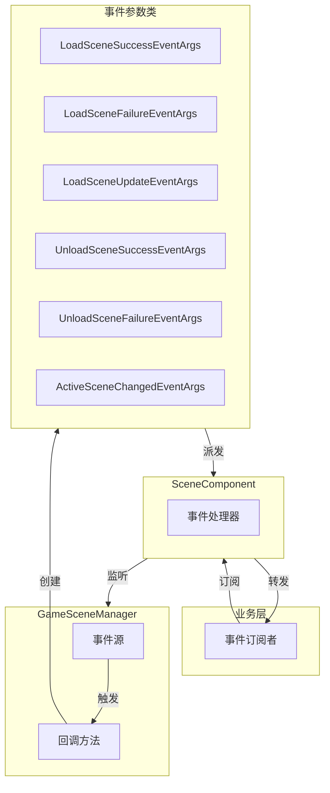
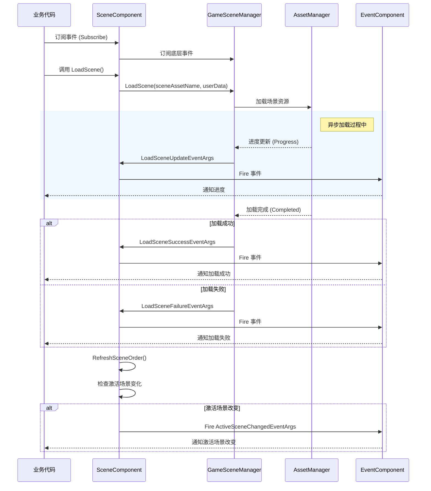

# イベント系统

GameFrameX Scene シーン管理モジュール提供します完善的イベント系统，用于通知シーンロード、アンロード和激活ステータス的变化。このドキュメント詳細介绍 Scene モジュール的イベントタイプ、イベントフローおよび如何在プロジェクト中使用这些イベント。

## 概要

イベント系统是 Scene モジュール的コア组成部分，它采用观察者モード（Observer Pattern）実装，允许開発者在シーンステータス发生变化时受信通知并执行相应的逻辑。通过イベント系统，〜できます実装：

- **解耦**：シーンマネージャー与业务逻辑通过イベント进行通信，降低モジュール间的耦合度
- **异步サポート**：シーンロード是异步操作，イベント系统提供します進捗コールバック和完成通知
- **ステータス追踪**：实时理解するシーン的ロード、アンロード、激活ステータス
- **对象池最適化**：使用 `ReferencePool` 对イベントパラメータ进行复用，减少内存分配

Scene モジュール定義了 6 种イベントタイプ，涵盖シーン操作的完全なライフサイクル：

| イベントタイプ | 説明 | トリガー时机 |
|---------|------|---------|
| `LoadSceneSuccessEventArgs` | ロードシーン成功イベント | シーン成功ロード完成后 |
| `LoadSceneFailureEventArgs` | ロードシーン失敗イベント | シーンロード失敗时 |
| `LoadSceneUpdateEventArgs` | ロードシーンアップデートイベント | シーンロード过程中（進捗アップデート） |
| `UnloadSceneSuccessEventArgs` | アンロードシーン成功イベント | シーン成功アンロード完成后 |
| `UnloadSceneFailureEventArgs` | アンロードシーン失敗イベント | シーンアンロード失敗时 |
| `ActiveSceneChangedEventArgs` | 激活シーン改变イベント | 当前激活的シーン发生变化时 |

## アーキテクチャ

Scene モジュール的イベント系统采用分层アーキテクチャ設計，パッケージ含以下几个关键コンポーネント：



### イベントフロー

シーンイベント的发生遵循以下典型フロー：



### イベントパラメータ类层次结构

所有シーンイベントパラメータ类都継承自 `GameEventArgs` 基底クラス（来自 GameFrameX.Event モジュール），并実装了对象池化机制：

```mermaid
classDiagram
    class GameEventArgs {
        <<abstract>>
        +Id: string { get; }
        +Clear() void
    }
    
    class LoadSceneSuccessEventArgs {
        +EventId: string
        +SceneAssetName: string
        +Duration: float
        +UserData: object
        +Create() LoadSceneSuccessEventArgs
    }
    
    class LoadSceneFailureEventArgs {
        +EventId: string
        +SceneAssetName: string
        +ErrorMessage: string
        +Status: EOperationStatus
        +UserData: object
        +Create() LoadSceneFailureEventArgs
    }
    
    class LoadSceneUpdateEventArgs {
        +EventId: string
        +SceneAssetName: string
        +Progress: float
        +UserData: object
        +Create() LoadSceneUpdateEventArgs
    }
    
    class UnloadSceneSuccessEventArgs {
        +EventId: string
        +SceneAssetName: string
        +UserData: object
        +Create() UnloadSceneSuccessEventArgs
    }
    
    class UnloadSceneFailureEventArgs {
        +EventId: string
        +SceneAssetName: string
        +UserData: object
        +Create() UnloadSceneFailureEventArgs
    }
    
    class ActiveSceneChangedEventArgs {
        +EventId: string
        +LastActiveScene: Scene
        +ActiveScene: Scene
        +Create() ActiveSceneChangedEventArgs
    }
    
    GameEventArgs <|-- LoadSceneSuccessEventArgs
    GameEventArgs <|-- LoadSceneFailureEventArgs
    GameEventArgs <|-- LoadSceneUpdateEventArgs
    GameEventArgs <|-- UnloadSceneSuccessEventArgs
    GameEventArgs <|-- UnloadSceneFailureEventArgs
    GameEventArgs <|-- ActiveSceneChangedEventArgs
```

## イベント详解

### ロードシーン成功イベント (LoadSceneSuccessEventArgs)

シーン成功ロード完成后トリガー，パッケージ含ロード耗时情報。

> Source: [LoadSceneSuccessEventArgs.cs](https://github.com/GameFrameX/com.gameframex.unity.scene/blob/main/Runtime/EventArgs/LoadSceneSuccessEventArgs.cs#L40-L105)

**プロパティ説明：**

| プロパティ | タイプ | 説明 |
|-----|------|------|
| `SceneAssetName` | string | シーンリソース名称 |
| `Duration` | float | ロード持续时间（秒） |
| `UserData` | object | ユーザー自定義数据 |

### ロードシーン失敗イベント (LoadSceneFailureEventArgs)

シーンロード失敗时トリガー，パッケージ含エラー情報。

> Source: [LoadSceneFailureEventArgs.cs](https://github.com/GameFrameX/com.gameframex.unity.scene/blob/main/Runtime/EventArgs/LoadSceneFailureEventArgs.cs#L41-L113)

**プロパティ説明：**

| プロパティ | タイプ | 説明 |
|-----|------|------|
| `SceneAssetName` | string | シーンリソース名称 |
| `ErrorMessage` | string | エラー情報 |
| `Status` | EOperationStatus | 操作ステータス |
| `UserData` | object | ユーザー自定義数据 |

### ロードシーンアップデートイベント (LoadSceneUpdateEventArgs)

シーンロード过程中持续トリガー，用于显示ロード進捗。

> Source: [LoadSceneUpdateEventArgs.cs](https://github.com/GameFrameX/com.gameframex.unity.scene/blob/main/Runtime/EventArgs/LoadSceneUpdateEventArgs.cs#L40-L105)

**プロパティ説明：**

| プロパティ | タイプ | 説明 |
|-----|------|------|
| `SceneAssetName` | string | シーンリソース名称 |
| `Progress` | float | ロード進捗（0.0 - 1.0） |
| `UserData` | object | ユーザー自定義数据 |

### アンロードシーン成功イベント (UnloadSceneSuccessEventArgs)

シーン成功アンロード完成后トリガー。

> Source: [UnloadSceneSuccessEventArgs.cs](https://github.com/GameFrameX/com.gameframex.unity.scene/blob/main/Runtime/EventArgs/UnloadSceneSuccessEventArgs.cs#L40-L96)

**プロパティ説明：**

| プロパティ | タイプ | 説明 |
|-----|------|------|
| `SceneAssetName` | string | シーンリソース名称 |
| `UserData` | object | ユーザー自定義数据 |

### アンロードシーン失敗イベント (UnloadSceneFailureEventArgs)

シーンアンロード失敗时トリガー。

> Source: [UnloadSceneFailureEventArgs.cs](https://github.com/GameFrameX/com.gameframex.unity.scene/blob/main/Runtime/EventArgs/UnloadSceneFailureEventArgs.cs#L40-L96)

**プロパティ説明：**

| プロパティ | タイプ | 説明 |
|-----|------|------|
| `SceneAssetName` | string | シーンリソース名称 |
| `UserData` | object | ユーザー自定義数据 |

### 激活シーン改变イベント (ActiveSceneChangedEventArgs)

当前激活的シーン发生变化时トリガー。

> Source: [ActiveSceneChangedEventArgs.cs](https://github.com/GameFrameX/com.gameframex.unity.scene/blob/main/Runtime/EventArgs/ActiveSceneChangedEventArgs.cs#L40-L96)

**プロパティ説明：**

| プロパティ | タイプ | 説明 |
|-----|------|------|
| `LastActiveScene` | Scene | 上一个被激活的シーン |
| `ActiveScene` | Scene | 当前被激活的シーン |

## 使用例

### 基本用法：購読シーンイベント

在游戏中，通常〜する必要があります在游戏入口或特定的マネージャー中購読シーンイベント。以下例表示如何購読ロード成功和失敗イベント：

```csharp
using GameFrameX.Scene.Runtime;
using GameFrameX.Runtime;
using UnityEngine;

// 继承自 MonoBehaviour 的脚本
public class SceneEventExample : MonoBehaviour
{
    private SceneComponent _sceneComponent;

    private void Start()
    {
        // 获取 SceneComponent 实例
        _sceneComponent = GameEntry.GetComponent<SceneComponent>();
        
        // 订阅加载成功事件
        _sceneComponent.LoadSceneSuccess += OnLoadSceneSuccess;
        
        // 订阅加载失败事件
        _sceneComponent.LoadSceneFailure += OnLoadSceneFailure;
        
        // 订阅卸载成功事件
        _sceneComponent.UnloadSceneSuccess += OnUnloadSceneSuccess;
        
        // 订阅卸载失败事件
        _sceneComponent.UnloadSceneFailure += OnUnloadSceneFailure;
        
        // 订阅激活场景改变事件
        _sceneComponent.ActiveSceneChanged += OnActiveSceneChanged;
    }

    private void OnLoadSceneSuccess(object sender, LoadSceneSuccessEventArgs e)
    {
        Debug.Log($"场景加载成功: {e.SceneAssetName}, 耗时: {e.Duration:F2}秒");
        
        // 可以通过 UserData 传递自定义数据
        if (e.UserData != null)
        {
            Debug.Log($"用户数据: {e.UserData}");
        }
    }

    private void OnLoadSceneFailure(object sender, LoadSceneFailureEventArgs e)
    {
        Debug.LogError($"场景加载失败: {e.SceneAssetName}, 错误: {e.ErrorMessage}");
    }

    private void OnUnloadSceneSuccess(object sender, UnloadSceneSuccessEventArgs e)
    {
        Debug.Log($"场景卸载成功: {e.SceneAssetName}");
    }

    private void OnUnloadSceneFailure(object sender, UnloadSceneFailureEventArgs e)
    {
        Debug.LogError($"场景卸载失败: {e.SceneAssetName}");
    }

    private void OnActiveSceneChanged(object sender, ActiveSceneChangedEventArgs e)
    {
        Debug.Log($"激活场景改变: {e.LastActiveScene.name} -> {e.ActiveScene.name}");
    }

    private void OnDestroy()
    {
        // 记得在组件销毁时取消订阅，避免内存泄漏
        if (_sceneComponent != null)
        {
            _sceneComponent.LoadSceneSuccess -= OnLoadSceneSuccess;
            _sceneComponent.LoadSceneFailure -= OnLoadSceneFailure;
            _sceneComponent.UnloadSceneSuccess -= OnUnloadSceneSuccess;
            _sceneComponent.UnloadSceneFailure -= OnUnloadSceneFailure;
            _sceneComponent.ActiveSceneChanged -= OnActiveSceneChanged;
        }
    }
}
```
> Source: [SceneComponent.cs](https://github.com/GameFrameX/com.gameframex.unity.scene/blob/main/Runtime/Scene/SceneComponent.cs#L89-L103)

### 高级用法：使用進捗イベント実装ロード界面

在实际プロジェクト中，通常〜する必要があります显示ロード界面来反馈ロード進捗：

```csharp
using UnityEngine;
using UnityEngine.UI;
using GameFrameX.Scene.Runtime;
using GameFrameX.Runtime;

public class LoadingSceneExample : MonoBehaviour
{
    [SerializeField] private Slider _progressSlider;
    [SerializeField] private Text _progressText;
    [SerializeField] private GameObject _loadingPanel;

    private SceneComponent _sceneComponent;

    private void Awake()
    {
        _loadingPanel.SetActive(false);
    }

    public void LoadSceneWithProgress(string sceneAssetName)
    {
        _sceneComponent = GameEntry.GetComponent<SceneComponent>();
        
        // 订阅加载进度更新事件
        _sceneComponent.LoadSceneUpdate += OnLoadSceneUpdate;
        
        // 显示加载界面
        _loadingPanel.SetActive(true);
        
        // 开始加载场景，传入自定义数据
        var userData = new LoadSceneData { SceneName = sceneAssetName };
        _ = _sceneComponent.LoadScene(sceneAssetName, UnityEngine.SceneManagement.LoadSceneMode.Single, userData);
    }

    private void OnLoadSceneUpdate(object sender, LoadSceneUpdateEventArgs e)
    {
        // 更新 UI 显示加载进度
        float progress = e.Progress * 100f;
        _progressSlider.value = e.Progress;
        _progressText.text = $"{progress:F1}%";
        
        Debug.Log($"加载进度: {e.SceneAssetName} - {progress:F1}%");
    }

    private void OnLoadSceneSuccess(object sender, LoadSceneSuccessEventArgs e)
    {
        Debug.Log($"场景加载完成: {e.SceneAssetName}");
        
        // 取消订阅进度事件
        _sceneComponent.LoadSceneUpdate -= OnLoadSceneUpdate;
        
        // 隐藏加载界面
        _loadingPanel.SetActive(false);
    }

    // 自定义数据类
    public class LoadSceneData
    {
        public string SceneName;
    }
}
```

### イベント启用設定

SceneComponent 提供します設定オプション来控制イベント的トリガー：

```csharp
public sealed class SceneComponent : GameFrameworkComponent
{
    // 是否启用加载场景更新事件
    [SerializeField] private bool m_EnableLoadSceneUpdateEvent = true;
    
    // 是否启用加载场景依赖资源事件
    [SerializeField] private bool m_EnableLoadSceneDependencyAssetEvent = true;
}
```

> Source: [SceneComponent.cs](https://github.com/GameFrameX/com.gameframex.unity.scene/blob/main/Runtime/Scene/SceneComponent.cs#L62-L64)

通过 Inspector パネル或コード〜できます禁用不〜する必要があります的イベント，以最適化性能。

## API リファレンス

### SceneComponent イベント

> Source: [SceneComponent.cs](https://github.com/GameFrameX/com.gameframex.unity.scene/blob/main/Runtime/Scene/SceneComponent.cs#L89-L103)

#### `LoadSceneSuccess` イベント

```csharp
public event EventHandler<LoadSceneSuccessEventArgs> LoadSceneSuccess;
```

シーンロード成功时トリガー。

**イベントパラメータ：**
- `SceneAssetName` (string): シーンリソース名称
- `Duration` (float): ロード持续时间
- `UserData` (object): ユーザー自定義数据

---

#### `LoadSceneFailure` イベント

```csharp
public event EventHandler<LoadSceneFailureEventArgs> LoadSceneFailure;
```

シーンロード失敗时トリガー。

**イベントパラメータ：**
- `SceneAssetName` (string): シーンリソース名称
- `ErrorMessage` (string): エラー情報
- `Status` (EOperationStatus): 操作ステータス
- `UserData` (object): ユーザー自定義数据

---

#### `LoadSceneUpdate` イベント

```csharp
public event EventHandler<LoadSceneUpdateEventArgs> LoadSceneUpdate;
```

シーンロード过程中持续トリガー。

**イベントパラメータ：**
- `SceneAssetName` (string): シーンリソース名称
- `Progress` (float): ロード進捗 (0.0 - 1.0)
- `UserData` (object): ユーザー自定義数据

---

#### `UnloadSceneSuccess` イベント

```csharp
public event EventHandler<UnloadSceneSuccessEventArgs> UnloadSceneSuccess;
```

シーンアンロード成功时トリガー。

**イベントパラメータ：**
- `SceneAssetName` (string): シーンリソース名称
- `UserData` (object): ユーザー自定義数据

---

#### `UnloadSceneFailure` イベント

```csharp
public event EventHandler<UnloadSceneFailureEventArgs> UnloadSceneFailure;
```

シーンアンロード失敗时トリガー。

**イベントパラメータ：**
- `SceneAssetName` (string): シーンリソース名称
- `UserData` (object): ユーザー自定義数据

---

#### `ActiveSceneChanged` イベント

```csharp
public event EventHandler<ActiveSceneChangedEventArgs> ActiveSceneChanged;
```

激活シーン发生改变时トリガー。

**イベントパラメータ：**
- `LastActiveScene` (Scene): 上一个激活的シーン
- `ActiveScene` (Scene): 当前激活的シーン

### IGameSceneManager イベント

> Source: [IGameSceneManager.cs](https://github.com/GameFrameX/com.gameframex.unity.scene/blob/main/Runtime/Scene/Scene/IGameSceneManager.cs#L44-L70)

IGameSceneManager インターフェース定義了与 SceneComponent 相同的イベント集，这些イベント在 GameSceneManager 内部トリガー，随后被 SceneComponent 转发到全局イベント系统。

### イベントパラメータ作成メソッド

所有イベントパラメータ类都提供します静态的 `Create` メソッド用于作成イベントインスタンス，および `Clear` メソッド用于清理数据（供对象池回收使用）。

```csharp
// 创建 LoadSceneSuccessEventArgs
LoadSceneSuccessEventArgs.Create(string sceneAssetName, float duration, object userData)

// 创建 LoadSceneFailureEventArgs
LoadSceneFailureEventArgs.Create(string sceneAssetName, EOperationStatus status, string errorMessage, object userData)

// 创建 LoadSceneUpdateEventArgs
LoadSceneUpdateEventArgs.Create(string sceneAssetName, float progress, object userData)

// 创建 UnloadSceneSuccessEventArgs
UnloadSceneSuccessEventArgs.Create(string sceneAssetName, object userData)

// 创建 UnloadSceneFailureEventArgs
UnloadSceneFailureEventArgs.Create(string sceneAssetName, object userData)

// 创建 ActiveSceneChangedEventArgs
ActiveSceneChangedEventArgs.Create(Scene lastActiveScene, Scene activeScene)
```

> Source: [LoadSceneSuccessEventArgs.cs](https://github.com/GameFrameX/com.gameframex.unity.scene/blob/main/Runtime/EventArgs/LoadSceneSuccessEventArgs.cs#L87-L94)

## ベストプラクティス

### 1. 及时取消購読

在 MonoBehaviour 的 `OnDestroy` 或コンポーネント禁用时及时取消イベント購読，避免内存泄漏：

```csharp
private void OnDestroy()
{
    if (_sceneComponent != null)
    {
        _sceneComponent.LoadSceneSuccess -= OnLoadSceneSuccess;
        // 取消其他所有订阅...
    }
}
```

### 2. 使用 UserData 传递上下文

通过 `userData` パラメータ在シーンロード时传递上下文情報，避免使用全局变量：

```csharp
// 加载场景时传递数据
await sceneComponent.LoadScene("Assets/Scenes/Game.unity", LoadSceneMode.Single, new GameLoadData { LevelId = 1 });

// 在事件中接收数据
private void OnLoadSceneSuccess(object sender, LoadSceneSuccessEventArgs e)
{
    if (e.UserData is GameLoadData data)
    {
        Debug.Log($"加载关卡: {data.LevelId}");
    }
}
```

### 3. 合理选择イベントタイプ

- **〜する必要があります显示進捗条**：購読 `LoadSceneUpdate` イベント
- **只〜する必要があります結果**：購読 `LoadSceneSuccess` / `LoadSceneFailure` イベント
- **〜する必要があります响应シーン切换**：購読 `ActiveSceneChanged` イベント

### 4. 禁用不〜する必要があります的イベント

もし不〜する必要がありますロード進捗アップデートイベント，〜できます在 Inspector 中禁用以提升性能：

```csharp
// 通过代码禁用
sceneComponent.m_EnableLoadSceneUpdateEvent = false;
```

## 関連リンク

- [コア機能](./4-core-features) - 理解する更多 Scene モジュール的コア機能
- [API リファレンス](./5-api-reference) - 完全な的 API インターフェースドキュメント
- [快速入门](./3-getting-started) - 快速上手 Scene モジュール
- [常见問題](./7-troubleshooting) - 常见問題与解決策
- [GameFrameX 官网](https://gameframex.doc.alianblank.com/) - 官方ドキュメント
- [GitHub リポジトリ](https://github.com/GameFrameX/com.gameframex.unity.scene) - ソースコード
