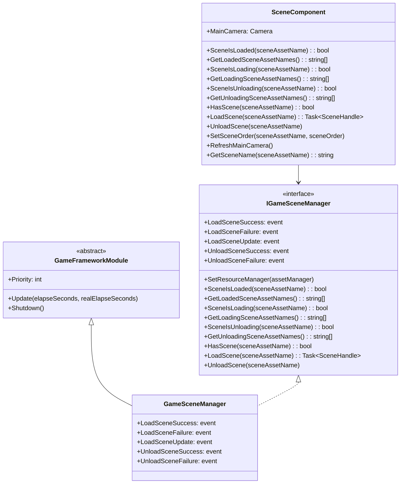
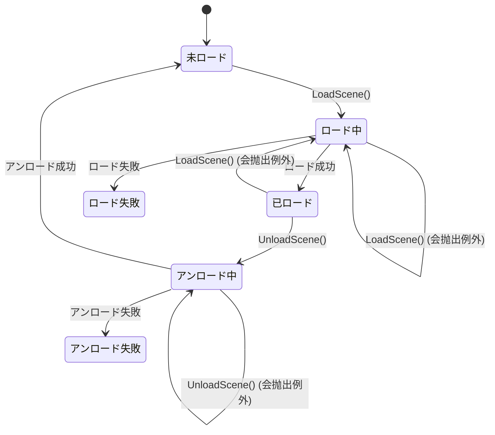

# API リファレンス

ドキュメント GameFrameX Scene コンポーネントの API，インターフェース、メソッド、パラメータすタイプ。

## 

GameFrameX Scene コンポーネントたの，むコアクラス：

- **IGameSceneManager** - マネージャーのインターフェース，たの
- **GameSceneManager** - IGameSceneManager の， GameFrameworkModule
- **SceneComponent** - Unity コンポーネント， Unity と

コンポーネント YooAsset リソースリソースのロードとアンロード。

## クラス



## IGameSceneManager インターフェース

`IGameSceneManager` はマネージャーのコアインターフェース，たのメソッド。

> Source: [IGameSceneManager.cs](https://github.com/GameFrameX/com.gameframex.unity.scene/blob/main/Runtime/Scene/Scene/IGameSceneManager.cs#L1-L175)

### イベント

| イベント | イベントタイプ |  |
|---------|---------|------|
| LoadSceneSuccess | EventHandler~LoadSceneSuccessEventArgs~ | ロード |
| LoadSceneFailure | EventHandler~LoadSceneFailureEventArgs~ | ロード |
| LoadSceneUpdate | EventHandler~LoadSceneUpdateEventArgs~ | ロード |
| UnloadSceneSuccess | EventHandler~UnloadSceneSuccessEventArgs~ | アンロード |
| UnloadSceneFailure | EventHandler~UnloadSceneFailureEventArgs~ | アンロード |

### `SetResourceManager(assetManager: IAssetManager): void`

リソースマネージャー。にシーンマネージャーびしメソッド IAssetManager 。

**パラメータ：**
- `assetManager` (IAssetManager): リソースマネージャー， null

**：**
- `GameFrameworkException`:  assetManager  null 

---

### `SceneIsLoaded(sceneAssetName: string): bool`

はロード。

**パラメータ：**
- `sceneAssetName` (string): リソース

**す：** 
- (bool): ロードす true，す false

**：**
- `GameFrameworkException`:  sceneAssetName  null 

---

### `GetLoadedSceneAssetNames(): string[]`

ロードのリソース。

**す：** 
- (string[]): ロードのリソース

---

### `GetLoadedSceneAssetNames(results: List<string>): void`

ロードのリソース（パラメータ）。

**パラメータ：**
- `results` (`List<string>`): にの， null

**：**
- `GameFrameworkException`:  results  null 

---

### `SceneIsLoading(sceneAssetName: string): bool`

はにロード。

**パラメータ：**
- `sceneAssetName` (string): リソース

**す：** 
- (bool): にロードす true，す false

**：**
- `GameFrameworkException`:  sceneAssetName  null 

---

### `GetLoadingSceneAssetNames(): string[]`

にロードのリソース。

**す：** 
- (string[]): にロードのリソース

---

### `GetLoadingSceneAssetNames(results: List<string>): void`

にロードのリソース（パラメータ）。

**パラメータ：**
- `results` (`List<string>`): にの， null

**：**
- `GameFrameworkException`:  results  null 

---

### `SceneIsUnloading(sceneAssetName: string): bool`

はにアンロード。

**パラメータ：**
- `sceneAssetName` (string): リソース

**す：** 
- (bool): にアンロードす true，す false

**：**
- `GameFrameworkException`:  sceneAssetName  null 

---

### `GetUnloadingSceneAssetNames(): string[]`

にアンロードのリソース。

**す：** 
- (string[]): にアンロードのリソース

---

### `GetUnloadingSceneAssetNames(results: List<string>): void`

にアンロードのリソース（パラメータ）。

**パラメータ：**
- `results` (`List<string>`): にの， null

**：**
- `GameFrameworkException`:  results  null 

---

### `HasScene(sceneAssetName: string): bool`

リソースはに。

**パラメータ：**
- `sceneAssetName` (string): のリソース

**す：** 
- (bool): リソースにす true，す false

---

### `LoadScene(sceneAssetName: string): Task<SceneHandle>`

ロード（デフォルトパラメータ）。 Single ロード，データ。

**パラメータ：**
- `sceneAssetName` (string): リソース

**す：** 
- (Task~SceneHandle~): ，たす SceneHandle

**メソッド：**
```csharp
Task<SceneHandle> LoadScene(string sceneAssetName, object userData)
Task<SceneHandle> LoadScene(string sceneAssetName, LoadSceneMode sceneMode, object userData)
```

**パラメータ：**
- `sceneAssetName` (string): リソース（ "Assets/Scenes/Game.unity"）
- `sceneMode` (LoadSceneMode): ロード，Single  Additive
- `userData` (object): カスタマイズデータ，にイベント

**：**
- `GameFrameworkException`:  sceneAssetName  null 
- `GameFrameworkException`: リソースマネージャー
- `GameFrameworkException`: にアンロード
- `GameFrameworkException`: にロード
- `GameFrameworkException`: ロード

---

### `UnloadScene(sceneAssetName: string): void`

アンロード（デフォルトパラメータ）。データ。

**パラメータ：**
- `sceneAssetName` (string): リソース

**メソッド：**
```csharp
void UnloadScene(string sceneAssetName, object userData)
```

**パラメータ：**
- `sceneAssetName` (string): リソース
- `userData` (object): カスタマイズデータ，にイベント

**：**
- `GameFrameworkException`:  sceneAssetName  null 
- `GameFrameworkException`: リソースマネージャー
- `GameFrameworkException`: にアンロード
- `GameFrameworkException`: にロード
- `GameFrameworkException`: ロード

---

## SceneComponent クラス

SceneComponent は Unity コンポーネント， GameFrameworkComponent，と Unity の。

> Source: [SceneComponent.cs](https://github.com/GameFrameX/com.gameframex.unity.scene/blob/main/Runtime/Scene/SceneComponent.cs#L1-L472)

### プロパティ

| プロパティ | タイプ |  |
|-------|------|------|
| MainCamera | Camera | の |

### 

|  | タイプ | デフォルト |  |
|-------|------|--------|------|
| m_EnableLoadSceneUpdateEvent | bool | true | はロードイベント |
| m_EnableLoadSceneDependencyAssetEvent | bool | true | はリソースロードイベント |

---

### `GetSceneName(sceneAssetName: string): string`

リソースパス。

**パラメータ：**
- `sceneAssetName` (string): リソースパス（ "Assets/Scenes/Game.unity"）

**す：** 
- (string): （ "Game"），す null

**：**
```csharp
// 输入: "Assets/Scenes/MainMenu.unity"
// 输出: "MainMenu"
string sceneName = SceneComponent.GetSceneName("Assets/Scenes/MainMenu.unity");
```
> Source: [SceneComponent.cs](https://github.com/GameFrameX/com.gameframex.unity.scene/blob/main/Runtime/Scene/SceneComponent.cs#L144-L167)

---

### `LoadScene(sceneAssetName: string): Task<SceneHandle>`

ロード（デフォルトパラメータ）。 Additive ロード。

> ：SceneComponent のデフォルトロード Additive，と IGameSceneManager のデフォルト（Single）。

**パラメータ：**
- `sceneAssetName` (string): リソース

**す：** 
- (Task~SceneHandle~): ，たす SceneHandle

**メソッド：**
```csharp
Task<SceneHandle> LoadScene(string sceneAssetName, LoadSceneMode sceneMode, object userData = null)
```

**：**
- sceneAssetName  "Assets/" 
- sceneAssetName  ".unity" 

**：**
```csharp
// 异步ロード场景
var sceneComponent = GameEntry.GetComponent<SceneComponent>();
var handle = await sceneComponent.LoadScene("Assets/Scenes/Game.unity", LoadSceneMode.Additive);
Debug.Log($"场景ロード完た，耗时: {handle.Duration}");
```
> Source: [SceneComponent.cs](https://github.com/GameFrameX/com.gameframex.unity.scene/blob/main/Runtime/Scene/SceneComponent.cs#L280-L307)

---

### `UnloadScene(sceneAssetName: string, userData: object = null): void`

アンロード。

**パラメータ：**
- `sceneAssetName` (string): リソース
- `userData` (object): カスタマイズデータ（オプション）

**：**
- sceneAssetName  "Assets/" 
- sceneAssetName  ".unity" 

**：**
```csharp
var sceneComponent = GameEntry.GetComponent<SceneComponent>();
sceneComponent.UnloadScene("Assets/Scenes/MainMenu.unity");
```
> Source: [SceneComponent.cs](https://github.com/GameFramex.unity.scene/blob/main/Runtime/Scene/SceneComponent.cs#L314-L331)

---

### `SetSceneOrder(sceneAssetName: string, sceneOrder: int): void`

の。メソッドに Additive ロードの。

**パラメータ：**
- `sceneAssetName` (string): リソース
- `sceneOrder` (int): ，

**：**
- にロード，，ロードた
- ロード，
- ロードロード，エラーログ

**：**
```csharp
var sceneComponent = GameEntry.GetComponent<SceneComponent>();
// 設定 Main 场景の优先级最高
sceneComponent.SetSceneOrder("Assets/Scenes/Main.unity", 100);
sceneComponent.SetSceneOrder("Assets/Scenes/UI.unity", 50);
```
> Source: [SceneComponent.cs](https://github.com/GameFrameX/com.gameframex.unity.scene/blob/main/Runtime/Scene/SceneComponent.cs#L338-L367)

---

### `RefreshMainCamera(): void`

の。にロードびし。

> Source: [SceneComponent.cs](https://github.com/GameFrameX/com.gameframex.unity.scene/blob/main/Runtime/Scene/SceneComponent.cs#L372-L375)

---

## イベントクラス

イベントクラス GameEventArgs，た Create メソッドと Clear メソッドにプール。

> Source: [LoadSceneSuccessEventArgs.cs](https://github.com/GameFrameX/com.gameframex.unity.scene/blob/main/Runtime/EventArgs/LoadSceneSuccessEventArgs.cs#L1-L106)

### LoadSceneSuccessEventArgs

ロードイベント。

| プロパティ | タイプ |  |
|-------|------|------|
| SceneAssetName | string | リソース |
| Duration | float | ロード（） |
| UserData | object | カスタマイズデータ |

**イベント ID:** `GameFrameX.Scene.Runtime.LoadSceneSuccessEventArgs`

---

### LoadSceneFailureEventArgs

ロードイベント。

| プロパティ | タイプ |  |
|-------|------|------|
| SceneAssetName | string | リソース |
| ErrorMessage | string | エラー |
| UserData | object | カスタマイズデータ |
| Status | EOperationStatus |  |

**イベント ID:** `GameFrameX.Scene.Runtime.LoadSceneFailureEventArgs`

> Source: [LoadSceneFailureEventArgs.cs](https://github.com/GameFrameX/com.gameframex.unity.scene/blob/main/Runtime/EventArgs/LoadSceneFailureEventArgs.cs#L1-L114)

---

### LoadSceneUpdateEventArgs

ロードイベント。

| プロパティ | タイプ |  |
|-------|------|------|
| SceneAssetName | string | リソース |
| Progress | float | ロード（0.0 - 1.0） |
| UserData | object | カスタマイズデータ |

**イベント ID:** `GameFrameX.Scene.Runtime.LoadSceneUpdateEventArgs`

> Source: [LoadSceneUpdateEventArgs.cs](https://github.com/GameFrameX/com.gameframex.unity.scene/blob/main/Runtime/EventArgs/LoadSceneUpdateEventArgs.cs#L1-L106)

---

### UnloadSceneSuccessEventArgs

アンロードイベント。

| プロパティ | タイプ |  |
|-------|------|------|
| SceneAssetName | string | リソース |
| UserData | object | カスタマイズデータ |

**イベント ID:** `GameFrameX.Scene.Runtime.UnloadSceneSuccessEventArgs`

> Source: [UnloadSceneSuccessEventArgs.cs](https://github.com/GameFrameX/com.gameframex.unity.scene/blob/main/Runtime/EventArgs/UnloadSceneSuccessEventArgs.cs#L1-L97)

---

### UnloadSceneFailureEventArgs

アンロードイベント。

| プロパティ | タイプ |  |
|-------|------|------|
| SceneAssetName | string | リソース |
| UserData | object | カスタマイズデータ |

**イベント ID:** `GameFrameX.Scene.Runtime.UnloadSceneFailureEventArgs`

> Source: [UnloadSceneFailureEventArgs.cs](https://github.com/GameFrameX/com.gameframex.unity.scene/blob/main/Runtime/EventArgs/UnloadSceneFailureEventArgs.cs#L1-L97)

---

### ActiveSceneChangedEventArgs

イベント。

| プロパティ | タイプ |  |
|-------|------|------|
| LastActiveScene | UnityEngine.SceneManagement.Scene | の |
| ActiveScene | UnityEngine.SceneManagement.Scene | の |

**イベント ID:** `GameFrameX.Scene.Runtime.ActiveSceneChangedEventArgs`

> Source: [ActiveSceneChangedEventArgs.cs](https://github.com/GameFrameX/com.gameframex.unity.scene/blob/main/Runtime/EventArgs/ActiveSceneChangedEventArgs.cs#L1-L97)

---

## フロー



---

## 

### 1. をじて SceneComponent ロードとアンロード

```csharp
// 获取 SceneComponent 实例
var sceneComponent = GameEntry.GetComponent<SceneComponent>();

// 订阅场景ロード成功イベント
sceneComponent.LoadSceneSuccess += OnLoadSceneSuccess;

// ロード场景
await sceneComponent.LoadScene("Assets/Scenes/Game.unity", LoadSceneMode.Additive);

private void OnLoadSceneSuccess(object sender, LoadSceneSuccessEventArgs e)
{
    Debug.Log($"场景 {e.SceneAssetName} ロード成功，耗时: {e.Duration}秒");
}
```

> Source: [SceneComponent.cs](https://github.com/GameFrameX/com.gameframex.unity.scene/blob/main/Runtime/Scene/SceneComponent.cs#L437-L446)

---

### 2. （）

```csharp
var sceneComponent = GameEntry.GetComponent<SceneComponent>();

// アンロード当前场景
sceneComponent.UnloadScene(currentSceneName);

// ロード新场景
await sceneComponent.LoadScene(newSceneName, LoadSceneMode.Single);
```

---

### 3. （ additive ）

```csharp
var sceneComponent = GameEntry.GetComponent<SceneComponent>();

// ロード基础场景
await sceneComponent.LoadScene("Assets/Scenes/Base.unity", LoadSceneMode.Additive);

// ロードゲーム玩法场景
await sceneComponent.LoadScene("Assets/Scenes/Gameplay.unity", LoadSceneMode.Additive);

// ロード UI 场景（优先级最高）
sceneComponent.SetSceneOrder("Assets/Scenes/UI.unity", 100);
await sceneComponent.LoadScene("Assets/Scenes/UI.unity", LoadSceneMode.Additive);
```

---

### 4. ロード

```csharp
var sceneComponent = GameEntry.GetComponent<SceneComponent>();

sceneComponent.LoadSceneFailure += OnLoadSceneFailure;

try 
{
    await sceneComponent.LoadScene("Assets/Scenes/Game.unity");
}
catch (Exception ex)
{
    Debug.LogError($"场景ロード例外: {ex.Message}");
}

private void OnLoadSceneFailure(object sender, LoadSceneFailureEventArgs e)
{
    Debug.LogError($"场景ロード失敗: {e.ErrorMessage}");
    // 可能に这里显示エラー UI 或実行其他恢复逻辑
}
```

---

### 5. 

```csharp
var sceneComponent = GameEntry.GetComponent<SceneComponent>();

// 注意：ActiveSceneChangedEventArgs を通じて EventComponent 触发
// 必要を通じてイベント系统订阅
```

> イベントの， [イベント](./6-events) ドキュメント。

---

## エラー

マネージャーに GameFrameworkException：

| エラー |  |
|---------|---------|
| sceneAssetName  | "Scene asset name is invalid." |
| assetManager  | "You must set resource manager first." |
| にアンロード | "Scene asset '{0}' is being unloaded." |
| にロード | "Scene asset '{0}' is being loaded." |
| ロード | "Scene asset '{0}' is already loaded." |
| ロード | "Scene asset '{0}' is not loaded yet." |

> Source: [GameSceneManager.cs](https://github.com/GameFrameX/com.gameframex.unity.scene/blob/main/Runtime/Scene/Scene/GameSceneManager.cs#L350-L373)

---

## リンク

- [コア](./4-core-features) - たのコア
- [イベント](./6-events) - たイベントの
- [クイックスタート](./3-getting-started) - クイックスタートシーンコンポーネント
- [よくある](./7-troubleshooting) - よくあると
