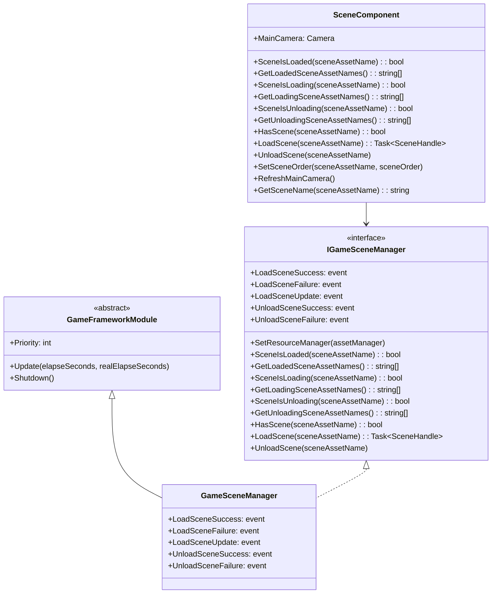
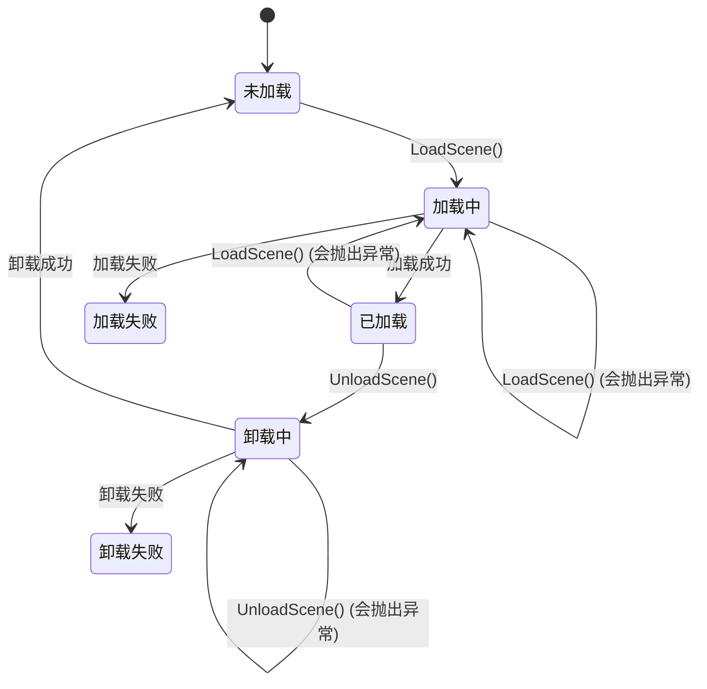

# API リファレンス

このドキュメント詳細介绍 GameFrameX Scene シーン管理コンポーネント提供的所有公共 API，含みますインターフェース定義、メソッド签名、パラメータ説明および戻り値タイプ。

## 概要

GameFrameX Scene コンポーネント提供します一套完全な的シーン管理解決策，主なパッケージ含两个コア类：

- **IGameSceneManager** - シーンマネージャー的抽象インターフェース，定義了シーン操作的標準契约
- **GameSceneManager** - IGameSceneManager 的具体実装，継承自 GameFrameworkModule
- **SceneComponent** - Unity コンポーネントカプセル化，提供 Unity 集成和シーン激活顺序管理

コンポーネント依赖 YooAsset リソース管理系统进行シーンリソース的非同期ロード和アンロード。

## 类图



## IGameSceneManager インターフェース

`IGameSceneManager` 是シーンマネージャー的コアインターフェース，定義了所有シーン操作的標準メソッド。

> Source: [IGameSceneManager.cs](https://github.com/GameFrameX/com.gameframex.unity.scene/blob/main/Runtime/Scene/Scene/IGameSceneManager.cs#L1-L175)

### イベント定義

| イベント名称 | イベントタイプ | 説明 |
|---------|---------|------|
| LoadSceneSuccess | EventHandler~LoadSceneSuccessEventArgs~ | シーンロード成功时トリガー |
| LoadSceneFailure | EventHandler~LoadSceneFailureEventArgs~ | シーンロード失敗时トリガー |
| LoadSceneUpdate | EventHandler~LoadSceneUpdateEventArgs~ | シーンロード進捗アップデート时トリガー |
| UnloadSceneSuccess | EventHandler~UnloadSceneSuccessEventArgs~ | シーンアンロード成功时トリガー |
| UnloadSceneFailure | EventHandler~UnloadSceneFailureEventArgs~ | シーンアンロード失敗时トリガー |

### `SetResourceManager(assetManager: IAssetManager): void`

設定リソースマネージャー。在使用シーンマネージャー之前〜しなければなりません先呼び出し此メソッド設定 IAssetManager 実装。

**パラメータ：**
- `assetManager` (IAssetManager): リソースマネージャーインスタンス，不能为 null

**抛出：**
- `GameFrameworkException`: 当 assetManager 为 null 时抛出

---

### `SceneIsLoaded(sceneAssetName: string): bool`

確認指定シーン是否已ロード。

**パラメータ：**
- `sceneAssetName` (string): シーンリソース名称

**返す：** 
- (bool): シーン已ロード返す true，否则返す false

**抛出：**
- `GameFrameworkException`: 当 sceneAssetName 为空或 null 时抛出

---

### `GetLoadedSceneAssetNames(): string[]`

取得所有已ロードシーン的リソース名称。

**返す：** 
- (string[]): 已ロードシーン的リソース名称数组

---

### `GetLoadedSceneAssetNames(results: List<string>): void`

取得所有已ロードシーン的リソース名称（使用列表パラメータ避免内存分配）。

**パラメータ：**
- `results` (List<string>): 用于存储結果的列表，不能为 null

**抛出：**
- `GameFrameworkException`: 当 results 为 null 时抛出

---

### `SceneIsLoading(sceneAssetName: string): bool`

確認指定シーン是否〜中ロード。

**パラメータ：**
- `sceneAssetName` (string): シーンリソース名称

**返す：** 
- (bool): シーン〜中ロード返す true，否则返す false

**抛出：**
- `GameFrameworkException`: 当 sceneAssetName 为空或 null 时抛出

---

### `GetLoadingSceneAssetNames(): string[]`

取得所有〜中ロードシーン的リソース名称。

**返す：** 
- (string[]): 〜中ロードシーン的リソース名称数组

---

### `GetLoadingSceneAssetNames(results: List<string>): void`

取得所有〜中ロードシーン的リソース名称（使用列表パラメータ避免内存分配）。

**パラメータ：**
- `results` (List<string>): 用于存储結果的列表，不能为 null

**抛出：**
- `GameFrameworkException`: 当 results 为 null 时抛出

---

### `SceneIsUnloading(sceneAssetName: string): bool`

確認指定シーン是否〜中アンロード。

**パラメータ：**
- `sceneAssetName` (string): シーンリソース名称

**返す：** 
- (bool): シーン〜中アンロード返す true，否则返す false

**抛出：**
- `GameFrameworkException`: 当 sceneAssetName 为空或 null 时抛出

---

### `GetUnloadingSceneAssetNames(): string[]`

取得所有〜中アンロードシーン的リソース名称。

**返す：** 
- (string[]): 〜中アンロードシーン的リソース名称数组

---

### `GetUnloadingSceneAssetNames(results: List<string>): void`

取得所有〜中アンロードシーン的リソース名称（使用列表パラメータ避免内存分配）。

**パラメータ：**
- `results` (List<string>): 用于存储結果的列表，不能为 null

**抛出：**
- `GameFrameworkException`: 当 results 为 null 时抛出

---

### `HasScene(sceneAssetName: string): bool`

確認シーンリソース是否存在。

**パラメータ：**
- `sceneAssetName` (string): 要確認的シーンリソース名称

**返す：** 
- (bool): シーンリソース存在返す true，否则返す false

---

### `LoadScene(sceneAssetName: string): Task<SceneHandle>`

ロードシーン（使用デフォルトパラメータ）。以 Single モードロードシーン，不携带ユーザー数据。

**パラメータ：**
- `sceneAssetName` (string): シーンリソース名称

**返す：** 
- (Task~SceneHandle~): 异步操作任务，完成后返す SceneHandle

**オーバーロードメソッド：**
```csharp
Task<SceneHandle> LoadScene(string sceneAssetName, object userData)
Task<SceneHandle> LoadScene(string sceneAssetName, LoadSceneMode sceneMode, object userData)
```

**パラメータ説明：**
- `sceneAssetName` (string): シーンリソース名称（如 "Assets/Scenes/Game.unity"）
- `sceneMode` (LoadSceneMode): ロードモード，Single 或 Additive
- `userData` (object): ユーザー自定義数据，会在イベント中回传

**抛出：**
- `GameFrameworkException`: 当 sceneAssetName 为空或 null 时抛出
- `GameFrameworkException`: 当未設定リソースマネージャー时抛出
- `GameFrameworkException`: 当シーン〜中アンロード时抛出
- `GameFrameworkException`: 当シーン〜中ロード时抛出
- `GameFrameworkException`: 当シーン已ロード时抛出

---

### `UnloadScene(sceneAssetName: string): void`

アンロードシーン（使用デフォルトパラメータ）。不携带ユーザー数据。

**パラメータ：**
- `sceneAssetName` (string): シーンリソース名称

**オーバーロードメソッド：**
```csharp
void UnloadScene(string sceneAssetName, object userData)
```

**パラメータ説明：**
- `sceneAssetName` (string): シーンリソース名称
- `userData` (object): ユーザー自定義数据，会在イベント中回传

**抛出：**
- `GameFrameworkException`: 当 sceneAssetName 为空或 null 时抛出
- `GameFrameworkException`: 当未設定リソースマネージャー时抛出
- `GameFrameworkException`: 当シーン〜中アンロード时抛出
- `GameFrameworkException`: 当シーン〜中ロード时抛出
- `GameFrameworkException`: 当シーン未ロード时抛出

---

## SceneComponent 类

SceneComponent 是 Unity コンポーネントカプセル化，継承自 GameFrameworkComponent，提供与 Unity 生态系统的集成。

> Source: [SceneComponent.cs](https://github.com/GameFrameX/com.gameframex.unity.scene/blob/main/Runtime/Scene/SceneComponent.cs#L1-L472)

### プロパティ

| プロパティ名 | タイプ | 説明 |
|-------|------|------|
| MainCamera | Camera | 取得当前シーン的主摄像机 |

### シリアライズフィールド

| フィールド名 | タイプ | デフォルト值 | 説明 |
|-------|------|--------|------|
| m_EnableLoadSceneUpdateEvent | bool | true | 是否启用シーンロードアップデートイベント |
| m_EnableLoadSceneDependencyAssetEvent | bool | true | 是否启用シーン依赖リソースロードイベント |

---

### `GetSceneName(sceneAssetName: string): string`

从シーンリソースパス中提取シーン名称。

**パラメータ：**
- `sceneAssetName` (string): シーンリソースパス（如 "Assets/Scenes/Game.unity"）

**返す：** 
- (string): シーン名称（如 "Game"），无效输入返す null

**例：**
```csharp
// 输入: "Assets/Scenes/MainMenu.unity"
// 输出: "MainMenu"
string sceneName = SceneComponent.GetSceneName("Assets/Scenes/MainMenu.unity");
```
> Source: [SceneComponent.cs](https://github.com/GameFrameX/com.gameframex.unity.scene/blob/main/Runtime/Scene/SceneComponent.cs#L144-L167)

---

### `LoadScene(sceneAssetName: string): Task<SceneHandle>`

ロードシーン（使用デフォルトパラメータ）。以 Additive モードロードシーン。

> 注意：SceneComponent 的デフォルトロードモード为 Additive，与 IGameSceneManager 的デフォルトモード（Single）不同。

**パラメータ：**
- `sceneAssetName` (string): シーンリソース名称

**返す：** 
- (Task~SceneHandle~): 异步操作任务，完成后返す SceneHandle

**オーバーロードメソッド：**
```csharp
Task<SceneHandle> LoadScene(string sceneAssetName, LoadSceneMode sceneMode, object userData = null)
```

**検証规则：**
- sceneAssetName 〜しなければなりません以 "Assets/" 开头
- sceneAssetName 〜しなければなりません以 ".unity" 结尾

**例：**
```csharp
// 异步加载场景
var sceneComponent = GameEntry.GetComponent<SceneComponent>();
var handle = await sceneComponent.LoadScene("Assets/Scenes/Game.unity", LoadSceneMode.Additive);
Debug.Log($"场景加载完成，耗时: {handle.Duration}");
```
> Source: [SceneComponent.cs](https://github.com/GameFrameX/com.gameframex.unity.scene/blob/main/Runtime/Scene/SceneComponent.cs#L280-L307)

---

### `UnloadScene(sceneAssetName: string, userData: object = null): void`

アンロードシーン。

**パラメータ：**
- `sceneAssetName` (string): シーンリソース名称
- `userData` (object): ユーザー自定義数据（可选）

**検証规则：**
- sceneAssetName 〜しなければなりません以 "Assets/" 开头
- sceneAssetName 〜しなければなりません以 ".unity" 结尾

**例：**
```csharp
var sceneComponent = GameEntry.GetComponent<SceneComponent>();
sceneComponent.UnloadScene("Assets/Scenes/MainMenu.unity");
```
> Source: [SceneComponent.cs](https://github.com/GameFramex.unity.scene/blob/main/Runtime/Scene/SceneComponent.cs#L314-L331)

---

### `SetSceneOrder(sceneAssetName: string, sceneOrder: int): void`

設定シーン的激活顺序。该メソッド用于管理多个 Additive ロードシーン时的活动シーン优先级。

**パラメータ：**
- `sceneAssetName` (string): シーンリソース名称
- `sceneOrder` (int): シーン顺序，数值越大优先级越高

**行为説明：**
- もしシーン〜中ロード，将シーン顺序记录到内部字典，待ロード完成后应用
- もしシーン已ロード，立つまり刷新シーン顺序
- もしシーン未ロード也未ロード中，记录エラーログ

**例：**
```csharp
var sceneComponent = GameEntry.GetComponent<SceneComponent>();
// 设置 Main 场景的优先级最高
sceneComponent.SetSceneOrder("Assets/Scenes/Main.unity", 100);
sceneComponent.SetSceneOrder("Assets/Scenes/UI.unity", 50);
```
> Source: [SceneComponent.cs](https://github.com/GameFrameX/com.gameframex.unity.scene/blob/main/Runtime/Scene/SceneComponent.cs#L338-L367)

---

### `RefreshMainCamera(): void`

刷新当前シーン的主摄像机参照。通常在シーンロード或激活シーン变更后呼び出し。

> Source: [SceneComponent.cs](https://github.com/GameFrameX/com.gameframex.unity.scene/blob/main/Runtime/Scene/SceneComponent.cs#L372-L375)

---

## イベントパラメータ类

所有シーンイベントパラメータ类都継承自 GameEventArgs，并実装了 Create 工厂メソッド和 Clear メソッド用于对象池管理。

> Source: [LoadSceneSuccessEventArgs.cs](https://github.com/GameFrameX/com.gameframex.unity.scene/blob/main/Runtime/EventArgs/LoadSceneSuccessEventArgs.cs#L1-L106)

### LoadSceneSuccessEventArgs

シーンロード成功イベントパラメータ。

| プロパティ名 | タイプ | 説明 |
|-------|------|------|
| SceneAssetName | string | シーンリソース名称 |
| Duration | float | ロード持续时间（秒） |
| UserData | object | ユーザー自定義数据 |

**イベント ID:** `GameFrameX.Scene.Runtime.LoadSceneSuccessEventArgs`

---

### LoadSceneFailureEventArgs

シーンロード失敗イベントパラメータ。

| プロパティ名 | タイプ | 説明 |
|-------|------|------|
| SceneAssetName | string | シーンリソース名称 |
| ErrorMessage | string | エラー情報 |
| UserData | object | ユーザー自定義数据 |
| Status | EOperationStatus | 操作ステータス |

**イベント ID:** `GameFrameX.Scene.Runtime.LoadSceneFailureEventArgs`

> Source: [LoadSceneFailureEventArgs.cs](https://github.com/GameFrameX/com.gameframex.unity.scene/blob/main/Runtime/EventArgs/LoadSceneFailureEventArgs.cs#L1-L114)

---

### LoadSceneUpdateEventArgs

シーンロード進捗アップデートイベントパラメータ。

| プロパティ名 | タイプ | 説明 |
|-------|------|------|
| SceneAssetName | string | シーンリソース名称 |
| Progress | float | ロード進捗（0.0 - 1.0） |
| UserData | object | ユーザー自定義数据 |

**イベント ID:** `GameFrameX.Scene.Runtime.LoadSceneUpdateEventArgs`

> Source: [LoadSceneUpdateEventArgs.cs](https://github.com/GameFrameX/com.gameframex.unity.scene/blob/main/Runtime/EventArgs/LoadSceneUpdateEventArgs.cs#L1-L106)

---

### UnloadSceneSuccessEventArgs

シーンアンロード成功イベントパラメータ。

| プロパティ名 | タイプ | 説明 |
|-------|------|------|
| SceneAssetName | string | シーンリソース名称 |
| UserData | object | ユーザー自定義数据 |

**イベント ID:** `GameFrameX.Scene.Runtime.UnloadSceneSuccessEventArgs`

> Source: [UnloadSceneSuccessEventArgs.cs](https://github.com/GameFrameX/com.gameframex.unity.scene/blob/main/Runtime/EventArgs/UnloadSceneSuccessEventArgs.cs#L1-L97)

---

### UnloadSceneFailureEventArgs

シーンアンロード失敗イベントパラメータ。

| プロパティ名 | タイプ | 説明 |
|-------|------|------|
| SceneAssetName | string | シーンリソース名称 |
| UserData | object | ユーザー自定義数据 |

**イベント ID:** `GameFrameX.Scene.Runtime.UnloadSceneFailureEventArgs`

> Source: [UnloadSceneFailureEventArgs.cs](https://github.com/GameFrameX/com.gameframex.unity.scene/blob/main/Runtime/EventArgs/UnloadSceneFailureEventArgs.cs#L1-L97)

---

### ActiveSceneChangedEventArgs

激活シーン变更イベントパラメータ。

| プロパティ名 | タイプ | 説明 |
|-------|------|------|
| LastActiveScene | UnityEngine.SceneManagement.Scene | 上一个激活的シーン |
| ActiveScene | UnityEngine.SceneManagement.Scene | 当前激活的シーン |

**イベント ID:** `GameFrameX.Scene.Runtime.ActiveSceneChangedEventArgs`

> Source: [ActiveSceneChangedEventArgs.cs](https://github.com/GameFrameX/com.gameframex.unity.scene/blob/main/Runtime/EventArgs/ActiveSceneChangedEventArgs.cs#L1-L97)

---

## シーンステータスフロー



---

## 常见使用モード

### 1. 通过 SceneComponent ロード和アンロードシーン

```csharp
// 获取 SceneComponent 实例
var sceneComponent = GameEntry.GetComponent<SceneComponent>();

// 订阅场景加载成功事件
sceneComponent.LoadSceneSuccess += OnLoadSceneSuccess;

// 加载场景
await sceneComponent.LoadScene("Assets/Scenes/Game.unity", LoadSceneMode.Additive);

private void OnLoadSceneSuccess(object sender, LoadSceneSuccessEventArgs e)
{
    Debug.Log($"场景 {e.SceneAssetName} 加载成功，耗时: {e.Duration}秒");
}
```

> Source: [SceneComponent.cs](https://github.com/GameFrameX/com.gameframex.unity.scene/blob/main/Runtime/Scene/SceneComponent.cs#L437-L446)

---

### 2. シーン切换（单シーンモード）

```csharp
var sceneComponent = GameEntry.GetComponent<SceneComponent>();

// 卸载当前场景
sceneComponent.UnloadScene(currentSceneName);

// 加载新场景
await sceneComponent.LoadScene(newSceneName, LoadSceneMode.Single);
```

---

### 3. 多シーン管理（ additive モード）

```csharp
var sceneComponent = GameEntry.GetComponent<SceneComponent>();

// 加载基础场景
await sceneComponent.LoadScene("Assets/Scenes/Base.unity", LoadSceneMode.Additive);

// 加载游戏玩法场景
await sceneComponent.LoadScene("Assets/Scenes/Gameplay.unity", LoadSceneMode.Additive);

// 加载 UI 场景（优先级最高）
sceneComponent.SetSceneOrder("Assets/Scenes/UI.unity", 100);
await sceneComponent.LoadScene("Assets/Scenes/UI.unity", LoadSceneMode.Additive);
```

---

### 4. 処理シーンロード失敗

```csharp
var sceneComponent = GameEntry.GetComponent<SceneComponent>();

sceneComponent.LoadSceneFailure += OnLoadSceneFailure;

try 
{
    await sceneComponent.LoadScene("Assets/Scenes/Game.unity");
}
catch (Exception ex)
{
    Debug.LogError($"场景加载异常: {ex.Message}");
}

private void OnLoadSceneFailure(object sender, LoadSceneFailureEventArgs e)
{
    Debug.LogError($"场景加载失败: {e.ErrorMessage}");
    // 可以在这里显示错误 UI 或执行其他恢复逻辑
}
```

---

### 5. 监听活动シーン变化

```csharp
var sceneComponent = GameEntry.GetComponent<SceneComponent>();

// 注意：ActiveSceneChangedEventArgs 通过 EventComponent 触发
// 需要通过事件系统订阅
```

> 关于イベント系统的詳細使用，请参见 [イベント系统](./6-events) ドキュメント。

---

## エラー処理

シーンマネージャー在以下情况会抛出 GameFrameworkException：

| エラーシーン | 例外メッセージ |
|---------|---------|
| sceneAssetName 为空 | "Scene asset name is invalid." |
| assetManager 未設定 | "You must set resource manager first." |
| シーン〜中アンロード | "Scene asset '{0}' is being unloaded." |
| シーン〜中ロード | "Scene asset '{0}' is being loaded." |
| シーン已ロード | "Scene asset '{0}' is already loaded." |
| シーン未ロード | "Scene asset '{0}' is not loaded yet." |

> Source: [GameSceneManager.cs](https://github.com/GameFrameX/com.gameframex.unity.scene/blob/main/Runtime/Scene/Scene/GameSceneManager.cs#L350-L373)

---

## 関連リンク

- [コア機能](./4-core-features) - 理解するシーン管理的コア機能設計
- [イベント系统](./6-events) - 理解するイベント系统的詳細使用
- [快速入门](./3-getting-started) - 快速开始使用シーンコンポーネント
- [常见問題](./7-troubleshooting) - 常见問題与解決策
