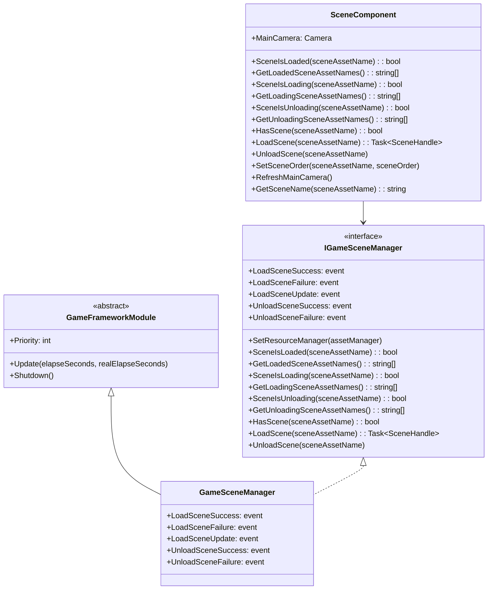

# API 参考

本文档详细介绍 GameFrameX Scene シーン管理コンポーネント提供的所有公共 API，包括インターフェース定义、メソッド签名、参数説明以及返回值クラス型。

## 概要

GameFrameX Scene コンポーネント提供します一套完整的シーン管理解決策，主要包含两个コアクラス：

- **IGameSceneManager** - シーン管理器的抽象インターフェース，定义了シーン操作的标准契约
- **GameSceneManager** - IGameSceneManager 的具体実装，を継承 GameFrameworkModule
- **SceneComponent** - Unity コンポーネント封装，提供 Unity 集成和シーン激活顺序管理

コンポーネント依赖 YooAsset リソース管理系统进行シーンリソース的异步加载和卸载。

## クラス图



## IGameSceneManager インターフェース

`IGameSceneManager` 是シーン管理器的コアインターフェース，定义了所有シーン操作的标准メソッド。

> Source: [IGameSceneManager.cs](https://github.com/GameFrameX/com.gameframex.unity.scene/blob/main/Runtime/Scene/Scene/IGameSceneManager.cs#L1-L175)

### イベント定义

| イベント名称 | イベントクラス型 | 説明 |
|---------|---------|------|
| LoadSceneSuccess | EventHandler~LoadSceneSuccessEventArgs~ | シーン加载成功时触发 |
| LoadSceneFailure | EventHandler~LoadSceneFailureEventArgs~ | シーン加载失败时触发 |
| LoadSceneUpdate | EventHandler~LoadSceneUpdateEventArgs~ | シーン加载进度更新时触发 |
| UnloadSceneSuccess | EventHandler~UnloadSceneSuccessEventArgs~ | シーン卸载成功时触发 |
| UnloadSceneFailure | EventHandler~UnloadSceneFailureEventArgs~ | シーン卸载失败时触发 |

### `SetResourceManager(assetManager: IAssetManager): void`

設定リソース管理器。在使用シーン管理器之前必須先呼び出し此メソッド設定 IAssetManager 実装。

**参数：**
- `assetManager` (IAssetManager): リソース管理器インスタンス，不能为 null

**抛出：**
- `GameFrameworkException`: 当 assetManager 为 null 时抛出

---

### `SceneIsLoaded(sceneAssetName: string): bool`

检查指定シーン是否已加载。

**参数：**
- `sceneAssetName` (string): シーンリソース名称

**返回：** 
- (bool): シーン已加载返回 true，否则返回 false

**抛出：**
- `GameFrameworkException`: 当 sceneAssetName 为空或 null 时抛出

---

### `GetLoadedSceneAssetNames(): string[]`

取得所有已加载シーン的リソース名称。

**返回：** 
- (string[]): 已加载シーン的リソース名称数组

---

### `GetLoadedSceneAssetNames(results: List<string>): void`

取得所有已加载シーン的リソース名称（使用列表参数避免内存分配）。

**参数：**
- `results` (List<string>): に使用存储结果的列表，不能为 null

**抛出：**
- `GameFrameworkException`: 当 results 为 null 时抛出

---

### `SceneIsLoading(sceneAssetName: string): bool`

检查指定シーン是否正在加载。

**参数：**
- `sceneAssetName` (string): シーンリソース名称

**返回：** 
- (bool): シーン正在加载返回 true，否则返回 false

**抛出：**
- `GameFrameworkException`: 当 sceneAssetName 为空或 null 时抛出

---

### `GetLoadingSceneAssetNames(): string[]`

取得所有正在加载シーン的リソース名称。

**返回：** 
- (string[]): 正在加载シーン的リソース名称数组

---

### `GetLoadingSceneAssetNames(results: List<string>): void`

取得所有正在加载シーン的リソース名称（使用列表参数避免内存分配）。

**参数：**
- `results` (List<string>): に使用存储结果的列表，不能为 null

**抛出：**
- `GameFrameworkException`: 当 results 为 null 时抛出

---

### `SceneIsUnloading(sceneAssetName: string): bool`

检查指定シーン是否正在卸载。

**参数：**
- `sceneAssetName` (string): シーンリソース名称

**返回：** 
- (bool): シーン正在卸载返回 true，否则返回 false

**抛出：**
- `GameFrameworkException`: 当 sceneAssetName 为空或 null 时抛出

---

### `GetUnloadingSceneAssetNames(): string[]`

取得所有正在卸载シーン的リソース名称。

**返回：** 
- (string[]): 正在卸载シーン的リソース名称数组

---

### `GetUnloadingSceneAssetNames(results: List<string>): void`

取得所有正在卸载シーン的リソース名称（使用列表参数避免内存分配）。

**参数：**
- `results` (List<string>): に使用存储结果的列表，不能为 null

**抛出：**
- `GameFrameworkException`: 当 results 为 null 时抛出

---

### `HasScene(sceneAssetName: string): bool`

检查シーンリソース是否存在。

**参数：**
- `sceneAssetName` (string): 要检查的シーンリソース名称

**返回：** 
- (bool): シーンリソース存在返回 true，否则返回 false

---

### `LoadScene(sceneAssetName: string): Task<SceneHandle>`

加载シーン（使用默认参数）。以 Single 模式加载シーン，不携带用户数据。

**参数：**
- `sceneAssetName` (string): シーンリソース名称

**返回：** 
- (Task~SceneHandle~): 异步操作任务，完成后返回 SceneHandle

**重载メソッド：**
```csharp
Task<SceneHandle> LoadScene(string sceneAssetName, object userData)
Task<SceneHandle> LoadScene(string sceneAssetName, LoadSceneMode sceneMode, object userData)
```

**参数説明：**
- `sceneAssetName` (string): シーンリソース名称（如 "Assets/Scenes/Game.unity"）
- `sceneMode` (LoadSceneMode): 加载模式，Single 或 Additive
- `userData` (object): 用户自定义数据，会在イベント中回传

**抛出：**
- `GameFrameworkException`: 当 sceneAssetName 为空或 null 时抛出
- `GameFrameworkException`: 当未設定リソース管理器时抛出
- `GameFrameworkException`: 当シーン正在卸载时抛出
- `GameFrameworkException`: 当シーン正在加载时抛出
- `GameFrameworkException`: 当シーン已加载时抛出

---

### `UnloadScene(sceneAssetName: string): void`

卸载シーン（使用默认参数）。不携带用户数据。

**参数：**
- `sceneAssetName` (string): シーンリソース名称

**重载メソッド：**
```csharp
void UnloadScene(string sceneAssetName, object userData)
```

**参数説明：**
- `sceneAssetName` (string): シーンリソース名称
- `userData` (object): 用户自定义数据，会在イベント中回传

**抛出：**
- `GameFrameworkException`: 当 sceneAssetName 为空或 null 时抛出
- `GameFrameworkException`: 当未設定リソース管理器时抛出
- `GameFrameworkException`: 当シーン正在卸载时抛出
- `GameFrameworkException`: 当シーン正在加载时抛出
- `GameFrameworkException`: 当シーン未加载时抛出

---

## SceneComponent クラス

SceneComponent 是 Unity コンポーネント封装，を継承 GameFrameworkComponent，提供与 Unity 生态系统的集成。

> Source: [SceneComponent.cs](https://github.com/GameFrameX/com.gameframex.unity.scene/blob/main/Runtime/Scene/SceneComponent.cs#L1-L472)

### プロパティ

| プロパティ名 | クラス型 | 説明 |
|-------|------|------|
| MainCamera | Camera | 取得当前シーン的主摄像机 |

### 序列化字段

| 字段名 | クラス型 | 默认值 | 説明 |
|-------|------|--------|------|
| m_EnableLoadSceneUpdateEvent | bool | true | 是否启用シーン加载更新イベント |
| m_EnableLoadSceneDependencyAssetEvent | bool | true | 是否启用シーン依赖リソース加载イベント |

---

### `GetSceneName(sceneAssetName: string): string`

从シーンリソース路径中提取シーン名称。

**参数：**
- `sceneAssetName` (string): シーンリソース路径（如 "Assets/Scenes/Game.unity"）

**返回：** 
- (string): シーン名称（如 "Game"），无效输入返回 null

**示例：**
```csharp
// 输入: "Assets/Scenes/MainMenu.unity"
// 输出: "MainMenu"
string sceneName = SceneComponent.GetSceneName("Assets/Scenes/MainMenu.unity");
```
> Source: [SceneComponent.cs](https://github.com/GameFrameX/com.gameframex.unity.scene/blob/main/Runtime/Scene/SceneComponent.cs#L144-L167)

---

### `LoadScene(sceneAssetName: string): Task<SceneHandle>`

加载シーン（使用默认参数）。以 Additive 模式加载シーン。

> 注意：SceneComponent 的默认加载模式为 Additive，与 IGameSceneManager 的默认模式（Single）不同。

**参数：**
- `sceneAssetName` (string): シーンリソース名称

**返回：** 
- (Task~SceneHandle~): 异步操作任务，完成后返回 SceneHandle

**重载メソッド：**
```csharp
Task<SceneHandle> LoadScene(string sceneAssetName, LoadSceneMode sceneMode, object userData = null)
```

**验证规则：**
- sceneAssetName 必須以 "Assets/" 开头
- sceneAssetName 必須以 ".unity" 结尾

**示例：**
```csharp
// 异步加载シーン
var sceneComponent = GameEntry.GetComponent<SceneComponent>();
var handle = await sceneComponent.LoadScene("Assets/Scenes/Game.unity", LoadSceneMode.Additive);
Debug.Log($"シーン加载完成，耗时: {handle.Duration}");
```
> Source: [SceneComponent.cs](https://github.com/GameFrameX/com.gameframex.unity.scene/blob/main/Runtime/Scene/SceneComponent.cs#L280-L307)

---

### `UnloadScene(sceneAssetName: string, userData: object = null): void`

卸载シーン。

**参数：**
- `sceneAssetName` (string): シーンリソース名称
- `userData` (object): 用户自定义数据（可选）

**验证规则：**
- sceneAssetName 必須以 "Assets/" 开头
- sceneAssetName 必須以 ".unity" 结尾

**示例：**
```csharp
var sceneComponent = GameEntry.GetComponent<SceneComponent>();
sceneComponent.UnloadScene("Assets/Scenes/MainMenu.unity");
```
> Source: [SceneComponent.cs](https://github.com/GameFramex.unity.scene/blob/main/Runtime/Scene/SceneComponent.cs#L314-L331)

---

### `SetSceneOrder(sceneAssetName: string, sceneOrder: int): void`

設定シーン的激活顺序。该メソッドに使用管理多个 Additive 加载シーン时的活动シーン优先级。

**参数：**
- `sceneAssetName` (string): シーンリソース名称
- `sceneOrder` (int): シーン顺序，数值越大优先级越高

**行为説明：**
- 如果シーン正在加载，将シーン顺序记录到内部字典，待加载完成后应用
- 如果シーン已加载，立即刷新シーン顺序
- 如果シーン未加载也未加载中，记录错误日志

**示例：**
```csharp
var sceneComponent = GameEntry.GetComponent<SceneComponent>();
// 設定 Main シーン的优先级最高
sceneComponent.SetSceneOrder("Assets/Scenes/Main.unity", 100);
sceneComponent.SetSceneOrder("Assets/Scenes/UI.unity", 50);
```
> Source: [SceneComponent.cs](https://github.com/GameFrameX/com.gameframex.unity.scene/blob/main/Runtime/Scene/SceneComponent.cs#L338-L367)

---

### `RefreshMainCamera(): void`

刷新当前シーン的主摄像机引用。通常在シーン加载或激活シーン变更后呼び出し。

> Source: [SceneComponent.cs](https://github.com/GameFrameX/com.gameframex.unity.scene/blob/main/Runtime/Scene/SceneComponent.cs#L372-L375)

---

## イベント参数クラス

所有シーンイベント参数クラス都を継承 GameEventArgs，并実装了 Create 工厂メソッド和 Clear メソッドに使用オブジェクトプール管理。

> Source: [LoadSceneSuccessEventArgs.cs](https://github.com/GameFrameX/com.gameframex.unity.scene/blob/main/Runtime/EventArgs/LoadSceneSuccessEventArgs.cs#L1-L106)

### LoadSceneSuccessEventArgs

シーン加载成功イベント参数。

| プロパティ名 | クラス型 | 説明 |
|-------|------|------|
| SceneAssetName | string | シーンリソース名称 |
| Duration | float | 加载持续时间（秒） |
| UserData | object | 用户自定义数据 |

**イベント ID:** `GameFrameX.Scene.Runtime.LoadSceneSuccessEventArgs`

---

### LoadSceneFailureEventArgs

シーン加载失败イベント参数。

| プロパティ名 | クラス型 | 説明 |
|-------|------|------|
| SceneAssetName | string | シーンリソース名称 |
| ErrorMessage | string | 错误信息 |
| UserData | object | 用户自定义数据 |
| Status | EOperationStatus | 操作ステータス |

**イベント ID:** `GameFrameX.Scene.Runtime.LoadSceneFailureEventArgs`

> Source: [LoadSceneFailureEventArgs.cs](https://github.com/GameFrameX/com.gameframex.unity.scene/blob/main/Runtime/EventArgs/LoadSceneFailureEventArgs.cs#L1-L114)

---

### LoadSceneUpdateEventArgs

シーン加载进度更新イベント参数。

| プロパティ名 | クラス型 | 説明 |
|-------|------|------|
| SceneAssetName | string | シーンリソース名称 |
| Progress | float | 加载进度（0.0 - 1.0） |
| UserData | object | 用户自定义数据 |

**イベント ID:** `GameFrameX.Scene.Runtime.LoadSceneUpdateEventArgs`

> Source: [LoadSceneUpdateEventArgs.cs](https://github.com/GameFrameX/com.gameframex.unity.scene/blob/main/Runtime/EventArgs/LoadSceneUpdateEventArgs.cs#L1-L106)

---

### UnloadSceneSuccessEventArgs

シーン卸载成功イベント参数。

| プロパティ名 | クラス型 | 説明 |
|-------|------|------|
| SceneAssetName | string | シーンリソース名称 |
| UserData | object | 用户自定义数据 |

**イベント ID:** `GameFrameX.Scene.Runtime.UnloadSceneSuccessEventArgs`

> Source: [UnloadSceneSuccessEventArgs.cs](https://github.com/GameFrameX/com.gameframex.unity.scene/blob/main/Runtime/EventArgs/UnloadSceneSuccessEventArgs.cs#L1-L97)

---

### UnloadSceneFailureEventArgs

シーン卸载失败イベント参数。

| プロパティ名 | クラス型 | 説明 |
|-------|------|------|
| SceneAssetName | string | シーンリソース名称 |
| UserData | object | 用户自定义数据 |

**イベント ID:** `GameFrameX.Scene.Runtime.UnloadSceneFailureEventArgs`

> Source: [UnloadSceneFailureEventArgs.cs](https://github.com/GameFrameX/com.gameframex.unity.scene/blob/main/Runtime/EventArgs/UnloadSceneFailureEventArgs.cs#L1-L97)

---

### ActiveSceneChangedEventArgs

激活シーン变更イベント参数。

| プロパティ名 | クラス型 | 説明 |
|-------|------|------|
| LastActiveScene | UnityEngine.SceneManagement.Scene | 上一个激活的シーン |
| ActiveScene | UnityEngine.SceneManagement.Scene | 当前激活的シーン |

**イベント ID:** `GameFrameX.Scene.Runtime.ActiveSceneChangedEventArgs`

> Source: [ActiveSceneChangedEventArgs.cs](https://github.com/GameFrameX/com.gameframex.unity.scene/blob/main/Runtime/EventArgs/ActiveSceneChangedEventArgs.cs#L1-L97)

---

## シーンステータスフロー


---

## 常见使用模式

### 1. を通じて SceneComponent 加载和卸载シーン

```csharp
// 取得 SceneComponent インスタンス
var sceneComponent = GameEntry.GetComponent<SceneComponent>();

// 订阅シーン加载成功イベント
sceneComponent.LoadSceneSuccess += OnLoadSceneSuccess;

// 加载シーン
await sceneComponent.LoadScene("Assets/Scenes/Game.unity", LoadSceneMode.Additive);

private void OnLoadSceneSuccess(object sender, LoadSceneSuccessEventArgs e)
{
    Debug.Log($"シーン {e.SceneAssetName} 加载成功，耗时: {e.Duration}秒");
}
```

> Source: [SceneComponent.cs](https://github.com/GameFrameX/com.gameframex.unity.scene/blob/main/Runtime/Scene/SceneComponent.cs#L437-L446)

---

### 2. シーン切换（单シーン模式）

```csharp
var sceneComponent = GameEntry.GetComponent<SceneComponent>();

// 卸载当前シーン
sceneComponent.UnloadScene(currentSceneName);

// 加载新シーン
await sceneComponent.LoadScene(newSceneName, LoadSceneMode.Single);
```

---

### 3. 多シーン管理（ additive 模式）

```csharp
var sceneComponent = GameEntry.GetComponent<SceneComponent>();

// 加载基础シーン
await sceneComponent.LoadScene("Assets/Scenes/Base.unity", LoadSceneMode.Additive);

// 加载ゲーム玩法シーン
await sceneComponent.LoadScene("Assets/Scenes/Gameplay.unity", LoadSceneMode.Additive);

// 加载 UI シーン（优先级最高）
sceneComponent.SetSceneOrder("Assets/Scenes/UI.unity", 100);
await sceneComponent.LoadScene("Assets/Scenes/UI.unity", LoadSceneMode.Additive);
```

---

### 4. 处理シーン加载失败

```csharp
var sceneComponent = GameEntry.GetComponent<SceneComponent>();

sceneComponent.LoadSceneFailure += OnLoadSceneFailure;

try 
{
    await sceneComponent.LoadScene("Assets/Scenes/Game.unity");
}
catch (Exception ex)
{
    Debug.LogError($"シーン加载異常: {ex.Message}");
}

private void OnLoadSceneFailure(object sender, LoadSceneFailureEventArgs e)
{
    Debug.LogError($"シーン加载失败: {e.ErrorMessage}");
    // 可能在这里显示错误 UI 或执行其他恢复逻辑
}
```

---

### 5. 监听活动シーン变化

```csharp
var sceneComponent = GameEntry.GetComponent<SceneComponent>();

// 注意：ActiveSceneChangedEventArgs を通じて EventComponent 触发
// 必要を通じてイベント系统订阅
```

> 关于イベント系统的详细使用，お願いします参见 [イベント系统](./6-events) 文档。

---

## 错误处理

シーン管理器在以下情况会抛出 GameFrameworkException：

| 错误シーン | 異常消息 |
|---------|---------|
| sceneAssetName 为空 | "Scene asset name is invalid." |
| assetManager 未設定 | "You must set resource manager first." |
| シーン正在卸载 | "Scene asset '{0}' is being unloaded." |
| シーン正在加载 | "Scene asset '{0}' is being loaded." |
| シーン已加载 | "Scene asset '{0}' is already loaded." |
| シーン未加载 | "Scene asset '{0}' is not loaded yet." |

> Source: [GameSceneManager.cs](https://github.com/GameFrameX/com.gameframex.unity.scene/blob/main/Runtime/Scene/Scene/GameSceneManager.cs#L350-L373)

---

## 関連リンク

- [コア機能](./4-core-features) - 了解シーン管理的コア機能设计
- [イベント系统](./6-events) - 了解イベント系统的详细使用
- [快速入门](./3-getting-started) - 快速开始使用シーンコンポーネント
- [常见问题](./7-troubleshooting) - 常见问题与解決策
