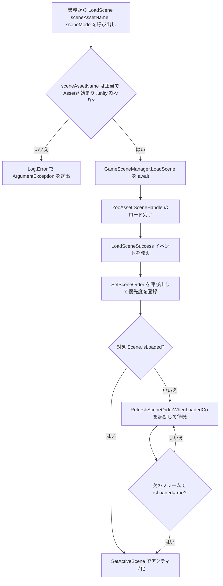

# 動作原理：非同期ロードとアクティブシーンの並び替え

`SceneComponent` は YooAsset の `SceneHandle` をベースに **非同期ロード** を実装し、複数のシーンを Additive で重ねる場合に `m_SceneOrder` の SortedDictionary と `RefreshSceneOrder()` によって現在のアクティブシーンを選択します。本記事では `LoadScene` の呼び出しから Unity の `SetActiveScene` までの主要な流れを解説します。

## 主要フィールド一覧

| フィールド | 型 | 役割 |
|------|------|------|
| `m_SceneOrder` | `SortedDictionary<string,int>` | 各 `sceneAssetName` のアクティブ優先度を記録（大きいほど優先） |
| `m_GameFrameworkScene` | `UnityEngine.SceneManagement.Scene` | フレームワーク付属のシーン。すべての業務シーンが未ロードの場合にここにフォールバックする |
| `m_RefreshSceneOrderCo` | `Coroutine` | YooAsset の完了を待っているが Unity の `isLoaded` がまだ `true` でない場合の再試行コルーチン |
| `DefaultPriority` | `const int = 0` | デフォルトの優先度定数 |
| `m_EnableLoadSceneUpdateEvent` | `bool` | `LoadSceneUpdate` 進捗イベントを有効にするか（デフォルト `true`） |

フィールド定義は [SceneComponent.cs](https://github.com/GameFrameX/com.gameframex.unity.scene/blob/main/Runtime/Scene/SceneComponent.cs#L51-L65) を参照してください。

## 非同期ロードの流れ

`SceneComponent.LoadScene` は `Task<YooAsset.SceneHandle>` を返し、内部でリクエストを `GameSceneManager` に委譲します。後者はロード状態を区別するために 3 つの辞書を管理しています:

| 辞書 | 意味 |
|------|------|
| `m_LoadedSceneAssetNames` | ロード完了済みのシーンリソース |
| `m_LoadingSceneAssetNames` | ロード中のシーン（`SceneHandleData` を保持） |
| `m_UnloadingSceneAssetNames` | アンロード中のシーン |

辞書と初期化ロジックは [GameSceneManager.cs](https://github.com/GameFrameX/com.gameframex.unity.scene/blob/main/Runtime/Scene/Scene/GameSceneManager.cs#L59-L84) を参照してください。

`SceneComponent.Awake()` は `GameSceneManager` の 5 つのイベントを購読します：`LoadSceneSuccess`、`LoadSceneFailure`、`LoadSceneUpdate`（デフォルトで有効）、`UnloadSceneSuccess`、`UnloadSceneFailure`。購読コード:

```csharp
_gameSceneManager.LoadSceneSuccess += OnLoadGameSceneSuccess;
_gameSceneManager.LoadSceneFailure += OnLoadGameSceneFailure;
if (m_EnableLoadSceneUpdateEvent)
{
    _gameSceneManager.LoadSceneUpdate += OnLoadGameSceneUpdate;
}
_gameSceneManager.UnloadSceneSuccess += OnUnloadGameSceneSuccess;
_gameSceneManager.UnloadSceneFailure += OnUnloadGameSceneFailure;
```

Source: [SceneComponent.cs](https://github.com/GameFrameX/com.gameframex.unity.scene/blob/main/Runtime/Scene/SceneComponent.cs#L91-L105)

`LoadScene` の公開シグネチャは以下の形式です:

```csharp
public async Task<YooAsset.SceneHandle> LoadScene(
    string sceneAssetName,
    UnityEngine.SceneManagement.LoadSceneMode sceneMode,
    object userData = null);
```

`sceneAssetName` が `Assets/` で始まり `.unity` で終わることを検証したうえで、基盤となる `GameSceneManager.LoadScene` を `await` します。

Source: [SceneComponent.cs](https://github.com/GameFrameX/com.gameframex.unity.scene/blob/main/Runtime/Scene/SceneComponent.cs#L306-L322)

## アクティブシーンの並び替えメカニズム

並び替えとアクティブ化の中心的なエントリーポイントは `SetSceneOrder` と `RefreshSceneOrder` です。

```csharp
public void SetSceneOrder(string sceneAssetName, int sceneOrder)
{
    // ... sceneAssetName の正当性を検証 ...
    if (SceneIsLoading(sceneAssetName))
    {
        m_SceneOrder[sceneAssetName] = sceneOrder;
        return;
    }
    if (SceneIsLoaded(sceneAssetName))
    {
        m_SceneOrder[sceneAssetName] = sceneOrder;
        RefreshSceneOrder();
        return;
    }
    Log.Error("Scene '{0}' is not loaded or loading.", sceneAssetName);
}
```

Source: [SceneComponent.cs](https://github.com/GameFrameX/com.gameframex.unity.scene/blob/main/Runtime/Scene/SceneComponent.cs#L352-L381)

`RefreshSceneOrder` の動作:

1. `m_SceneOrder` を走査し、ロード中のシーン（`SceneIsLoading`）をスキップして、`sceneOrder.Value` が最大のものをアクティブシーンの候補とします。
2. すべてのシーンがロード中、または辞書が空の場合は `SetActiveScene(m_GameFrameworkScene)` でフレームワークシーンにフォールバックします。
3. `SceneManager.GetSceneByName(GetSceneName(maxSceneName))` で Unity のシーンオブジェクトを取得しますが、`scene.isLoaded == false` の場合、YooAsset の `await` 完了タイミングは通常 Unity 層の `isLoaded=true` より **早い** ため、直接 `SetActiveScene` を呼ぶと `ArgumentException` が発生します。

このとき `RefreshSceneOrder` はコルーチン `RefreshSceneOrderWhenLoadedCo` を起動し、次のフレームで `isLoaded` が `true` になってからアクティブ化します。この間、古い同名コルーチンを `StopCoroutine` で停止し、新しいコルーチンとアクティブ化の順序が競合するのを防ぎます。

Source: [SceneComponent.cs](https://github.com/GameFrameX/com.gameframex.unity.scene/blob/main/Runtime/Scene/SceneComponent.cs#L392-L437)



## イベントペイロード (EventArgs)

非同期ロードのプロセスは `GameFrameX.Runtime` のオブジェクトプールを通じてイベントを配信し、ペイロードはいずれも `GameEventArgs` のサブクラスです。[GameFrameXSceneCroppingHelper.cs](https://github.com/GameFrameX/com.gameframex.unity.scene/blob/main/Runtime/GameFrameXSceneCroppingHelper.cs#L10-L21) において AOT クロップヘルパーによって明示的に参照され、誤ってクロップされるのを防いでいます。

| イベント | ペイロードクラス | 用途 |
|------|--------|------|
| `LoadSceneSuccess` | `LoadSceneSuccessEventArgs` | ロード成功 |
| `LoadSceneFailure` | `LoadSceneFailureEventArgs` | ロード失敗（`Status`、`ErrorMessage` を含む） |
| `LoadSceneUpdate` | `LoadSceneUpdateEventArgs` | 進捗更新 |
| `UnloadSceneSuccess` | `UnloadSceneSuccessEventArgs` | アンロード成功 |
| `UnloadSceneFailure` | `UnloadSceneFailureEventArgs` | アンロード失敗 |
| `ActiveSceneChanged` | `ActiveSceneChangedEventArgs` | Unity のアクティブシーン変更 |

## 関連リンク

- [SceneComponent.cs](https://github.com/GameFrameX/com.gameframex.unity.scene/blob/main/Runtime/Scene/SceneComponent.cs#L294-L343) — `LoadScene`/`UnloadScene`/`SetSceneOrder` のエントリーポイント
- [GameSceneManager.cs](https://github.com/GameFrameX/com.gameframex.unity.scene/blob/main/Runtime/Scene/Scene/GameSceneManager.cs#L145-L164) — 非同期ロード実装、Update、Shutdown でロード済み全シーンを回収
- [IGameSceneManager.cs](https://github.com/GameFrameX/com.gameframex.unity.scene/blob/main/Runtime/Scene/Scene/IGameSceneManager.cs) — マネージャーのインターフェース契約
- [GameFrameXSceneCroppingHelper.cs](https://github.com/GameFrameX/com.gameframex.unity.scene/blob/main/Runtime/GameFrameXSceneCroppingHelper.cs) — AOT クロップヘルパークラス
- 関連 EventArgs：`LoadSceneSuccessEventArgs`、`LoadSceneFailureEventArgs`、`LoadSceneUpdateEventArgs`、`UnloadSceneSuccessEventArgs`、`UnloadSceneFailureEventArgs`、`ActiveSceneChangedEventArgs`（すべて `Runtime/EventArgs/` 配下）