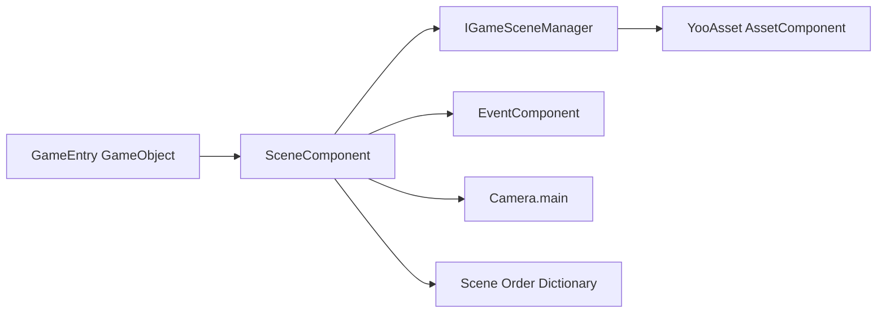

# 概要と機能

GameFrameX Scene は [YooAsset](https://github.com/tuyoogame/YooAsset) をベースにした Unity のシーンマネジメントパッケージです。非同期シーンのロード/アンロード、イベント駆動の状態通知、進捗追跡、アクティブシーンの優先度ソート機能を提供し、Game Frame X 体系におけるシーンサブシステムの統一エントリーポイントとして機能します。

## クイックスタート

### 依存関係

| パッケージ | 最低バージョン |
|---|---------|
| `com.gameframex.unity.asset` | >= 2.5.0 |
| `com.gameframex.unity.event` | >= 1.1.0 |

### インストール (UPM Scoped Registry)

Unity プロジェクトの `Packages/manifest.json` を編集し、`scopedRegistries` に GameFrameX リポジトリを追加し、Scene パッケージを `dependencies` に追加します:

```json
{
  "scopedRegistries": [
    {
      "name": "GameFrameX",
      "url": "https://gameframex.upm.alianblank.uk",
      "scopes": ["com.gameframex"]
    }
  ],
  "dependencies": {
    "com.gameframex.unity.scene": "2.2.1"
  }
}
```

Source: [README.zh-CN.md](https://github.com/GameFrameX/com.gameframex.unity.scene/blob/main/README.zh-CN.md#L57-L73)

その他のインストール方法 (Git URL / 手動で `Packages` ディレクトリに配置) と詳細な手順については、「インストール」を参照してください。

### SceneComponent の追加

GameEntry GameObject に `Add Component > GameFrameX > Scene` から `SceneComponent` を追加します。フレームワークは起動時に自動的に初期化するため、追加の呼び出しは不要です。

```csharp
[DisallowMultipleComponent]
[AddComponentMenu("GameFrameX/Scene")]
[GameFrameXAutoComponent(-4000)]
public sealed class SceneComponent : GameFrameworkComponent
```

Source: [SceneComponent.cs](https://github.com/GameFrameX/com.gameframex.unity.scene/blob/main/Runtime/Scene/SceneComponent.cs#L46-L49)

### 最初のシーンを実行する

1. `SceneComponent.LoadScene` を通じて非同期でシーンをロードし、`SceneHandle` を取得します。
2. `SceneComponent.SetSceneOrder` を通じて優先度を設定し、アクティブシーンにします。
3. `EventComponent` を通じて `LoadSceneSuccessEventArgs` コールバック通知を購読します。

```csharp
var handle = await SceneComponent.LoadScene("Assets/Scenes/GameScene.unity");
SceneComponent.SetSceneOrder("Assets/Scenes/GameScene.unity", 10);

EventComponent.Subscribe<LoadSceneSuccessEventArgs>(e =>
{
    Debug.Log($"シーン {e.SceneAssetName} のロードが完了しました。所要時間 {e.Duration:F2}s");
});
```

Source: [README.zh-CN.md](https://github.com/GameFrameX/com.gameframex.unity.scene/blob/main/README.zh-CN.md#L107-L154)

## 機能

| 機能 | 説明 |
|------|------|
| 非同期シーンのロード/アンロード | `Task` ベースの `LoadScene` と `UnloadScene` API |
| `LoadSceneMode` のサポート | `Single` (すべて置き換え) と `Additive` (加算) の 2 つのモード |
| 進捗追跡 | `LoadSceneUpdateEventArgs` によるリアルタイム進捗。ロード画面を駆動可能 |
| アクティブシーンのソート | `SetSceneOrder` で優先度を設定し、数値が高いほど優先的にアクティブシーンになる |
| 自動カメラ更新 | アクティブシーンの切り替え時に `Camera.main` の参照を自動的に更新 |
| イベント通知 | `EventComponent` を通じてロード/アンロードの成功、失敗、更新イベントを購読 |
| 状態照会 | `SceneIsLoaded` / `SceneIsLoading` / `SceneIsUnloading` でいつでも照会可能 |
| エディター拡張 | `SceneComponent` カスタム Inspector パネル |

Source: [README.zh-CN.md](https://github.com/GameFrameX/com.gameframex.unity.scene/blob/main/README.zh-CN.md#L28-L37)

## 仕組みの概要

シーンサブシステムは `SceneComponent` を統一エントリーポイントとし、内部的に `IGameSceneManager` と `GameSceneManager` に委譲してシーンを非同期でロードし、ライフサイクルイベントを `EventComponent` バスに転送します。呼び出し側はイベントを購読するか、`SceneIsLoaded` などの照会インターフェースを呼び出すことで状態を取得します。



Source: [SceneComponent.cs](https://github.com/GameFrameX/com.gameframex.unity.scene/blob/main/Runtime/Scene/SceneComponent.cs#L49-L61)

## 次に進む

- シーンのロード/アンロードの完全な手順とサンプルについては、「シーンのロードとアンロード」を参照
- イベント購読の完全なリストについては、「イベントリファレンス」を参照
- API クイックリファレンスとバージョン変更については、「API リファレンス」と「更新履歴」を参照