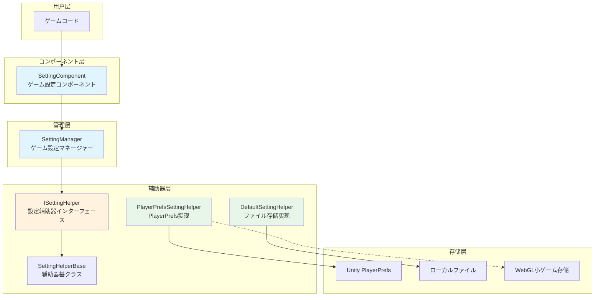
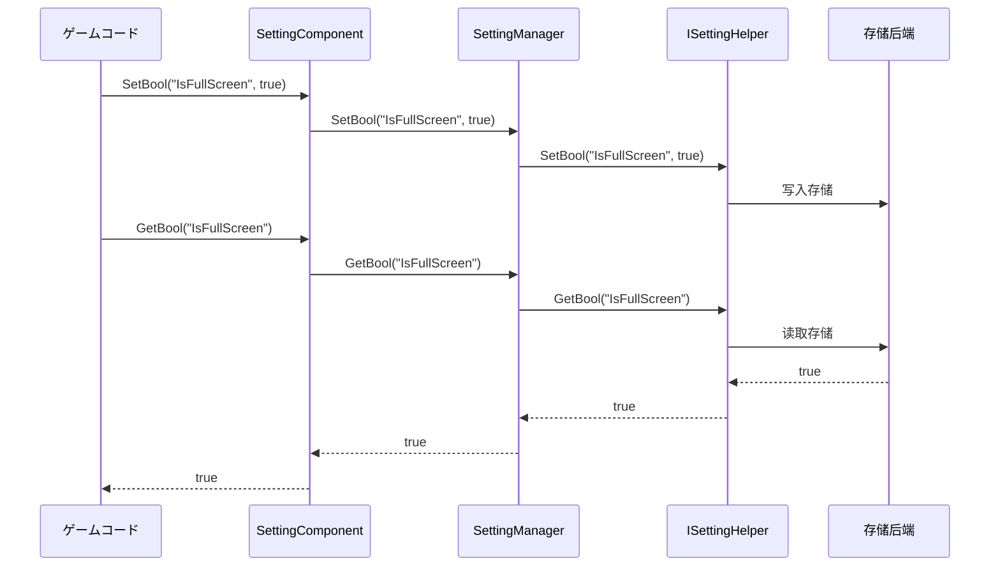

# 

GameFrameX Setting コンポーネントは GameFrameX ゲームフレームワークのコアコンポーネント，ゲームの，とタイプデータの。コンポーネントアーキテクチャ，サポート，ゲームのシンプル。

## 

Setting コンポーネントにゲームにの。にゲーム，タイプのデータ，、、、ゲーム。は，コード，。

GameFrameX Setting コンポーネントたの：

- **タイプ**: サポート、、、
- ****:  PlayerPrefs とファイル，サポートカスタマイズ
- **プラットフォームサポート**: サポート Unity プラットフォーム， WebGL ゲーム（、、）
- **エディター**:  Unity エディターInspector，コンポーネント

## アーキテクチャ



### コアコンポーネント

| コンポーネント |  |  |
|------|------|----------|
| SettingComponent | Unity MonoBehaviour コンポーネント | フレームワークとゲームコードの，エディターと |
| SettingManager | コアモジュール | データの，，リクエスト |
| ISettingHelper | インターフェース | ，の |
| SettingHelperBase | クラス | メソッド， |

### データ



## 

### サポートのデータタイプ

Setting コンポーネントサポートデータタイプ，ゲームの：

- ** (bool)**: にクラス，は、は
- ** (int)**: にクラス，、
- ** (float)**: に，、
- ** (string)**: にクラス，、
- ** (Object)**: に， JSON ，ゲーム、データ

### 

#### PlayerPrefsSettingHelper（デフォルト）

にづく Unity の PlayerPrefs ，はシンプルの：

- ****: ，
- ****: サポート，
- ****: シンプルの

```csharp
// デフォルト使用 PlayerPrefsSettingHelper
settingComponent.SetBool("IsFullScreen", true);
settingComponent.SetFloat("Volume", 0.8f);
settingComponent.Save();
```

#### DefaultSettingHelper

にづくローカルファイルの，の：

- ****: サポート，サポートのデータ
- ****: びし Save() 
- ****: のゲーム

```csharp
// 使用ファイル存储
settingComponent.SetInt("HighScore", 10000);
settingComponent.Save();
```

### プラットフォームサポート

PlayerPrefsSettingHelper プラットフォーム：

| プラットフォーム |  |  |
|------|----------|----------|
| Unity Editor | Unity PlayerPrefs | のサポート |
| Standalone | Unity PlayerPrefs | のサポート |
| WebGL | プラットフォーム Storage API | 、、ゲーム |
| Mobile | Unity PlayerPrefs | のサポート |
| Console | Unity PlayerPrefs | のサポート |

### 

コンポーネント JSON ，サポートとインターフェース：

```csharp
// 定义一个設定クラス
[Serializable]
public class GameSettings
{
    public bool IsFullScreen = true;
    public int ResolutionWidth = 1920;
    public int ResolutionHeight = 1080;
    public float Volume = 0.8f;
}

// 存储对象
GameSettings settings = new GameSettings { IsFullScreen = true, Volume = 0.5f };
settingComponent.SetObject("GameSettings", settings);

// 读取对象
GameSettings loadedSettings = settingComponent.GetObject<GameSettings>("GameSettings");
```

## 

### 

に Unity  SettingComponent：

1. に Hierarchy 
2.  `SettingComponent` コンポーネント（：GameFrameX → Setting）
3. のコンポーネント

### 

に Inspector ，の：

- **PlayerPrefsSettingHelper**: デフォルト，
- **DefaultSettingHelper**: ファイル，

をじて `m_CustomSettingHelper` カスタマイズ。

### データフロー

```csharp
public class GameExample : MonoBehaviour
{
    private SettingComponent settingComponent;

    private void Start()
    {
        // 获取設定コンポーネント（を通じてフレームワーク获取或直接获取）
        settingComponent = GameEntry.GetComponent<SettingComponent>();
    }

    private void SaveSettings()
    {
        // 保存設定
        settingComponent.SetBool("IsFullScreen", true);
        settingComponent.SetFloat("Volume", 0.8f);
        settingComponent.SetString("PlayerName", "PlayerOne");
        
        // 重要：呼び出しSave()持久化存储
        settingComponent.Save();
    }

    private void LoadSettings()
    {
        // 读取設定，サポートデフォルト值
        bool isFullScreen = settingComponent.GetBool("IsFullScreen", true);
        float volume = settingComponent.GetFloat("Volume", 0.5f);
        string playerName = settingComponent.GetString("PlayerName", "Default");
    }
}
```

## リンク

- [インストールガイド](./02.installation)
- [クイックスタート](./03.getting-started)
- [](./04.features)
- [](./05.helper-implementation)
- [プラットフォーム](./06.platforms)
- [API リファレンス](./07.api-reference)
- [よくある](./08.troubleshooting)
- [ドキュメント](https://gameframex.doc.alianblank.com/)
- [GitHub リポジトリ](https://github.com/GameFrameX/com.gameframex.unity.setting)
