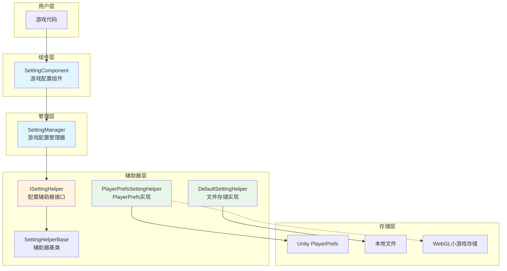
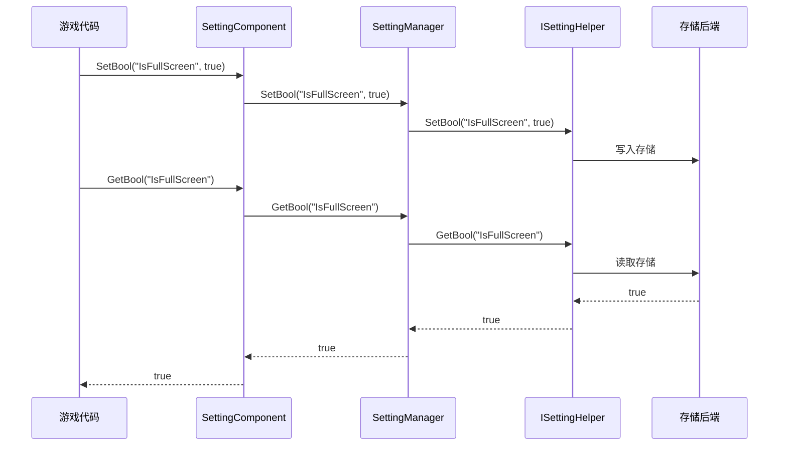

# 概要

GameFrameX Setting 設定コンポーネント是 GameFrameX 游戏フレームワーク的コアコンポーネント之一，负责管理游戏的設定情報，提供保存和取得各种タイプ設定数据的機能。该コンポーネント采用分层アーキテクチャ設計，サポート多种存储后端，使游戏設定的管理变得シンプル効率的。

## 概要

Setting 設定コンポーネント旨在解决游戏开发中普遍存在的設定管理需求。在游戏开发过程中，開発者〜する必要があります保存各种タイプ的設定数据，如画面质量、音量大小、按键绑定、游戏進捗等。传统做法是自行実装一套設定系统，不仅コード复用性低，而且难以维护。

GameFrameX Setting コンポーネント提供します統一された的設定管理解決策：

- **タイプ安全**: サポート布尔值、整数、浮点数、字符串および任意可シリアライズ对象
- **多存储后端**: 内置 PlayerPrefs 和ファイル存储两种実装，サポート自定義拡張
- **跨プラットフォームサポート**: 全面サポート Unity 各プラットフォーム，含みます WebGL ミニゲーム（抖音、微信、快手）
- **エディタ集成**: 提供 Unity エディタInspectorパネル，可视化設定コンポーネント

## アーキテクチャ設計



### コアコンポーネント説明

| コンポーネント | 説明 | 設計意图 |
|------|------|----------|
| SettingComponent | Unity MonoBehaviour コンポーネント | 作为フレームワーク与游戏コード的桥梁，提供エディタ集成和ライフサイクル管理 |
| SettingManager | コア业务逻辑モジュール | 负责設定数据的管理，検証输入，转发请求到辅助器 |
| ISettingHelper | 存储抽象インターフェース | 解耦存储実装，便于拡張新的存储后端 |
| SettingHelperBase | 辅助器基底クラス | 提供抽象メソッド定義，簡素化辅助器実装 |

### 数据流向



## 機能特性

### サポート的数据タイプ

Setting コンポーネントサポート以下数据タイプ，满足游戏开发中的各种設定需求：

- **布尔值 (bool)**: 用于开关类設定，如是否全屏、是否开启音效等
- **整数 (int)**: 用于数值类設定，如分辨率、画质等级等
- **浮点数 (float)**: 用于精确数值設定，如音量大小、灵敏度等
- **字符串 (string)**: 用于文本类設定，如プレイヤー名称、服务器地址等
- **对象 (Object)**: 用于複雑設定，使用 JSON シリアライズ存储，如游戏進捗、角色数据等

### 存储后端

#### PlayerPrefsSettingHelper（デフォルト）

基于 Unity 内置的 PlayerPrefs 実装，是最シンプル直接的存储方法：

- **优点**: 无需额外設定，つまり插つまり用
- **缺点**: 不サポート取得所有键名，无法批量削除
- **适用シーン**: シンプル的設定存储

```csharp
// 默认使用 PlayerPrefsSettingHelper
settingComponent.SetBool("IsFullScreen", true);
settingComponent.SetFloat("Volume", 0.8f);
settingComponent.Save();
```

#### DefaultSettingHelper

基于本地ファイル存储的実装，提供更完善的機能：

- **优点**: サポート取得所有設定项名称，サポート完全な的数据管理
- **缺点**: 〜する必要があります手动呼び出し Save() 保存
- **适用シーン**: 〜する必要があります完全な設定管理機能的游戏

```csharp
// 使用文件存储
settingComponent.SetInt("HighScore", 10000);
settingComponent.Save();
```

### 跨プラットフォームサポート

PlayerPrefsSettingHelper 针对不同プラットフォーム有特殊処理：

| プラットフォーム | 存储実装 | 特殊説明 |
|------|----------|----------|
| Unity Editor | Unity PlayerPrefs | 完全な的读写サポート |
| Standalone | Unity PlayerPrefs | 完全な的读写サポート |
| WebGL | 各プラットフォーム Storage API | 抖音、微信、KuaiShouミニゲーム各自适配 |
| Mobile | Unity PlayerPrefs | 完全な的读写サポート |
| Console | Unity PlayerPrefs | 完全な的读写サポート |

### 对象シリアライズ

コンポーネント使用 JSON シリアライズ来存储複雑对象，サポートジェネリック和非ジェネリック两种インターフェース：

```csharp
// 定义一个设置类
[Serializable]
public class GameSettings
{
    public bool IsFullScreen = true;
    public int ResolutionWidth = 1920;
    public int ResolutionHeight = 1080;
    public float Volume = 0.8f;
}

// 存储对象
GameSettings settings = new GameSettings { IsFullScreen = true, Volume = 0.5f };
settingComponent.SetObject("GameSettings", settings);

// 读取对象
GameSettings loadedSettings = settingComponent.GetObject<GameSettings>("GameSettings");
```

## 使用方法

### 基本設定

在 Unity シーン中作成 SettingComponent：

1. 在 Hierarchy パネル中作成空物体
2. 追加 `SettingComponent` コンポーネント（メニュー：GameFrameX → Setting）
3. 系统会自动追加必要的依赖コンポーネント

### 設定辅助器选择

在 Inspector パネル中，〜できます选择不同的設定辅助器：

- **PlayerPrefsSettingHelper**: デフォルト使用，简便易用
- **DefaultSettingHelper**: ファイル存储，機能更全

也〜できます通过 `m_CustomSettingHelper` フィールド拖入自定義辅助器。

### 数据操作フロー

```csharp
public class GameExample : MonoBehaviour
{
    private SettingComponent settingComponent;

    private void Start()
    {
        // 获取设置组件（通过框架获取或直接获取）
        settingComponent = GameEntry.GetComponent<SettingComponent>();
    }

    private void SaveSettings()
    {
        // 保存设置
        settingComponent.SetBool("IsFullScreen", true);
        settingComponent.SetFloat("Volume", 0.8f);
        settingComponent.SetString("PlayerName", "PlayerOne");
        
        // 重要：调用Save()持久化存储
        settingComponent.Save();
    }

    private void LoadSettings()
    {
        // 读取设置，支持默认值
        bool isFullScreen = settingComponent.GetBool("IsFullScreen", true);
        float volume = settingComponent.GetFloat("Volume", 0.5f);
        string playerName = settingComponent.GetString("PlayerName", "Default");
    }
}
```

## 関連リンク

- [インストールガイド](./02.installation)
- [快速开始](./03.getting-started)
- [機能特性](./04.features)
- [設定辅助器実装](./05.helper-implementation)
- [プラットフォーム設定](./06.platforms)
- [API リファレンス](./07.api-reference)
- [常见問題](./08.troubleshooting)
- [官方ドキュメント](https://gameframex.doc.alianblank.com/)
- [GitHub リポジトリ](https://github.com/GameFrameX/com.gameframex.unity.setting)
