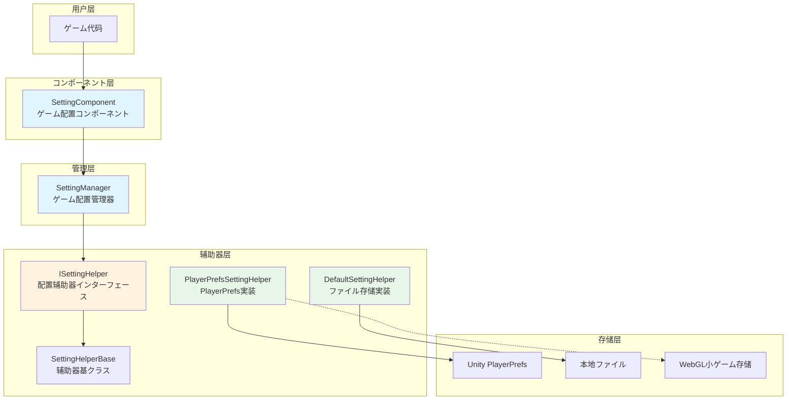

# 概要

GameFrameX Setting 配置コンポーネント是 GameFrameX ゲームフレームワーク的コアコンポーネント之一，负责管理ゲーム的配置信息，提供保存和取得各种クラス型配置数据的機能。该コンポーネント采用分层アーキテクチャ設計，サポート多种存储后端，使ゲーム設定的管理变得简单高效。

## 概要

Setting 配置コンポーネント旨在解决ゲーム开发中普遍存在的配置管理需求。在ゲーム开发过程中，開発者必要保存各种クラス型的設定数据，如画面质量、音量大小、按键绑定、ゲーム进度等。传统做法是自行実装一套配置系统，不仅代码复用性低，而且难以维护。

GameFrameX Setting コンポーネント提供します统一的配置管理解決策：

- **クラス型安全**: サポート布尔值、整数、浮点数、字符串以及任意可序列化对象
- **多存储后端**: 内置 PlayerPrefs 和ファイル存储两种実装，サポート自定义扩展
- **跨平台サポート**: 全面サポート Unity 各平台，包括 WebGL 小ゲーム（抖音、微信、快手）
- **编辑器集成**: 提供 Unity 编辑器Inspector面板，可视化配置コンポーネント

## アーキテクチャ設計



### コアコンポーネント説明

| コンポーネント | 説明 | 设计意图 |
|------|------|----------|
| SettingComponent | Unity MonoBehaviour コンポーネント | 作为フレームワーク与ゲーム代码的桥梁，提供编辑器集成和生命周期管理 |
| SettingManager | コア业务逻辑模块 | 负责設定数据的管理，验证输入，转发お願いします求到辅助器 |
| ISettingHelper | 存储抽象インターフェース | 解耦存储実装，便于扩展新的存储后端 |
| SettingHelperBase | 辅助器基クラス | 提供抽象メソッド定义，简化辅助器実装 |

### 数据流向


## 機能特性

### サポート的数据クラス型

Setting コンポーネントサポート以下数据クラス型，满足ゲーム开发中的各种配置需求：

- **布尔值 (bool)**: に使用开关クラス設定，如是否全屏、是否开启音效等
- **整数 (int)**: に使用数值クラス設定，如分辨率、画质等级等
- **浮点数 (float)**: に使用精确数值設定，如音量大小、灵敏度等
- **字符串 (string)**: に使用文本クラス設定，如玩家名称、服务器地址等
- **对象 (Object)**: に使用复杂配置，使用 JSON 序列化存储，如ゲーム进度、角色数据等

### 存储后端

#### PlayerPrefsSettingHelper（默认）

基づく Unity 内置的 PlayerPrefs 実装，是最简单直接的存储方法：

- **优点**: 无需额外配置，即插即用
- **缺点**: 不サポート取得所有键名，无法批量删除
- **适用シーン**: 简单的配置存储

```csharp
// 默认使用 PlayerPrefsSettingHelper
settingComponent.SetBool("IsFullScreen", true);
settingComponent.SetFloat("Volume", 0.8f);
settingComponent.Save();
```

#### DefaultSettingHelper

基づく本地ファイル存储的実装，提供更完善的機能：

- **优点**: サポート取得所有設定项名称，サポート完整的数据管理
- **缺点**: 必要手动呼び出し Save() 保存
- **适用シーン**: 必要完整設定管理機能的ゲーム

```csharp
// 使用ファイル存储
settingComponent.SetInt("HighScore", 10000);
settingComponent.Save();
```

### 跨平台サポート

PlayerPrefsSettingHelper 针对不同平台有特殊处理：

| 平台 | 存储実装 | 特殊説明 |
|------|----------|----------|
| Unity Editor | Unity PlayerPrefs | 完整的读写サポート |
| Standalone | Unity PlayerPrefs | 完整的读写サポート |
| WebGL | 各平台 Storage API | 抖音、微信、快手小ゲーム各自适配 |
| Mobile | Unity PlayerPrefs | 完整的读写サポート |
| Console | Unity PlayerPrefs | 完整的读写サポート |

### 对象序列化

コンポーネント使用 JSON 序列化来存储复杂对象，サポート泛型和非泛型两种インターフェース：

```csharp
// 定义一个設定クラス
[Serializable]
public class GameSettings
{
    public bool IsFullScreen = true;
    public int ResolutionWidth = 1920;
    public int ResolutionHeight = 1080;
    public float Volume = 0.8f;
}

// 存储对象
GameSettings settings = new GameSettings { IsFullScreen = true, Volume = 0.5f };
settingComponent.SetObject("GameSettings", settings);

// 读取对象
GameSettings loadedSettings = settingComponent.GetObject<GameSettings>("GameSettings");
```

## 使用メソッド

### 基本配置

在 Unity シーン中作成 SettingComponent：

1. 在 Hierarchy 面板中作成空物体
2. 添加 `SettingComponent` コンポーネント（菜单：GameFrameX → Setting）
3. 系统会自动添加必要的依赖コンポーネント

### 設定辅助器选择

在 Inspector 面板中，可能选择不同的配置辅助器：

- **PlayerPrefsSettingHelper**: 默认使用，简便易用
- **DefaultSettingHelper**: ファイル存储，機能更全

也可能を通じて `m_CustomSettingHelper` 字段拖入自定义辅助器。

### 数据操作フロー

```csharp
public class GameExample : MonoBehaviour
{
    private SettingComponent settingComponent;

    private void Start()
    {
        // 取得設定コンポーネント（を通じてフレームワーク取得或直接取得）
        settingComponent = GameEntry.GetComponent<SettingComponent>();
    }

    private void SaveSettings()
    {
        // 保存設定
        settingComponent.SetBool("IsFullScreen", true);
        settingComponent.SetFloat("Volume", 0.8f);
        settingComponent.SetString("PlayerName", "PlayerOne");
        
        // 重要：呼び出しSave()持久化存储
        settingComponent.Save();
    }

    private void LoadSettings()
    {
        // 读取設定，サポート默认值
        bool isFullScreen = settingComponent.GetBool("IsFullScreen", true);
        float volume = settingComponent.GetFloat("Volume", 0.5f);
        string playerName = settingComponent.GetString("PlayerName", "Default");
    }
}
```

## 関連リンク

- [安装指南](./02.installation)
- [快速开始](./03.getting-started)
- [機能特性](./04.features)
- [設定辅助器実装](./05.helper-implementation)
- [平台配置](./06.platforms)
- [API 参考](./07.api-reference)
- [常见问题](./08.troubleshooting)
- [官方文档](https://gameframex.doc.alianblank.com/)
- [GitHub 仓库](https://github.com/GameFrameX/com.gameframex.unity.setting)
