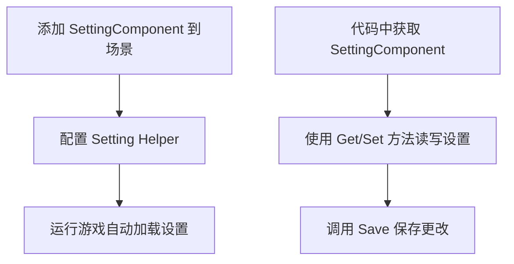
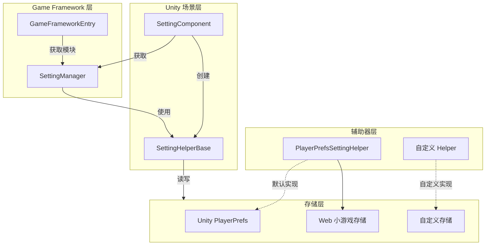

# クイックスタート

本ガイド将帮助您快速上手 GameFrameX Setting 設定コンポーネント，理解する如何在 Unity プロジェクト中集成和使用設定機能。

## 概要

SettingComponent 是 GameFrameX フレームワーク的コアコンポーネント，专门用于管理游戏的設定情報。它提供しますシンプル的 API 来保存和ロード各种タイプ的游戏設定，含みます布尔值、整数、浮点数、字符串および複雑的自定義对象。

该コンポーネント采用モジュール化設計，通过 `ISettingHelper` インターフェースサポート不同的存储実装，デフォルト使用 Unity 的 PlayerPrefs，同時にサポート拡張自定義存储方法。

## クイックスタートフロー



## 在 Unity シーン中追加コンポーネント

### ステップ 1：作成 Setting コンポーネント

1. 在 Unity エディタ中，打开您的游戏シーン
2. 在 Hierarchy パネル中，作成一个空 GameObject 或选择现有对象
3. 在 Inspector パネル中，点击 **Add Component** ボタン
4. 在検索框中输入 "Setting"，找到 **GameFrameX/Setting** コンポーネント
5. 点击追加

```csharp
// SettingComponent 将自动添加以下依赖组件：
// - GameFrameXSettingCroppingHelper (必需)
```
> Source: [SettingComponent.cs](https://github.com/GameFrameX/com.gameframex.unity.setting/blob/main/Runtime/Setting/SettingComponent.cs#L46)

### ステップ 2：設定 Setting Helper

SettingComponent 会自动作成 `PlayerPrefsSettingHelper` 作为デフォルト的存储辅助器。您〜できます在 Inspector パネル中確認和設定：

| プロパティ | タイプ | デフォルト值 | 説明 |
|------|------|--------|------|
| Setting Helper Type Name | string | "GameFrameX.Setting.Runtime.PlayerPrefsSettingHelper" | 設定辅助器的タイプ名称 |
| Custom Setting Helper | SettingHelperBase | null | 自定義設定辅助器（可选） |

```csharp
// SettingComponent 在 Awake 中初始化设置助手
private void Awake()
{
    // 获取 SettingManager 模块
    m_SettingManager = GameFrameworkEntry.GetModule<ISettingManager>();
    
    // 创建设置辅助器
    SettingHelperBase settingHelper = Helper.CreateHelper(m_SettingHelperTypeName, m_CustomSettingHelper);
    
    // 设置辅助器
    m_SettingManager.SetSettingHelper(settingHelper);
}
```
> Source: [SettingComponent.cs](https://github.com/GameFrameX/com.gameframex.unity.setting/blob/main/Runtime/Setting/SettingComponent.cs#L73-L98)

## 基本使用例

### 在コード中取得 SettingComponent

在 Unity 游戏中，您〜できます通过多种方法取得 SettingComponent：

```csharp
// 方式 1：通过场景中的 GameObject 获取
SettingComponent settingComponent = FindObjectOfType<SettingComponent>();

// 方式 2：如果您使用 GameFrameX 的 MonoBehaviour 方式
// 假设您的类继承自自定义的 MonoBehaviour
private SettingComponent settingComponent;

private void Start()
{
    settingComponent = GetComponent<SettingComponent>();
}
```
> Source: [README.md](https://github.com/GameFrameX/com.gameframex.unity.setting/blob/main/README.md#L86-L100)

### 保存和ロード設定

SettingComponent 在游戏启动时会自动呼び出し `Start()` メソッドロード已保存的設定：

```csharp
// 完整的设置管理示例
public class GameSettingsManager : MonoBehaviour
{
    private SettingComponent settingComponent;

    private void Start()
    {
        // 获取 SettingComponent
        settingComponent = GetComponent<SettingComponent>();
        
        // 设置一些游戏配置
        settingComponent.SetBool("IsFullScreen", true);
        settingComponent.SetInt("ResolutionWidth", 1920);
        settingComponent.SetFloat("Volume", 0.8f);
        settingComponent.SetString("PlayerName", "PlayerOne");
        
        // 保存配置
        settingComponent.Save();
    }

    private void OnApplicationPause(bool pauseStatus)
    {
        // 当应用暂停时保存设置（适用于移动平台）
        if (pauseStatus)
        {
            settingComponent.Save();
        }
    }

    private void OnApplicationQuit()
    {
        // 应用退出时保存设置
        settingComponent.Save();
    }
}
```
> Source: [README.md](https://github.com/GameFrameX/com.gameframex.unity.setting/blob/main/README.md#L86-L100)

### 读取設定值

```csharp
// 检查设置是否存在
bool hasVolumeSetting = settingComponent.HasSetting("Volume");

// 获取设置值，使用默认值防止设置不存在时出错
float volume = settingComponent.GetFloat("Volume", 0.5f);  // 如果不存在，返回 0.5f
bool isFullScreen = settingComponent.GetBool("IsFullScreen", false);  // 默认全屏关闭
int resolutionWidth = settingComponent.GetInt("ResolutionWidth", 1920);  // 默认 1920
string playerName = settingComponent.GetString("PlayerName", "Guest");  // 默认 Guest
```
> Source: [README.md](https://github.com/GameFrameX/com.gameframex.unity.setting/blob/main/README.md#L104-L110)

### 保存和削除設定

```csharp
// 保存所有修改
settingComponent.Save();

// 删除单个设置
settingComponent.RemoveSetting("PlayerName");

// 删除所有设置
settingComponent.RemoveAllSettings();
```
> Source: [README.md](https://github.com/GameFrameX/com.gameframex.unity.setting/blob/main/README.md#L114-L120)

### 保存複雑对象

SettingComponent サポート保存自定義对象，对象会被自动シリアライズ为 JSON：

```csharp
// 定义一个设置类
[Serializable]
public class GamePreferences
{
    public bool IsMusicEnabled = true;
    public bool IsSoundEnabled = true;
    public float MusicVolume = 0.7f;
    public float SoundVolume = 0.8f;
    public string Language = "en";
}

// 保存复杂对象
var preferences = new GamePreferences
{
    IsMusicEnabled = true,
    MusicVolume = 0.8f,
    Language = "zh-CN"
};
settingComponent.SetObject("GamePreferences", preferences);

// 读取复杂对象
var loadedPreferences = settingComponent.GetObject<GamePreferences>("GamePreferences", new GamePreferences());
```
> Source: [PlayerPrefsSettingHelper.cs](https://github.com/GameFrameX/com.gameframex.unity.setting/blob/main/Runtime/Setting/PlayerPrefsSettingHelper.cs#L620-L623)

## コンポーネントアーキテクチャ



## 在ランタイム取得設定

SettingComponent 提供多种数据タイプ的メソッド：

| 数据タイプ | 读取メソッド | 写入メソッド |
|---------|---------|---------|
| 布尔值 | `GetBool(name)` / `GetBool(name, default)` | `SetBool(name, value)` |
| 整数 | `GetInt(name)` / `GetInt(name, default)` | `SetInt(name, value)` |
| 浮点数 | `GetFloat(name)` / `GetFloat(name, default)` | `SetFloat(name, value)` |
| 字符串 | `GetString(name)` / `GetString(name, default)` | `SetString(name, value)` |
| 对象 | `GetObject<T>(name)` / `GetObject<T>(name, default)` | `SetObject<T>(name, obj)` |

```csharp
// 完整示例：游戏设置管理器
public class SettingsManager : MonoBehaviour
{
    private SettingComponent settingComponent;
    
    // 设置键名常量
    private const string KEY_MUSIC_ON = "setting.music.on";
    private const string KEY_MUSIC_VOLUME = "setting.music.volume";
    private const string KEY_GRAPHICS_QUALITY = "setting.graphics.quality";
    private const string KEY_PLAYER_DATA = "player.data";

    private void Awake()
    {
        settingComponent = GetComponent<SettingComponent>();
    }

    // 音乐设置
    public bool MusicEnabled
    {
        get => settingComponent.GetBool(KEY_MUSIC_ON, true);
        set => settingComponent.SetBool(KEY_MUSIC_ON, value);
    }

    public float MusicVolume
    {
        get => settingComponent.GetFloat(KEY_MUSIC_VOLUME, 0.5f);
        set => settingComponent.SetFloat(KEY_MUSIC_VOLUME, Mathf.Clamp01(value));
    }

    // 图形设置
    public int GraphicsQuality
    {
        get => settingComponent.GetInt(KEY_GRAPHICS_QUALITY, 1);
        set => settingComponent.SetInt(KEY_GRAPHICS_QUALITY, value);
    }

    // 保存玩家数据
    public void SavePlayerData(PlayerData data)
    {
        settingComponent.SetObject(KEY_PLAYER_DATA, data);
        settingComponent.Save();
    }

    // 加载玩家数据
    public PlayerData LoadPlayerData()
    {
        return settingComponent.GetObject<PlayerData>(KEY_PLAYER_DATA, new PlayerData());
    }
}
```

## 常见使用シーン

### シーン 1：游戏設定界面

```csharp
public class SettingsUI : MonoBehaviour
{
    [SerializeField] private SettingComponent settingComponent;
    [SerializeField] private Slider volumeSlider;
    [SerializeField] private Toggle fullscreenToggle;

    private void Start()
    {
        // 加载现有设置到 UI
        volumeSlider.value = settingComponent.GetFloat("Volume", 0.5f);
        fullscreenToggle.isOn = settingComponent.GetBool("Fullscreen", true);
    }

    public void OnVolumeChanged(float value)
    {
        settingComponent.SetFloat("Volume", value);
        settingComponent.Save();
    }

    public void OnFullscreenChanged(bool value)
    {
        settingComponent.SetBool("Fullscreen", value);
        settingComponent.Save();
    }
}
```

### シーン 2：プレイヤー数据持久化

```csharp
[Serializable]
public class PlayerData
{
    public string playerName;
    public int level;
    public int experience;
    public List<string> achievements;
}

public class PlayerDataManager : MonoBehaviour
{
    private SettingComponent settingComponent;
    private const string KEY = "player.data";

    public void SavePlayer(PlayerData data)
    {
        settingComponent.SetObject(KEY, data);
        bool success = settingComponent.Save();
        Debug.Log($"玩家数据保存{(success ? "成功" : "失败")}");
    }

    public PlayerData LoadPlayer()
    {
        return settingComponent.GetObject<PlayerData>(KEY, new PlayerData());
    }
}
```

## 注意事项

1. **自动ロード**：SettingComponent 在 `Start()` メソッド中自动呼び出し `Load()` ロード設定，您无需手动呼び出し。
2. **手动保存**：設定変更后〜する必要があります呼び出し `Save()` メソッド才能持久化到存储。
3. **プラットフォーム差异**：在不同プラットフォーム（如 WebGL ミニゲーム）上，存储行为〜の可能性があります略有不同，具体请リファレンスプラットフォーム設定ドキュメント。
4. **对象シリアライズ**：複雑对象会使用 JSON シリアライズ，请確認してください类标记为 `[Serializable]`。

## 関連リンク

- [機能特性](./04.features) - 深入理解する Setting アーキテクチャ設計
- [設定辅助器](./05.helper-implementation) - 自定義存储実装
- [プラットフォーム設定](./06.platforms) - 不同プラットフォーム的具体設定
- [API リファレンス](./07.api-reference) - 完全な的 API メソッドドキュメント
