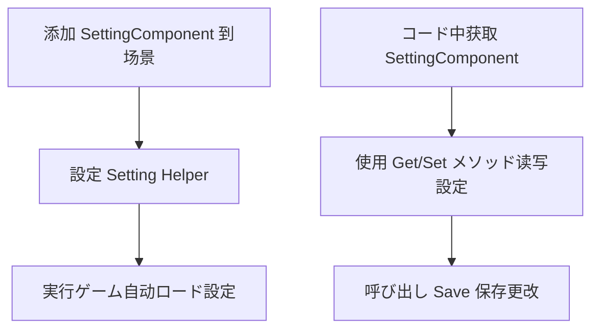
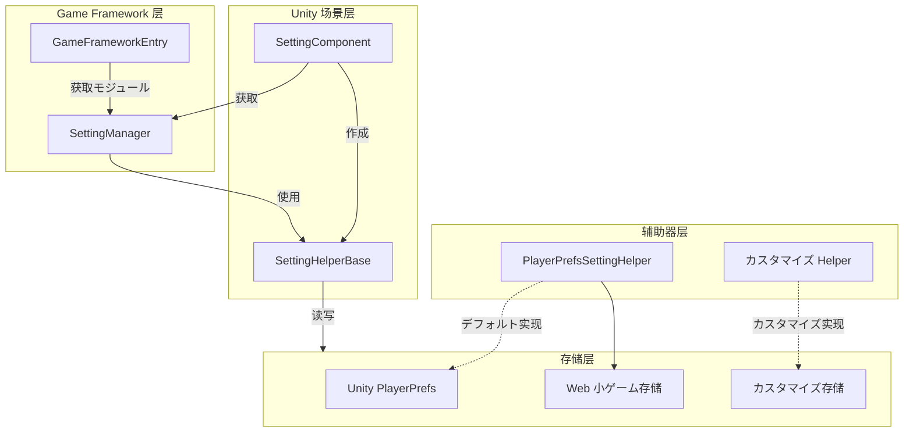

# クイックスタート

ガイド GameFrameX Setting コンポーネント，たに Unity プロジェクトと。

## 

SettingComponent は GameFrameX フレームワークのコアコンポーネント，にゲームの。たの API とロードタイプのゲーム，、、、のカスタマイズ。

コンポーネントモジュール，をじて `ISettingHelper` インターフェースサポートの，デフォルト Unity の PlayerPrefs，サポートカスタマイズ。

## クイックスタートフロー



## に Unity コンポーネント

### ステップ 1： Setting コンポーネント

1. に Unity エディター，のゲーム
2. に Hierarchy ， GameObject 
3. に Inspector ， **Add Component** 
4. に "Setting"， **GameFrameX/Setting** コンポーネント
5. 

```csharp
// SettingComponent 将自动添加以下依赖コンポーネント：
// - GameFrameXSettingCroppingHelper (必需)
```
> Source: [SettingComponent.cs](https://github.com/GameFrameX/com.gameframex.unity.setting/blob/main/Runtime/Setting/SettingComponent.cs#L46)

### ステップ 2： Setting Helper

SettingComponent  `PlayerPrefsSettingHelper` デフォルトの。に Inspector と：

| プロパティ | タイプ | デフォルト |  |
|------|------|--------|------|
| Setting Helper Type Name | string | "GameFrameX.Setting.Runtime.PlayerPrefsSettingHelper" | のタイプ |
| Custom Setting Helper | SettingHelperBase | null | カスタマイズ（オプション） |

```csharp
// SettingComponent に Awake 中初始化設定助手
private void Awake()
{
    // 获取 SettingManager モジュール
    m_SettingManager = GameFrameworkEntry.GetModule<ISettingManager>();
    
    // 作成設定辅助器
    SettingHelperBase settingHelper = Helper.CreateHelper(m_SettingHelperTypeName, m_CustomSettingHelper);
    
    // 設定辅助器
    m_SettingManager.SetSettingHelper(settingHelper);
}
```
> Source: [SettingComponent.cs](https://github.com/GameFrameX/com.gameframex.unity.setting/blob/main/Runtime/Setting/SettingComponent.cs#L73-L98)

## 

### にコード SettingComponent

に Unity ゲーム，をじて SettingComponent：

```csharp
// 方式 1：を通じて场景中の GameObject 获取
SettingComponent settingComponent = FindObjectOfType<SettingComponent>();

// 方式 2：如果您使用 GameFrameX の MonoBehaviour 方式
// 假设您のクラス继承自カスタマイズの MonoBehaviour
private SettingComponent settingComponent;

private void Start()
{
    settingComponent = GetComponent<SettingComponent>();
}
```
> Source: [README.md](https://github.com/GameFrameX/com.gameframex.unity.setting/blob/main/README.md#L86-L100)

### とロード

SettingComponent にゲームびし `Start()` メソッドロードの：

```csharp
// 完全の設定管理例
public class GameSettingsManager : MonoBehaviour
{
    private SettingComponent settingComponent;

    private void Start()
    {
        // 获取 SettingComponent
        settingComponent = GetComponent<SettingComponent>();
        
        // 設定一些ゲーム設定
        settingComponent.SetBool("IsFullScreen", true);
        settingComponent.SetInt("ResolutionWidth", 1920);
        settingComponent.SetFloat("Volume", 0.8f);
        settingComponent.SetString("PlayerName", "PlayerOne");
        
        // 保存設定
        settingComponent.Save();
    }

    private void OnApplicationPause(bool pauseStatus)
    {
        // 当应用暂停时保存設定（适に使用移动プラットフォーム）
        if (pauseStatus)
        {
            settingComponent.Save();
        }
    }

    private void OnApplicationQuit()
    {
        // 应用退出时保存設定
        settingComponent.Save();
    }
}
```
> Source: [README.md](https://github.com/GameFrameX/com.gameframex.unity.setting/blob/main/README.md#L86-L100)

### 

```csharp
// 检查設定は否存に
bool hasVolumeSetting = settingComponent.HasSetting("Volume");

// 获取設定值，使用デフォルト值防止設定不存に时出错
float volume = settingComponent.GetFloat("Volume", 0.5f);  // 如果不存に，戻す 0.5f
bool isFullScreen = settingComponent.GetBool("IsFullScreen", false);  // デフォルト全屏关闭
int resolutionWidth = settingComponent.GetInt("ResolutionWidth", 1920);  // デフォルト 1920
string playerName = settingComponent.GetString("PlayerName", "Guest");  // デフォルト Guest
```
> Source: [README.md](https://github.com/GameFrameX/com.gameframex.unity.setting/blob/main/README.md#L104-L110)

### と

```csharp
// 保存所有修改
settingComponent.Save();

// 削除单个設定
settingComponent.RemoveSetting("PlayerName");

// 削除所有設定
settingComponent.RemoveAllSettings();
```
> Source: [README.md](https://github.com/GameFrameX/com.gameframex.unity.setting/blob/main/README.md#L114-L120)

### 

SettingComponent サポートカスタマイズ， JSON：

```csharp
// 定义一个設定クラス
[Serializable]
public class GamePreferences
{
    public bool IsMusicEnabled = true;
    public bool IsSoundEnabled = true;
    public float MusicVolume = 0.7f;
    public float SoundVolume = 0.8f;
    public string Language = "en";
}

// 保存複雑对象
var preferences = new GamePreferences
{
    IsMusicEnabled = true,
    MusicVolume = 0.8f,
    Language = "zh-CN"
};
settingComponent.SetObject("GamePreferences", preferences);

// 读取複雑对象
var loadedPreferences = settingComponent.GetObject<GamePreferences>("GamePreferences", new GamePreferences());
```
> Source: [PlayerPrefsSettingHelper.cs](https://github.com/GameFrameX/com.gameframex.unity.setting/blob/main/Runtime/Setting/PlayerPrefsSettingHelper.cs#L620-L623)

## コンポーネントアーキテクチャ



## に

SettingComponent データタイプのメソッド：

| データタイプ | メソッド | メソッド |
|---------|---------|---------|
|  | `GetBool(name)` / `GetBool(name, default)` | `SetBool(name, value)` |
|  | `GetInt(name)` / `GetInt(name, default)` | `SetInt(name, value)` |
|  | `GetFloat(name)` / `GetFloat(name, default)` | `SetFloat(name, value)` |
|  | `GetString(name)` / `GetString(name, default)` | `SetString(name, value)` |
|  | `GetObject<T>(name)` / `GetObject<T>(name, default)` | `SetObject<T>(name, obj)` |

```csharp
// 完全例：ゲーム設定マネージャー
public class SettingsManager : MonoBehaviour
{
    private SettingComponent settingComponent;
    
    // 設定键名常量
    private const string KEY_MUSIC_ON = "setting.music.on";
    private const string KEY_MUSIC_VOLUME = "setting.music.volume";
    private const string KEY_GRAPHICS_QUALITY = "setting.graphics.quality";
    private const string KEY_PLAYER_DATA = "player.data";

    private void Awake()
    {
        settingComponent = GetComponent<SettingComponent>();
    }

    // 音乐設定
    public bool MusicEnabled
    {
        get => settingComponent.GetBool(KEY_MUSIC_ON, true);
        set => settingComponent.SetBool(KEY_MUSIC_ON, value);
    }

    public float MusicVolume
    {
        get => settingComponent.GetFloat(KEY_MUSIC_VOLUME, 0.5f);
        set => settingComponent.SetFloat(KEY_MUSIC_VOLUME, Mathf.Clamp01(value));
    }

    // 图形設定
    public int GraphicsQuality
    {
        get => settingComponent.GetInt(KEY_GRAPHICS_QUALITY, 1);
        set => settingComponent.SetInt(KEY_GRAPHICS_QUALITY, value);
    }

    // 保存玩家データ
    public void SavePlayerData(PlayerData data)
    {
        settingComponent.SetObject(KEY_PLAYER_DATA, data);
        settingComponent.Save();
    }

    // ロード玩家データ
    public PlayerData LoadPlayerData()
    {
        return settingComponent.GetObject<PlayerData>(KEY_PLAYER_DATA, new PlayerData());
    }
}
```

## シーン

###  1：ゲーム

```csharp
public class SettingsUI : MonoBehaviour
{
    [SerializeField] private SettingComponent settingComponent;
    [SerializeField] private Slider volumeSlider;
    [SerializeField] private Toggle fullscreenToggle;

    private void Start()
    {
        // ロード现有設定到 UI
        volumeSlider.value = settingComponent.GetFloat("Volume", 0.5f);
        fullscreenToggle.isOn = settingComponent.GetBool("Fullscreen", true);
    }

    public void OnVolumeChanged(float value)
    {
        settingComponent.SetFloat("Volume", value);
        settingComponent.Save();
    }

    public void OnFullscreenChanged(bool value)
    {
        settingComponent.SetBool("Fullscreen", value);
        settingComponent.Save();
    }
}
```

###  2：データ

```csharp
[Serializable]
public class PlayerData
{
    public string playerName;
    public int level;
    public int experience;
    public List<string> achievements;
}

public class PlayerDataManager : MonoBehaviour
{
    private SettingComponent settingComponent;
    private const string KEY = "player.data";

    public void SavePlayer(PlayerData data)
    {
        settingComponent.SetObject(KEY, data);
        bool success = settingComponent.Save();
        Debug.Log($"玩家データ保存{(success ? "成功" : "失敗")}");
    }

    public PlayerData LoadPlayer()
    {
        return settingComponent.GetObject<PlayerData>(KEY, new PlayerData());
    }
}
```

## 

1. **ロード**：SettingComponent に `Start()` メソッドびし `Load()` ロード，びし。
2. ****：びし `Save()` メソッド。
3. **プラットフォーム**：にプラットフォーム（ WebGL ゲーム），，リファレンスプラットフォームドキュメント。
4. ****： JSON ，クラス `[Serializable]`。

## リンク

- [](./04.features) - た Setting アーキテクチャ
- [](./05.helper-implementation) - カスタマイズ
- [プラットフォーム](./06.platforms) - プラットフォームの
- [API リファレンス](./07.api-reference) - の API メソッドドキュメント
