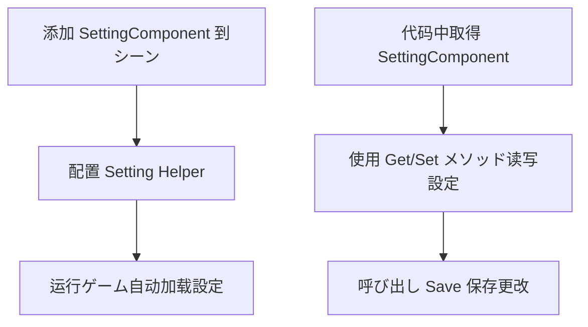

# 快速开始

本指南将帮助您快速上手 GameFrameX Setting 配置コンポーネント，了解如何在 Unity プロジェクト中集成和使用設定機能。

## 概要

SettingComponent 是 GameFrameX フレームワーク的コアコンポーネント，专门に使用管理ゲーム的配置信息。它提供します简洁的 API 来保存和加载各种クラス型的ゲーム設定，包括布尔值、整数、浮点数、字符串以及复杂的自定义对象。

该コンポーネント采用モジュラー設計，を通じて `ISettingHelper` インターフェースサポート不同的存储実装，默认使用 Unity 的 PlayerPrefs，同时サポート扩展自定义存储方法。

## 快速开始フロー



## 在 Unity シーン中添加コンポーネント

### 手順 1：作成 Setting コンポーネント

1. 在 Unity 编辑器中，打开您的ゲームシーン
2. 在 Hierarchy 面板中，作成一个空 GameObject 或选择现有对象
3. 在 Inspector 面板中，点击 **Add Component** 按钮
4. 在搜索框中输入 "Setting"，找到 **GameFrameX/Setting** コンポーネント
5. 点击添加

```csharp
// SettingComponent 将自动添加以下依赖コンポーネント：
// - GameFrameXSettingCroppingHelper (必須)
```
> Source: [SettingComponent.cs](https://github.com/GameFrameX/com.gameframex.unity.setting/blob/main/Runtime/Setting/SettingComponent.cs#L46)

### 手順 2：配置 Setting Helper

SettingComponent 会自动作成 `PlayerPrefsSettingHelper` 作为默认的存储辅助器。您可能在 Inspector 面板中查看和配置：

| プロパティ | クラス型 | 默认值 | 説明 |
|------|------|--------|------|
| Setting Helper Type Name | string | "GameFrameX.Setting.Runtime.PlayerPrefsSettingHelper" | 設定辅助器的クラス型名称 |
| Custom Setting Helper | SettingHelperBase | null | 自定义設定辅助器（可选） |

```csharp
// SettingComponent 在 Awake 中初期化設定助手
private void Awake()
{
    // 取得 SettingManager 模块
    m_SettingManager = GameFrameworkEntry.GetModule<ISettingManager>();
    
    // 作成設定辅助器
    SettingHelperBase settingHelper = Helper.CreateHelper(m_SettingHelperTypeName, m_CustomSettingHelper);
    
    // 設定辅助器
    m_SettingManager.SetSettingHelper(settingHelper);
}
```
> Source: [SettingComponent.cs](https://github.com/GameFrameX/com.gameframex.unity.setting/blob/main/Runtime/Setting/SettingComponent.cs#L73-L98)

## 基本使用示例

### 在代码中取得 SettingComponent

在 Unity ゲーム中，您可能を通じて多种方法取得 SettingComponent：

```csharp
// 方法 1：を通じてシーン中的 GameObject 取得
SettingComponent settingComponent = FindObjectOfType<SettingComponent>();

// 方法 2：如果您使用 GameFrameX 的 MonoBehaviour 方法
// 假设您的クラスを継承自定义的 MonoBehaviour
private SettingComponent settingComponent;

private void Start()
{
    settingComponent = GetComponent<SettingComponent>();
}
```
> Source: [README.md](https://github.com/GameFrameX/com.gameframex.unity.setting/blob/main/README.md#L86-L100)

### 保存和加载設定

SettingComponent 在ゲーム启动时会自动呼び出し `Start()` メソッド加载已保存的設定：

```csharp
// 完整的設定管理示例
public class GameSettingsManager : MonoBehaviour
{
    private SettingComponent settingComponent;

    private void Start()
    {
        // 取得 SettingComponent
        settingComponent = GetComponent<SettingComponent>();
        
        // 設定一些ゲーム配置
        settingComponent.SetBool("IsFullScreen", true);
        settingComponent.SetInt("ResolutionWidth", 1920);
        settingComponent.SetFloat("Volume", 0.8f);
        settingComponent.SetString("PlayerName", "PlayerOne");
        
        // 保存配置
        settingComponent.Save();
    }

    private void OnApplicationPause(bool pauseStatus)
    {
        // 当应用暂停时保存設定（适に使用移动平台）
        if (pauseStatus)
        {
            settingComponent.Save();
        }
    }

    private void OnApplicationQuit()
    {
        // 应用退出时保存設定
        settingComponent.Save();
    }
}
```
> Source: [README.md](https://github.com/GameFrameX/com.gameframex.unity.setting/blob/main/README.md#L86-L100)

### 读取設定值

```csharp
// 检查設定是否存在
bool hasVolumeSetting = settingComponent.HasSetting("Volume");

// 取得設定值，使用默认值防止設定不存在时出错
float volume = settingComponent.GetFloat("Volume", 0.5f);  // 如果不存在，返回 0.5f
bool isFullScreen = settingComponent.GetBool("IsFullScreen", false);  // 默认全屏关闭
int resolutionWidth = settingComponent.GetInt("ResolutionWidth", 1920);  // 默认 1920
string playerName = settingComponent.GetString("PlayerName", "Guest");  // 默认 Guest
```
> Source: [README.md](https://github.com/GameFrameX/com.gameframex.unity.setting/blob/main/README.md#L104-L110)

### 保存和删除設定

```csharp
// 保存所有修改
settingComponent.Save();

// 删除单个設定
settingComponent.RemoveSetting("PlayerName");

// 删除所有設定
settingComponent.RemoveAllSettings();
```
> Source: [README.md](https://github.com/GameFrameX/com.gameframex.unity.setting/blob/main/README.md#L114-L120)

### 保存复杂对象

SettingComponent サポート保存自定义对象，对象会被自动序列化为 JSON：

```csharp
// 定义一个設定クラス
[Serializable]
public class GamePreferences
{
    public bool IsMusicEnabled = true;
    public bool IsSoundEnabled = true;
    public float MusicVolume = 0.7f;
    public float SoundVolume = 0.8f;
    public string Language = "en";
}

// 保存复杂对象
var preferences = new GamePreferences
{
    IsMusicEnabled = true,
    MusicVolume = 0.8f,
    Language = "zh-CN"
};
settingComponent.SetObject("GamePreferences", preferences);

// 读取复杂对象
var loadedPreferences = settingComponent.GetObject<GamePreferences>("GamePreferences", new GamePreferences());
```
> Source: [PlayerPrefsSettingHelper.cs](https://github.com/GameFrameX/com.gameframex.unity.setting/blob/main/Runtime/Setting/PlayerPrefsSettingHelper.cs#L620-L623)

## コンポーネント架构


## 在运行时取得設定

SettingComponent 提供多种数据クラス型的メソッド：

| 数据クラス型 | 读取メソッド | 写入メソッド |
|---------|---------|---------|
| 布尔值 | `GetBool(name)` / `GetBool(name, default)` | `SetBool(name, value)` |
| 整数 | `GetInt(name)` / `GetInt(name, default)` | `SetInt(name, value)` |
| 浮点数 | `GetFloat(name)` / `GetFloat(name, default)` | `SetFloat(name, value)` |
| 字符串 | `GetString(name)` / `GetString(name, default)` | `SetString(name, value)` |
| 对象 | `GetObject<T>(name)` / `GetObject<T>(name, default)` | `SetObject<T>(name, obj)` |

```csharp
// 完整示例：ゲーム設定管理器
public class SettingsManager : MonoBehaviour
{
    private SettingComponent settingComponent;
    
    // 設定键名常量
    private const string KEY_MUSIC_ON = "setting.music.on";
    private const string KEY_MUSIC_VOLUME = "setting.music.volume";
    private const string KEY_GRAPHICS_QUALITY = "setting.graphics.quality";
    private const string KEY_PLAYER_DATA = "player.data";

    private void Awake()
    {
        settingComponent = GetComponent<SettingComponent>();
    }

    // 音乐設定
    public bool MusicEnabled
    {
        get => settingComponent.GetBool(KEY_MUSIC_ON, true);
        set => settingComponent.SetBool(KEY_MUSIC_ON, value);
    }

    public float MusicVolume
    {
        get => settingComponent.GetFloat(KEY_MUSIC_VOLUME, 0.5f);
        set => settingComponent.SetFloat(KEY_MUSIC_VOLUME, Mathf.Clamp01(value));
    }

    // 图形設定
    public int GraphicsQuality
    {
        get => settingComponent.GetInt(KEY_GRAPHICS_QUALITY, 1);
        set => settingComponent.SetInt(KEY_GRAPHICS_QUALITY, value);
    }

    // 保存玩家数据
    public void SavePlayerData(PlayerData data)
    {
        settingComponent.SetObject(KEY_PLAYER_DATA, data);
        settingComponent.Save();
    }

    // 加载玩家数据
    public PlayerData LoadPlayerData()
    {
        return settingComponent.GetObject<PlayerData>(KEY_PLAYER_DATA, new PlayerData());
    }
}
```

## 常见使用シーン

### シーン 1：ゲーム設定界面

```csharp
public class SettingsUI : MonoBehaviour
{
    [SerializeField] private SettingComponent settingComponent;
    [SerializeField] private Slider volumeSlider;
    [SerializeField] private Toggle fullscreenToggle;

    private void Start()
    {
        // 加载现有設定到 UI
        volumeSlider.value = settingComponent.GetFloat("Volume", 0.5f);
        fullscreenToggle.isOn = settingComponent.GetBool("Fullscreen", true);
    }

    public void OnVolumeChanged(float value)
    {
        settingComponent.SetFloat("Volume", value);
        settingComponent.Save();
    }

    public void OnFullscreenChanged(bool value)
    {
        settingComponent.SetBool("Fullscreen", value);
        settingComponent.Save();
    }
}
```

### シーン 2：玩家数据持久化

```csharp
[Serializable]
public class PlayerData
{
    public string playerName;
    public int level;
    public int experience;
    public List<string> achievements;
}

public class PlayerDataManager : MonoBehaviour
{
    private SettingComponent settingComponent;
    private const string KEY = "player.data";

    public void SavePlayer(PlayerData data)
    {
        settingComponent.SetObject(KEY, data);
        bool success = settingComponent.Save();
        Debug.Log($"玩家数据保存{(success ? "成功" : "失败")}");
    }

    public PlayerData LoadPlayer()
    {
        return settingComponent.GetObject<PlayerData>(KEY, new PlayerData());
    }
}
```

## 注意事项

1. **自动加载**：SettingComponent 在 `Start()` メソッド中自动呼び出し `Load()` 加载設定，您无需手动呼び出し。
2. **手动保存**：設定修改后必要呼び出し `Save()` メソッド才能持久化到存储。
3. **平台差异**：在不同平台（如 WebGL 小ゲーム）上，存储行为可能略有不同，具体お願いします参考平台配置文档。
4. **对象序列化**：复杂对象会使用 JSON 序列化，必ずクラス标记为 `[Serializable]`。

## 関連リンク

- [機能特性](./04.features) - 深入了解 Setting アーキテクチャ設計
- [設定辅助器](./05.helper-implementation) - 自定义存储実装
- [平台配置](./06.platforms) - 不同平台的具体配置
- [API 参考](./07.api-reference) - 完整的 API メソッド文档
