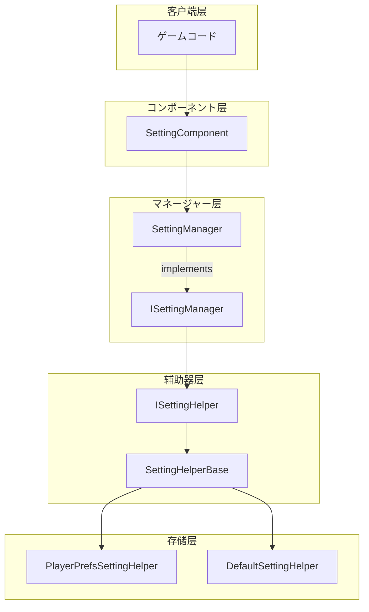

# コアコンセプト

GameFrameX Setting コンポーネントはゲームフレームワークのコアモジュール，の，サポート，ゲームデータ。

## 

Setting コンポーネントアーキテクチャ，と。コア：

1. **のインターフェース**：タイプのメソッド，サポート、、、
2. **の**：をじてサポートの
3. ** Unity のコンポーネント**： MonoBehaviour コンポーネント，ゲームオブジェクト

## アーキテクチャ



### 

|  | コンポーネント |  |
|------|------|------|
| コンポーネント | SettingComponent | Unity コンポーネント， Unity の API |
| マネージャー | SettingManager | ，パラメータ， |
|  | SettingHelperBase | インターフェース，タイプ |
|  | PlayerPrefsSettingHelper / DefaultSettingHelper |  |

## コアコンポーネント

### SettingComponent

SettingComponent はの， GameFrameworkComponent， Unity コンポーネント。

```csharp
[DisallowMultipleComponent]
[RequireComponent(typeof(GameFrameXSettingCroppingHelper))]
[AddComponentMenu("GameFrameX/Setting")]
public sealed class SettingComponent : GameFrameworkComponent
```
> Source: [SettingComponent.cs](https://github.com/GameFrameX/com.gameframex.unity.setting/blob/main/Runtime/Setting/SettingComponent.cs#L43-L47)

****： Unity の，SettingComponent に `Awake()`  SettingManager，に `Start()` ロードデータ。

### ISettingManager

ISettingManager たのコアインターフェース，とデータの。

```csharp
public interface ISettingManager
{
    int Count { get; }
    void SetSettingHelper(ISettingHelper settingHelper);
    bool Load();
    bool Save();
    // ... 读写メソッド
}
```
> Source: [ISettingManager.cs](https://github.com/GameFrameX/com.gameframex.unity.setting/blob/main/Runtime/Setting/Setting/ISettingManager.cs#L42-L342)

****：マネージャーのインターフェース，コンポーネント。

### SettingManager

SettingManager は ISettingManager のクラス， GameFrameworkModule。

```csharp
public sealed class SettingManager : GameFrameworkModule, ISettingManager
{
    private ISettingHelper m_SettingHelper;
    // ... 实现 ISettingManager インターフェース
}
```
> Source: [SettingManager.cs](https://github.com/GameFrameX/com.gameframex.unity.setting/blob/main/Runtime/Setting/Setting/SettingManager.cs#L43-L736)

****：
-  GameFrameworkModule  GameFrameX フレームワーク
- メソッドむとパラメータ
- をじて GameFrameworkException 

### ISettingHelper / SettingHelperBase

ISettingHelper はのインターフェース，SettingHelperBase はクラス。

```csharp
public interface ISettingHelper
{
    int Count { get; }
    bool Load();
    bool Save();
    // ... 存储操作メソッド
}

public abstract class SettingHelperBase : MonoBehaviour, ISettingHelper
{
    // ... 抽象メソッド定义
}
```
> Source: [ISettingHelper.cs](https://github.com/GameFrameX/com.gameframex.unity.setting/blob/main/Runtime/Setting/Setting/ISettingHelper.cs#L42-L332)
> Source: [SettingHelperBase.cs](https://github.com/GameFrameX/com.gameframex.unity.setting/blob/main/Runtime/Setting/SettingHelperBase.cs#L43-L333)

****：
-  MonoBehaviour  GameObject
- メソッドクラスの

### 

#### PlayerPrefsSettingHelper

にづく Unity PlayerPrefs の，に Unity プロジェクト。

```csharp
public class PlayerPrefsSettingHelper : SettingHelperBase
{
    // 使用 Unity PlayerPrefs API
    public override bool Save()
    {
#if UNITY_WEBGL && (ENABLE_DOUYIN_MINI_GAME || ENABLE_WECHAT_MINI_GAME || ENABLE_KUAISHOU_MINI_GAME)
        return true;  // 小ゲームプラットフォーム不做实际保存
#else
        UnityEngine.PlayerPrefs.Save();
        return true;
#endif
    }
}
```
> Source: [PlayerPrefsSettingHelper.cs](https://github.com/GameFrameX/com.gameframex.unity.setting/blob/main/Runtime/Setting/PlayerPrefsSettingHelper.cs#L43-L638)

**プラットフォーム**：
- **エディター/Standalone**： Unity PlayerPrefs
- **//ゲーム**：プラットフォーム API

#### DefaultSettingHelper

にづくローカルファイルの，サポート。

```csharp
public class DefaultSettingHelper : SettingHelperBase
{
    private const string SettingFileName = "GameFrameworkSetting.dat";
    private string m_FilePath = null;
    private DefaultSetting m_Settings = null;
}
```
> Source: [DefaultSettingHelper.cs](https://github.com/GameFrameX/com.gameframex.unity.setting/blob/main/Runtime/Setting/DefaultSettingHelper.cs#L46-L52)

****：
- パス：`Application.persistentDataPath/GameFrameworkSetting.dat`
- サポート `GetAllSettingNames()` メソッド
- 

### DefaultSetting

のデータ， SortedDictionary 。

```csharp
public sealed class DefaultSetting
{
    private readonly SortedDictionary<string, string> m_Settings = new SortedDictionary<string, string>(StringComparer.Ordinal);
}
```
> Source: [DefaultSetting.cs](https://github.com/GameFrameX/com.gameframex.unity.setting/blob/main/Runtime/Setting/DefaultSetting.cs#L47-L49)

## データタイプサポート

Setting コンポーネントサポートデータタイプの：

| タイプ | メソッド | メソッド |  |
|------|----------|----------|------|
|  | GetBool / GetBool(name, default) | SetBool |  0/1 |
|  | GetInt / GetInt(name, default) | SetInt | サポート int  |
|  | GetFloat / GetFloat(name, default) | SetFloat |  InvariantCulture  |
|  | GetString / GetString(name, default) | SetString |  |
|  | `GetObject<T>` / GetObject | `SetObject<T>` | JSON  |

## フロー


## 

### ： SettingComponent

```csharp
// 获取 SettingComponent コンポーネント
var settingComponent = UnityEngine.Object.FindObjectOfType<SettingComponent>();

// 保存設定
settingComponent.SetBool("IsFullScreen", true);
settingComponent.SetInt("ResolutionWidth", 1920);
settingComponent.SetFloat("Volume", 0.8f);
settingComponent.SetString("PlayerName", "PlayerOne");
settingComponent.Save();

// 读取設定（带デフォルト值）
bool isFullScreen = settingComponent.GetBool("IsFullScreen", false);
int resolution = settingComponent.GetInt("ResolutionWidth", 1280);
float volume = settingComponent.GetFloat("Volume", 0.5f);
string playerName = settingComponent.GetString("PlayerName", "Guest");
```
> Source: [README.md](https://github.com/GameFrameX/com.gameframex.unity.setting/blob/main/README.md#L85-L100)

### ：カスタマイズ

```csharp
// 继承 SettingHelperBase 实现カスタマイズ存储
public class CustomSettingHelper : SettingHelperBase
{
    public override int Count => /* 实现计数 */;
    public override bool Load() { /* 实现ロード */ }
    public override bool Save() { /* 实现保存 */ }
    // ... 实现其他抽象メソッド
}
```

に Unity エディター：
1.  SettingComponent の GameObject
2.  Setting Helper Type Name カスタマイズクラス
3. カスタマイズ Helper コンポーネント

## プラットフォームサポート

| プラットフォーム | PlayerPrefsSettingHelper | DefaultSettingHelper |
|------|--------------------------|----------------------|
| Unity Editor | ✅ | ✅ |
| Windows/Mac/Linux | ✅ | ✅ |
| iOS | ✅ | ✅ |
| Android | ✅ | ✅ |
| WebGL (ゲーム) | ✅ (プラットフォーム) | ✅ |
| WebGL (ゲーム) | ✅ (プラットフォーム) | ✅ |
| WebGL (ゲーム) | ✅ (プラットフォーム) | ✅ |

## リンク

- [](./05.helper-implementation) - カスタマイズガイド
- [プラットフォーム](./06.platforms) - プラットフォーム
- [API リファレンス](./07.api-reference) - の API ドキュメント
- [よくある](./08.troubleshooting) - よくあると
