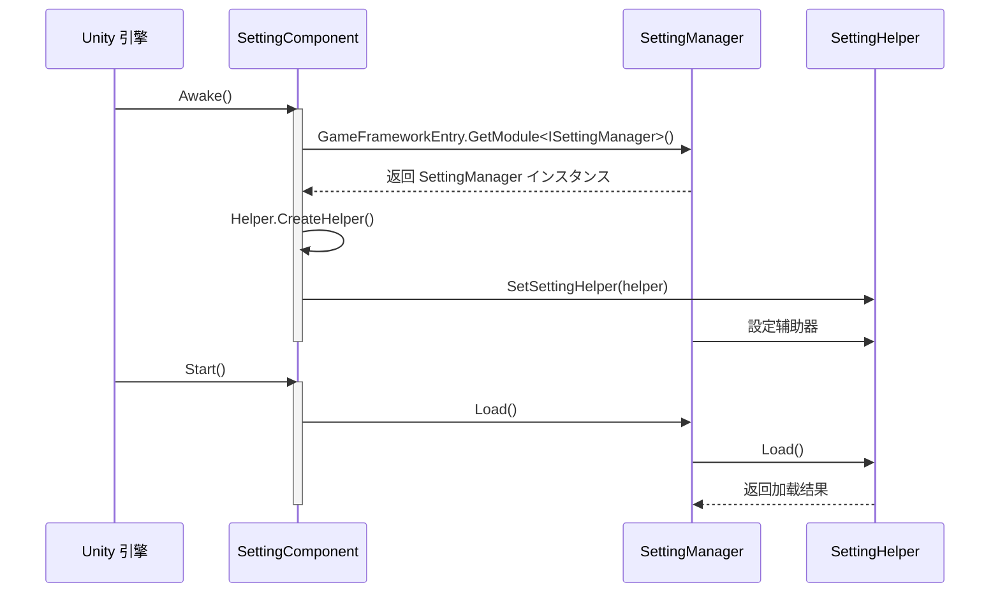

# コア概念

GameFrameX Setting 配置コンポーネント是ゲームフレームワーク的コア模块之一，提供统一的配置管理抽象层，サポート多种存储后端，帮助開発者高效管理ゲーム配置数据。

## 概要

Setting コンポーネント采用分层アーキテクチャ設計，将业务逻辑与存储実装解耦。コア设计理念包括：

1. **统一的配置インターフェース**：提供クラス型安全的配置读写メソッド，サポート布尔、整数、浮点、字符串及复杂对象
2. **可插拔的存储后端**：を通じて策略模式サポート不同的存储実装
3. **面向 Unity 的コンポーネント化**：作为 MonoBehaviour コンポーネント，可直接挂载到ゲーム对象上

## アーキテクチャ設計


### 各层职责

| 层级 | コンポーネント | 职责 |
|------|------|------|
| コンポーネント层 | SettingComponent | Unity コンポーネントエントリーポイント，提供面向 Unity 的 API |
| 管理器层 | SettingManager | 业务逻辑处理，参数校验，異常管理 |
| 辅助器层 | SettingHelperBase | 定义存储インターフェース抽象，実装クラス型转换 |
| 存储层 | PlayerPrefsSettingHelper / DefaultSettingHelper | 具体存储実装 |

## コアコンポーネント

### SettingComponent

SettingComponent 是整个系统的エントリーポイント点，を継承 GameFrameworkComponent，作为 Unity コンポーネント使用。

```csharp
[DisallowMultipleComponent]
[RequireComponent(typeof(GameFrameXSettingCroppingHelper))]
[AddComponentMenu("GameFrameX/Setting")]
public sealed class SettingComponent : GameFrameworkComponent
```
> Source: [SettingComponent.cs](https://github.com/GameFrameX/com.gameframex.unity.setting/blob/main/Runtime/Setting/SettingComponent.cs#L43-L47)

**设计意图**：作为 Unity 生态的エントリーポイント点，SettingComponent 在 `Awake()` 中初期化 SettingManager，在 `Start()` 中加载配置数据。

### ISettingManager

ISettingManager 定义了配置管理的コアインターフェース，负责业务逻辑层与数据访问层的解耦。

```csharp
public interface ISettingManager
{
    int Count { get; }
    void SetSettingHelper(ISettingHelper settingHelper);
    bool Load();
    bool Save();
    // ... 读写メソッド
}
```
> Source: [ISettingManager.cs](https://github.com/GameFrameX/com.gameframex.unity.setting/blob/main/Runtime/Setting/Setting/ISettingManager.cs#L42-L342)

**设计意图**：定义配置管理器的标准インターフェース，使得上层コンポーネント无需关心具体実装细节。

### SettingManager

SettingManager 是 ISettingManager 的実装クラス，を継承 GameFrameworkModule。

```csharp
public sealed class SettingManager : GameFrameworkModule, ISettingManager
{
    private ISettingHelper m_SettingHelper;
    // ... 実装 ISettingManager インターフェース
}
```
> Source: [SettingManager.cs](https://github.com/GameFrameX/com.gameframex.unity.setting/blob/main/Runtime/Setting/Setting/SettingManager.cs#L43-L736)

**设计意图**：
- 继承 GameFrameworkModule 融入 GameFrameX フレームワーク生命周期
- 所有メソッド都包含空值检查和参数校验
- 異常信息统一を通じて GameFrameworkException 抛出

### ISettingHelper / SettingHelperBase

ISettingHelper 是存储后端的抽象インターフェース，SettingHelperBase 是其抽象基底クラス。

```csharp
public interface ISettingHelper
{
    int Count { get; }
    bool Load();
    bool Save();
    // ... 存储操作メソッド
}

public abstract class SettingHelperBase : MonoBehaviour, ISettingHelper
{
    // ... 抽象メソッド定义
}
```
> Source: [ISettingHelper.cs](https://github.com/GameFrameX/com.gameframex.unity.setting/blob/main/Runtime/Setting/Setting/ISettingHelper.cs#L42-L332)
> Source: [SettingHelperBase.cs](https://github.com/GameFrameX/com.gameframex.unity.setting/blob/main/Runtime/Setting/SettingHelperBase.cs#L43-L333)

**设计意图**：
- 继承 MonoBehaviour 使其可能挂载到 GameObject
- 抽象メソッド要求サブクラス実装具体的存储逻辑

### 存储后端実装

#### PlayerPrefsSettingHelper

基づく Unity PlayerPrefs 的実装，适に使用大多数 Unity プロジェクト。

```csharp
public class PlayerPrefsSettingHelper : SettingHelperBase
{
    // 使用 Unity PlayerPrefs API
    public override bool Save()
    {
#if UNITY_WEBGL && (ENABLE_DOUYIN_MINI_GAME || ENABLE_WECHAT_MINI_GAME || ENABLE_KUAISHOU_MINI_GAME)
        return true;  // 小ゲーム平台不做实际保存
#else
        UnityEngine.PlayerPrefs.Save();
        return true;
#endif
    }
}
```
> Source: [PlayerPrefsSettingHelper.cs](https://github.com/GameFrameX/com.gameframex.unity.setting/blob/main/Runtime/Setting/PlayerPrefsSettingHelper.cs#L43-L638)

**平台适配**：
- **编辑器/Standalone**：使用 Unity PlayerPrefs
- **抖音/微信/快手小ゲーム**：使用各平台原生存储 API

#### DefaultSettingHelper

基づく本地ファイル的実装，サポート取得配置项列表。

```csharp
public class DefaultSettingHelper : SettingHelperBase
{
    private const string SettingFileName = "GameFrameworkSetting.dat";
    private string m_FilePath = null;
    private DefaultSetting m_Settings = null;
}
```
> Source: [DefaultSettingHelper.cs](https://github.com/GameFrameX/com.gameframex.unity.setting/blob/main/Runtime/Setting/DefaultSettingHelper.cs#L46-L52)

**特点**：
- 存储路径：`Application.persistentDataPath/GameFrameworkSetting.dat`
- サポート `GetAllSettingNames()` メソッド
- 使用二进制序列化

### DefaultSetting

内存中的配置数据结构，使用 SortedDictionary 存储。

```csharp
public sealed class DefaultSetting
{
    private readonly SortedDictionary<string, string> m_Settings = new SortedDictionary<string, string>(StringComparer.Ordinal);
}
```
> Source: [DefaultSetting.cs](https://github.com/GameFrameX/com.gameframex.unity.setting/blob/main/Runtime/Setting/DefaultSetting.cs#L47-L49)

## 数据クラス型サポート

Setting コンポーネントサポート多种数据クラス型的配置存储：

| クラス型 | 读取メソッド | 写入メソッド | 説明 |
|------|----------|----------|------|
| 布尔值 | GetBool / GetBool(name, default) | SetBool | 内部存储为 0/1 |
| 整数 | GetInt / GetInt(name, default) | SetInt | サポート int 范围 |
| 浮点数 | GetFloat / GetFloat(name, default) | SetFloat | 使用 InvariantCulture 序列化 |
| 字符串 | GetString / GetString(name, default) | SetString | 直接存储 |
| 对象 | GetObject<T> / GetObject | SetObject<T> | JSON 序列化存储 |

## 初期化フロー



## 使用模式

### 基础模式：使用 SettingComponent

```csharp
// 取得 SettingComponent コンポーネント
var settingComponent = UnityEngine.Object.FindObjectOfType<SettingComponent>();

// 保存設定
settingComponent.SetBool("IsFullScreen", true);
settingComponent.SetInt("ResolutionWidth", 1920);
settingComponent.SetFloat("Volume", 0.8f);
settingComponent.SetString("PlayerName", "PlayerOne");
settingComponent.Save();

// 读取設定（带默认值）
bool isFullScreen = settingComponent.GetBool("IsFullScreen", false);
int resolution = settingComponent.GetInt("ResolutionWidth", 1280);
float volume = settingComponent.GetFloat("Volume", 0.5f);
string playerName = settingComponent.GetString("PlayerName", "Guest");
```
> Source: [README.md](https://github.com/GameFrameX/com.gameframex.unity.setting/blob/main/README.md#L85-L100)

### 进阶模式：自定义存储后端

```csharp
// 继承 SettingHelperBase 実装自定义存储
public class CustomSettingHelper : SettingHelperBase
{
    public override int Count => /* 実装计数 */;
    public override bool Load() { /* 実装加载 */ }
    public override bool Save() { /* 実装保存 */ }
    // ... 実装其他抽象メソッド
}
```

然后在 Unity 编辑器中設定：
1. 作成带有 SettingComponent 的 GameObject
2. 設定 Setting Helper Type Name 为自定义クラス名
3. 或直接挂载自定义 Helper コンポーネント

## プラットフォーム対応

| 平台 | PlayerPrefsSettingHelper | DefaultSettingHelper |
|------|--------------------------|----------------------|
| Unity Editor | ✅ | ✅ |
| Windows/Mac/Linux | ✅ | ✅ |
| iOS | ✅ | ✅ |
| Android | ✅ | ✅ |
| WebGL (抖音小ゲーム) | ✅ (平台适配) | ✅ |
| WebGL (微信小ゲーム) | ✅ (平台适配) | ✅ |
| WebGL (快手小ゲーム) | ✅ (平台适配) | ✅ |

## 関連リンク

- [設定辅助器実装](./05.helper-implementation) - 自定义辅助器指南
- [平台配置](./06.platforms) - 各平台特定配置
- [API 参考](./07.api-reference) - 完整的 API 文档
- [常见问题](./08.troubleshooting) - 常见问题与解決策
