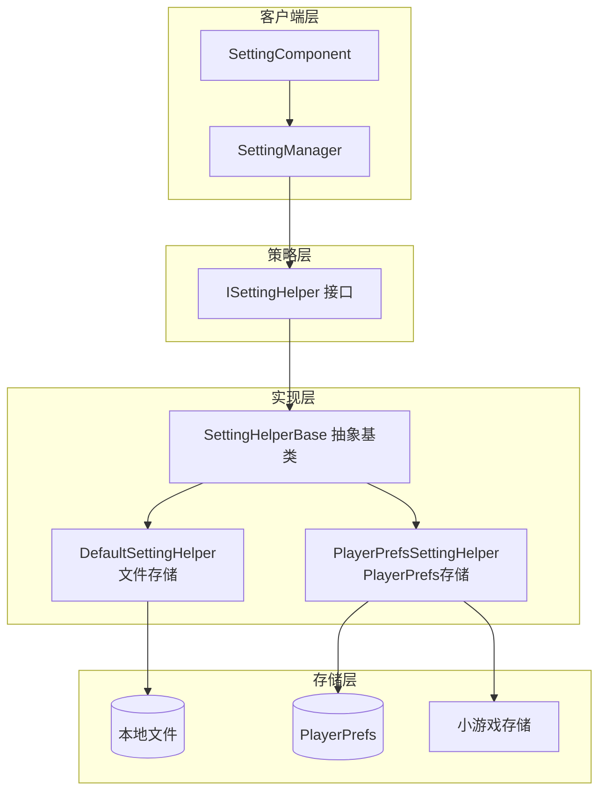

# 設定辅助器

設定辅助器（Setting Helper）是 GameFrameX 設定モジュール的コアコンポーネント，负责游戏設定的底层存储和读取操作。通过ストラテジーパターン設計，系统サポート多种存储后端，開発者〜できます根据プロジェクト需求选择合适的存储実装。

## 概要

設定辅助器是 `ISettingHelper` インターフェース的各种実装，负责将游戏設定数据持久化到不同的存储介质。该系统采用ストラテジーパターン，使得存储実装〜できます柔軟切换而无需変更上层业务逻辑。

**設計意图**：将設定存储的底层実装与业务层分离，允许在不変更业务コード的情况下切换存储方法（如从ファイル存储切换到 PlayerPrefs），同時にサポート针对不同プラットフォーム（Unity 原生、WebGL、ミニゲーム）的定制化存储実装。



### コアコンポーネント説明

| コンポーネント | 职责 | 适用シーン |
|------|------|----------|
| `ISettingHelper` | 定義設定存储的統一されたインターフェース | 統一された API 规范 |
| `SettingHelperBase` | 提供抽象基底クラス，実装 MonoBehaviour ライフサイクル | 拡張新存储方法 |
| `DefaultSettingHelper` | 基于本地ファイル的二进制シリアライズ存储 | 〜する必要があります完全な数据控制权 |
| `PlayerPrefsSettingHelper` | 基于 Unity PlayerPrefs 的键值存储 | シンプル設定、快速原型 |

## 内置辅助器実装

### DefaultSettingHelper（ファイル存储辅助器）

`DefaultSettingHelper` 将游戏設定存储为本地二进制ファイル，使用自定義シリアライズフォーマット。该実装提供します完全な的数据控制权，サポート取得所有設定项名称、统计数量等高级機能。

**存储位置**：`<persistentDataPath>/GameFrameworkSetting.dat`

> Source: [DefaultSettingHelper.cs](https://github.com/GameFrameX/com.gameframex.unity.setting/blob/main/Runtime/Setting/DefaultSettingHelper.cs#L46-L529)

```csharp
public class DefaultSettingHelper : SettingHelperBase
{
    private const string SettingFileName = "GameFrameworkSetting.dat";
    private string m_FilePath = null;
    private DefaultSetting m_Settings = null;
    private DefaultSettingSerializer m_Serializer = null;

    private void Awake()
    {
        m_FilePath = Utility.Path.GetRegularPath(Path.Combine(Application.persistentDataPath, SettingFileName));
        m_Settings = new DefaultSetting();
        m_Serializer = new DefaultSettingSerializer();
        m_Serializer.RegisterSerializeCallback(0, SerializeDefaultSettingCallback);
        m_Serializer.RegisterDeserializeCallback(0, DeserializeDefaultSettingCallback);
    }
}
```

**特点**：
- 存储路径可预测，便于ファイル管理和备份
- サポート完全な的設定列挙型和计数機能
- 二进制シリアライズ，ファイル体积紧凑
- サポート自定義シリアライズ器拡張

### PlayerPrefsSettingHelper（PlayerPrefs 存储辅助器）

`PlayerPrefsSettingHelper` 基于 Unity 的 PlayerPrefs 実装，同時に针对 WebGL ミニゲームプラットフォーム（抖音、微信、快手）提供しますプラットフォーム特定的存储适配。

> Source: [PlayerPrefsSettingHelper.cs](https://github.com/GameFrameX/com.gameframex.unity.setting/blob/main/Runtime/Setting/PlayerPrefsSettingHelper.cs#L43-L638)

```csharp
public class PlayerPrefsSettingHelper : SettingHelperBase
{
    // 平台判断示例：检查是否存在指定配置项
    public override bool HasSetting(string settingName)
    {
#if UNITY_EDITOR
        return UnityEngine.PlayerPrefs.HasKey(settingName);
#endif
#if UNITY_WEBGL && ENABLE_DOUYIN_MINI_GAME
        return TTSDK.TTStorage.HasKeySync(settingName);
#elif UNITY_WEBGL && ENABLE_WECHAT_MINI_GAME
        return WeChatWASM.WXSDKManagerHandler.Instance.StorageHasKeySync(settingName);
#elif UNITY_WEBGL && ENABLE_KUAISHOU_MINI_GAME
        return KSWASM.KSBase.StorageHasKeySync(settingName);
#else
        return UnityEngine.PlayerPrefs.HasKey(settingName);
#endif
    }
}
```

**サポート的プラットフォーム存储**：

| プラットフォーム | 存储実装 | 特殊処理 |
|------|----------|----------|
| Unity Editor | PlayerPrefs | 標準実装 |
| Unity Standalone | PlayerPrefs | 標準実装 |
| Unity WebGL (原生) | PlayerPrefs | 標準実装 |
| DouYinミニゲーム | TTStorage | 同步 API |
| WeChatミニゲーム | WXStorage | 同步 API |
| KuaiShouミニゲーム | KSStorage | 同步 API |

**注意事项**：
- `Count` プロパティ始终返す `-1`（PlayerPrefs 不サポート计数）
- `GetAllSettingNames()` 不サポート，返す `null` 并输出警告
- WebGL ミニゲームプラットフォーム Save() メソッド为空操作（ミニゲーム自动保存）

## 辅助器基底クラス

`SettingHelperBase` 是所有設定辅助器的抽象基底クラス，継承自 `MonoBehaviour`，提供統一された的ライフサイクル管理和インターフェース定義。

> Source: [SettingHelperBase.cs](https://github.com/GameFrameX/com.gameframex.unity.setting/blob/main/Runtime/Setting/SettingHelperBase.cs#L43-L333)

### 抽象メソッド清单

| メソッド | 説明 |
|------|------|
| `Count` | 取得設定项数量 |
| `Load()` | ロード設定 |
| `Save()` | 保存設定 |
| `GetAllSettingNames()` | 取得所有設定项名称 |
| `HasSetting(name)` | 確認設定项是否存在 |
| `RemoveSetting(name)` | 移除指定設定项 |
| `RemoveAllSettings()` | 清空所有設定 |
| `GetBool/SetBool` | 布尔值读写 |
| `GetInt/SetInt` | 整数值读写 |
| `GetFloat/SetFloat` | 浮点数值读写 |
| `GetString/SetString` | 字符串读写 |
| `GetObject/SetObject` | 对象シリアライズ读写 |

## 作成自定義辅助器

要作成自定義設定辅助器，〜する必要があります継承 `SettingHelperBase` 并実装所有抽象メソッド。

```csharp
using GameFrameX.Setting.Runtime;
using UnityEngine;

public class CustomSettingHelper : SettingHelperBase
{
    // 自定义存储实现
    private Dictionary<string, string> _storage = new Dictionary<string, string>();

    public override int Count => _storage.Count;

    public override bool Load()
    {
        // 从自定义存储加载数据
        return true;
    }

    public override bool Save()
    {
        // 保存数据到自定义存储
        return true;
    }

    public override string[] GetAllSettingNames()
    {
        return _storage.Keys.ToArray();
    }

    public override bool HasSetting(string settingName)
    {
        return _storage.ContainsKey(settingName);
    }

    public override bool RemoveSetting(string settingName)
    {
        return _storage.Remove(settingName);
    }

    public override void RemoveAllSettings()
    {
        _storage.Clear();
    }

    // 实现所有 Get/Set 方法...
    // Bool, Int, Float, String, Object 的读写实现
}
```

> Source: [SettingHelperBase.cs](https://github.com/GameFrameX/com.gameframex.unity.setting/blob/main/Runtime/Setting/SettingHelperBase.cs)

## 辅助器选择設定

在 Unity エディタ中，〜できます通过 SettingComponent 选择使用哪个辅助器：

1. 在シーン中追加 `SettingComponent`（GameFrameX/Setting メニュー）
2. 在 Inspector 中変更 `Setting Helper Type Name`
3. 或拖入自定義辅助器到 `Custom Setting Helper` フィールド

```csharp
// SettingComponent 中的辅助器创建逻辑
private void Awake()
{
    // ... 初始化代码 ...
    
    SettingHelperBase settingHelper = Helper.CreateHelper(m_SettingHelperTypeName, m_CustomSettingHelper);
    m_SettingManager.SetSettingHelper(settingHelper);
}
```

> Source: [SettingComponent.cs](https://github.com/GameFrameX/com.gameframex.unity.setting/blob/main/Runtime/Setting/SettingComponent.cs#L85-L97)

## シリアライズ机制

### DefaultSetting 内部数据结构

`DefaultSetting` 使用 `SortedDictionary<string, string>` 存储所有設定项，将所有值統一された转换为字符串进行存储。

> Source: [DefaultSetting.cs](https://github.com/GameFrameX/com.gameframex.unity.setting/blob/main/Runtime/Setting/DefaultSetting.cs#L47-L400)

```csharp
public sealed class DefaultSetting
{
    private readonly SortedDictionary<string, string> m_Settings = new SortedDictionary<string, string>(StringComparer.Ordinal);

    public void Serialize(Stream stream)
    {
        using (BinaryWriter binaryWriter = new BinaryWriter(stream, Encoding.UTF8))
        {
            binaryWriter.Write7BitEncodedInt32(m_Settings.Count);
            foreach (KeyValuePair<string, string> setting in m_Settings)
            {
                binaryWriter.Write(setting.Key);
                binaryWriter.Write(setting.Value);
            }
        }
    }
}
```

### DefaultSettingSerializer ファイルフォーマット

存储ファイル使用二进制フォーマット，パッケージ含以下部分：
- **ファイル头**：`GFS` 三个字节（用于フォーマット识别）
- **バージョン号**：7 位压缩整型
- **数据**：键值对列表

> Source: [DefaultSettingSerializer.cs](https://github.com/GameFrameX/com.gameframex.unity.setting/blob/main/Runtime/Setting/DefaultSettingSerializer.cs#L43-L66)

```csharp
public sealed class DefaultSettingSerializer : GameFrameworkSerializer<DefaultSetting>
{
    private static readonly byte[] Header = new byte[] { (byte)'G', (byte)'F', (byte)'S' };

    protected override byte[] GetHeader()
    {
        return Header;
    }
}
```

## プラットフォーム差异对比

| 機能 | DefaultSettingHelper | PlayerPrefsSettingHelper |
|------|---------------------|------------------------|
| 存储位置 | persistentDataPath/dat ファイル | PlayerPrefs 登録表 |
| Count プロパティ | ✅ 实际数量 | ❌ 始终返す -1 |
| GetAllSettingNames | ✅ サポート | ❌ 返す null |
| 跨プラットフォーム一致性 | 需自行処理 | 自动适配 |
| ファイル可移植性 | ✅ 可复制移动 | ❌ 与设备绑定 |
| 数据容量 | 无明显限制 | 约 1MB お勧め上限 |

## 関連リンク

- [機能特性](./04.features) - 設定モジュールコアコンセプト详解
- [プラットフォーム設定](./06.platforms) - 各プラットフォーム設定説明
- [API リファレンス](./07.api-reference) - 設定マネージャー完全な API ドキュメント
