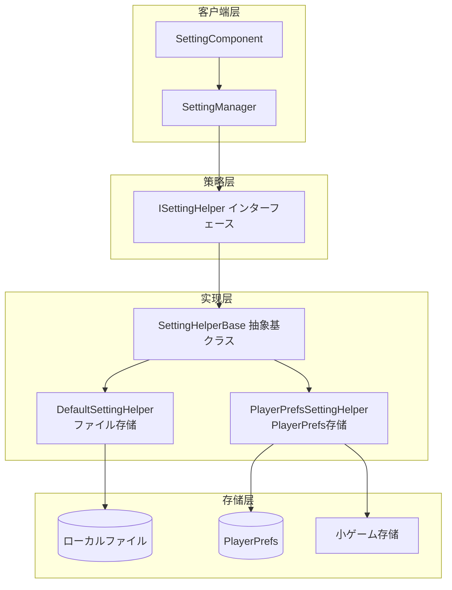

# 

（Setting Helper）は GameFrameX モジュールのコアコンポーネント，ゲームのと。をじて，サポート，プロジェクトの。

## 

は `ISettingHelper` インターフェースの，ゲームデータの。，。

****：のと，にコードの（ファイル PlayerPrefs），サポートプラットフォーム（Unity 、WebGL、ゲーム）の。



### コアコンポーネント

| コンポーネント |  |  |
|------|------|----------|
| `ISettingHelper` | のインターフェース |  API  |
| `SettingHelperBase` | クラス， MonoBehaviour  |  |
| `DefaultSettingHelper` | にづくローカルファイルの | データ |
| `PlayerPrefsSettingHelper` | にづく Unity PlayerPrefs の | シンプル、 |

## 

### DefaultSettingHelper（ファイル）

`DefaultSettingHelper` ゲームローカルファイル，カスタマイズ。たのデータ，サポート、。

****：`<persistentDataPath>/GameFrameworkSetting.dat`

> Source: [DefaultSettingHelper.cs](https://github.com/GameFrameX/com.gameframex.unity.setting/blob/main/Runtime/Setting/DefaultSettingHelper.cs#L46-L529)

```csharp
public class DefaultSettingHelper : SettingHelperBase
{
    private const string SettingFileName = "GameFrameworkSetting.dat";
    private string m_FilePath = null;
    private DefaultSetting m_Settings = null;
    private DefaultSettingSerializer m_Serializer = null;

    private void Awake()
    {
        m_FilePath = Utility.Path.GetRegularPath(Path.Combine(Application.persistentDataPath, SettingFileName));
        m_Settings = new DefaultSetting();
        m_Serializer = new DefaultSettingSerializer();
        m_Serializer.RegisterSerializeCallback(0, SerializeDefaultSettingCallback);
        m_Serializer.RegisterDeserializeCallback(0, DeserializeDefaultSettingCallback);
    }
}
```

****：
- パス，ファイルと
- サポートのと
- ，ファイル
- サポートカスタマイズ

### PlayerPrefsSettingHelper（PlayerPrefs ）

`PlayerPrefsSettingHelper` にづく Unity の PlayerPrefs ， WebGL ゲームプラットフォーム（、、）たプラットフォームの。

> Source: [PlayerPrefsSettingHelper.cs](https://github.com/GameFrameX/com.gameframex.unity.setting/blob/main/Runtime/Setting/PlayerPrefsSettingHelper.cs#L43-L638)

```csharp
public class PlayerPrefsSettingHelper : SettingHelperBase
{
    // プラットフォーム判断例：检查は否存に指定設定项
    public override bool HasSetting(string settingName)
    {
#if UNITY_EDITOR
        return UnityEngine.PlayerPrefs.HasKey(settingName);
#endif
#if UNITY_WEBGL && ENABLE_DOUYIN_MINI_GAME
        return TTSDK.TTStorage.HasKeySync(settingName);
#elif UNITY_WEBGL && ENABLE_WECHAT_MINI_GAME
        return WeChatWASM.WXSDKManagerHandler.Instance.StorageHasKeySync(settingName);
#elif UNITY_WEBGL && ENABLE_KUAISHOU_MINI_GAME
        return KSWASM.KSBase.StorageHasKeySync(settingName);
#else
        return UnityEngine.PlayerPrefs.HasKey(settingName);
#endif
    }
}
```

**サポートのプラットフォーム**：

| プラットフォーム |  |  |
|------|----------|----------|
| Unity Editor | PlayerPrefs |  |
| Unity Standalone | PlayerPrefs |  |
| Unity WebGL () | PlayerPrefs |  |
| ゲーム | TTStorage |  API |
| ゲーム | WXStorage |  API |
| ゲーム | KSStorage |  API |

****：
- `Count` プロパティす `-1`（PlayerPrefs サポート）
- `GetAllSettingNames()` サポート，す `null` 
- WebGL ゲームプラットフォーム Save() メソッド（ゲーム）

## クラス

`SettingHelperBase` はのクラス， `MonoBehaviour`，のとインターフェース。

> Source: [SettingHelperBase.cs](https://github.com/GameFrameX/com.gameframex.unity.setting/blob/main/Runtime/Setting/SettingHelperBase.cs#L43-L333)

### メソッド

| メソッド |  |
|------|------|
| `Count` |  |
| `Load()` | ロード |
| `Save()` |  |
| `GetAllSettingNames()` |  |
| `HasSetting(name)` | はに |
| `RemoveSetting(name)` |  |
| `RemoveAllSettings()` |  |
| `GetBool/SetBool` |  |
| `GetInt/SetInt` |  |
| `GetFloat/SetFloat` |  |
| `GetString/SetString` |  |
| `GetObject/SetObject` |  |

## カスタマイズ

カスタマイズ， `SettingHelperBase` メソッド。

```csharp
using GameFrameX.Setting.Runtime;
using UnityEngine;

public class CustomSettingHelper : SettingHelperBase
{
    // カスタマイズ存储实现
    private Dictionary<string, string> _storage = new Dictionary<string, string>();

    public override int Count => _storage.Count;

    public override bool Load()
    {
        // 从カスタマイズ存储ロードデータ
        return true;
    }

    public override bool Save()
    {
        // 保存データ到カスタマイズ存储
        return true;
    }

    public override string[] GetAllSettingNames()
    {
        return _storage.Keys.ToArray();
    }

    public override bool HasSetting(string settingName)
    {
        return _storage.ContainsKey(settingName);
    }

    public override bool RemoveSetting(string settingName)
    {
        return _storage.Remove(settingName);
    }

    public override void RemoveAllSettings()
    {
        _storage.Clear();
    }

    // 实现所有 Get/Set メソッド...
    // Bool, Int, Float, String, Object の读写实现
}
```

> Source: [SettingHelperBase.cs](https://github.com/GameFrameX/com.gameframex.unity.setting/blob/main/Runtime/Setting/SettingHelperBase.cs)

## 

に Unity エディター，をじて SettingComponent ：

1. に `SettingComponent`（GameFrameX/Setting ）
2. に Inspector  `Setting Helper Type Name`
3. カスタマイズ `Custom Setting Helper` 

```csharp
// SettingComponent 中の辅助器作成逻辑
private void Awake()
{
    // ... 初始化コード ...
    
    SettingHelperBase settingHelper = Helper.CreateHelper(m_SettingHelperTypeName, m_CustomSettingHelper);
    m_SettingManager.SetSettingHelper(settingHelper);
}
```

> Source: [SettingComponent.cs](https://github.com/GameFrameX/com.gameframex.unity.setting/blob/main/Runtime/Setting/SettingComponent.cs#L85-L97)

## 

### DefaultSetting データ

`DefaultSetting`  `SortedDictionary<string, string>` ，。

> Source: [DefaultSetting.cs](https://github.com/GameFrameX/com.gameframex.unity.setting/blob/main/Runtime/Setting/DefaultSetting.cs#L47-L400)

```csharp
public sealed class DefaultSetting
{
    private readonly SortedDictionary<string, string> m_Settings = new SortedDictionary<string, string>(StringComparer.Ordinal);

    public void Serialize(Stream stream)
    {
        using (BinaryWriter binaryWriter = new BinaryWriter(stream, Encoding.UTF8))
        {
            binaryWriter.Write7BitEncodedInt32(m_Settings.Count);
            foreach (KeyValuePair<string, string> setting in m_Settings)
            {
                binaryWriter.Write(setting.Key);
                binaryWriter.Write(setting.Value);
            }
        }
    }
}
```

### DefaultSettingSerializer ファイル

ファイル，む：
- **ファイル**：`GFS` （に）
- **バージョン**：7 
- **データ**：

> Source: [DefaultSettingSerializer.cs](https://github.com/GameFrameX/com.gameframex.unity.setting/blob/main/Runtime/Setting/DefaultSettingSerializer.cs#L43-L66)

```csharp
public sealed class DefaultSettingSerializer : GameFrameworkSerializer<DefaultSetting>
{
    private static readonly byte[] Header = new byte[] { (byte)'G', (byte)'F', (byte)'S' };

    protected override byte[] GetHeader()
    {
        return Header;
    }
}
```

## プラットフォーム

|  | DefaultSettingHelper | PlayerPrefsSettingHelper |
|------|---------------------|------------------------|
|  | persistentDataPath/dat ファイル | PlayerPrefs  |
| Count プロパティ | ✅  | ❌ す -1 |
| GetAllSettingNames | ✅ サポート | ❌ す null |
| プラットフォーム |  |  |
| ファイル | ✅  | ❌ と |
| データ |  |  1MB  |

## リンク

- [](./04.features) - モジュールコアコンセプト
- [プラットフォーム](./06.platforms) - プラットフォーム
- [API リファレンス](./07.api-reference) - マネージャー API ドキュメント
