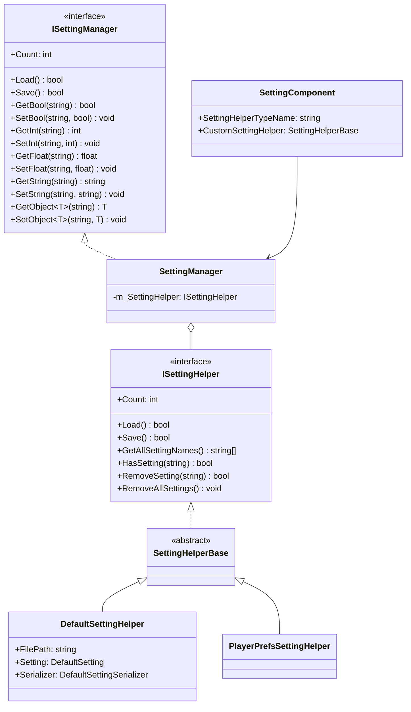
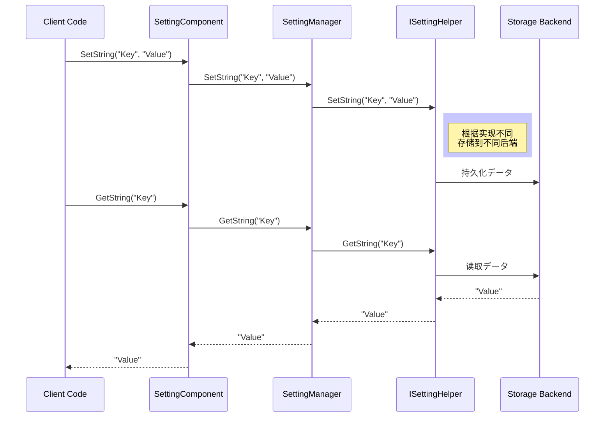

# API リファレンス

ドキュメント GameFrameX Setting モジュールの API，インターフェース、クラスと。

## 

GameFrameX Setting モジュールたのゲーム，サポート（ファイル、PlayerPrefs、ゲームプラットフォーム）。モジュールアーキテクチャ，をじてインターフェースの。

## アーキテクチャ



## ISettingManager インターフェース

`ISettingManager` はのコアインターフェース，たゲームの。

> Source: [ISettingManager.cs](https://github.com/GameFrameX/com.gameframex.unity.setting/blob/main/Runtime/Setting/Setting/ISettingManager.cs#L30-L342)

### プロパティ

#### `Count: int`

ゲームの。

```csharp
int count = settingManager.Count;
```

> Source: [ISettingManager.cs](https://github.com/GameFrameX/com.gameframex.unity.setting/blob/main/Runtime/Setting/Setting/ISettingManager.cs#L50-L51)

### メソッド

#### `Load(): bool`

ロードゲーム。

**す：** はロード。

```csharp
bool success = settingManager.Load();
```

> Source: [ISettingManager.cs](https://github.com/GameFrameX/com.gameframex.unity.setting/blob/main/Runtime/Setting/Setting/ISettingManager.cs#L70-L71)

---

#### `Save(): bool`

ゲーム。

**す：** は。

```csharp
bool success = settingManager.Save();
```

> Source: [ISettingManager.cs](https://github.com/GameFrameX/com.gameframex.unity.setting/blob/main/Runtime/Setting/Setting/ISettingManager.cs#L80-L81)

---

#### `GetAllSettingNames(): string[]`

ゲームの。

**す：** の。

```csharp
string[] names = settingManager.GetAllSettingNames();
```

> Source: [ISettingManager.cs](https://github.com/GameFrameX/com.gameframex.unity.setting/blob/main/Runtime/Setting/Setting/ISettingManager.cs#L90-L91)

---

#### `GetAllSettingNames(results: List<string>): void`

ゲームの。

**パラメータ：**
- `results` (`List<string>`): にの。

```csharp
var names = new List<string>();
settingManager.GetAllSettingNames(names);
```

> Source: [ISettingManager.cs](https://github.com/GameFrameX/com.gameframex.unity.setting/blob/main/Runtime/Setting/Setting/ISettingManager.cs#L100-L101)

---

#### `HasSetting(settingName: string): bool`

はに。

**パラメータ：**
- `settingName` (string): の。

**す：** はに。

```csharp
bool exists = settingManager.HasSetting("PlayerName");
```

> Source: [ISettingManager.cs](https://github.com/GameFrameX/com.gameframex.unity.setting/blob/main/Runtime/Setting/Setting/ISettingManager.cs#L112-L113)

---

#### `RemoveSetting(settingName: string): bool`

。

**パラメータ：**
- `settingName` (string): の。

**す：** は。

```csharp
bool success = settingManager.RemoveSetting("OldSetting");
```

> Source: [ISettingManager.cs](https://github.com/GameFrameX/com.gameframex.unity.setting/blob/main/Runtime/Setting/Setting/ISettingManager.cs#L122-L123)

---

#### `RemoveAllSettings(): void`

ゲーム。

```csharp
settingManager.RemoveAllSettings();
```

> Source: [ISettingManager.cs](https://github.com/GameFrameX/com.gameframex.unity.setting/blob/main/Runtime/Setting/Setting/ISettingManager.cs#L131-L132)

---

### 

#### `GetBool(settingName: string): bool`

。

**パラメータ：**
- `settingName` (string): 。

**す：** の。に。

```csharp
bool value = settingManager.GetBool("SoundEnabled");
```

> Source: [ISettingManager.cs](https://github.com/GameFrameX/com.gameframex.unity.setting/blob/main/Runtime/Setting/Setting/ISettingManager.cs#L142-L143)

---

#### `GetBool(settingName: string, defaultValue: bool): bool`

，サポートデフォルト。

**パラメータ：**
- `settingName` (string): 。
- `defaultValue` (bool): にすのデフォルト。

**す：** のデフォルト。

```csharp
bool value = settingManager.GetBool("MusicEnabled", true);
```

> Source: [ISettingManager.cs](https://github.com/GameFrameX/com.gameframex.unity.setting/blob/main/Runtime/Setting/Setting/ISettingManager.cs#L154-L155)

---

#### `SetBool(settingName: string, value: bool): void`

。

**パラメータ：**
- `settingName` (string): 。
- `value` (bool): の。

```csharp
settingManager.SetBool("SoundEnabled", true);
```

> Source: [ISettingManager.cs](https://github.com/GameFrameX/com.gameframex.unity.setting/blob/main/Runtime/Setting/Setting/ISettingManager.cs#L165-L166)

---

### 

#### `GetInt(settingName: string): int`

。

**パラメータ：**
- `settingName` (string): 。

**す：** の。に。

```csharp
int level = settingManager.GetInt("CurrentLevel");
```

> Source: [ISettingManager.cs](https://github.com/GameFrameX/com.gameframex.unity.setting/blob/main/Runtime/Setting/Setting/ISettingManager.cs#L176-L177)

---

#### `GetInt(settingName: string, defaultValue: int): int`

，サポートデフォルト。

**パラメータ：**
- `settingName` (string): 。
- `defaultValue` (int): にすのデフォルト。

**す：** のデフォルト。

```csharp
int score = settingManager.GetInt("HighScore", 0);
```

> Source: [ISettingManager.cs](https://github.com/GameFrameX/com.gameframex.unity.setting/blob/main/Runtime/Setting/Setting/ISettingManager.cs#L188-L189)

---

#### `SetInt(settingName: string, value: int): void`

。

**パラメータ：**
- `settingName` (string): 。
- `value` (int): の。

```csharp
settingManager.SetInt("CurrentLevel", 5);
```

> Source: [ISettingManager.cs](https://github.com/GameFrameX/com.gameframex.unity.setting/blob/main/Runtime/Setting/Setting/ISettingManager.cs#L199-L200)

---

### 

#### `GetFloat(settingName: string): float`

。

**パラメータ：**
- `settingName` (string): 。

**す：** の。に。

```csharp
float volume = settingManager.GetFloat("MusicVolume");
```

> Source: [ISettingManager.cs](https://github.com/GameFrameX/com.gameframex.unity.setting/blob/main/Runtime/Setting/Setting/ISettingManager.cs#L210-L211)

---

#### `GetFloat(settingName: string, defaultValue: float): float`

，サポートデフォルト。

**パラメータ：**
- `settingName` (string): 。
- `defaultValue` (float): にすのデフォルト。

**す：** のデフォルト。

```csharp
float volume = settingManager.GetFloat("MusicVolume", 0.5f);
```

> Source: [ISettingManager.cs](https://github.com/GameFrameX/com.gameframex.unity.setting/blob/main/Runtime/Setting/Setting/ISettingManager.cs#L222-L223)

---

#### `SetFloat(settingName: string, value: float): void`

。

**パラメータ：**
- `settingName` (string): 。
- `value` (float): の。

```csharp
settingManager.SetFloat("MusicVolume", 0.8f);
```

> Source: [ISettingManager.cs](https://github.com/GameFrameX/com.gameframex.unity.setting/blob/main/Runtime/Setting/Setting/ISettingManager.cs#L233-L234)

---

### 

#### `GetString(settingName: string): string`

。

**パラメータ：**
- `settingName` (string): 。

**す：** の。に。

```csharp
string playerName = settingManager.GetString("PlayerName");
```

> Source: [ISettingManager.cs](https://github.com/GameFrameX/com.gameframex.unity.setting/blob/main/Runtime/Setting/Setting/ISettingManager.cs#L244-L245)

---

#### `GetString(settingName: string, defaultValue: string): string`

，サポートデフォルト。

**パラメータ：**
- `settingName` (string): 。
- `defaultValue` (string): にすのデフォルト。

**す：** のデフォルト。

```csharp
string playerName = settingManager.GetString("PlayerName", "Guest");
```

> Source: [ISettingManager.cs](https://github.com/GameFrameX/com.gameframex.unity.setting/blob/main/Runtime/Setting/Setting/ISettingManager.cs#L256-L257)

---

#### `SetString(settingName: string, value: string): void`

。

**パラメータ：**
- `settingName` (string): 。
- `value` (string): の。

```csharp
settingManager.SetString("PlayerName", "Hero");
```

> Source: [ISettingManager.cs](https://github.com/GameFrameX/com.gameframex.unity.setting/blob/main/Runtime/Setting/Setting/ISettingManager.cs#L267-L268)

---

### 

#### `GetObject<T>(settingName: string): T`

。

**タイプパラメータ：**
- `T`: のタイプ，む。

**パラメータ：**
- `settingName` (string): 。

**す：** の。に。

```csharp
var playerData = settingManager.GetObject<PlayerData>("PlayerData");
```

> Source: [ISettingManager.cs](https://github.com/GameFrameX/com.gameframex.unity.setting/blob/main/Runtime/Setting/Setting/ISettingManager.cs#L279-L280)

---

#### `GetObject(objectType: Type, settingName: string): object`

（バージョン）。

**パラメータ：**
- `objectType` (Type): のタイプ。
- `settingName` (string): 。

**す：** の。

```csharp
object playerData = settingManager.GetObject(typeof(PlayerData), "PlayerData");
```

> Source: [ISettingManager.cs](https://github.com/GameFrameX/com.gameframex.unity.setting/blob/main/Runtime/Setting/Setting/ISettingManager.cs#L291-L292)

---

#### `GetObject<T>(settingName: string, defaultObj: T): T`

，サポートデフォルト。

**タイプパラメータ：**
- `T`: のタイプ。

**パラメータ：**
- `settingName` (string): 。
- `defaultObj` (T): にすのデフォルト。

**す：** のデフォルト。

```csharp
var defaultData = new PlayerData();
var playerData = settingManager.GetObject("PlayerData", defaultData);
```

> Source: [ISettingManager.cs](https://github.com/GameFrameX/com.gameframex.unity.setting/blob/main/Runtime/Setting/Setting/ISettingManager.cs#L304-L305)

---

#### `GetObject(objectType: Type, settingName: string, defaultObj: object): object`

（バージョン），サポートデフォルト。

**パラメータ：**
- `objectType` (Type): のタイプ。
- `settingName` (string): 。
- `defaultObj` (object): にすのデフォルト。

**す：** のデフォルト。

```csharp
var defaultData = new PlayerData();
var playerData = settingManager.GetObject(typeof(PlayerData), "PlayerData", defaultData);
```

> Source: [ISettingManager.cs](https://github.com/GameFrameX/com.gameframex.unity.setting/blob/main/Runtime/Setting/Setting/ISettingManager.cs#L317-L318)

---

#### `SetObject<T>(settingName: string, obj: T): void`

。

**タイプパラメータ：**
- `T`: のタイプ。

**パラメータ：**
- `settingName` (string): 。
- `obj` (T): の。

```csharp
var playerData = new PlayerData { Name = "Hero", Level = 10 };
settingManager.SetObject("PlayerData", playerData);
```

> Source: [ISettingManager.cs](https://github.com/GameFrameX/com.gameframex.unity.setting/blob/main/Runtime/Setting/Setting/ISettingManager.cs#L329-L330)

---

#### `SetObject(settingName: string, obj: object): void`

（バージョン）。

**パラメータ：**
- `settingName` (string): 。
- `obj` (object): の。

```csharp
var playerData = new PlayerData { Name = "Hero", Level = 10 };
settingManager.SetObject("PlayerData", (object)playerData);
```

> Source: [ISettingManager.cs](https://github.com/GameFrameX/com.gameframex.unity.setting/blob/main/Runtime/Setting/Setting/ISettingManager.cs#L340-L341)

---

## ISettingHelper インターフェース

`ISettingHelper` はのインターフェース，の。

> Source: [ISettingHelper.cs](https://github.com/GameFrameX/com.gameframex.unity.setting/blob/main/Runtime/Setting/Setting/ISettingHelper.cs#L30-L332)

**インターフェースメソッドと ISettingManager ，た：**
- ファイル/
- メソッドはの，クラス

**：** インターフェース，にの，ファイル、PlayerPrefs、ゲームプラットフォーム。

---

## SettingManager クラス

`SettingManager` は `ISettingManager` のコアクラス， `GameFrameworkModule`。

> Source: [SettingManager.cs](https://github.com/GameFrameX/com.gameframex.unity.setting/blob/main/Runtime/Setting/Setting/SettingManager.cs#L30-L737)

### メソッド

#### `SettingManager()`

 SettingManager の。

```csharp
var settingManager = new SettingManager();
```

> Source: [SettingManager.cs](https://github.com/GameFrameX/com.gameframex.unity.setting/blob/main/Runtime/Setting/Setting/SettingManager.cs#L53-L57)

### メソッド

#### `SetSettingHelper(settingHelper: ISettingHelper): void`

ゲーム。

**パラメータ：**
- `settingHelper` (ISettingHelper): ゲーム。

**：**  settingHelper  null  GameFrameworkException。

```csharp
settingManager.SetSettingHelper(new PlayerPrefsSettingHelper());
```

> Source: [SettingManager.cs](https://github.com/GameFrameX/com.gameframex.unity.setting/blob/main/Runtime/Setting/Setting/SettingManager.cs#L111-L120)

---

#### `Update(elapseSeconds: float, realElapseSeconds: float): void`

メソッド。メソッド，マネージャー。

> Source: [SettingManager.cs](https://github.com/GameFrameX/com.gameframex.unity.setting/blob/main/Runtime/Setting/Setting/SettingManager.cs#L88-L90)

---

#### `Shutdown(): void`

マネージャー。にの。

> Source: [SettingManager.cs](https://github.com/GameFrameX/com.gameframex.unity.setting/blob/main/Runtime/Setting/Setting/SettingManager.cs#L98-L101)

---

## SettingHelperBase クラス

`SettingHelperBase` はのクラス， `MonoBehaviour`  `ISettingHelper` インターフェース。

> Source: [SettingHelperBase.cs](https://github.com/GameFrameX/com.gameframex.unity.setting/blob/main/Runtime/Setting/SettingHelperBase.cs#L30-L333)

**：**  Unity コンポーネントのクラス，コンポーネント。

---

## DefaultSettingHelper クラス

`DefaultSettingHelper` はデフォルトの，ローカルファイルデータ。

> Source: [DefaultSettingHelper.cs](https://github.com/GameFrameX/com.gameframex.unity.setting/blob/main/Runtime/Setting/DefaultSettingHelper.cs#L30-L529)

### プロパティ

#### `FilePath: string` ()

ゲームファイルのパス。

```csharp
string path = defaultSettingHelper.FilePath;
```

> Source: [DefaultSettingHelper.cs](https://github.com/GameFrameX/com.gameframex.unity.setting/blob/main/Runtime/Setting/DefaultSettingHelper.cs#L76-L82)

---

#### `Setting: DefaultSetting` ()

ゲームデータ。

```csharp
var settings = defaultSettingHelper.Setting;
```

> Source: [DefaultSettingHelper.cs](https://github.com/GameFrameX/com.gameframex.unity.setting/blob/main/Runtime/Setting/DefaultSettingHelper.cs#L91-L97)

---

#### `Serializer: DefaultSettingSerializer` ()

ゲーム。

```csharp
var serializer = defaultSettingHelper.Serializer;
```

> Source: [DefaultSettingHelper.cs](https://github.com/GameFrameX/com.gameframex.unity.setting/blob/main/Runtime/Setting/DefaultSettingHelper.cs#L106-L112)

---

### ファイル

デフォルトパス：`Application.persistentDataPath/GameFrameworkSetting.dat`

> Source: [DefaultSettingHelper.cs](https://github.com/GameFrameX/com.gameframex.unity.setting/blob/main/Runtime/Setting/DefaultSettingHelper.cs#L48)

---

## PlayerPrefsSettingHelper クラス

`PlayerPrefsSettingHelper` にづく Unity PlayerPrefs ，サポートゲームプラットフォーム。

> Source: [PlayerPrefsSettingHelper.cs](https://github.com/GameFrameX/com.gameframex.unity.setting/blob/main/Runtime/Setting/PlayerPrefsSettingHelper.cs#L30-L638)

### プラットフォームサポート

- Unity Editor
- Unity WebGL ()
- ゲーム (ENABLE_DOUYIN_MINI_GAME)
- ゲーム (ENABLE_WECHAT_MINI_GAME)
- ゲーム (ENABLE_KUAISHOU_MINI_GAME)

### 

|  | サポート |
|------|----------|
| Count | サポート，す -1 |
| GetAllSettingNames | サポート，す null |
| Load | ，す true |
| Save | WebGL ゲームプラットフォーム |

> Source: [PlayerPrefsSettingHelper.cs](https://github.com/GameFrameX/com.gameframex.unity.setting/blob/main/Runtime/Setting/PlayerPrefsSettingHelper.cs#L52-L100)

---

## SettingComponent クラス

`SettingComponent` は Unity コンポーネント，にに GameFrameX フレームワーク。

> Source: [SettingComponent.cs](https://github.com/GameFrameX/com.gameframex.unity.setting/blob/main/Runtime/Setting/SettingComponent.cs#L30-L447)

### コンポーネント

-  `GameFrameworkComponent`
- に
- サポートカスタマイズタイプ

### 

#### `SettingHelperTypeName: string`

のタイプ。デフォルト `PlayerPrefsSettingHelper`。

```csharp
[SerializeField]
private string m_SettingHelperTypeName = "GameFrameX.Setting.Runtime.PlayerPrefsSettingHelper";
```

> Source: [SettingComponent.cs](https://github.com/GameFrameX/com.gameframex.unity.setting/blob/main/Runtime/Setting/SettingComponent.cs#L51)

---

#### `CustomSettingHelper: SettingHelperBase`

カスタマイズ。

```csharp
[SerializeField]
private SettingHelperBase m_CustomSettingHelper = null;
```

> Source: [SettingComponent.cs](https://github.com/GameFrameX/com.gameframex.unity.setting/blob/main/Runtime/Setting/SettingComponent.cs#L53)

---

### メソッド

`SettingComponent` たと `ISettingManager` のメソッド，に Unity 。

---

## データ



---

## 

| タイプ |  |
|----------|----------|
| GameFrameworkException | びしメソッド |
| GameFrameworkException |  null |
| GameFrameworkException | タイプ null |

```csharp
// 典型例外处理
try {
    var value = settingManager.GetString("Key");
} catch (GameFrameworkException ex) {
    Debug.LogError($"設定操作失敗: {ex.Message}");
}
```

---

## リンク

- [](./01.overview)
- [インストール](./02.installation)
- [クイックスタート](./03.getting-started)
- [](./04.features)
- [](./05.helper-implementation)
- [プラットフォーム](./06.platforms)
- [よくある](./08.troubleshooting)
