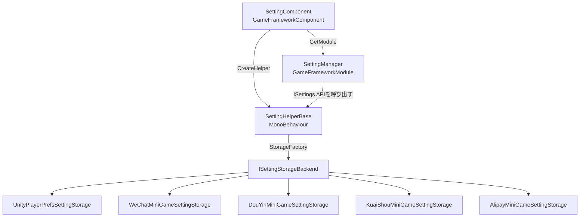

# 仕組み：SettingComponent アーキテクチャ

`SettingComponent` は GameFrameX 設定モジュールのエントリコンポーネントであり、ゲーム起動時に `SettingManager` と `SettingHelper` を起動して設定の読み込みと後続の読み書きを担当します。このページでは、それがどのようにインスタンス化されるか、どのようにヘルパーに処理を委譲するか、そしてデータが最終的にどのストレージバックエンドに保存されるかを説明します。

## クイックスタート

`SettingComponent` をアタッチすると、フレームワークが自動的に設定の読み取りと初期化を完了するため、業務コードで手動で new する必要はありません。

1. 起動シーンの `GameFrameX` オブジェクトに `SettingComponent` が追加されていることを確認します（デフォルトでフレームワークと一緒に登録されます）。
2. デフォルトでは [PlayerPrefsSettingHelper.cs](https://github.com/GameFrameX/com.gameframex.unity.setting/blob/main/Runtime/Setting/PlayerPrefsSettingHelper.cs) をヘルパーとして使用します。WeChat ミニゲームのストレージに変更する場合は、`m_SettingHelperTypeName` フィールドを対応するミニゲームのヘルパー型名に変更してください。
3. 業務コードでは `GameFrameX.Setting.Runtime.SettingComponent` の `GetBool` / `GetInt` / `GetString` などのメソッドを通じて設定を読み書きします。

## 仕組みの概要

Setting モジュールは「コンポーネント → マネージャー → ヘルパー → ストレージバックエンド」という 4 層の委譲構造になっており、各層は直下の層のインターフェースにのみ依存します。



各層の役割：

| 層 | 型 | 役割 |
|----|------|------|
| コンポーネント層 | [SettingComponent.cs](https://github.com/GameFrameX/com.gameframex.unity.setting/blob/main/Runtime/Setting/SettingComponent.cs#L48-L100) | `Awake` 内で `ISettingManager` を取得し、`SettingHelperBase` のインスタンスを作成してマネージャーに注入する。`Start` で初回 `Load()` をトリガーする |
| マネージャー層 | [SettingManager.cs](https://github.com/GameFrameX/com.gameframex.unity.setting/blob/main/Runtime/Setting/Setting/SettingManager.cs#L43-L134) | [ISettingManager.cs](https://github.com/GameFrameX/com.gameframex.unity.setting/blob/main/Runtime/Setting/Setting/ISettingManager.cs) を実装し、上層に `Get/Set*` シリーズ API を公開し、内部で `ISettingHelper` に呼び出しを転送する |
| ヘルパー層 | [SettingHelperBase.cs](https://github.com/GameFrameX/com.gameframex.unity.setting/blob/main/Runtime/Setting/SettingHelperBase.cs#L43-L335) | `MonoBehaviour` を抽象化したもので、設定の読み書き、ロード/アンロード、シリアライズなどの汎用機能を提供する |
| ストレージバックエンド | [SettingStorageBackendFactory.cs](https://github.com/GameFrameX/com.gameframex.unity.setting/blob/main/Runtime/Setting/Storage/SettingStorageBackendFactory.cs) と各 `ISettingStorageBackend` 実装 | 実際に永続化するアダプタ層：Unity は `UnityPlayerPrefsSettingStorage`、ミニゲームプラットフォームは対応するプラットフォームの storage 実装を使用する |

## 起動フロー

起動期間中の重要な手順は以下の通りで、順序は `SettingComponent` の `Awake` / `Start` と一対一に対応しています：

1. **コンポーネント型の解析** —— `ImplementationComponentType = Utility.Assembly.GetType(componentType)` で、このインターフェースに対応する実装が `SettingManager` であることをフレームワークに伝える。
2. **マネージャーの取得** —— `GameFrameworkEntry.GetModule<ISettingManager>()` を通じてグローバルに一意なマネージャーインスタンスを取得する。
3. **ヘルパーの作成** —— `Helper.CreateHelper(m_SettingHelperTypeName, m_CustomSettingHelper)`、デフォルトの型名は `"GameFrameX.Setting.Runtime.PlayerPrefsSettingHelper"`。Inspector で `m_CustomSettingHelper` を指定した場合は、カスタム実装が優先される。
4. **ヘルパーのアタッチ** —— 作成した helper を `"SettingHelper"` にリネームし、`SettingComponent` 自身の下にアタッチする（[SettingComponent.cs](https://github.com/GameFrameX/com.gameframex.unity.setting/blob/main/Runtime/Setting/SettingComponent.cs#L94-L99) を参照）。
5. **マネージャーの注入** —— `m_SettingManager.SetSettingHelper(settingHelper)` を呼び出す。このステップで helper が null でないことを検証する。
6. **初回ロード** —— `Start` 内で `m_SettingManager.Load()` を実行し、プレイヤーのローカルに永続化された設定を読み取る。失敗してもログを記録するだけで、ゲームは中断されない。
7. **Shutdown での保存** —— `SettingManager.Shutdown()` がフレームワーク終了時に自動的に `Save()` を呼び出し、メモリ内の最新値を永続化する。

## API 委譲関係

`SettingComponent` の各公開メソッドは `ISettingManager` の対応するメソッドの薄いラッパーに過ぎず、業務呼び出し側が受け取る `Count` / `GetBool` / `SetInt` などのインターフェースシグネチャは [ISettingManager.cs](https://github.com/GameFrameX/com.gameframex.unity.setting/blob/main/Runtime/Setting/Setting/ISettingManager.cs) と完全に一致しています。

| SettingComponent メソッド | 委譲先 | ISettingManager シグネチャ |
|----------------------|--------|----------------------|
| `Count` | → | `int Count { get; }` |
| `Save()` / `Load()` | → | `bool Load()` / `bool Save()` |
| `GetBool/SetBool(name[,defaultValue], value)` | → | 同名メソッド |
| `GetInt/SetInt` | → | 同名メソッド |
| `GetFloat/SetFloat` | → | 同名メソッド |
| `GetString/SetString` | → | 同名メソッド |
| `GetBool/Int/Float/String(..., object)` | → | オブジェクトシリアライズ対応のジェネリック版 |
| `HasSetting/RemoveSetting/RemoveAllSettings` | → | 同名メソッド |
| `GetAllSettingNames()` | → | `string[]` を返す |
| `GetAllSettingNames(List<string>)` | → | リストに格納する |

`SettingManager` は呼び出し前に毎回 `EnsureSettingHelper()` と `EnsureSettingName()` を実行します（[SettingManager.cs L47-L61](https://github.com/GameFrameX/com.gameframex.unity.setting/blob/main/Runtime/Setting/Setting/SettingManager.cs#L47-L61) を参照）。helper が未注入の場合は `GameFrameworkException("Setting helper is invalid.")` がスローされ、settingName が空の場合は `"Setting name is invalid."` がスローされます。

## ヘルパーとストレージバックエンド

`SettingHelperBase` 自体は抽象インターフェースを定義するだけで、実際の読み書きはそのサブクラスが実装します。リポジトリで提供されているデフォルト実装：

- [PlayerPrefsSettingHelper.cs](https://github.com/GameFrameX/com.gameframex.unity.setting/blob/main/Runtime/Setting/PlayerPrefsSettingHelper.cs)：Unity の `PlayerPrefs` ベースで、すべての通常のプラットフォームに適している。
- ミニゲームプラットフォーム用 helper：[WeChatMiniGameSettingStorage.cs](https://github.com/GameFrameX/com.gameframex.unity.setting/blob/main/Runtime/MiniGame/WeChat/WeChatMiniGameSettingStorage.cs)、[DouYinMiniGameSettingStorage.cs](https://github.com/GameFrameX/com.gameframex.unity.setting/blob/main/Runtime/MiniGame/DouYin/DouYinMiniGameSettingStorage.cs)、[KuaiShouMiniGameSettingStorage.cs](https://github.com/GameFrameX/com.gameframex.unity.setting/blob/main/Runtime/MiniGame/KuaiShou/KuaiShouMiniGameSettingStorage.cs)、[AlipayMiniGameSettingStorage.cs](https://github.com/GameFrameX/com.gameframex.unity.setting/blob/main/Runtime/MiniGame/Alipay/AlipayMiniGameSettingStorage.cs)。

ヘルパーは `SettingStorageBackendFactory` を通じて現在のプラットフォームに対応する `ISettingStorageBackend` 実装を選択するため、業務コードは意識する必要がありません。

## カスタムヘルパー

```csharp
public class MySettingHelper : SettingHelperBase
{
    public override int Count => 0;
    public override bool Load() { /* 読み込みロジック */ return true; }
    public override bool Save() { /* 書き込みロジック */ return true; }
    // ... 残りの抽象メンバーは必要に応じて実装
}
```

スクリプトを含むプレハブを `SettingComponent.m_CustomSettingHelper` フィールドにドラッグするだけで、フレームワークは `Awake` でそれを優先的に使用します。このフィールドが空の場合は、`m_SettingHelperTypeName` でリフレクションにより作成されます。

## 次に

- Inspector でストレージプラットフォームを切り替える：『設定ストレージバックエンドの選び方』を参照
- 業務コードでの設定読み書き例：『ゲーム設定の読み書き方法』を参照
- プラットフォームストレージバックエンドのエラートラブルシューティング：『Setting のロードに失敗した場合は』を参照