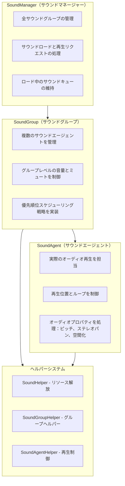
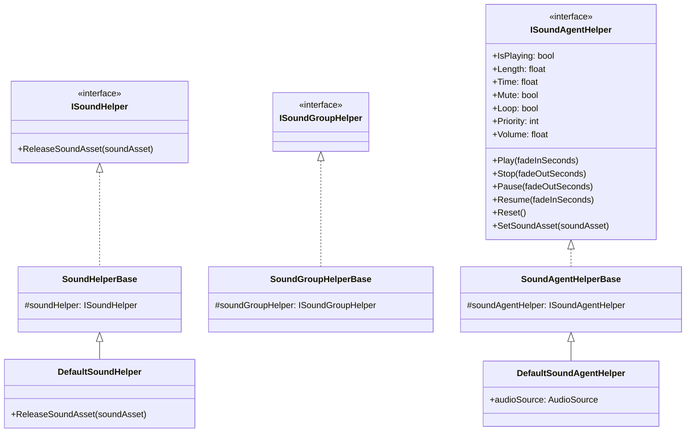
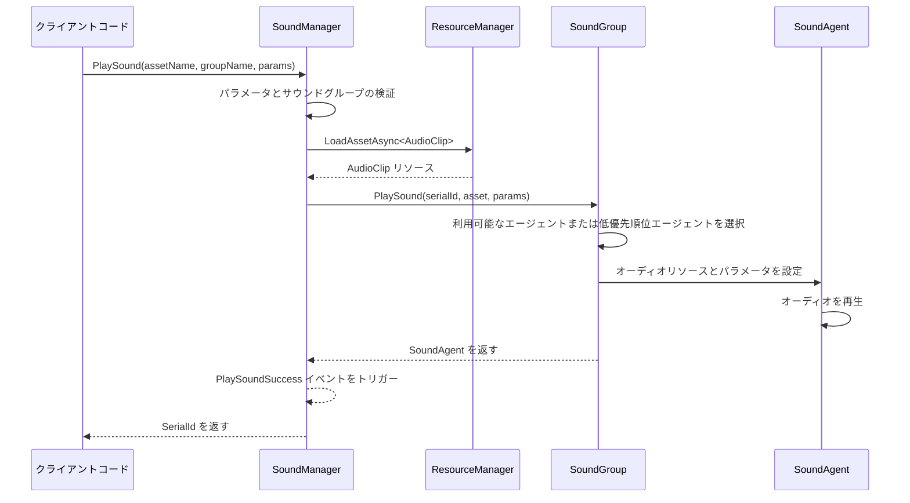
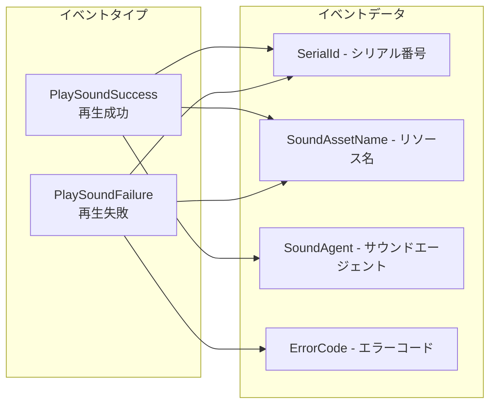

# 概要

GameFrameX Sound は、GameFrameX ゲームフレームワークのオーディオ管理システムであり、Unity ゲームエンジン向けに設計されています。複数のサウンドグループ、優先順位スケジューリング、フェードイン・フェードアウトなどの高度なオーディオ機能を提供する、完全なサウンド再生、管理、制御ソリューションです。

## システムアーキテクチャ

GameFrameX Sound は3層アーキテクチャ設計を採用しています：マネージャー（SoundManager）→ サウンドグループ（SoundGroup）→ サウンドエージェント（SoundAgent）。この階層型設計により、オーディオシステムは優れた拡張性と柔軟性を持ち、各种複雑なゲームのオーディオニーズを満たすことができます。



## コアコンセプト

### サウンドマネージャー（SoundManager）

サウンドマネージャーはオーディオシステム全体のコアコンポーネントであり、すべてのサウンドグループの管理とサウンド再生リクエストの処理を担当します。`GameFrameworkModule` を継承し、以下のコア機能を提供します：

- **サウンドグループ管理**：サウンドグループの作成、クエリ、破棄
- **サウンド再生**：オーディオリソースの非同期ロードと再生
- **再生制御**：单个または全サウンドの一時停止、再開、停止
- **状態クエリ**：ロード中または再生中のサウンドのクエリ

> 詳細な API 説明は [サウンドマネージャー](./sound-manager.md) を参照してください

### サウンドグループ（SoundGroup）

サウンドグループは、類似の特性を持つサウンドを組織化和控制するために使用されます。例えば、BGM 用に "Music" グループを作成し、効果音用に "SFX" グループを作成できます。各グループは独立して音量とミュート状態を制御できます。

サウンドグループのコア特性：
- **独立音量制御**：各グループには独立した音量設定があります
- **ミュート管理**：单个グループを单独でミュートにして其他グループに影響しないようにできます
- **優先順位戦略**：同優先順位のサウンドが互相置換されるかどうかを構成できます
- **エージェントプール管理**：并发再生用のサウンドエージェントグループを維持します

> 詳細な API 説明は [サウンドグループ](./sound-group.md) を参照してください

### サウンドエージェント（SoundAgent）

サウンドエージェントはオーディオ再生を実際の実行するコンポーネントです。各サウンドエージェントは1つの `AudioSource`（またはカスタムオーディオ実装）に対応し、以下の职责を担当します：
- 再生/一時停止/停止オーディオ
- 再生位置の設定
- ループ再生の制御
- ピッチ調整（Pitch）
- ステレオパンの設定（PanStereo）
- 空間オーディオミックス（SpatialBlend）
- ドップラー効果（DopplerLevel）

> 詳細な API 説明は [サウンドエージェント](./sound-agent.md) を参照してください

### ヘルパーシステム

GameFrameX Sound は、高度な拡張性を実現するためにヘルパー（Helper）パターンを採用しています：



これらのヘルパー基底クラスを継承することで、開発者はオーディオシステムの低レベル実装を完全にカスタマイズできます。例えば：
- サードパーティのオーディオミドルウェアを使用（FMOD、Wwiseなど）
- 特殊なオーディオエフェクトを実装
- カスタムリソースロード戦略を実装

## サウンド再生フロー

`PlaySound` メソッドを呼び出すと、システムは次のフローで処理します：



1. **パラメータ検証**：サウンドグループが存在するか、利用可能なサウンドエージェントがいるかを確認
2. **リソースロード**：リソースマネージャーを通じてオーディオリソースを非同期ロード
3. **エージェント割り当て**：サウンドグループから適切なエージェントを選択（空きまたは低優先順位）
4. **再生制御**：オーディオパラメータを設定して再生を開始
5. **イベント通知**：成功または失敗イベントをトリガー

## 再生パラメータ

`PlaySoundParams` クラスは、構成するすべての再生パラメータを含みます：

| パラメータ | タイプ | デフォルト | 説明 |
|------|------|--------|------|
| Time | float | 0f | 再生開始位置（秒） |
| MuteInSoundGroup | bool | false | グループ内でミュートするかどうか |
| Loop | bool | false | ループ再生するかどうか |
| Priority | int | 0 | 再生優先順位（数値が大きいほど優先度高） |
| VolumeInSoundGroup | float | 1.0f | グループ内音量係数 |
| FadeInSeconds | float | 0f | フェードイン時間（秒） |
| Pitch | float | 1.0f | ピッチ（0.5-3.0） |
| PanStereo | float | 0f | ステレオ位置（-1~1） |
| SpatialBlend | float | 0f | 空間混合量（2D/3D） |
| MaxDistance | float | 100f | 最大3D距離 |
| DopplerLevel | float | 1f | ドップラー効果レベル |

> 詳細な説明は [再生パラメータ](./play-sound-params.md) を参照してください

## イベントシステム

GameFrameX Sound は、完全なイベントメカニズムを提供します：



- **PlaySoundSuccess**：再生成功時にトリガーされ、シリアル番号、リソース名、サウンドエージェントなどの情報が含まれます
- **PlaySoundFailure**：再生失敗時にトリガーされ、エラーコードとエラー情報が含まれます

> 詳細な説明は [イベントパラメータ](./event-args.md) を参照してください

## 使用例

### 基本的な使用方法

```csharp
// SoundComponent を通じてサウンドを再生
var soundComponent = GameEntry.GetComponent<SoundComponent>();
int serialId = await soundComponent.PlaySound("Assets/Audio/BGM_Main.mp3", "Music");
```

### パラメータ付き再生

```csharp
var playParams = PlaySoundParams.Create();
playParams.Loop = true;
playParams.VolumeInSoundGroup = 0.8f;
playParams.FadeInSeconds = 1.0f;

int serialId = await soundComponent.PlaySound("Assets/Audio/BGM_Battle.mp3", "Music", playParams);
```

### 再生制御

```csharp
// 再生を一時停止
soundComponent.PauseSound(serialId);

// 再生を再開
soundComponent.ResumeSound(serialId);

// 再生を停止
soundComponent.StopSound(serialId);
```

## 設計理念

GameFrameX Sound の設計は以下の原則に従っています：

1. **階層型管理**：Manager → Group → Agent の階層型構造を通じて、細粒度のオーディオ制御を実現
2. **優先順位スケジューリング**：優先順位ベースのエージェント割り当て戦略を確保し、重要なサウンドがタイムリーに再生されることを保証
3. **ヘルパー拡張**：Helper パターンを通じてカスタムオーディオ実装をサポートし、サードパーティのオーディオライブラリの統合を容易にする
4. **非同期ロード**：UniTask を使用してノンブロッキングのオーディオリソースロードを実現
5. **フェードイン・フェードアウト**：内置の音量グラデーションサポートにより、オーディオ体験を向上

## 関連リンク

- [インストールガイド](./02.installation)
- [クイックスタート](./03.getting-started)
- [API リファレンス - インターフェース](./04.interfaces)
- [API リファレンス - 再生パラメータ](./08.play-sound-params)
- [設定説明](./10.configuration)
- [拡張ガイド](./11.extending)
- [よくある問題](./12.troubleshooting)
