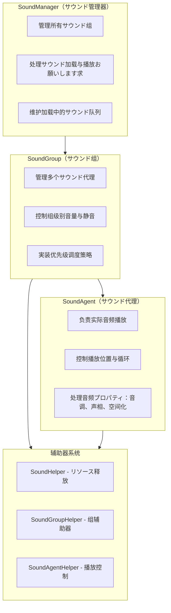
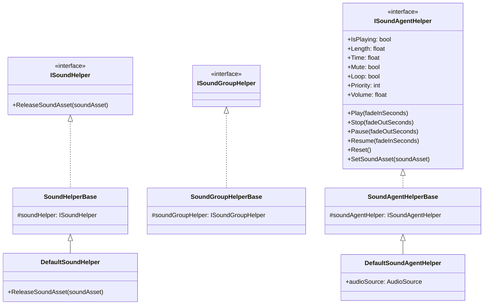
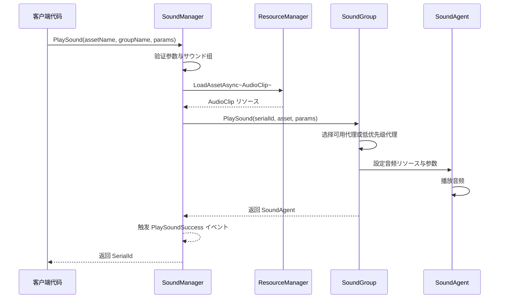
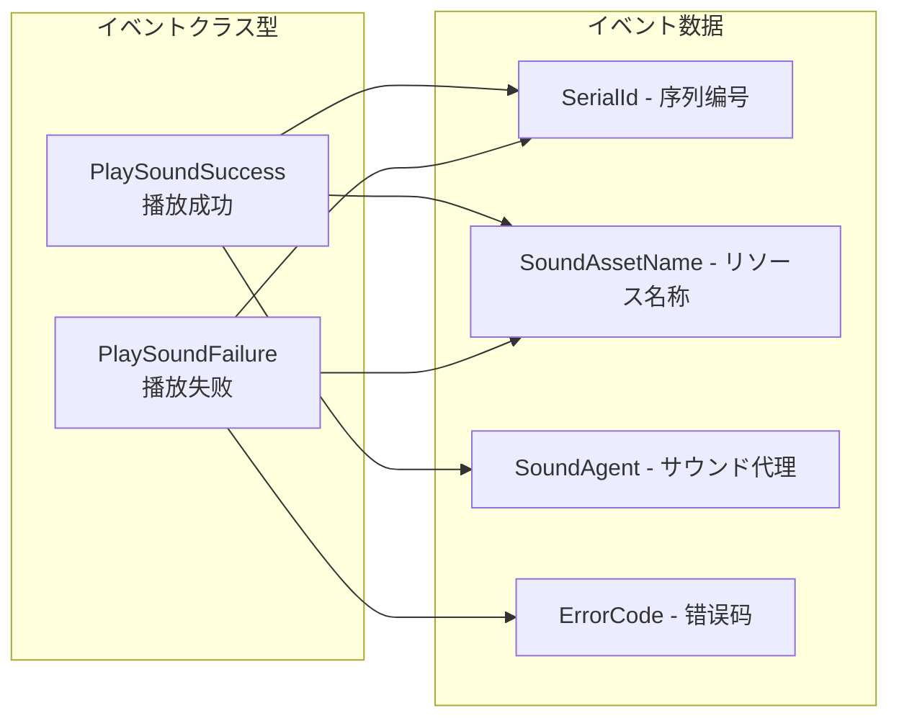

# 概要

GameFrameX Sound 是 GameFrameX ゲームフレームワーク的音频管理系统，专门为 Unity ゲーム引擎设计。它提供します一套完整的サウンド播放、管理和控制解決策，サポート多サウンド组、优先级调度、淡入淡出等高级音频機能。

## 系统架构

GameFrameX Sound 采用三层アーキテクチャ設計：管理器（SoundManager）→ サウンド组（SoundGroup）→ サウンド代理（SoundAgent）。这种分层设计使得音频系统具有良好的可扩展性和灵活性，能够满足各种复杂的ゲーム音频需求。



## コアコンセプト

### サウンド管理器（SoundManager）

サウンド管理器是整个音频系统的コアコンポーネント，负责管理所有的サウンド组和处理サウンド播放お願いします求。它を継承 `GameFrameworkModule`，提供以下コア機能：

- **サウンド组管理**：作成、查询和销毁サウンド组
- **サウンド播放**：异步加载和播放サウンドリソース
- **播放控制**：暂停、恢复、停止单个或所有サウンド
- **ステータス查询**：查询正在加载或播放的サウンド

> 详细 API 説明お願いします参阅 [サウンド管理器](./4-core-concepts.1-sound-manager)

### サウンド组（SoundGroup）

サウンド组に使用组织和控制具有相似特性的サウンド。例如，你可能为背景音乐作成一个 "Music" 组，为音效作成 "SFX" 组，每个组可能独立控制音量和静音ステータス。

サウンド组的コア特性：
- **独立音量控制**：每个组有独立的音量設定
- **静音管理**：可能单独静音某个组而不影响其他组
- **优先级策略**：可配置同优先级サウンド是否互相替换
- **代理池管理**：维护一组サウンド代理に使用并发播放

> 详细 API 説明お願いします参阅 [サウンド组](./4-core-concepts.2-sound-group)

### サウンド代理（SoundAgent）

サウンド代理是实际执行音频播放的コンポーネント。每个サウンド代理对应一个 `AudioSource`（或自定义音频実装），负责：
- 播放/暂停/停止音频
- 設定播放位置
- 控制循环播放
- 调整音调（Pitch）
- 設定立体声声相（PanStereo）
- 空间音频混合（ SpatialBlend）
- 多普勒效果（DopplerLevel）

> 详细 API 説明お願いします参阅 [サウンド代理](./4-core-concepts.3-sound-agent)

### 辅助器系统

GameFrameX Sound 采用辅助器（Helper）模式実装高度可扩展性：



を通じて继承这些辅助器基クラス，開発者可能完全自定义音频系统的底层実装，例如：
- 使用第三方音频中间件（如 FMOD、Wwise）
- 実装特殊的音频效果
- 自定义リソース加载策略

## サウンド播放フロー

当呼び出し `PlaySound` メソッド时，系统按照以下フロー处理：



1. **参数验证**：检查サウンド组是否存在、是否有可用的サウンド代理
2. **リソース加载**：を通じてリソース管理器异步加载音频リソース
3. **代理分配**：从サウンド组中选择合适的代理（空闲或低优先级）
4. **播放控制**：設定音频参数并开始播放
5. **イベント通知**：触发成功或失败イベント

## 播放参数

`PlaySoundParams` クラス包含所有可配置的播放参数：

| 参数 | クラス型 | 默认值 | 説明 |
|------|------|--------|------|
| Time | float | 0f | 播放起始位置（秒） |
| MuteInSoundGroup | bool | false | 在组内是否静音 |
| Loop | bool | false | 是否循环播放 |
| Priority | int | 0 | 播放优先级（数值越高越优先） |
| VolumeInSoundGroup | float | 1.0f | 组内音量系数 |
| FadeInSeconds | float | 0f | 淡入时间（秒） |
| Pitch | float | 1.0f | 音调（0.5-3.0） |
| PanStereo | float | 0f | 立体声位置（-1~1） |
| SpatialBlend | float | 0f | 空间混合量（2D/3D） |
| MaxDistance | float | 100f | 最大3D距离 |
| DopplerLevel | float | 1f | 多普勒效果等级 |

> 詳細説明お願いします参阅 [播放参数](./5-api-reference.2-play-sound-params)

## イベント系统

GameFrameX Sound 提供完善的イベント机制：



- **PlaySoundSuccess**：播放成功时触发，包含序列编号、リソース名称、サウンド代理等信息
- **PlaySoundFailure**：播放失败时触发，包含错误码和错误信息

> 詳細説明お願いします参阅 [イベント参数](./5-api-reference.3-event-args)

## 使用例

### 基本用法

```csharp
// を通じて SoundComponent 播放サウンド
var soundComponent = GameEntry.GetComponent<SoundComponent>();
int serialId = await soundComponent.PlaySound("Assets/Audio/BGM_Main.mp3", "Music");
```

### 带参数播放

```csharp
var playParams = PlaySoundParams.Create();
playParams.Loop = true;
playParams.VolumeInSoundGroup = 0.8f;
playParams.FadeInSeconds = 1.0f;

int serialId = await soundComponent.PlaySound("Assets/Audio/BGM_Battle.mp3", "Music", playParams);
```

### 控制播放

```csharp
// 暂停播放
soundComponent.PauseSound(serialId);

// 恢复播放
soundComponent.ResumeSound(serialId);

// 停止播放
soundComponent.StopSound(serialId);
```

## 设计理念

GameFrameX Sound 的设计遵循以下原则：

1. **分层管理**：を通じて Manager → Group → Agent 的分层结构，実装细粒度的音频控制
2. **优先级调度**：基づく优先级的代理分配策略，确保重要サウンド能够及时播放
3. **辅助器扩展**：を通じて Helper 模式サポート自定义音频実装，便于集成第三方音频库
4. **异步加载**：使用 UniTask 実装非阻塞的音频リソース加载
5. **淡入淡出**：内置的音量渐变サポート，提升音频体验

## 関連リンク

- [安装指南](./2-installation)
- [快速开始](./3-getting-started)
- [API 参考 - インターフェース定义](./5-api-reference.1-interfaces)
- [API 参考 - 播放参数](./5-api-reference.2-play-sound-params)
- [配置説明](./6-configuration)
- [扩展指南](./7-extending)
- [常见问题](./8-faq)
