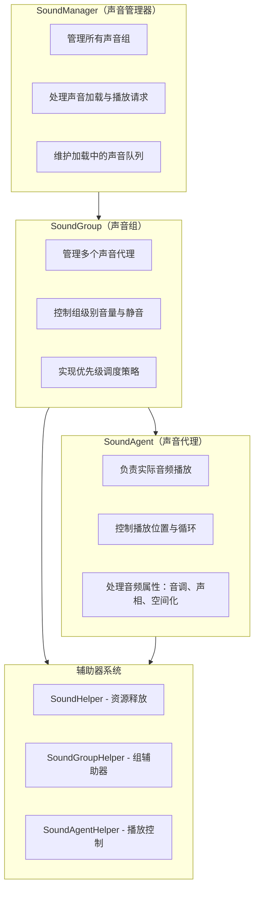
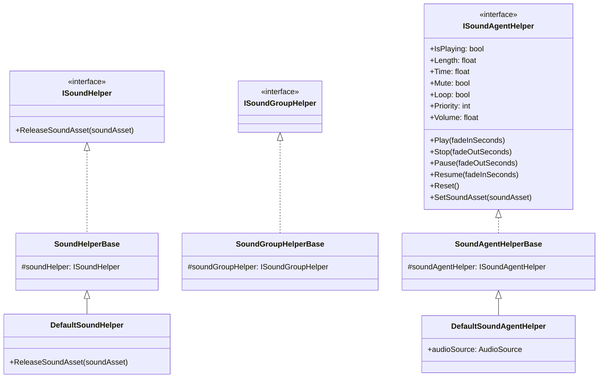
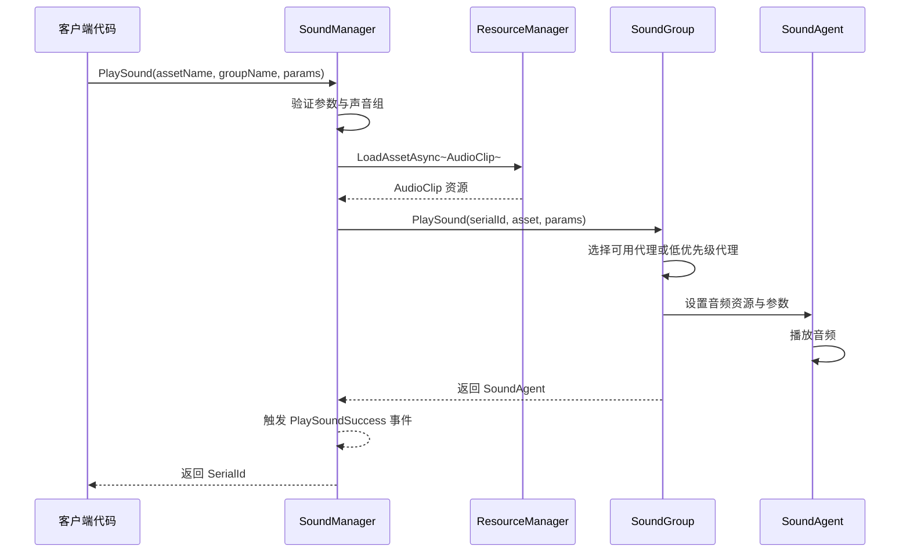
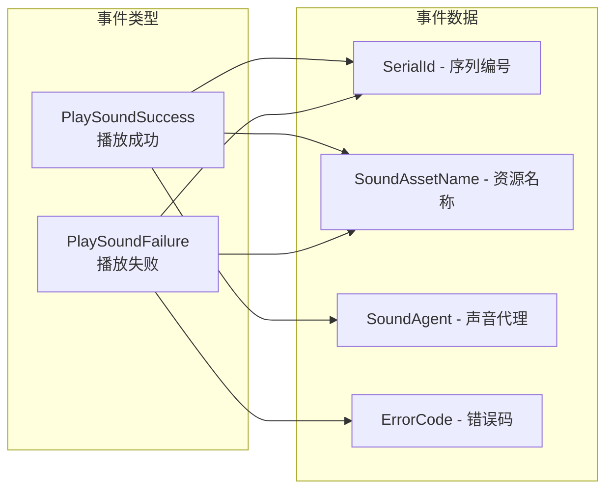

# 概要

GameFrameX Sound 是 GameFrameX 游戏フレームワーク的音频管理系统，专门为 Unity 游戏引擎設計。它提供します一套完全な的声音再生、管理和控制解決策，サポート多声音组、优先级调度、淡入淡出等高级音频機能。

## システムアーキテクチャ

GameFrameX Sound 采用三层アーキテクチャ設計：マネージャー（SoundManager）→ 声音组（SoundGroup）→ 声音代理（SoundAgent）。这种分层設計使得音频系统具有良好的可拡張性和柔軟性，能够满足各种複雑的游戏音频需求。



## コアコンセプト

### 声音マネージャー（SoundManager）

声音マネージャー是整个音频系统的コアコンポーネント，负责管理所有的声音组和処理声音再生请求。它継承自 `GameFrameworkModule`，提供以下コア機能：

- **声音组管理**：作成、查询和破棄声音组
- **声音再生**：非同期ロード和再生声音リソース
- **再生控制**：暂停、恢复、停止单个或所有声音
- **ステータス查询**：查询〜中ロード或再生的声音

> 詳細 API 説明请参照 [声音マネージャー](./4-core-concepts.1-sound-manager)

### 声音组（SoundGroup）

声音组用于组织和控制具有相似特性的声音。例えば，你〜できます为背景音乐作成一个 "Music" 组，为音效作成 "SFX" 组，每个组〜できます独立控制音量和静音ステータス。

声音组的コア特性：
- **独立音量控制**：每个组有独立的音量設定
- **静音管理**：〜できます单独静音某个组而不影响其他组
- **优先级策略**：可設定同优先级声音是否互相置換
- **代理池管理**：维护一组声音代理用于并发再生

> 詳細 API 説明请参照 [声音组](./4-core-concepts.2-sound-group)

### 声音代理（SoundAgent）

声音代理是实际执行音频再生的コンポーネント。每个声音代理对应一个 `AudioSource`（或自定義音频実装），负责：
- 再生/暂停/停止音频
- 設定再生位置
- 控制循环再生
- 调整音调（Pitch）
- 設定立体声声相（PanStereo）
- 空间音频混合（ SpatialBlend）
- 多普勒效果（DopplerLevel）

> 詳細 API 説明请参照 [声音代理](./4-core-concepts.3-sound-agent)

### 辅助器系统

GameFrameX Sound 采用辅助器（Helper）モード実装高度可拡張性：



通过継承这些辅助器基底クラス，開発者〜できます完全自定義音频系统的底层実装，例えば：
- 使用第3方音频中间件（如 FMOD、Wwise）
- 実装特殊的音频效果
- 自定義リソースロード策略

## 声音再生フロー

当呼び出し `PlaySound` メソッド时，系统按照以下フロー処理：



1. **パラメータ検証**：確認声音组是否存在、是否有可用的声音代理
2. **リソースロード**：通过リソースマネージャー非同期ロード音频リソース
3. **代理分配**：从声音组中选择合适的代理（空闲或低优先级）
4. **再生控制**：設定音频パラメータ并开始再生
5. **イベント通知**：トリガー成功或失敗イベント

## 再生パラメータ

`PlaySoundParams` 类パッケージ含所有可設定的再生パラメータ：

| パラメータ | タイプ | デフォルト值 | 説明 |
|------|------|--------|------|
| Time | float | 0f | 再生起始位置（秒） |
| MuteInSoundGroup | bool | false | 在组内是否静音 |
| Loop | bool | false | 是否循环再生 |
| Priority | int | 0 | 再生优先级（数值越高越优先） |
| VolumeInSoundGroup | float | 1.0f | 组内音量系数 |
| FadeInSeconds | float | 0f | 淡入时间（秒） |
| Pitch | float | 1.0f | 音调（0.5-3.0） |
| PanStereo | float | 0f | 立体声位置（-1~1） |
| SpatialBlend | float | 0f | 空间混合量（2D/3D） |
| MaxDistance | float | 100f | 最大3D距离 |
| DopplerLevel | float | 1f | 多普勒效果等级 |

> 詳細説明请参照 [再生パラメータ](./5-api-reference.2-play-sound-params)

## イベント系统

GameFrameX Sound 提供完善的イベント机制：



- **PlaySoundSuccess**：再生成功时トリガー，パッケージ含序列编号、リソース名称、声音代理等情報
- **PlaySoundFailure**：再生失敗时トリガー，パッケージ含エラー码和エラー情報

> 詳細説明请参照 [イベントパラメータ](./5-api-reference.3-event-args)

## 使用例

### 基本用法

```csharp
// 通过 SoundComponent 播放声音
var soundComponent = GameEntry.GetComponent<SoundComponent>();
int serialId = await soundComponent.PlaySound("Assets/Audio/BGM_Main.mp3", "Music");
```

### 带パラメータ再生

```csharp
var playParams = PlaySoundParams.Create();
playParams.Loop = true;
playParams.VolumeInSoundGroup = 0.8f;
playParams.FadeInSeconds = 1.0f;

int serialId = await soundComponent.PlaySound("Assets/Audio/BGM_Battle.mp3", "Music", playParams);
```

### 控制再生

```csharp
// 暂停播放
soundComponent.PauseSound(serialId);

// 恢复播放
soundComponent.ResumeSound(serialId);

// 停止播放
soundComponent.StopSound(serialId);
```

## 設計理念

GameFrameX Sound 的設計遵循以下原则：

1. **分层管理**：通过 Manager → Group → Agent 的分层结构，実装细粒度的音频控制
2. **优先级调度**：基于优先级的代理分配策略，確認してください重要な声音能够及时再生
3. **辅助器拡張**：通过 Helper モードサポート自定義音频実装，便于集成第3方音频库
4. **非同期ロード**：使用 UniTask 実装非阻塞的音频リソースロード
5. **淡入淡出**：内置的音量渐变サポート，提升音频体验

## 関連リンク

- [インストールガイド](./2-installation)
- [快速开始](./3-getting-started)
- [API リファレンス - インターフェース定義](./5-api-reference.1-interfaces)
- [API リファレンス - 再生パラメータ](./5-api-reference.2-play-sound-params)
- [設定説明](./6-configuration)
- [拡張ガイド](./7-extending)
- [常见問題](./8-faq)
