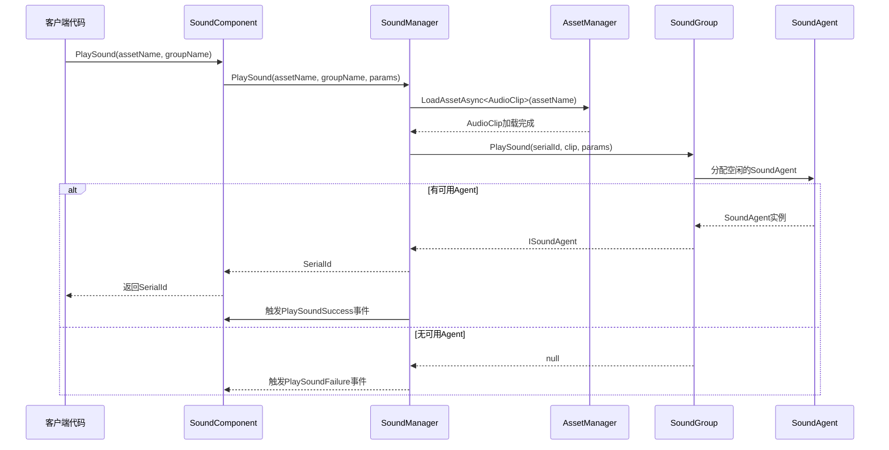

# クイックスタート

本ガイド将帮助您快速上手 GameFrameX Sound 声音管理コンポーネント，通过シンプル的ステップつまり可在 Unity プロジェクト中集成专业的音频系统。

## 概要

GameFrameX Sound 是 GameFrameX フレームワーク的声音管理コンポーネント，提供完全な的声音再生、管理和控制機能。该コンポーネントサポート多声音组管理、异步リソースロード、空间音频、声音淡入淡出等高级特性，能够满足各种游戏音频需求。

**コア機能：**
- 多声音组管理：サポート同時に管理多个声音组，每个组可独立控制音量和静音
- 非同期ロード：使用 UniTask 実装异步リソースロード，不阻塞游戏主线程
- 柔軟的イベント系统：提供再生成功/失敗イベントコールバック
- 空间音频サポート：サポート 3D 空间音效
- 声音淡入淡出：サポート再生时淡入、停止时淡出
- AudioMixer 集成：サポート与 Unity AudioMixer 无缝对接

## 快速使用フロー

以下是在 Unity プロジェクト中快速集成 Sound コンポーネント的五个ステップ：

### ステップ 1：インストールコンポーネント

在 Unity プロジェクト的 `manifest.json` ファイル中追加依赖：

```json
{
  "dependencies": {
    "com.gameframex.unity.sound": "https://github.com/GameFrameX/com.gameframex.unity.sound.git"
  }
}
```

> Source: [README.md](https://github.com/GameFrameX/com.gameframex.unity.sound/blob/main/README.md#L10-L14)

### ステップ 2：追加 SoundComponent

在 Unity シーン中作成一个空 GameObject，次に追加 `SoundComponent` コンポーネント：

1. 在 Hierarchy パネル中右键点击，选择 **Create Empty** 作成一个空物体
2. 将其重命名为 "SoundSystem" 或其他合适的名称
3. 在 Inspector パネル中点击 **Add Component**
4. 検索并选择 **GameFrameX/Sound** コンポーネント

> Source: [SoundComponent.cs](https://github.com/GameFrameX/com.gameframex.unity.sound/blob/main/Runtime/Sound/SoundComponent.cs#L50-L51)

```csharp
[DisallowMultipleComponent]
[AddComponentMenu("GameFrameX/Sound")]
public sealed partial class SoundComponent : GameFrameworkComponent
```

### ステップ 3：設定声音组

在 SoundComponent 的 Inspector パネル中設定声音组。点击 **Sound Groups** 数组，为每个元素設定：

| プロパティ | 説明 | 例值 |
|------|------|--------|
| Name | 声音组名称，用于コード中参照 | "Music", "SFX", "Voice" |
| Avoid Being Replaced By Same Priority | 是否避免被同优先级声音置換 | false |
| Mute | 是否静音 | false |
| Volume | 音量大小 (0-1) | 1.0 |
| Agent Helper Count | 并发再生代理数量 | 3 |

> Source: [SoundComponent.cs](https://github.com/GameFrameX/com.gameframex.unity.sound/blob/main/Runtime/Sound/SoundComponent.cs#L175-L183)

典型的設定方案：
- **背景音乐组**：1 个 Agent，循环再生
- **音效组**：3-5 个 Agent，サポート多音效同時に再生
- **语音组**：1-2 个 Agent，確認してください语音清晰

### ステップ 4：在コード中再生声音

通过 `SoundComponent` 再生声音非常シンプル：

```csharp
// 获取 SoundComponent 实例
var soundComponent = GameEntry.GetComponent<SoundComponent>();

// 播放背景音乐（循环）
var musicParams = PlaySoundParams.Create(true); // true 表示循环播放
await soundComponent.PlaySound("Assets/Audio/Music/MainTheme.mp3", "Music", musicParams);

// 播放音效（不循环）
await soundComponent.PlaySound("Assets/Audio/SFX/Click.wav", "SFX");

// 播放 3D 空间音效
await soundComponent.PlaySound("Assets/Audio/SFX/Explosion.wav", "SFX", transform.position);
```

> Source: [SoundComponent.cs](https://github.com/GameFrameX/com.gameframex.unity.sound/blob/main/Runtime/Sound/SoundComponent.cs#L356-L430)

### ステップ 5：控制再生

使用返す的序列编号（SerialId）控制声音再生：

```csharp
// 暂停声音
soundComponent.PauseSound(serialId);

// 恢复播放
soundComponent.ResumeSound(serialId);

// 停止声音（带淡出效果）
soundComponent.StopSound(serialId, 0.5f); // 0.5秒淡出

// 停止所有声音
soundComponent.StopAllLoadedSounds();
```

> Source: [SoundComponent.cs](https://github.com/GameFrameX/com.gameframex.unity.sound/blob/main/Runtime/Sound/SoundComponent.cs#L532-L614)

## 再生フロー

以下フロー图表示了从呼び出し PlaySound 到声音实际再生的完全な过程：



## 再生パラメータ設定

`PlaySoundParams` 类提供します丰富的再生パラメータ設定：

```csharp
// 创建播放参数
var playSoundParams = ReferencePool.Acquire<PlaySoundParams>();

// 配置播放参数
playSoundParams.Loop = true;                    // 循环播放
playSoundParams.VolumeInSoundGroup = 0.8f;    // 组内音量
playSoundParams.Priority = 100;                // 优先级
playSoundParams.FadeInSeconds = 1.0f;         // 淡入时间（秒）
playSoundParams.Pitch = 1.0f;                  // 音调
playSoundParams.SpatialBlend = 1.0f;           // 空间混合（3D音效）
playSoundParams.MaxDistance = 50f;             // 最大距离

// 使用后释放回对象池
ReferencePool.Release(playSoundParams);
```

> Source: [PlaySoundParams.cs](https://github.com/GameFrameX/com.gameframex.unity.sound/blob/main/Runtime/Sound/Sound/PlaySoundParams.cs#L40-L258)

**常用パラメータ説明：**

| パラメータ | タイプ | デフォルト值 | 説明 |
|------|------|--------|------|
| Loop | bool | false | 是否循环再生 |
| VolumeInSoundGroup | float | 1.0 | 在声音组内的音量 (0-1) |
| Priority | int | 0 | 再生优先级，数值越高越优先 |
| FadeInSeconds | float | 0 | 淡入时间（秒） |
| Pitch | float | 1.0 | 再生音调 (0.5-2.0) |
| SpatialBlend | float | 0 | 空间混合量 (0=2D, 1=3D) |
| MaxDistance | float | 100 | 3D音效最大衰减距离 |

## 完全な使用例

以下は完全な的使用例，表示如何在游戏启动时再生背景音乐，并在プレイヤー点击ボタン时再生音效：

```csharp
using UnityEngine;
using GameFrameX.Sound.Runtime;
using GameFrameX.Runtime;
using Cysharp.Threading.Tasks;

public class AudioExample : MonoBehaviour
{
    private SoundComponent _soundComponent;
    private int _bgMusicSerialId;
    
    private void Start()
    {
        // 获取 SoundComponent
        _soundComponent = GameEntry.GetComponent<SoundComponent>();
        
        // 订阅播放事件
        _soundComponent.PlaySoundSuccess += OnPlaySoundSuccess;
        _soundComponent.PlaySoundFailure += OnPlaySoundFailure;
        
        // 播放背景音乐
        PlayBackgroundMusic();
    }
    
    private async void PlayBackgroundMusic()
    {
        // 创建循环播放参数
        var musicParams = PlaySoundParams.Create(true);
        musicParams.FadeInSeconds = 2.0f;
        musicParams.VolumeInSoundGroup = 0.6f;
        
        _bgMusicSerialId = await _soundComponent.PlaySound(
            "Assets/Audio/Music/GameTitle.mp3", 
            "Music", 
            musicParams
        );
    }
    
    // 玩家点击按钮时调用
    public void OnButtonClick()
    {
        // 播放点击音效
        _ = _soundComponent.PlaySound(
            "Assets/Audio/SFX/ButtonClick.wav", 
            "SFX"
        );
    }
    
    // 播放成功回调
    private void OnPlaySoundSuccess(object sender, PlaySoundSuccessEventArgs e)
    {
        Debug.Log($"声音播放成功: {e.SoundAssetName}, SerialId: {e.SerialId}");
    }
    
    // 播放失败回调
    private void OnPlaySoundFailure(object sender, PlaySoundFailureEventArgs e)
    {
        Debug.LogWarning($"声音播放失败: {e.SoundAssetName}, 错误: {e.ErrorMessage}");
    }
    
    private void OnDestroy()
    {
        if (_soundComponent != null)
        {
            _soundComponent.PlaySoundSuccess -= OnPlaySoundSuccess;
            _soundComponent.PlaySoundFailure -= OnPlaySoundFailure;
        }
    }
}
```

> Source: [SoundComponent.cs](https://github.com/GameFrameX/com.gameframex.unity.sound/blob/main/Runtime/Sound/SoundComponent.cs#L655-L688)

## 声音组管理

在ランタイム动态管理声音组：

```csharp
var soundComponent = GameEntry.GetComponent<SoundComponent>();

// 检查声音组是否存在
if (soundComponent.HasSoundGroup("Music"))
{
    // 获取声音组
    var musicGroup = soundComponent.GetSoundGroup("Music");
    
    // 设置音量
    musicGroup.Volume = 0.5f;
    
    // 静音/取消静音
    musicGroup.Mute = true;
    
    // 检查是否正在播放
    bool isPlaying = musicGroup.IsPlaying(serialId);
}

// 停止当前播放的所有声音
soundComponent.StopAllLoadedSounds();
soundComponent.StopAllLoadingSounds();
```

> Source: [ISoundGroup.cs](https://github.com/GameFrameX/com.gameframex.unity.sound/blob/main/Runtime/Interface/ISoundGroup.cs#L38-L87)

## 関連リンク

- [声音マネージャー](./4-core-concepts.1-sound-manager) - 理解する SoundManager 的詳細機能
- [声音组](./4-core-concepts.2-sound-group) - 深入理解する声音组コンセプト
- [声音代理](./4-core-concepts.3-sound-agent) - 理解する声音代理机制
- [API リファレンス - インターフェース定義](./5-api-reference.1-interfaces) - ISoundManager、ISoundGroup 等インターフェース详解
- [API リファレンス - 再生パラメータ](./5-api-reference.2-play-sound-params) - PlaySoundParams 完全なパラメータ説明
- [API リファレンス - イベントパラメータ](./5-api-reference.3-event-args) - 再生イベント详解
- [設定説明](./6-configuration) - 声音系统設定オプション
