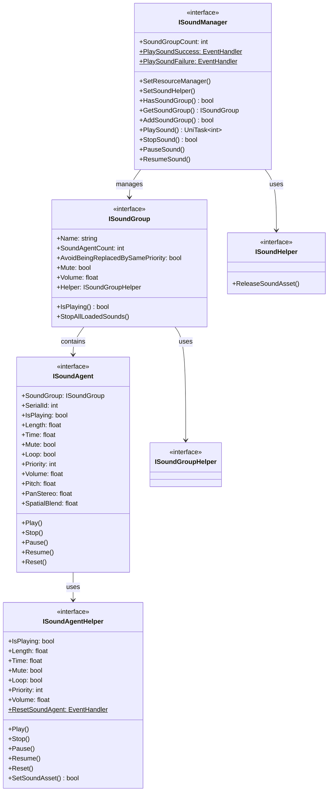

# インターフェース定義

このドキュメント詳細介绍 GameFrameX 声音系统中定義的所有コアインターフェース。インターフェース采用分层設計，提供します对声音マネージャー、声音组、声音代理及辅助器的完全な抽象。

## 概要

GameFrameX 声音系统采用了经典的分层アーキテクチャ，通过インターフェース定義実装了高度的可拡張性和可テスト性。系统パッケージ含以下コアインターフェース：

- **ISoundManager** - 声音マネージャーインターフェース，负责全局声音リソース管理和再生控制
- **ISoundGroup** - 声音组インターフェース，管理一组相关声音的再生行为
- **ISoundAgent** - 声音代理インターフェース，控制单个声音インスタンス的再生
- **ISoundHelper** - 声音辅助器インターフェース，用于リソース解放
- **ISoundGroupHelper** - 声音组辅助器インターフェース
- **ISoundAgentHelper** - 声音代理辅助器インターフェース

这种分层設計使得開発者〜できます针对不同プラットフォーム（如 FMOD、CRIWARE）実装特定的辅助器，同時に保持上层コード的一致性。

## インターフェースアーキテクチャ



## ISoundManager インターフェース

ISoundManager 是声音系统的コアインターフェース，継承自 GameFrameworkModule，提供全局声音管理機能。

### コアプロパティ

| プロパティ | タイプ | 説明 |
|------|------|------|
| SoundGroupCount | `int` | 取得当前已追加的声音组数量 |
| PlaySoundSuccess | `EventHandler<PlaySoundSuccessEventArgs>`` | 播放声音成功事件 |
| PlaySoundFailure | `EventHandler<PlaySoundFailureEventArgs>` | 再生声音失敗イベント |

### コアメソッド

#### 設定リソースマネージャー

```csharp
void SetResourceManager(IAssetManager assetManager)
```

設定リソースマネージャー，用于非同期ロード声音リソース。

> Source: [ISoundManager.cs](https://github.com/GameFrameX/com.gameframex.unity.sound/blob/main/Runtime/Interface/ISoundManager.cs#L62-L64)

#### 設定声音辅助器

```csharp
void SetSoundHelper(ISoundHelper soundHelper)
```

設定声音辅助器，用于解放声音リソース。

> Source: [ISoundManager.cs](https://github.com/GameFrameX/com.gameframex.unity.sound/blob/main/Runtime/Interface/ISoundManager.cs#L67-L70)

#### 追加声音组

```csharp
bool AddSoundGroup(string soundGroupName, ISoundGroupHelper soundGroupHelper)
bool AddSoundGroup(string soundGroupName, bool soundGroupAvoidBeingReplacedBySamePriority, bool soundGroupMute, float soundGroupVolume, ISoundGroupHelper soundGroupHelper)
```

追加新的声音组。第1个オーバーロード使用デフォルトパラメータ，第2个オーバーロード允许指定完全な設定。

**パラメータ：**
- `soundGroupName` - 声音组名称，用于标识和取得声音组
- `soundGroupAvoidBeingReplacedBySamePriority` - 同优先级声音是否避免被置換
- `soundGroupMute` - 声音组是否静音
- `soundGroupVolume` - 声音组音量（0.0-1.0）
- `soundGroupHelper` - 声音组辅助器インスタンス

> Source: [ISoundManager.cs](https://github.com/GameFrameX/com.gameframex.unity.sound/blob/main/Runtime/Interface/ISoundManager.cs#L98-L115)

#### 取得声音组

```csharp
bool HasSoundGroup(string soundGroupName)
ISoundGroup GetSoundGroup(string soundGroupName)
ISoundGroup[] GetAllSoundGroups()
void GetAllSoundGroups(List<ISoundGroup> results)
```

取得已追加的声音组。サポート按名称查询和取得全部声音组。

> Source: [ISoundManager.cs](https://github.com/GameFrameX/com.gameframex.unity.sound/blob/main/Runtime/Interface/ISoundManager.cs#L72-L96)

#### 再生声音

```csharp
UniTask<int> PlaySound(string soundAssetName, string soundGroupName)
UniTask<int> PlaySound(string soundAssetName, string soundGroupName, int priority)
UniTask<int> PlaySound(string soundAssetName, string soundGroupName, PlaySoundParams playSoundParams)
UniTask<int> PlaySound(string soundAssetName, string soundGroupName, object userData)
UniTask<int> PlaySound(string soundAssetName, string soundGroupName, int priority, PlaySoundParams playSoundParams)
UniTask<int> PlaySound(string soundAssetName, string soundGroupName, int priority, object userData)
UniTask<int> PlaySound(string soundAssetName, string soundGroupName, PlaySoundParams playSoundParams, object userData)
UniTask<int> PlaySound(string soundAssetName, string soundGroupName, int priority, PlaySoundParams playSoundParams, object userData, int serialId)
```

再生声音リソース的コアメソッド，提供多个オーバーロード以满足不同シーン需求。返す声音的序列编号（SerialId），用于后续再生控制。

**パラメータ：**
- `soundAssetName` - 声音リソース名称
- `soundGroupName` - 声音组名称
- `priority` - ロード优先级
- `playSoundParams` - 再生パラメータ（音调、音量、循环等）
- `userData` - ユーザー自定義数据，会在イベント中回传
- `serialId` - 指定序列编号

> Source: [ISoundManager.cs](https://github.com/GameFrameX/com.gameframex.unity.sound/blob/main/Runtime/Interface/ISoundManager.cs#L143-L218)

#### 停止声音

```csharp
bool StopSound(int serialId)
bool StopSound(int serialId, float fadeOutSeconds)
```

停止指定序列编号的声音再生。第2个オーバーロードサポート淡出效果。

> Source: [ISoundManager.cs](https://github.com/GameFrameX/com.gameframex.unity.sound/blob/main/Runtime/Interface/ISoundManager.cs#L220-L233)

#### 停止所有声音

```csharp
void StopAllLoadedSounds()
void StopAllLoadedSounds(float fadeOutSeconds)
void StopAllLoadingSounds()
```

停止所有已ロード或〜中ロード的声音。

> Source: [ISoundManager.cs](https://github.com/GameFrameX/com.gameframex.unity.sound/blob/main/Runtime/Interface/ISoundManager.cs#L235-L249)

#### 暂停/恢复声音

```csharp
void PauseSound(int serialId)
void PauseSound(int serialId, float fadeOutSeconds)
void ResumeSound(int serialId)
void ResumeSound(int serialId, float fadeInSeconds)
```

暂停和恢复指定声音的再生。サポート淡入淡出效果。

> Source: [ISoundManager.cs](https://github.com/GameFrameX/com.gameframex.unity.sound/blob/main/Runtime/Interface/ISoundManager.cs#L251-L275)

#### 查询ロードステータス

```csharp
int[] GetAllLoadingSoundSerialIds()
void GetAllLoadingSoundSerialIds(List<int> results)
bool IsLoadingSound(int serialId)
```

查询当前〜中ロード的声音序列编号。

> Source: [ISoundManager.cs](https://github.com/GameFrameX/com.gameframex.unity.sound/blob/main/Runtime/Interface/ISoundManager.cs#L124-L141)

---

## ISoundGroup インターフェース

ISoundGroup 表示声音组，用于管理一组相关的声音。每个声音组有自己的音量控制、静音設定和置換策略。

### プロパティ

| プロパティ | タイプ | 读写 | 説明 |
|------|------|------|------|
| Name | `string` | 只读 | 声音组名称 |
| SoundAgentCount | `int` | 只读 | 声音代理数量 |
| AvoidBeingReplacedBySamePriority | `bool` | 读写 | 同优先级声音是否避免被置換 |
| Mute | `bool` | 读写 | 声音组静音ステータス |
| Volume | `float` | 读写 | 声音组音量（0.0-1.0） |
| Helper | `ISoundGroupHelper` | 只读 | 声音组辅助器 |

> Source: [ISoundGroup.cs](https://github.com/GameFrameX/com.gameframex.unity.sound/blob/main/Runtime/Interface/ISoundGroup.cs#L38-L68)

### メソッド

#### 確認再生ステータス

```csharp
bool IsPlaying(int serialId)
```

確認指定序列编号的声音是否〜中再生。もし找不到指定的序列编号也会返す false。

> Source: [ISoundGroup.cs](https://github.com/GameFrameX/com.gameframex.unity.sound/blob/main/Runtime/Interface/ISoundGroup.cs#L70-L75)

#### 停止所有声音

```csharp
void StopAllLoadedSounds()
void StopAllLoadedSounds(float fadeOutSeconds)
```

停止该声音组中所有已ロード的声音。

> Source: [ISoundGroup.cs](https://github.com/GameFrameX/com.gameframex.unity.sound/blob/main/Runtime/Interface/ISoundGroup.cs#L77-L86)

---

## ISoundAgent インターフェース

ISoundAgent 表示声音代理，是实际控制音频再生的最小单元。每个声音代理对应一个〜中再生或已暂停的声音インスタンス。

### プロパティ

| プロパティ | タイプ | 读写 | 説明 |
|------|------|------|------|
| SoundGroup | `ISoundGroup` | 只读 | 所属声音组 |
| SerialId | `int` | 只读 | 序列编号 |
| IsPlaying | `bool` | 只读 | 是否〜中再生 |
| Length | `float` | 只读 | 声音长度（秒） |
| Time | `float` | 读写 | 当前再生位置（秒） |
| Mute | `bool` | 只读 | 静音ステータス |
| MuteInSoundGroup | `bool` | 读写 | 在组内是否静音 |
| Loop | `bool` | 读写 | 是否循环再生 |
| Priority | `int` | 读写 | 再生优先级 |
| Volume | `float` | 只读 | 当前音量 |
| VolumeInSoundGroup | `float` | 读写 | 在组内音量 |
| Pitch | `float` | 读写 | 音调 |
| PanStereo | `float` | 读写 | 立体声声相（-1.0到1.0） |
| SpatialBlend | `float` | 读写 | 空间混合量（0.0到1.0） |
| MaxDistance | `float` | 读写 | 最大距离 |
| DopplerLevel | `float` | 读写 | 多普勒等级 |
| Helper | `ISoundAgentHelper` | 只读 | 代理辅助器 |

> Source: [ISoundAgent.cs](https://github.com/GameFrameX/com.gameframex.unity.sound/blob/main/Runtime/Interface/ISoundAgent.cs#L38-L123)

### メソッド

#### 再生

```csharp
void Play()
void Play(float fadeInSeconds)
```

开始或恢复声音再生。第2个オーバーロードサポート淡入效果。

> Source: [ISoundAgent.cs](https://github.com/GameFrameX/com.gameframex.unity.sound/blob/main/Runtime/Interface/ISoundAgent.cs#L125-L134)

#### 停止

```csharp
void Stop()
void Stop(float fadeOutSeconds)
```

停止声音再生。第2个オーバーロードサポート淡出效果。

> Source: [ISoundAgent.cs](https://github.com/GameFrameX/com.gameframex.unity.sound/blob/main/Runtime/Interface/ISoundAgent.cs#L136-L145)

#### 暂停

```csharp
void Pause()
void Pause(float fadeOutSeconds)
```

暂停声音再生。第2个オーバーロードサポート淡出效果。

> Source: [ISoundAgent.cs](https://github.com/GameFrameX/com.gameframex.unity.sound/blob/main/Runtime/Interface/ISoundAgent.cs#L147-L156)

#### 恢复

```csharp
void Resume()
void Resume(float fadeInSeconds)
```

恢复暂停的声音再生。第2个オーバーロードサポート淡入效果。

> Source: [ISoundAgent.cs](https://github.com/GameFrameX/com.gameframex.unity.sound/blob/main/Runtime/Interface/ISoundAgent.cs#L158-L167)

#### 重置

```csharp
void Reset()
```

重置声音代理到初始ステータス。

> Source: [ISoundAgent.cs](https://github.com/GameFrameX/com.gameframex.unity.sound/blob/main/Runtime/Interface/ISoundAgent.cs#L169-L172)

---

## ISoundHelper インターフェース

ISoundHelper 是最シンプル的インターフェース，用于解放声音リソース。

### メソッド

```csharp
void ReleaseSoundAsset(object soundAsset)
```

解放指定的声音リソース。

> Source: [ISoundHelper.cs](https://github.com/GameFrameX/com.gameframex.unity.sound/blob/main/Runtime/Interface/ISoundHelper.cs#L38-L45)

---

## ISoundGroupHelper インターフェース

ISoundGroupHelper 是声音组辅助器的标记インターフェース。目前没有定義任何メソッド，仅作为基底クラス标识使用。

> Source: [ISoundGroupHelper.cs](https://github.com/GameFrameX/com.gameframex.unity.sound/blob/main/Runtime/Interface/ISoundGroupHelper.cs#L38-L40)

---

## ISoundAgentHelper インターフェース

ISoundAgentHelper 是声音代理辅助器インターフェース，提供底层音频再生控制。该インターフェース与 ISoundAgent 类似，但面向底层実装。

### プロパティ

| プロパティ | タイプ | 读写 | 説明 |
|------|------|------|------|
| IsPlaying | `bool` | 只读 | 是否〜中再生 |
| Length | `float` | 只读 | 声音长度（秒） |
| Time | `float` | 读写 | 当前再生位置（秒） |
| Mute | `bool` | 读写 | 静音ステータス |
| Loop | `bool` | 读写 | 是否循环再生 |
| Priority | `int` | 读写 | 再生优先级 |
| Volume | `float` | 读写 | 音量大小 |
| Pitch | `float` | 读写 | 音调 |
| PanStereo | `float` | 读写 | 立体声声相 |
| SpatialBlend | `float` | 读写 | 空间混合量 |
| MaxDistance | `float` | 读写 | 最大距离 |
| DopplerLevel | `float` | 读写 | 多普勒等级 |

### イベント

```csharp
event EventHandler<ResetSoundAgentEventArgs> ResetSoundAgent
```

当声音代理被重置时トリガー的イベント。

### メソッド

#### 再生

```csharp
void Play(float fadeInSeconds)
```

以指定淡入时间再生声音。

> Source: [ISoundAgentHelper.cs](https://github.com/GameFrameX/com.gameframex.unity.sound/blob/main/Runtime/Interface/ISoundAgentHelper.cs#L107-L111)

#### 停止

```csharp
void Stop(float fadeOutSeconds)
```

以指定淡出时间停止声音。

> Source: [ISoundAgentHelper.cs](https://github.com/GameFrameX/com.gameframex.unity.sound/blob/main/Runtime/Interface/ISoundAgentHelper.cs#L113-L117)

#### 暂停

```csharp
void Pause(float fadeOutSeconds)
```

以指定淡出时间暂停声音。

> Source: [ISoundAgentHelper.cs](https://github.com/GameFrameX/com.gameframex.unity.sound/blob/main/Runtime/Interface/ISoundAgentHelper.cs#L119-L123)

#### 恢复

```csharp
void Resume(float fadeInSeconds)
```

以指定淡入时间恢复声音。

> Source: [ISoundAgentHelper.cs](https://github.com/GameFrameX/com.gameframex.unity.sound/blob/main/Runtime/Interface/ISoundAgentHelper.cs#L125-L129)

#### 重置

```csharp
void Reset()
```

重置辅助器到初始ステータス。

> Source: [ISoundAgentHelper.cs](https://github.com/GameFrameX/com.gameframex.unity.sound/blob/main/Runtime/Interface/ISoundAgentHelper.cs#L131-L134)

#### 設定声音リソース

```csharp
bool SetSoundAsset(object soundAsset)
```

設定要再生的声音リソース。返す是否設定成功。

> Source: [ISoundAgentHelper.cs](https://github.com/GameFrameX/com.gameframex.unity.sound/blob/main/Runtime/Interface/ISoundAgentHelper.cs#L136-L141)

---

## イベントパラメータ

系统定義了以下イベントパラメータタイプ用于コールバック：

### PlaySoundSuccessEventArgs

再生声音成功时トリガー的イベントパラメータ。

| プロパティ | タイプ | 説明 |
|------|------|------|
| SerialId | `int` | 声音的序列编号 |
| SoundAssetName | `string` | 声音リソース名称 |
| SoundAgent | `ISoundAgent` | 用于再生的声音代理 |
| Duration | `float` | ロード持续时间 |
| UserData | `object` | ユーザー自定義数据 |

> Source: [PlaySoundSuccessEventArgs.cs](https://github.com/GameFrameX/com.gameframex.unity.sound/blob/main/Runtime/EventArgs/PlaySoundSuccessEventArgs.cs)

### PlaySoundFailureEventArgs

再生声音失敗时トリガー的イベントパラメータ。

| プロパティ | タイプ | 説明 |
|------|------|------|
| SerialId | `int` | 声音的序列编号 |
| SoundAssetName | `string` | 声音リソース名称 |
| SoundGroupName | `string` | 声音组名称 |
| PlaySoundParams | `PlaySoundParams` | 再生パラメータ |
| ErrorCode | `PlaySoundErrorCode` | エラー码 |
| ErrorMessage | `string` | エラー情報 |
| UserData | `object` | ユーザー自定義数据 |

> Source: [PlaySoundFailureEventArgs.cs](https://github.com/GameFrameX/com.gameframex.unity.sound/blob/main/Runtime/EventArgs/PlaySoundFailureEventArgs.cs)

---

## 使用例

### 监听再生イベント

```csharp
var soundManager = GameFrameworkEntry.GetModule<ISoundManager>();
soundManager.PlaySoundSuccess += OnPlaySoundSuccess;
soundManager.PlaySoundFailure += OnPlaySoundFailure;

private void OnPlaySoundSuccess(object sender, PlaySoundSuccessEventArgs e)
{
    Debug.Log($"声音播放成功: {e.SoundAssetName}, 序列编号: {e.SerialId}");
}

private void OnPlaySoundFailure(object sender, PlaySoundFailureEventArgs e)
{
    Debug.LogError($"声音播放失败: {e.SoundAssetName}, 错误: {e.ErrorMessage}");
}
```

### 再生带パラメータ的声音

```csharp
var playParams = PlaySoundParams.Create(loop: false);
playParams.Pitch = 1.0f;
playParams.VolumeInSoundGroup = 0.8f;
playParams.Priority = 100;

int serialId = await soundManager.PlaySound("bgm_music", "BGM", playParams);
```

### 控制声音组音量

```csharp
ISoundGroup bgmGroup = soundManager.GetSoundGroup("BGM");
if (bgmGroup != null)
{
    bgmGroup.Volume = 0.5f;
    bgmGroup.Mute = false;
}
```

---

## 関連リンク

- [再生パラメータ](./5-api-reference.2-play-sound-params) - PlaySoundParams 詳細設定
- [イベントパラメータ](./5-api-reference.3-event-args) - イベントパラメータ詳細説明
- [声音マネージャー](./4-core-concepts.1-sound-manager) - 声音マネージャーコアコンセプト
- [声音组](./4-core-concepts.2-sound-group) - 声音组コアコンセプト
- [声音代理](./4-core-concepts.3-sound-agent) - 声音代理コアコンセプト
