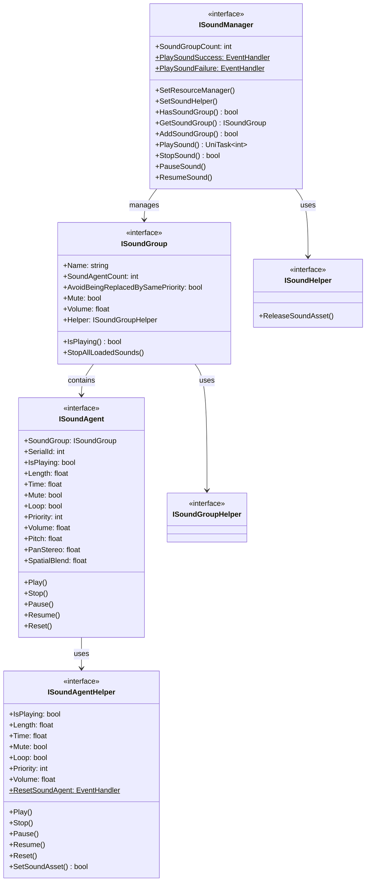

# インターフェース

ドキュメント GameFrameX のコアインターフェース。インターフェース，たマネージャー、、の。

## 

GameFrameX たのアーキテクチャ，をじてインターフェースたのとテスト。むコアインターフェース：

- **ISoundManager** - マネージャーインターフェース，グローバルリソースと
- **ISoundGroup** - インターフェース，の
- **ISoundAgent** - インターフェース，の
- **ISoundHelper** - インターフェース，にリソース
- **ISoundGroupHelper** - インターフェース
- **ISoundAgentHelper** - インターフェース

プラットフォーム（ FMOD、CRIWARE）の，コードの。

## インターフェースアーキテクチャ



## ISoundManager インターフェース

ISoundManager はのコアインターフェース， GameFrameworkModule，グローバル。

### コアプロパティ

| プロパティ | タイプ |  |
|------|------|------|
| SoundGroupCount | `int` | の |
| PlaySoundSuccess | `EventHandler<PlaySoundSuccessEventArgs>`` | イベント |
| PlaySoundFailure | `EventHandler<PlaySoundFailureEventArgs>` | イベント |

### コアメソッド

#### リソースマネージャー

```csharp
void SetResourceManager(IAssetManager assetManager)
```

リソースマネージャー，にロードリソース。

> Source: [ISoundManager.cs](https://github.com/GameFrameX/com.gameframex.unity.sound/blob/main/Runtime/Interface/ISoundManager.cs#L62-L64)

#### 

```csharp
void SetSoundHelper(ISoundHelper soundHelper)
```

，にリソース。

> Source: [ISoundManager.cs](https://github.com/GameFrameX/com.gameframex.unity.sound/blob/main/Runtime/Interface/ISoundManager.cs#L67-L70)

#### 

```csharp
bool AddSoundGroup(string soundGroupName, ISoundGroupHelper soundGroupHelper)
bool AddSoundGroup(string soundGroupName, bool soundGroupAvoidBeingReplacedBySamePriority, bool soundGroupMute, float soundGroupVolume, ISoundGroupHelper soundGroupHelper)
```

の。デフォルトパラメータ，。

**パラメータ：**
- `soundGroupName` - ，にと
- `soundGroupAvoidBeingReplacedBySamePriority` - は
- `soundGroupMute` - は
- `soundGroupVolume` - （0.0-1.0）
- `soundGroupHelper` - 

> Source: [ISoundManager.cs](https://github.com/GameFrameX/com.gameframex.unity.sound/blob/main/Runtime/Interface/ISoundManager.cs#L98-L115)

#### 

```csharp
bool HasSoundGroup(string soundGroupName)
ISoundGroup GetSoundGroup(string soundGroupName)
ISoundGroup[] GetAllSoundGroups()
void GetAllSoundGroups(List<ISoundGroup> results)
```

の。サポートと。

> Source: [ISoundManager.cs](https://github.com/GameFrameX/com.gameframex.unity.sound/blob/main/Runtime/Interface/ISoundManager.cs#L72-L96)

#### 

```csharp
UniTask<int> PlaySound(string soundAssetName, string soundGroupName)
UniTask<int> PlaySound(string soundAssetName, string soundGroupName, int priority)
UniTask<int> PlaySound(string soundAssetName, string soundGroupName, PlaySoundParams playSoundParams)
UniTask<int> PlaySound(string soundAssetName, string soundGroupName, object userData)
UniTask<int> PlaySound(string soundAssetName, string soundGroupName, int priority, PlaySoundParams playSoundParams)
UniTask<int> PlaySound(string soundAssetName, string soundGroupName, int priority, object userData)
UniTask<int> PlaySound(string soundAssetName, string soundGroupName, PlaySoundParams playSoundParams, object userData)
UniTask<int> PlaySound(string soundAssetName, string soundGroupName, int priority, PlaySoundParams playSoundParams, object userData, int serialId)
```

リソースのコアメソッド，。すの（SerialId），に。

**パラメータ：**
- `soundAssetName` - リソース
- `soundGroupName` - 
- `priority` - ロード
- `playSoundParams` - パラメータ（、、）
- `userData` - カスタマイズデータ，にイベント
- `serialId` - 

> Source: [ISoundManager.cs](https://github.com/GameFrameX/com.gameframex.unity.sound/blob/main/Runtime/Interface/ISoundManager.cs#L143-L218)

#### 

```csharp
bool StopSound(int serialId)
bool StopSound(int serialId, float fadeOutSeconds)
```

の。サポート。

> Source: [ISoundManager.cs](https://github.com/GameFrameX/com.gameframex.unity.sound/blob/main/Runtime/Interface/ISoundManager.cs#L220-L233)

#### 

```csharp
void StopAllLoadedSounds()
void StopAllLoadedSounds(float fadeOutSeconds)
void StopAllLoadingSounds()
```

ロードにロードの。

> Source: [ISoundManager.cs](https://github.com/GameFrameX/com.gameframex.unity.sound/blob/main/Runtime/Interface/ISoundManager.cs#L235-L249)

#### /

```csharp
void PauseSound(int serialId)
void PauseSound(int serialId, float fadeOutSeconds)
void ResumeSound(int serialId)
void ResumeSound(int serialId, float fadeInSeconds)
```

との。サポート。

> Source: [ISoundManager.cs](https://github.com/GameFrameX/com.gameframex.unity.sound/blob/main/Runtime/Interface/ISoundManager.cs#L251-L275)

#### ロード

```csharp
int[] GetAllLoadingSoundSerialIds()
void GetAllLoadingSoundSerialIds(List<int> results)
bool IsLoadingSound(int serialId)
```

にロードの。

> Source: [ISoundManager.cs](https://github.com/GameFrameX/com.gameframex.unity.sound/blob/main/Runtime/Interface/ISoundManager.cs#L124-L141)

---

## ISoundGroup インターフェース

ISoundGroup ，にの。の、と。

### プロパティ

| プロパティ | タイプ |  |  |
|------|------|------|------|
| Name | `string` |  |  |
| SoundAgentCount | `int` |  |  |
| AvoidBeingReplacedBySamePriority | `bool` |  | は |
| Mute | `bool` |  |  |
| Volume | `float` |  | （0.0-1.0） |
| Helper | `ISoundGroupHelper` |  |  |

> Source: [ISoundGroup.cs](https://github.com/GameFrameX/com.gameframex.unity.sound/blob/main/Runtime/Interface/ISoundGroup.cs#L38-L68)

### メソッド

#### 

```csharp
bool IsPlaying(int serialId)
```

のはに。のす false。

> Source: [ISoundGroup.cs](https://github.com/GameFrameX/com.gameframex.unity.sound/blob/main/Runtime/Interface/ISoundGroup.cs#L70-L75)

#### 

```csharp
void StopAllLoadedSounds()
void StopAllLoadedSounds(float fadeOutSeconds)
```

ロードの。

> Source: [ISoundGroup.cs](https://github.com/GameFrameX/com.gameframex.unity.sound/blob/main/Runtime/Interface/ISoundGroup.cs#L77-L86)

---

## ISoundAgent インターフェース

ISoundAgent ，はの。にの。

### プロパティ

| プロパティ | タイプ |  |  |
|------|------|------|------|
| SoundGroup | `ISoundGroup` |  |  |
| SerialId | `int` |  |  |
| IsPlaying | `bool` |  | はに |
| Length | `float` |  | （） |
| Time | `float` |  | （） |
| Mute | `bool` |  |  |
| MuteInSoundGroup | `bool` |  | には |
| Loop | `bool` |  | は |
| Priority | `int` |  |  |
| Volume | `float` |  |  |
| VolumeInSoundGroup | `float` |  | に |
| Pitch | `float` |  |  |
| PanStereo | `float` |  | （-1.01.0） |
| SpatialBlend | `float` |  | （0.01.0） |
| MaxDistance | `float` |  |  |
| DopplerLevel | `float` |  |  |
| Helper | `ISoundAgentHelper` |  |  |

> Source: [ISoundAgent.cs](https://github.com/GameFrameX/com.gameframex.unity.sound/blob/main/Runtime/Interface/ISoundAgent.cs#L38-L123)

### メソッド

#### 

```csharp
void Play()
void Play(float fadeInSeconds)
```

。サポート。

> Source: [ISoundAgent.cs](https://github.com/GameFrameX/com.gameframex.unity.sound/blob/main/Runtime/Interface/ISoundAgent.cs#L125-L134)

#### 

```csharp
void Stop()
void Stop(float fadeOutSeconds)
```

。サポート。

> Source: [ISoundAgent.cs](https://github.com/GameFrameX/com.gameframex.unity.sound/blob/main/Runtime/Interface/ISoundAgent.cs#L136-L145)

#### 

```csharp
void Pause()
void Pause(float fadeOutSeconds)
```

。サポート。

> Source: [ISoundAgent.cs](https://github.com/GameFrameX/com.gameframex.unity.sound/blob/main/Runtime/Interface/ISoundAgent.cs#L147-L156)

#### 

```csharp
void Resume()
void Resume(float fadeInSeconds)
```

の。サポート。

> Source: [ISoundAgent.cs](https://github.com/GameFrameX/com.gameframex.unity.sound/blob/main/Runtime/Interface/ISoundAgent.cs#L158-L167)

#### 

```csharp
void Reset()
```

。

> Source: [ISoundAgent.cs](https://github.com/GameFrameX/com.gameframex.unity.sound/blob/main/Runtime/Interface/ISoundAgent.cs#L169-L172)

---

## ISoundHelper インターフェース

ISoundHelper はシンプルのインターフェース，にリソース。

### メソッド

```csharp
void ReleaseSoundAsset(object soundAsset)
```

のリソース。

> Source: [ISoundHelper.cs](https://github.com/GameFrameX/com.gameframex.unity.sound/blob/main/Runtime/Interface/ISoundHelper.cs#L38-L45)

---

## ISoundGroupHelper インターフェース

ISoundGroupHelper はのインターフェース。メソッド，クラス。

> Source: [ISoundGroupHelper.cs](https://github.com/GameFrameX/com.gameframex.unity.sound/blob/main/Runtime/Interface/ISoundGroupHelper.cs#L38-L40)

---

## ISoundAgentHelper インターフェース

ISoundAgentHelper はインターフェース，。インターフェースと ISoundAgent クラス，。

### プロパティ

| プロパティ | タイプ |  |  |
|------|------|------|------|
| IsPlaying | `bool` |  | はに |
| Length | `float` |  | （） |
| Time | `float` |  | （） |
| Mute | `bool` |  |  |
| Loop | `bool` |  | は |
| Priority | `int` |  |  |
| Volume | `float` |  |  |
| Pitch | `float` |  |  |
| PanStereo | `float` |  |  |
| SpatialBlend | `float` |  |  |
| MaxDistance | `float` |  |  |
| DopplerLevel | `float` |  |  |

### イベント

```csharp
event EventHandler<ResetSoundAgentEventArgs> ResetSoundAgent
```

のイベント。

### メソッド

#### 

```csharp
void Play(float fadeInSeconds)
```

。

> Source: [ISoundAgentHelper.cs](https://github.com/GameFrameX/com.gameframex.unity.sound/blob/main/Runtime/Interface/ISoundAgentHelper.cs#L107-L111)

#### 

```csharp
void Stop(float fadeOutSeconds)
```

。

> Source: [ISoundAgentHelper.cs](https://github.com/GameFrameX/com.gameframex.unity.sound/blob/main/Runtime/Interface/ISoundAgentHelper.cs#L113-L117)

#### 

```csharp
void Pause(float fadeOutSeconds)
```

。

> Source: [ISoundAgentHelper.cs](https://github.com/GameFrameX/com.gameframex.unity.sound/blob/main/Runtime/Interface/ISoundAgentHelper.cs#L119-L123)

#### 

```csharp
void Resume(float fadeInSeconds)
```

。

> Source: [ISoundAgentHelper.cs](https://github.com/GameFrameX/com.gameframex.unity.sound/blob/main/Runtime/Interface/ISoundAgentHelper.cs#L125-L129)

#### 

```csharp
void Reset()
```

。

> Source: [ISoundAgentHelper.cs](https://github.com/GameFrameX/com.gameframex.unity.sound/blob/main/Runtime/Interface/ISoundAgentHelper.cs#L131-L134)

#### リソース

```csharp
bool SetSoundAsset(object soundAsset)
```

のリソース。すは。

> Source: [ISoundAgentHelper.cs](https://github.com/GameFrameX/com.gameframex.unity.sound/blob/main/Runtime/Interface/ISoundAgentHelper.cs#L136-L141)

---

## イベント

たイベントタイプに：

### PlaySoundSuccessEventArgs

のイベント。

| プロパティ | タイプ |  |
|------|------|------|
| SerialId | `int` | の |
| SoundAssetName | `string` | リソース |
| SoundAgent | `ISoundAgent` | にの |
| Duration | `float` | ロード |
| UserData | `object` | カスタマイズデータ |

> Source: [PlaySoundSuccessEventArgs.cs](https://github.com/GameFrameX/com.gameframex.unity.sound/blob/main/Runtime/EventArgs/PlaySoundSuccessEventArgs.cs)

### PlaySoundFailureEventArgs

のイベント。

| プロパティ | タイプ |  |
|------|------|------|
| SerialId | `int` | の |
| SoundAssetName | `string` | リソース |
| SoundGroupName | `string` |  |
| PlaySoundParams | `PlaySoundParams` | パラメータ |
| ErrorCode | `PlaySoundErrorCode` | エラー |
| ErrorMessage | `string` | エラー |
| UserData | `object` | カスタマイズデータ |

> Source: [PlaySoundFailureEventArgs.cs](https://github.com/GameFrameX/com.gameframex.unity.sound/blob/main/Runtime/EventArgs/PlaySoundFailureEventArgs.cs)

---

## 

### イベント

```csharp
var soundManager = GameFrameworkEntry.GetModule<ISoundManager>();
soundManager.PlaySoundSuccess += OnPlaySoundSuccess;
soundManager.PlaySoundFailure += OnPlaySoundFailure;

private void OnPlaySoundSuccess(object sender, PlaySoundSuccessEventArgs e)
{
    Debug.Log($"声音播放成功: {e.SoundAssetName}, 序列编号: {e.SerialId}");
}

private void OnPlaySoundFailure(object sender, PlaySoundFailureEventArgs e)
{
    Debug.LogError($"声音播放失敗: {e.SoundAssetName}, エラー: {e.ErrorMessage}");
}
```

### パラメータの

```csharp
var playParams = PlaySoundParams.Create(loop: false);
playParams.Pitch = 1.0f;
playParams.VolumeInSoundGroup = 0.8f;
playParams.Priority = 100;

int serialId = await soundManager.PlaySound("bgm_music", "BGM", playParams);
```

### 

```csharp
ISoundGroup bgmGroup = soundManager.GetSoundGroup("BGM");
if (bgmGroup != null)
{
    bgmGroup.Volume = 0.5f;
    bgmGroup.Mute = false;
}
```

---

## リンク

- [パラメータ](./5-api-reference.2-play-sound-params) - PlaySoundParams 
- [イベント](./5-api-reference.3-event-args) - イベント
- [マネージャー](./4-core-concepts.1-sound-manager) - マネージャーコアコンセプト
- [](./4-core-concepts.2-sound-group) - コアコンセプト
- [](./4-core-concepts.3-sound-agent) - コアコンセプト
