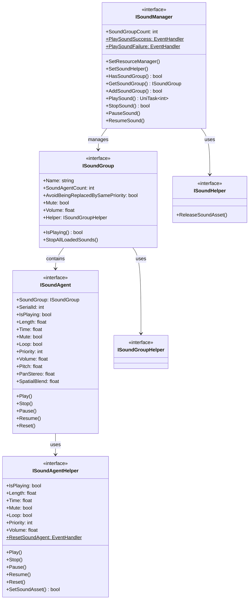

# インターフェース定义

本文档详细介绍 GameFrameX サウンド系统中定义的所有コアインターフェース。インターフェース采用分层设计，提供します对サウンド管理器、サウンド组、サウンド代理及辅助器的完整抽象。

## 概要

GameFrameX サウンド系统采用了经典的分层架构，を通じてインターフェース定义実装了高度的可扩展性和可测试性。系统包含以下コアインターフェース：

- **ISoundManager** - サウンド管理器インターフェース，负责全局サウンドリソース管理和播放控制
- **ISoundGroup** - サウンド组インターフェース，管理一组関連サウンド的播放行为
- **ISoundAgent** - サウンド代理インターフェース，控制单个サウンドインスタンス的播放
- **ISoundHelper** - サウンド辅助器インターフェース，に使用リソース释放
- **ISoundGroupHelper** - サウンド组辅助器インターフェース
- **ISoundAgentHelper** - サウンド代理辅助器インターフェース

这种分层设计使得開発者可能针对不同平台（如 FMOD、CRIWARE）実装特定的辅助器，同时保持上层代码的一致性。

## インターフェース架构



## ISoundManager インターフェース

ISoundManager 是サウンド系统的コアインターフェース，を継承 GameFrameworkModule，提供全局サウンド管理機能。

### コアプロパティ

| プロパティ | クラス型 | 説明 |
|------|------|------|
| SoundGroupCount | `int` | 取得当前已添加的サウンド组数量 |
| PlaySoundSuccess | `EventHandler<PlaySoundSuccessEventArgs>`` | 播放サウンド成功イベント |
| PlaySoundFailure | `EventHandler<PlaySoundFailureEventArgs>` | 播放サウンド失败イベント |

### コアメソッド

#### 設定リソース管理器

```csharp
void SetResourceManager(IAssetManager assetManager)
```

設定リソース管理器，に使用异步加载サウンドリソース。

> Source: [ISoundManager.cs](https://github.com/GameFrameX/com.gameframex.unity.sound/blob/main/Runtime/Interface/ISoundManager.cs#L62-L64)

#### 設定サウンド辅助器

```csharp
void SetSoundHelper(ISoundHelper soundHelper)
```

設定サウンド辅助器，に使用释放サウンドリソース。

> Source: [ISoundManager.cs](https://github.com/GameFrameX/com.gameframex.unity.sound/blob/main/Runtime/Interface/ISoundManager.cs#L67-L70)

#### 添加サウンド组

```csharp
bool AddSoundGroup(string soundGroupName, ISoundGroupHelper soundGroupHelper)
bool AddSoundGroup(string soundGroupName, bool soundGroupAvoidBeingReplacedBySamePriority, bool soundGroupMute, float soundGroupVolume, ISoundGroupHelper soundGroupHelper)
```

添加新的サウンド组。第一个重载使用默认参数，第二个重载允许指定完整配置。

**参数：**
- `soundGroupName` - サウンド组名称，に使用标识和取得サウンド组
- `soundGroupAvoidBeingReplacedBySamePriority` - 同优先级サウンド是否避免被替换
- `soundGroupMute` - サウンド组是否静音
- `soundGroupVolume` - サウンド组音量（0.0-1.0）
- `soundGroupHelper` - サウンド组辅助器インスタンス

> Source: [ISoundManager.cs](https://github.com/GameFrameX/com.gameframex.unity.sound/blob/main/Runtime/Interface/ISoundManager.cs#L98-L115)

#### 取得サウンド组

```csharp
bool HasSoundGroup(string soundGroupName)
ISoundGroup GetSoundGroup(string soundGroupName)
ISoundGroup[] GetAllSoundGroups()
void GetAllSoundGroups(List<ISoundGroup> results)
```

取得已添加的サウンド组。サポート按名称查询和取得全部サウンド组。

> Source: [ISoundManager.cs](https://github.com/GameFrameX/com.gameframex.unity.sound/blob/main/Runtime/Interface/ISoundManager.cs#L72-L96)

#### 播放サウンド

```csharp
UniTask<int> PlaySound(string soundAssetName, string soundGroupName)
UniTask<int> PlaySound(string soundAssetName, string soundGroupName, int priority)
UniTask<int> PlaySound(string soundAssetName, string soundGroupName, PlaySoundParams playSoundParams)
UniTask<int> PlaySound(string soundAssetName, string soundGroupName, object userData)
UniTask<int> PlaySound(string soundAssetName, string soundGroupName, int priority, PlaySoundParams playSoundParams)
UniTask<int> PlaySound(string soundAssetName, string soundGroupName, int priority, object userData)
UniTask<int> PlaySound(string soundAssetName, string soundGroupName, PlaySoundParams playSoundParams, object userData)
UniTask<int> PlaySound(string soundAssetName, string soundGroupName, int priority, PlaySoundParams playSoundParams, object userData, int serialId)
```

播放サウンドリソース的コアメソッド，提供多个重载以满足不同シーン需求。返回サウンド的序列编号（SerialId），に使用后续播放控制。

**参数：**
- `soundAssetName` - サウンドリソース名称
- `soundGroupName` - サウンド组名称
- `priority` - 加载优先级
- `playSoundParams` - 播放参数（音调、音量、循环等）
- `userData` - 用户自定义数据，会在イベント中回传
- `serialId` - 指定序列编号

> Source: [ISoundManager.cs](https://github.com/GameFrameX/com.gameframex.unity.sound/blob/main/Runtime/Interface/ISoundManager.cs#L143-L218)

#### 停止サウンド

```csharp
bool StopSound(int serialId)
bool StopSound(int serialId, float fadeOutSeconds)
```

停止指定序列编号的サウンド播放。第二个重载サポート淡出效果。

> Source: [ISoundManager.cs](https://github.com/GameFrameX/com.gameframex.unity.sound/blob/main/Runtime/Interface/ISoundManager.cs#L220-L233)

#### 停止所有サウンド

```csharp
void StopAllLoadedSounds()
void StopAllLoadedSounds(float fadeOutSeconds)
void StopAllLoadingSounds()
```

停止所有已加载或正在加载的サウンド。

> Source: [ISoundManager.cs](https://github.com/GameFrameX/com.gameframex.unity.sound/blob/main/Runtime/Interface/ISoundManager.cs#L235-L249)

#### 暂停/恢复サウンド

```csharp
void PauseSound(int serialId)
void PauseSound(int serialId, float fadeOutSeconds)
void ResumeSound(int serialId)
void ResumeSound(int serialId, float fadeInSeconds)
```

暂停和恢复指定サウンド的播放。サポート淡入淡出效果。

> Source: [ISoundManager.cs](https://github.com/GameFrameX/com.gameframex.unity.sound/blob/main/Runtime/Interface/ISoundManager.cs#L251-L275)

#### 查询加载ステータス

```csharp
int[] GetAllLoadingSoundSerialIds()
void GetAllLoadingSoundSerialIds(List<int> results)
bool IsLoadingSound(int serialId)
```

查询当前正在加载的サウンド序列编号。

> Source: [ISoundManager.cs](https://github.com/GameFrameX/com.gameframex.unity.sound/blob/main/Runtime/Interface/ISoundManager.cs#L124-L141)

---

## ISoundGroup インターフェース

ISoundGroup 表示サウンド组，に使用管理一组関連的サウンド。每个サウンド组有自己的音量控制、静音設定和替换策略。

### プロパティ

| プロパティ | クラス型 | 读写 | 説明 |
|------|------|------|------|
| Name | `string` | 只读 | サウンド组名称 |
| SoundAgentCount | `int` | 只读 | サウンド代理数量 |
| AvoidBeingReplacedBySamePriority | `bool` | 读写 | 同优先级サウンド是否避免被替换 |
| Mute | `bool` | 读写 | サウンド组静音ステータス |
| Volume | `float` | 读写 | サウンド组音量（0.0-1.0） |
| Helper | `ISoundGroupHelper` | 只读 | サウンド组辅助器 |

> Source: [ISoundGroup.cs](https://github.com/GameFrameX/com.gameframex.unity.sound/blob/main/Runtime/Interface/ISoundGroup.cs#L38-L68)

### メソッド

#### 检查播放ステータス

```csharp
bool IsPlaying(int serialId)
```

检查指定序列编号的サウンド是否正在播放。如果找不到指定的序列编号也会返回 false。

> Source: [ISoundGroup.cs](https://github.com/GameFrameX/com.gameframex.unity.sound/blob/main/Runtime/Interface/ISoundGroup.cs#L70-L75)

#### 停止所有サウンド

```csharp
void StopAllLoadedSounds()
void StopAllLoadedSounds(float fadeOutSeconds)
```

停止该サウンド组中所有已加载的サウンド。

> Source: [ISoundGroup.cs](https://github.com/GameFrameX/com.gameframex.unity.sound/blob/main/Runtime/Interface/ISoundGroup.cs#L77-L86)

---

## ISoundAgent インターフェース

ISoundAgent 表示サウンド代理，是实际控制音频播放的最小单元。每个サウンド代理对应一个正在播放或已暂停的サウンドインスタンス。

### プロパティ

| プロパティ | クラス型 | 读写 | 説明 |
|------|------|------|------|
| SoundGroup | `ISoundGroup` | 只读 | 所属サウンド组 |
| SerialId | `int` | 只读 | 序列编号 |
| IsPlaying | `bool` | 只读 | 是否正在播放 |
| Length | `float` | 只读 | サウンド长度（秒） |
| Time | `float` | 读写 | 当前播放位置（秒） |
| Mute | `bool` | 只读 | 静音ステータス |
| MuteInSoundGroup | `bool` | 读写 | 在组内是否静音 |
| Loop | `bool` | 读写 | 是否循环播放 |
| Priority | `int` | 读写 | 播放优先级 |
| Volume | `float` | 只读 | 当前音量 |
| VolumeInSoundGroup | `float` | 读写 | 在组内音量 |
| Pitch | `float` | 读写 | 音调 |
| PanStereo | `float` | 读写 | 立体声声相（-1.0到1.0） |
| SpatialBlend | `float` | 读写 | 空间混合量（0.0到1.0） |
| MaxDistance | `float` | 读写 | 最大距离 |
| DopplerLevel | `float` | 读写 | 多普勒等级 |
| Helper | `ISoundAgentHelper` | 只读 | 代理辅助器 |

> Source: [ISoundAgent.cs](https://github.com/GameFrameX/com.gameframex.unity.sound/blob/main/Runtime/Interface/ISoundAgent.cs#L38-L123)

### メソッド

#### 播放

```csharp
void Play()
void Play(float fadeInSeconds)
```

开始或恢复サウンド播放。第二个重载サポート淡入效果。

> Source: [ISoundAgent.cs](https://github.com/GameFrameX/com.gameframex.unity.sound/blob/main/Runtime/Interface/ISoundAgent.cs#L125-L134)

#### 停止

```csharp
void Stop()
void Stop(float fadeOutSeconds)
```

停止サウンド播放。第二个重载サポート淡出效果。

> Source: [ISoundAgent.cs](https://github.com/GameFrameX/com.gameframex.unity.sound/blob/main/Runtime/Interface/ISoundAgent.cs#L136-L145)

#### 暂停

```csharp
void Pause()
void Pause(float fadeOutSeconds)
```

暂停サウンド播放。第二个重载サポート淡出效果。

> Source: [ISoundAgent.cs](https://github.com/GameFrameX/com.gameframex.unity.sound/blob/main/Runtime/Interface/ISoundAgent.cs#L147-L156)

#### 恢复

```csharp
void Resume()
void Resume(float fadeInSeconds)
```

恢复暂停的サウンド播放。第二个重载サポート淡入效果。

> Source: [ISoundAgent.cs](https://github.com/GameFrameX/com.gameframex.unity.sound/blob/main/Runtime/Interface/ISoundAgent.cs#L158-L167)

#### 重置

```csharp
void Reset()
```

重置サウンド代理到初始ステータス。

> Source: [ISoundAgent.cs](https://github.com/GameFrameX/com.gameframex.unity.sound/blob/main/Runtime/Interface/ISoundAgent.cs#L169-L172)

---

## ISoundHelper インターフェース

ISoundHelper 是最简单的インターフェース，に使用释放サウンドリソース。

### メソッド

```csharp
void ReleaseSoundAsset(object soundAsset)
```

释放指定的サウンドリソース。

> Source: [ISoundHelper.cs](https://github.com/GameFrameX/com.gameframex.unity.sound/blob/main/Runtime/Interface/ISoundHelper.cs#L38-L45)

---

## ISoundGroupHelper インターフェース

ISoundGroupHelper 是サウンド组辅助器的标记インターフェース。目前没有定义任何メソッド，仅作为基クラス标识使用。

> Source: [ISoundGroupHelper.cs](https://github.com/GameFrameX/com.gameframex.unity.sound/blob/main/Runtime/Interface/ISoundGroupHelper.cs#L38-L40)

---

## ISoundAgentHelper インターフェース

ISoundAgentHelper 是サウンド代理辅助器インターフェース，提供底层音频播放控制。该インターフェース与 ISoundAgent クラス似，但面向底层実装。

### プロパティ

| プロパティ | クラス型 | 读写 | 説明 |
|------|------|------|------|
| IsPlaying | `bool` | 只读 | 是否正在播放 |
| Length | `float` | 只读 | サウンド长度（秒） |
| Time | `float` | 读写 | 当前播放位置（秒） |
| Mute | `bool` | 读写 | 静音ステータス |
| Loop | `bool` | 读写 | 是否循环播放 |
| Priority | `int` | 读写 | 播放优先级 |
| Volume | `float` | 读写 | 音量大小 |
| Pitch | `float` | 读写 | 音调 |
| PanStereo | `float` | 读写 | 立体声声相 |
| SpatialBlend | `float` | 读写 | 空间混合量 |
| MaxDistance | `float` | 读写 | 最大距离 |
| DopplerLevel | `float` | 读写 | 多普勒等级 |

### イベント

```csharp
event EventHandler<ResetSoundAgentEventArgs> ResetSoundAgent
```

当サウンド代理被重置时触发的イベント。

### メソッド

#### 播放

```csharp
void Play(float fadeInSeconds)
```

以指定淡入时间播放サウンド。

> Source: [ISoundAgentHelper.cs](https://github.com/GameFrameX/com.gameframex.unity.sound/blob/main/Runtime/Interface/ISoundAgentHelper.cs#L107-L111)

#### 停止

```csharp
void Stop(float fadeOutSeconds)
```

以指定淡出时间停止サウンド。

> Source: [ISoundAgentHelper.cs](https://github.com/GameFrameX/com.gameframex.unity.sound/blob/main/Runtime/Interface/ISoundAgentHelper.cs#L113-L117)

#### 暂停

```csharp
void Pause(float fadeOutSeconds)
```

以指定淡出时间暂停サウンド。

> Source: [ISoundAgentHelper.cs](https://github.com/GameFrameX/com.gameframex.unity.sound/blob/main/Runtime/Interface/ISoundAgentHelper.cs#L119-L123)

#### 恢复

```csharp
void Resume(float fadeInSeconds)
```

以指定淡入时间恢复サウンド。

> Source: [ISoundAgentHelper.cs](https://github.com/GameFrameX/com.gameframex.unity.sound/blob/main/Runtime/Interface/ISoundAgentHelper.cs#L125-L129)

#### 重置

```csharp
void Reset()
```

重置辅助器到初始ステータス。

> Source: [ISoundAgentHelper.cs](https://github.com/GameFrameX/com.gameframex.unity.sound/blob/main/Runtime/Interface/ISoundAgentHelper.cs#L131-L134)

#### 設定サウンドリソース

```csharp
bool SetSoundAsset(object soundAsset)
```

設定要播放的サウンドリソース。返回是否設定成功。

> Source: [ISoundAgentHelper.cs](https://github.com/GameFrameX/com.gameframex.unity.sound/blob/main/Runtime/Interface/ISoundAgentHelper.cs#L136-L141)

---

## イベント参数

系统定义了以下イベント参数クラス型に使用回调：

### PlaySoundSuccessEventArgs

播放サウンド成功时触发的イベント参数。

| プロパティ | クラス型 | 説明 |
|------|------|------|
| SerialId | `int` | サウンド的序列编号 |
| SoundAssetName | `string` | サウンドリソース名称 |
| SoundAgent | `ISoundAgent` | に使用播放的サウンド代理 |
| Duration | `float` | 加载持续时间 |
| UserData | `object` | 用户自定义数据 |

> Source: [PlaySoundSuccessEventArgs.cs](https://github.com/GameFrameX/com.gameframex.unity.sound/blob/main/Runtime/EventArgs/PlaySoundSuccessEventArgs.cs)

### PlaySoundFailureEventArgs

播放サウンド失败时触发的イベント参数。

| プロパティ | クラス型 | 説明 |
|------|------|------|
| SerialId | `int` | サウンド的序列编号 |
| SoundAssetName | `string` | サウンドリソース名称 |
| SoundGroupName | `string` | サウンド组名称 |
| PlaySoundParams | `PlaySoundParams` | 播放参数 |
| ErrorCode | `PlaySoundErrorCode` | 错误码 |
| ErrorMessage | `string` | 错误信息 |
| UserData | `object` | 用户自定义数据 |

> Source: [PlaySoundFailureEventArgs.cs](https://github.com/GameFrameX/com.gameframex.unity.sound/blob/main/Runtime/EventArgs/PlaySoundFailureEventArgs.cs)

---

## 使用例

### 监听播放イベント

```csharp
var soundManager = GameFrameworkEntry.GetModule<ISoundManager>();
soundManager.PlaySoundSuccess += OnPlaySoundSuccess;
soundManager.PlaySoundFailure += OnPlaySoundFailure;

private void OnPlaySoundSuccess(object sender, PlaySoundSuccessEventArgs e)
{
    Debug.Log($"サウンド播放成功: {e.SoundAssetName}, 序列编号: {e.SerialId}");
}

private void OnPlaySoundFailure(object sender, PlaySoundFailureEventArgs e)
{
    Debug.LogError($"サウンド播放失败: {e.SoundAssetName}, 错误: {e.ErrorMessage}");
}
```

### 播放带参数的サウンド

```csharp
var playParams = PlaySoundParams.Create(loop: false);
playParams.Pitch = 1.0f;
playParams.VolumeInSoundGroup = 0.8f;
playParams.Priority = 100;

int serialId = await soundManager.PlaySound("bgm_music", "BGM", playParams);
```

### 控制サウンド组音量

```csharp
ISoundGroup bgmGroup = soundManager.GetSoundGroup("BGM");
if (bgmGroup != null)
{
    bgmGroup.Volume = 0.5f;
    bgmGroup.Mute = false;
}
```

---

## 関連リンク

- [播放参数](./5-api-reference.2-play-sound-params) - PlaySoundParams 详细配置
- [イベント参数](./5-api-reference.3-event-args) - イベント参数詳細説明
- [サウンド管理器](./4-core-concepts.1-sound-manager) - サウンド管理器コア概念
- [サウンド组](./4-core-concepts.2-sound-group) - サウンド组コア概念
- [サウンド代理](./4-core-concepts.3-sound-agent) - サウンド代理コア概念
