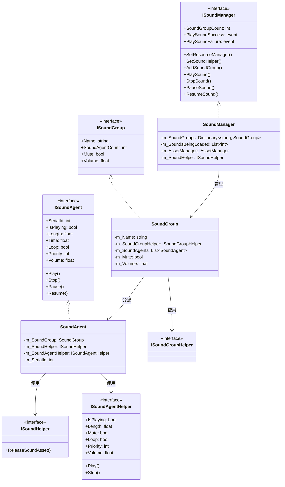
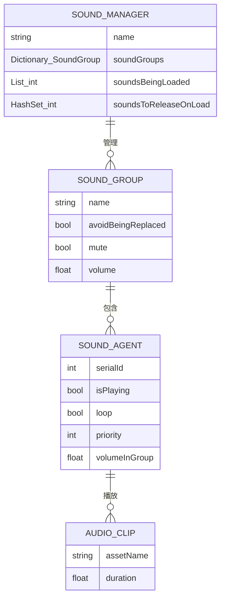
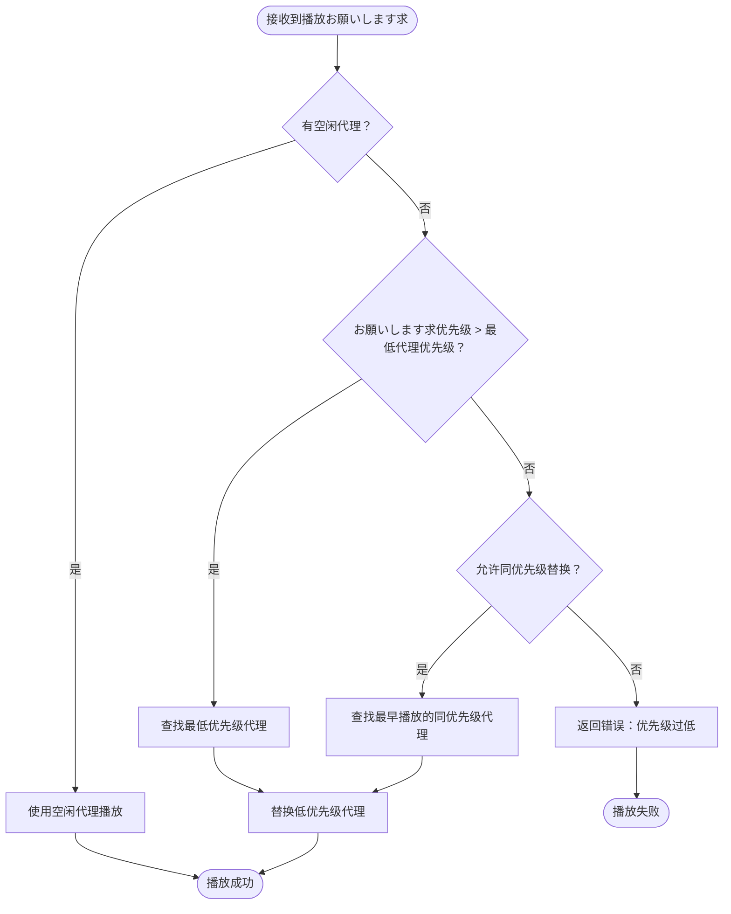

# サウンド管理器

サウンド管理器（SoundManager）是 GameFrameX 音频模块的コアコンポーネント，负责管理ゲーム中的サウンド播放、サウンド组、サウンド代理以及リソース加载等コア機能。它提供します统一的インターフェース来控制背景音乐、音效、语音等各种音频リソース，サポート优先级管理、音量控制、淡入淡出等高级特性。

## 概要

SoundManager 是 GameFrameX フレームワーク中处理所有音频関連操作的コア模块。作为 GameFrameworkModule 的実装クラス，它遵循フレームワーク的モジュラー設計原则，可能与其他フレームワーク模块（如リソース管理器、イベント系统）无缝集成。

**コア职责：**
- 管理多个サウンド组（SoundGroup），每个组可独立控制音量和静音ステータス
- 协调サウンド代理（SoundAgent）的分配，実装优先级调度和リソース复用
- 异步加载音频リソース，サポート YooAsset リソース管理系统
- 触发播放成功/失败イベント，便于ゲーム逻辑响应音频ステータス变化

**设计意图：**
SoundManager 采用分层アーキテクチャ設計，将音频播放的底层実装（SoundAgent）与管理层（SoundManager）分离。这种设计允许開発者を通じて自定义 Helper 来适配不同的音频引擎（如 Unity AudioSource、Fmod、AudioKit），同时保持上层代码的一致性。优先级机制确保重要音效能够及时播放，避免因代理池满导致的サウンド丢失。

```mermaid
flowchart TD
    subgraph SoundManager["サウンド管理器 (SoundManager)"]
        SM[コア管理器]
        SG[サウンド组字典]
        SL[加载中的サウンド列表]
        SR[待释放リソース集合]
    end
    
    subgraph External["外部依赖"]
        AM[リソース管理器]
        SH[サウンド辅助器]
        EC[イベントコンポーネント]
    end
    
    subgraph SoundGroup["サウンド组 (SoundGroup)"]
        SGH[辅助器]
        SAG[サウンド代理列表]
    end
    
    subgraph SoundAgent["サウンド代理 (SoundAgent)"]
        SAH[代理辅助器]
        ASSET[音频リソース]
    end
    
    AM --> SM : 加载音频リソース
    SH --> SM : 释放リソース回调
    SM --> SG : 管理サウンド组
    SG --> SGH
    SGH --> SAG
    SAG --> SAH
    SAH --> ASSET : 播放音频
    SM --> EC : 触发播放イベント
```

## コア架构

### 模块层次结构

SoundManager 采用三层アーキテクチャ設計，每层承担不同的职责：

1. **インターフェース层**：定义 ISoundManager、ISoundGroup、ISoundAgent 等インターフェース，封装业务逻辑
2. **実装层**：SoundManager、SoundGroup、SoundAgent 的具体実装
3. **辅助层**：各种 Helper インターフェース及其默认実装，提供平台特定的音频处理能力



### コア数据结构

SoundManager 内部维护三个コア数据结构：



- **m_SoundGroups**：存储所有サウンド组的字典，以组名为键，サポート O(1) 查找
- **m_SoundsBeingLoaded**：记录正在异步加载的サウンド序列 ID，に使用跟踪加载ステータス
- **m_SoundsToReleaseOnLoad**：记录必要在下一次加载完成时立即释放的サウンド ID，に使用处理 StopSound 在加载期间被呼び出し的情况

## サウンド播放フロー

### 完整播放フロー

当呼び出し PlaySound メソッド时，SoundManager 会执行以下手順：


### サウンド代理选择策略

SoundGroup 采用智能代理选择策略，确保高优先级サウンド能够及时播放：



**代理选择逻辑：**
1. 优先使用空闲的代理
2. 如果没有空闲代理，比较お願いします求优先级与现有播放サウンド的优先级
3. 如果お願いします求优先级更高，替换最低优先级的代理
4. 如果优先级相同，に基づいて `AvoidBeingReplacedBySamePriority` 設定决定是否替换同优先级サウンド

## 使用例

### 基础使用方法

在 Unity シーン中添加 SoundComponent 后，可能を通じて以下方法播放サウンド：

```csharp
// を通じて SoundComponent 播放音效
var soundComponent = GameEntry.GetComponent<SoundComponent>();
int serialId = await soundComponent.PlaySound("Assets/Sounds/click.wav", "UI");
```

> Source: [SoundComponent.cs](https://github.com/GameFrameX/com.gameframex.unity.sound/blob/main/Runtime/Sound/SoundComponent.cs#L356-L359)

### 带参数的播放

```csharp
// 作成播放参数
var playParams = PlaySoundParams.Create(false);
playParams.VolumeInSoundGroup = 0.8f;
playParams.Priority = 100;
playParams.Loop = false;
playParams.FadeInSeconds = 0.3f;

// 播放音效
int serialId = await soundComponent.PlaySound("Assets/Sounds/bgm_main.wav", "Background", playParams);
```

> Source: [PlaySoundParams.cs](https://github.com/GameFrameX/com.gameframex.unity.sound/blob/main/Runtime/Sound/Sound/PlaySoundParams.cs#L233-L239)

### イベント监听

```csharp
// 监听播放成功イベント
soundComponent.PlaySoundSuccess += OnPlaySoundSuccess;

// 监听播放失败イベント
soundComponent.PlaySoundFailure += OnPlaySoundFailure;

private void OnPlaySoundSuccess(object sender, PlaySoundSuccessEventArgs e)
{
    Debug.Log($"サウンド播放成功: {e.SoundAssetName}, SerialId: {e.SerialId}");
    // 可を通じて e.SoundAgent 取得播放代理进行更精细的控制
}

private void OnPlaySoundFailure(object sender, PlaySoundFailureEventArgs e)
{
    Debug.LogWarning($"サウンド播放失败: {e.SoundAssetName}, 错误码: {e.ErrorCode}, 原因: {e.ErrorMessage}");
}
```

> Source: [PlaySoundSuccessEventArgs.cs](https://github.com/GameFrameX/com.gameframex.unity.sound/blob/main/Runtime/EventArgs/PlaySoundSuccessEventArgs.cs#L89-L98)

### サウンド控制

```csharp
// 暂停指定サウンド
soundComponent.PauseSound(serialId);

// 恢复播放
soundComponent.ResumeSound(serialId);

// 停止播放（带淡出效果）
soundComponent.StopSound(serialId, 0.5f);

// 停止所有已加载的サウンド
soundComponent.StopAllLoadedSounds(1.0f);

// 停止所有正在加载的サウンド
soundComponent.StopAllLoadingSounds();
```

> Source: [SoundManager.cs](https://github.com/GameFrameX/com.gameframex.unity.sound/blob/main/Runtime/Sound/Sound/SoundManager.cs#L584-L609)

### サウンド组管理

```csharp
// 添加新的サウンド组
soundComponent.AddSoundGroup("Combat", false, false, 1.0f, 4);

// 取得サウンド组
var soundGroup = soundComponent.GetSoundGroup("UI");

// 設定组音量
soundGroup.Volume = 0.5f;

// 設定组静音
soundGroup.Mute = true;

// 检查サウンド组是否存在
if (soundComponent.HasSoundGroup("Background"))
{
    // 播放背景音乐
}
```

> Source: [SoundComponent.cs](https://github.com/GameFrameX/com.gameframex.unity.sound/blob/main/Runtime/Sound/SoundComponent.cs#L199-L212)

## 默认常量值

SoundManager 使用以下默认常量值，可能在 Constant.cs 中查看：

> Source: [Constant.cs](https://github.com/GameFrameX/com.gameframex.unity.sound/blob/main/Runtime/Sound/Sound/Constant.cs#L38-L99)

| プロパティ | 默认值 | 説明 |
|------|--------|------|
| DefaultTime | 0f | 默认播放位置 |
| DefaultMute | false | 默认不静音 |
| DefaultLoop | false | 默认不循环 |
| DefaultPriority | 0 | 默认优先级 |
| DefaultVolume | 1f | 默认音量（满音量） |
| DefaultFadeInSeconds | 0f | 默认淡入时间 |
| DefaultFadeOutSeconds | 0f | 默认淡出时间 |
| DefaultPitch | 1f | 默认音调 |
| DefaultPanStereo | 0f | 默认立体声位置 |
| DefaultSpatialBlend | 0f | 默认空间混合量 |
| DefaultMaxDistance | 100f | 默认最大距离 |
| DefaultDopplerLevel | 1f | 默认多普勒等级 |

## 错误码説明

播放サウンド时可能遇到以下错误码：

> Source: [PlaySoundErrorCode.cs](https://github.com/GameFrameX/com.gameframex.unity.sound/blob/main/Runtime/Sound/Sound/PlaySoundErrorCode.cs#L38-L69)

| 错误码 | 説明 |
|--------|------|
| Unknown | 未知错误 |
| SoundGroupNotExist | 指定的サウンド组不存在 |
| SoundGroupHasNoAgent | サウンド组没有可用的サウンド代理 |
| LoadAssetFailure | 加载音频リソース失败 |
| IgnoredDueToLowPriority | 由于优先级过低被忽略 |
| SetSoundAssetFailure | 設定音频リソース到代理失败 |

## 関連リンク

- [サウンド组](./4-core-concepts.2-sound-group) - 了解サウンド组的详细配置和管理
- [サウンド代理](./4-core-concepts.3-sound-agent) - 了解サウンド代理的工作原理
- [インターフェース定义](./5-api-reference.1-interfaces) - 查看完整的インターフェース定义
- [播放参数](./5-api-reference.2-play-sound-params) - 查看 PlaySoundParams 详细参数
- [イベント参数](./5-api-reference.3-event-args) - 查看イベント参数定义
- [配置説明](./6-configuration) - 查看模块配置説明
- [扩展指南](./7-extending) - 了解如何扩展音频系统
