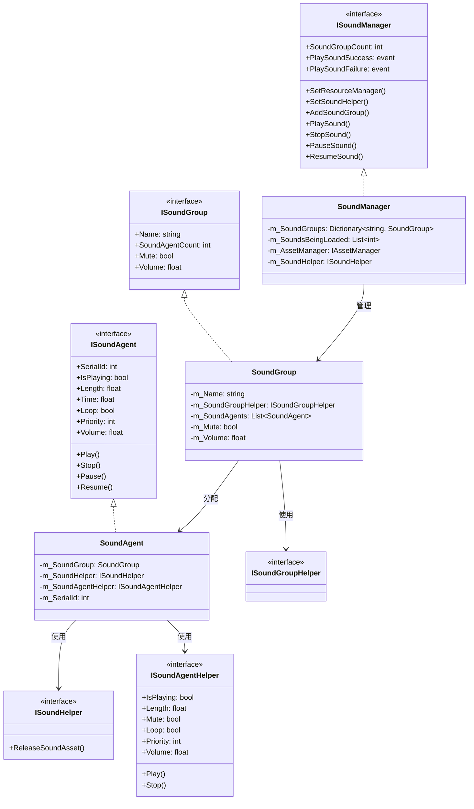
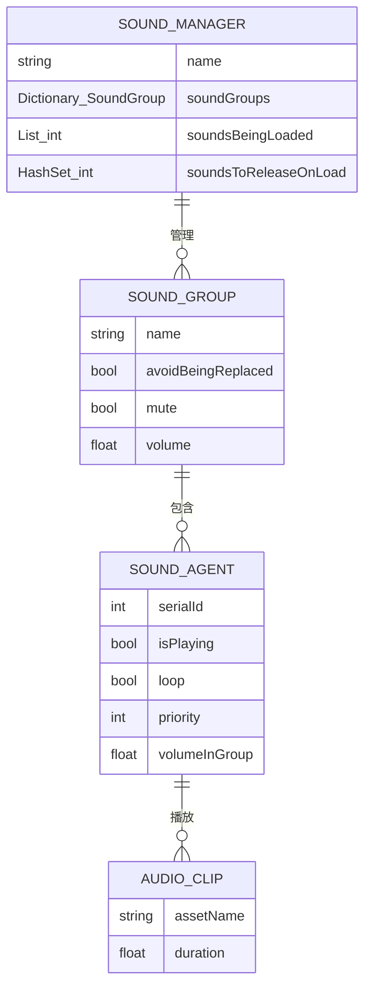
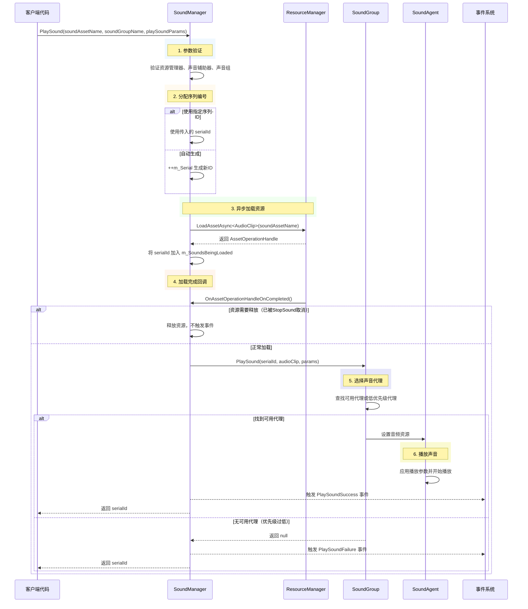
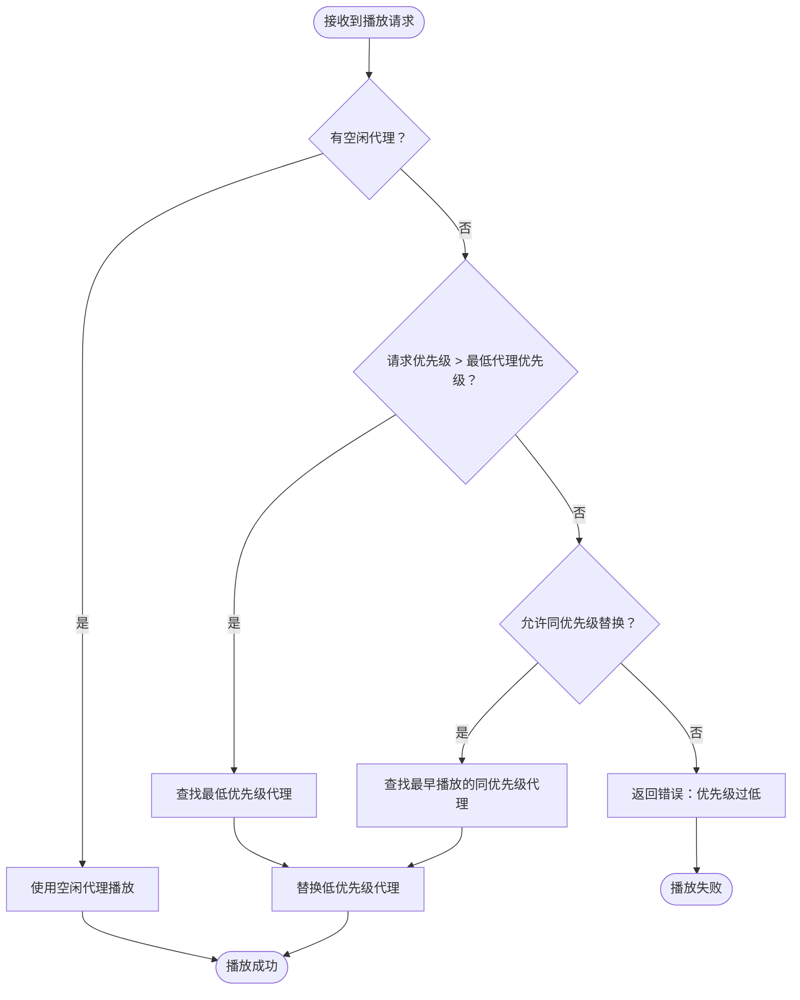

# 声音マネージャー

声音マネージャー（SoundManager）是 GameFrameX 音频モジュール的コアコンポーネント，负责管理游戏中的声音再生、声音组、声音代理およびリソースロード等コア機能。它提供します統一された的インターフェース来控制背景音乐、音效、语音等各种音频リソース，サポート优先级管理、音量控制、淡入淡出等高级特性。

## 概要

SoundManager 是 GameFrameX フレームワーク中処理所有音频相关操作的コアモジュール。作为 GameFrameworkModule 的実装类，它遵循フレームワーク的モジュール化設計原则，〜できます与其他フレームワークモジュール（如リソースマネージャー、イベント系统）无缝集成。

**コア职责：**
- 管理多个声音组（SoundGroup），每个组可独立控制音量和静音ステータス
- 协调声音代理（SoundAgent）的分配，実装优先级调度和リソース复用
- 非同期ロード音频リソース，サポート YooAsset リソース管理系统
- トリガー再生成功/失敗イベント，便于游戏逻辑响应音频ステータス变化

**設計意图：**
SoundManager 采用分层アーキテクチャ設計，将音频再生的底层実装（SoundAgent）与管理层（SoundManager）分离。这种設計允许開発者通过自定義 Helper 来适配不同的音频引擎（如 Unity AudioSource、Fmod、AudioKit），同時に保持上层コード的一致性。优先级机制確認してください重要な音效能够及时再生，避免因代理池满导致的声音丢失。

```mermaid
flowchart TD
    subgraph SoundManager["声音管理器 (SoundManager)"]
        SM[核心管理器]
        SG[声音组字典]
        SL[加载中的声音列表]
        SR[待释放资源集合]
    end
    
    subgraph External["外部依赖"]
        AM[资源管理器]
        SH[声音辅助器]
        EC[事件组件]
    end
    
    subgraph SoundGroup["声音组 (SoundGroup)"]
        SGH[辅助器]
        SAG[声音代理列表]
    end
    
    subgraph SoundAgent["声音代理 (SoundAgent)"]
        SAH[代理辅助器]
        ASSET[音频资源]
    end
    
    AM --> SM : 加载音频资源
    SH --> SM : 释放资源回调
    SM --> SG : 管理声音组
    SG --> SGH
    SGH --> SAG
    SAG --> SAH
    SAH --> ASSET : 播放音频
    SM --> EC : 触发播放事件
```

## コアアーキテクチャ

### モジュール层次结构

SoundManager 采用三层アーキテクチャ設計，每层承担不同的职责：

1. **インターフェース層**：定義 ISoundManager、ISoundGroup、ISoundAgent 等インターフェース，カプセル化业务逻辑
2. **実装層**：SoundManager、SoundGroup、SoundAgent 的具体実装
3. **辅助层**：各种 Helper インターフェース及其デフォルト実装，提供プラットフォーム特定的音频処理能力



### コア数据结构

SoundManager 内部维护三个コア数据结构：



- **m_SoundGroups**：存储所有声音组的字典，以组名为键，サポート O(1) 查找
- **m_SoundsBeingLoaded**：记录〜中非同期ロード的声音序列 ID，用于跟踪ロードステータス
- **m_SoundsToReleaseOnLoad**：记录〜する必要があります在下一次ロード完成时立つまり解放的声音 ID，用于処理 StopSound 在ロード期间被呼び出し的情况

## 声音再生フロー

### 完全な再生フロー

当呼び出し PlaySound メソッド时，SoundManager 会执行以下ステップ：



### 声音代理选择策略

SoundGroup 采用智能代理选择策略，確認してください高优先级声音能够及时再生：



**代理选择逻辑：**
1. 优先使用空闲的代理
2. もし没有空闲代理，比较请求优先级与现有再生声音的优先级
3. もし请求优先级更高，置換最低优先级的代理
4. もし优先级相同，根据 `AvoidBeingReplacedBySamePriority` 設定决定是否置換同优先级声音

## 使用例

### 基本使用方法

在 Unity シーン中追加 SoundComponent 后，〜できます通过以下方法再生声音：

```csharp
// 通过 SoundComponent 播放音效
var soundComponent = GameEntry.GetComponent<SoundComponent>();
int serialId = await soundComponent.PlaySound("Assets/Sounds/click.wav", "UI");
```

> Source: [SoundComponent.cs](https://github.com/GameFrameX/com.gameframex.unity.sound/blob/main/Runtime/Sound/SoundComponent.cs#L356-L359)

### 带パラメータ的再生

```csharp
// 创建播放参数
var playParams = PlaySoundParams.Create(false);
playParams.VolumeInSoundGroup = 0.8f;
playParams.Priority = 100;
playParams.Loop = false;
playParams.FadeInSeconds = 0.3f;

// 播放音效
int serialId = await soundComponent.PlaySound("Assets/Sounds/bgm_main.wav", "Background", playParams);
```

> Source: [PlaySoundParams.cs](https://github.com/GameFrameX/com.gameframex.unity.sound/blob/main/Runtime/Sound/Sound/PlaySoundParams.cs#L233-L239)

### イベント监听

```csharp
// 监听播放成功事件
soundComponent.PlaySoundSuccess += OnPlaySoundSuccess;

// 监听播放失败事件
soundComponent.PlaySoundFailure += OnPlaySoundFailure;

private void OnPlaySoundSuccess(object sender, PlaySoundSuccessEventArgs e)
{
    Debug.Log($"声音播放成功: {e.SoundAssetName}, SerialId: {e.SerialId}");
    // 可通过 e.SoundAgent 获取播放代理进行更精细的控制
}

private void OnPlaySoundFailure(object sender, PlaySoundFailureEventArgs e)
{
    Debug.LogWarning($"声音播放失败: {e.SoundAssetName}, 错误码: {e.ErrorCode}, 原因: {e.ErrorMessage}");
}
```

> Source: [PlaySoundSuccessEventArgs.cs](https://github.com/GameFrameX/com.gameframex.unity.sound/blob/main/Runtime/EventArgs/PlaySoundSuccessEventArgs.cs#L89-L98)

### 声音控制

```csharp
// 暂停指定声音
soundComponent.PauseSound(serialId);

// 恢复播放
soundComponent.ResumeSound(serialId);

// 停止播放（带淡出效果）
soundComponent.StopSound(serialId, 0.5f);

// 停止所有已加载的声音
soundComponent.StopAllLoadedSounds(1.0f);

// 停止所有正在加载的声音
soundComponent.StopAllLoadingSounds();
```

> Source: [SoundManager.cs](https://github.com/GameFrameX/com.gameframex.unity.sound/blob/main/Runtime/Sound/Sound/SoundManager.cs#L584-L609)

### 声音组管理

```csharp
// 添加新的声音组
soundComponent.AddSoundGroup("Combat", false, false, 1.0f, 4);

// 获取声音组
var soundGroup = soundComponent.GetSoundGroup("UI");

// 设置组音量
soundGroup.Volume = 0.5f;

// 设置组静音
soundGroup.Mute = true;

// 检查声音组是否存在
if (soundComponent.HasSoundGroup("Background"))
{
    // 播放背景音乐
}
```

> Source: [SoundComponent.cs](https://github.com/GameFrameX/com.gameframex.unity.sound/blob/main/Runtime/Sound/SoundComponent.cs#L199-L212)

## デフォルト常量值

SoundManager 使用以下デフォルト常量值，〜できます在 Constant.cs 中確認：

> Source: [Constant.cs](https://github.com/GameFrameX/com.gameframex.unity.sound/blob/main/Runtime/Sound/Sound/Constant.cs#L38-L99)

| プロパティ | デフォルト值 | 説明 |
|------|--------|------|
| DefaultTime | 0f | デフォルト再生位置 |
| DefaultMute | false | デフォルト不静音 |
| DefaultLoop | false | デフォルト不循环 |
| DefaultPriority | 0 | デフォルト优先级 |
| DefaultVolume | 1f | デフォルト音量（满音量） |
| DefaultFadeInSeconds | 0f | デフォルト淡入时间 |
| DefaultFadeOutSeconds | 0f | デフォルト淡出时间 |
| DefaultPitch | 1f | デフォルト音调 |
| DefaultPanStereo | 0f | デフォルト立体声位置 |
| DefaultSpatialBlend | 0f | デフォルト空间混合量 |
| DefaultMaxDistance | 100f | デフォルト最大距离 |
| DefaultDopplerLevel | 1f | デフォルト多普勒等级 |

## エラー码説明

再生声音时〜の可能性があります遇到以下エラー码：

> Source: [PlaySoundErrorCode.cs](https://github.com/GameFrameX/com.gameframex.unity.sound/blob/main/Runtime/Sound/Sound/PlaySoundErrorCode.cs#L38-L69)

| エラー码 | 説明 |
|--------|------|
| Unknown | 未知エラー |
| SoundGroupNotExist | 指定的声音组不存在 |
| SoundGroupHasNoAgent | 声音组没有可用的声音代理 |
| LoadAssetFailure | ロード音频リソース失敗 |
| IgnoredDueToLowPriority | 由于优先级过低被忽略 |
| SetSoundAssetFailure | 設定音频リソース到代理失敗 |

## 関連リンク

- [声音组](./4-core-concepts.2-sound-group) - 理解する声音组的詳細設定和管理
- [声音代理](./4-core-concepts.3-sound-agent) - 理解する声音代理的工作原理
- [インターフェース定義](./5-api-reference.1-interfaces) - 確認完全な的インターフェース定義
- [再生パラメータ](./5-api-reference.2-play-sound-params) - 確認 PlaySoundParams 詳細パラメータ
- [イベントパラメータ](./5-api-reference.3-event-args) - 確認イベントパラメータ定義
- [設定説明](./6-configuration) - 確認モジュール設定説明
- [拡張ガイド](./7-extending) - 理解する如何拡張音频系统
