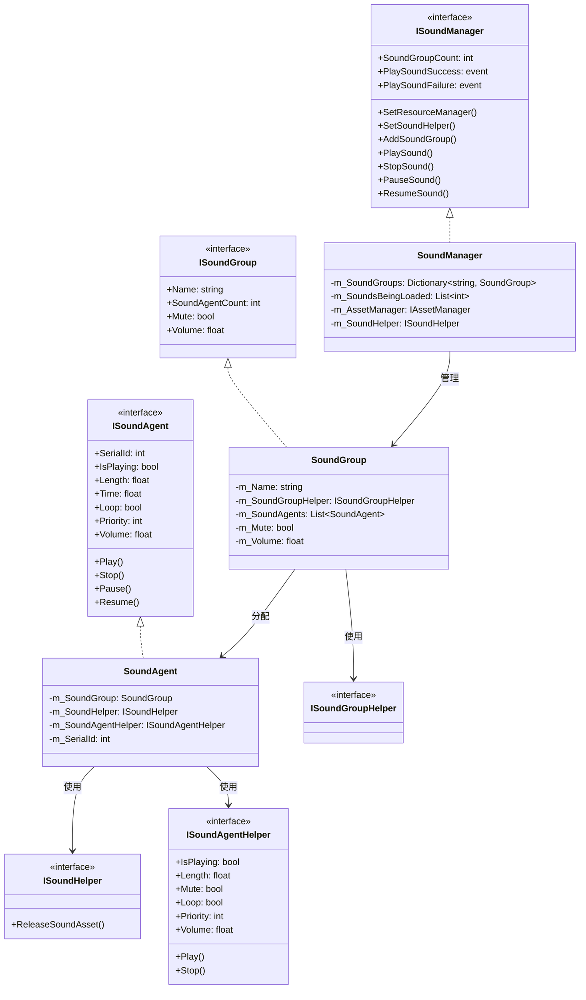
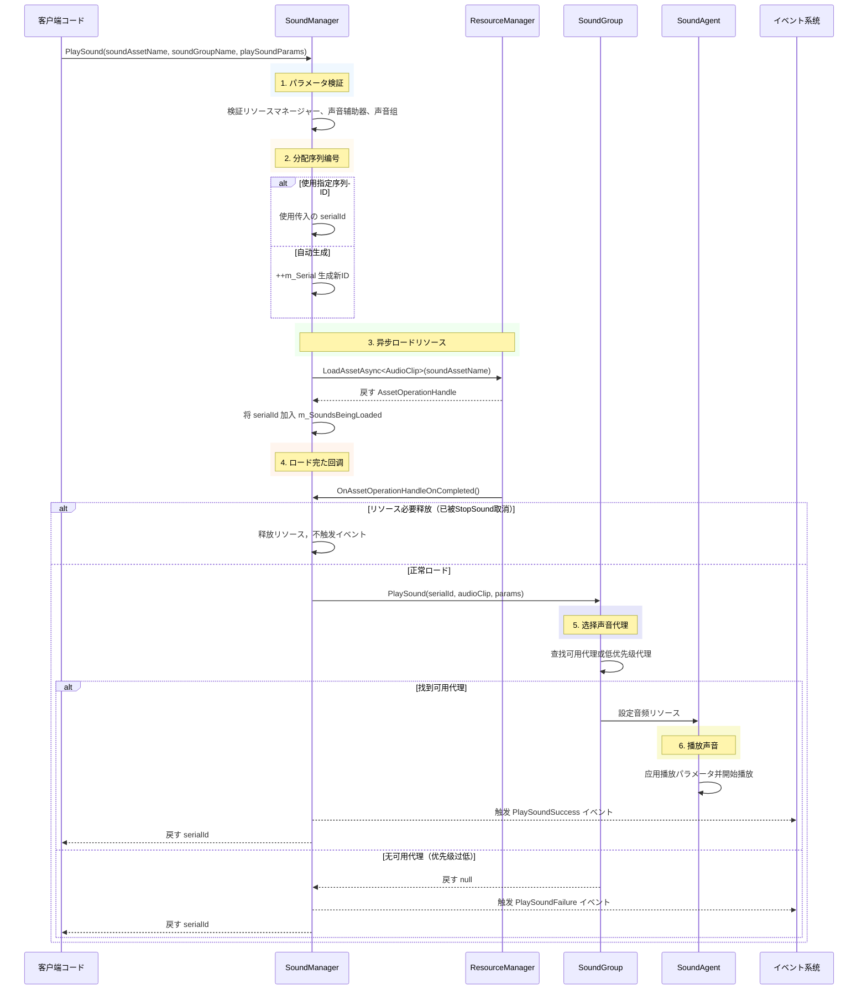
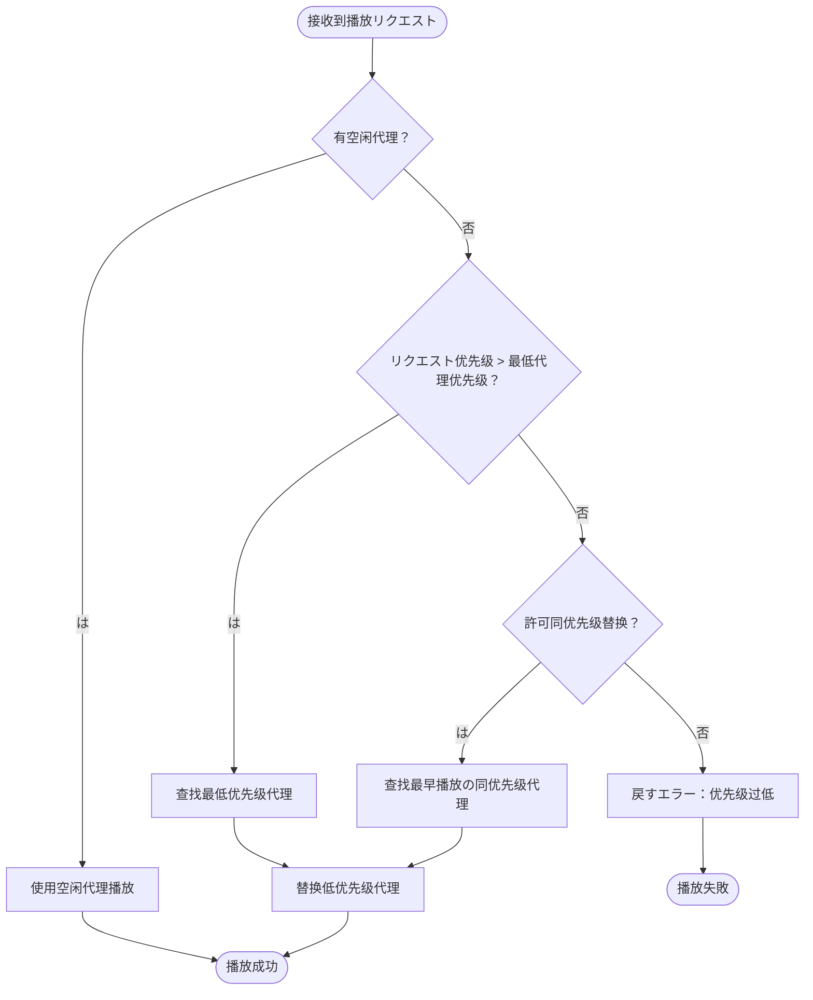

# マネージャー

マネージャー（SoundManager）は GameFrameX モジュールのコアコンポーネント，ゲームの、、リソースロードコア。たのインターフェース、、リソース，サポート、、。

## 

SoundManager は GameFrameX フレームワークのコアモジュール。 GameFrameworkModule のクラス，フレームワークのモジュール，とフレームワークモジュール（リソースマネージャー、イベント）。

**コア：**
- （SoundGroup），と
- （SoundAgent）の，とリソース
- ロードリソース，サポート YooAsset リソース
- /イベント，ゲームレスポンス

**：**
SoundManager アーキテクチャ，の（SoundAgent）と（SoundManager）。をじてカスタマイズ Helper の（ Unity AudioSource、Fmod、AudioKit），コードの。，プールの。

```mermaid
flowchart TD
    subgraph SoundManager["声音マネージャー (SoundManager)"]
        SM[コアマネージャー]
        SG[声音组字典]
        SL[ロード中の声音列表]
        SR[待释放リソース集合]
    end
    
    subgraph External["外部依赖"]
        AM[リソースマネージャー]
        SH[声音辅助器]
        EC[イベントコンポーネント]
    end
    
    subgraph SoundGroup["声音组 (SoundGroup)"]
        SGH[辅助器]
        SAG[声音代理列表]
    end
    
    subgraph SoundAgent["声音代理 (SoundAgent)"]
        SAH[代理辅助器]
        ASSET[音频リソース]
    end
    
    AM --> SM : ロード音频リソース
    SH --> SM : 释放リソース回调
    SM --> SG : 管理声音组
    SG --> SGH
    SGH --> SAG
    SAG --> SAH
    SAH --> ASSET : 播放音频
    SM --> EC : 触发播放イベント
```

## コアアーキテクチャ

### モジュール

SoundManager アーキテクチャ，の：

1. **インターフェース**： ISoundManager、ISoundGroup、ISoundAgent インターフェース，
2. ****：SoundManager、SoundGroup、SoundAgent の
3. ****： Helper インターフェースデフォルト，プラットフォームの



### コアデータ

SoundManager コアデータ：


- **m_SoundGroups**：の，，サポート O(1) 
- **m_SoundsBeingLoaded**：にロードの ID，にロード
- **m_SoundsToReleaseOnLoad**：にロードたの ID，に StopSound にロードびしの

## フロー

### フロー

びし PlaySound メソッド，SoundManager ステップ：



### 

SoundGroup ，：



**：**
1. の
2. ，リクエストとの
3. リクエスト，の
4. ， `AvoidBeingReplacedBySamePriority` は

## 

### 

に Unity  SoundComponent ，をじて：

```csharp
// を通じて SoundComponent 播放音效
var soundComponent = GameEntry.GetComponent<SoundComponent>();
int serialId = await soundComponent.PlaySound("Assets/Sounds/click.wav", "UI");
```

> Source: [SoundComponent.cs](https://github.com/GameFrameX/com.gameframex.unity.sound/blob/main/Runtime/Sound/SoundComponent.cs#L356-L359)

### パラメータの

```csharp
// 作成播放パラメータ
var playParams = PlaySoundParams.Create(false);
playParams.VolumeInSoundGroup = 0.8f;
playParams.Priority = 100;
playParams.Loop = false;
playParams.FadeInSeconds = 0.3f;

// 播放音效
int serialId = await soundComponent.PlaySound("Assets/Sounds/bgm_main.wav", "Background", playParams);
```

> Source: [PlaySoundParams.cs](https://github.com/GameFrameX/com.gameframex.unity.sound/blob/main/Runtime/Sound/Sound/PlaySoundParams.cs#L233-L239)

### イベント

```csharp
// 监听播放成功イベント
soundComponent.PlaySoundSuccess += OnPlaySoundSuccess;

// 监听播放失敗イベント
soundComponent.PlaySoundFailure += OnPlaySoundFailure;

private void OnPlaySoundSuccess(object sender, PlaySoundSuccessEventArgs e)
{
    Debug.Log($"声音播放成功: {e.SoundAssetName}, SerialId: {e.SerialId}");
    // 可を通じて e.SoundAgent 获取播放代理进行更精细の控制
}

private void OnPlaySoundFailure(object sender, PlaySoundFailureEventArgs e)
{
    Debug.LogWarning($"声音播放失敗: {e.SoundAssetName}, エラー码: {e.ErrorCode}, 原因: {e.ErrorMessage}");
}
```

> Source: [PlaySoundSuccessEventArgs.cs](https://github.com/GameFrameX/com.gameframex.unity.sound/blob/main/Runtime/EventArgs/PlaySoundSuccessEventArgs.cs#L89-L98)

### 

```csharp
// 暂停指定声音
soundComponent.PauseSound(serialId);

// 恢复播放
soundComponent.ResumeSound(serialId);

// 停止播放（带淡出效果）
soundComponent.StopSound(serialId, 0.5f);

// 停止所有已ロードの声音
soundComponent.StopAllLoadedSounds(1.0f);

// 停止所有正にロードの声音
soundComponent.StopAllLoadingSounds();
```

> Source: [SoundManager.cs](https://github.com/GameFrameX/com.gameframex.unity.sound/blob/main/Runtime/Sound/Sound/SoundManager.cs#L584-L609)

### 

```csharp
// 添加新の声音组
soundComponent.AddSoundGroup("Combat", false, false, 1.0f, 4);

// 获取声音组
var soundGroup = soundComponent.GetSoundGroup("UI");

// 設定组音量
soundGroup.Volume = 0.5f;

// 設定组静音
soundGroup.Mute = true;

// 检查声音组は否存に
if (soundComponent.HasSoundGroup("Background"))
{
    // 播放背景音乐
}
```

> Source: [SoundComponent.cs](https://github.com/GameFrameX/com.gameframex.unity.sound/blob/main/Runtime/Sound/SoundComponent.cs#L199-L212)

## デフォルト

SoundManager デフォルト，に Constant.cs ：

> Source: [Constant.cs](https://github.com/GameFrameX/com.gameframex.unity.sound/blob/main/Runtime/Sound/Sound/Constant.cs#L38-L99)

| プロパティ | デフォルト |  |
|------|--------|------|
| DefaultTime | 0f | デフォルト |
| DefaultMute | false | デフォルト |
| DefaultLoop | false | デフォルト |
| DefaultPriority | 0 | デフォルト |
| DefaultVolume | 1f | デフォルト（） |
| DefaultFadeInSeconds | 0f | デフォルト |
| DefaultFadeOutSeconds | 0f | デフォルト |
| DefaultPitch | 1f | デフォルト |
| DefaultPanStereo | 0f | デフォルト |
| DefaultSpatialBlend | 0f | デフォルト |
| DefaultMaxDistance | 100f | デフォルト |
| DefaultDopplerLevel | 1f | デフォルト |

## エラー

エラー：

> Source: [PlaySoundErrorCode.cs](https://github.com/GameFrameX/com.gameframex.unity.sound/blob/main/Runtime/Sound/Sound/PlaySoundErrorCode.cs#L38-L69)

| エラー |  |
|--------|------|
| Unknown | エラー |
| SoundGroupNotExist | のに |
| SoundGroupHasNoAgent | の |
| LoadAssetFailure | ロードリソース |
| IgnoredDueToLowPriority |  |
| SetSoundAssetFailure | リソース |

## リンク

- [](./4-core-concepts.2-sound-group) - たのと
- [](./4-core-concepts.3-sound-agent) - たの
- [インターフェース](./5-api-reference.1-interfaces) - のインターフェース
- [パラメータ](./5-api-reference.2-play-sound-params) -  PlaySoundParams パラメータ
- [イベント](./5-api-reference.3-event-args) - イベント
- [](./6-configuration) - モジュール
- [ガイド](./7-extending) - た
