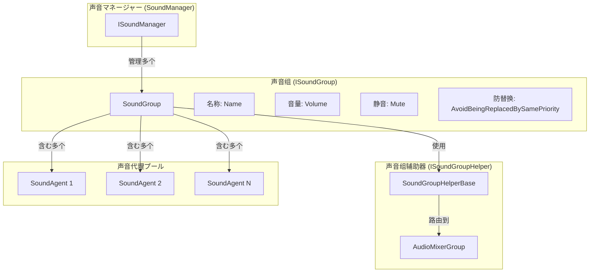
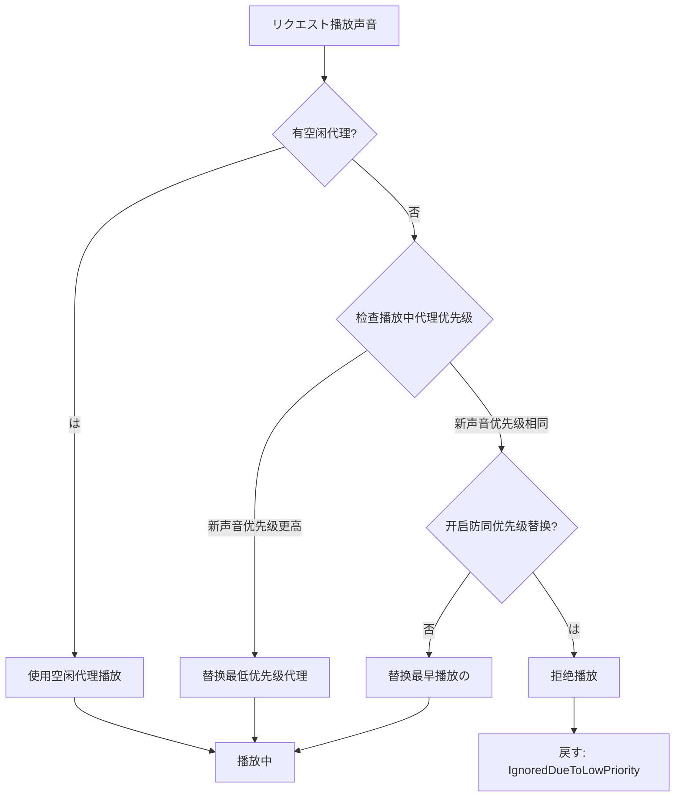

# 

（Sound Group）は GameFrameX のコアコンセプト，にとの。、と，たのクラス。

## 

たゲームの：、、UIタイプの，。をじて，：

- **クラス**：タイプのの（BGM、SE、Voice）
- ****：
- ****：をじて
- ****：をじて AudioMixerGroup  Unity 

（Sound Agent），。，たの。

## アーキテクチャ



### コアコンポーネント

| コンポーネント |  | ファイル |
|------|------|----------|
| `ISoundGroup` | インターフェース | [Runtime/Interface/ISoundGroup.cs](https://github.com/GameFrameX/com.gameframex.unity.sound/blob/main/Runtime/Interface/ISoundGroup.cs#L38-L87) |
| `SoundGroup` | クラス | [Runtime/Sound/Sound/SoundManager.SoundGroup.cs](https://github.com/GameFrameX/com.gameframex.unity.sound/blob/main/Runtime/Sound/Sound/SoundManager.SoundGroup.cs#L43-L324) |
| `ISoundGroupHelper` | インターフェース | [Runtime/Interface/ISoundGroupHelper.cs](https://github.com/GameFrameX/com.gameframex.unity.sound/blob/main/Runtime/Interface/ISoundGroupHelper.cs#L38-L40) |
| `SoundGroupHelperBase` | クラス | [Runtime/Sound/SoundGroupHelperBase.cs](https://github.com/GameFrameX/com.gameframex.unity.sound/blob/main/Runtime/Sound/SoundGroupHelperBase.cs#L42-L54) |
| `DefaultSoundGroupHelper` | デフォルト | [Runtime/Sound/DefaultSoundGroupHelper.cs](https://github.com/GameFrameX/com.gameframex.unity.sound/blob/main/Runtime/Sound/DefaultSoundGroupHelper.cs#L38-L40) |

## コア

### プロパティ

```csharp
public interface ISoundGroup
{
    // 获取声音组名称
    string Name { get; }

    // 获取声音代理数量
    int SoundAgentCount { get; }

    // は否避免被同优先级声音替换
    // 当为 true 时，相同优先级の音频不会相互替换
    bool AvoidBeingReplacedBySamePriority { get; set; }

    // 静音状態
    bool Mute { get; set; }

    // 音量 (0.0 - 1.0)
    float Volume { get; set; }

    // 声音组辅助器
    ISoundGroupHelper Helper { get; }
}
```

> Source: [ISoundGroup.cs](https://github.com/GameFrameX/com.gameframex.unity.sound/blob/main/Runtime/Interface/ISoundGroup.cs#L38-L87)

### 

のコアはの。，：



：

```csharp
// 声音播放时の代理分配逻辑
public ISoundAgent PlaySound(int serialId, object soundAsset, PlaySoundParams playSoundParams, out PlaySoundErrorCode? errorCode)
{
    errorCode = null;
    SoundAgent candidateAgent = null;
    foreach (SoundAgent soundAgent in m_SoundAgents)
    {
        if (!soundAgent.IsPlaying)
        {
            candidateAgent = soundAgent;
            break;
        }

        // 寻找优先级更低或同优先级但播放时间更早の代理
        if (soundAgent.Priority < playSoundParams.Priority)
        {
            if (candidateAgent == null || soundAgent.Priority < candidateAgent.Priority)
            {
                candidateAgent = soundAgent;
            }
        }
        else if (!m_AvoidBeingReplacedBySamePriority && soundAgent.Priority == playSoundParams.Priority)
        {
            if (candidateAgent == null || soundAgent.SetSoundAssetTime < candidateAgent.SetSoundAssetTime)
            {
                candidateAgent = soundAgent;
            }
        }
    }
    // ...
}
```

> Source: [SoundManager.SoundGroup.cs](https://github.com/GameFrameX/com.gameframex.unity.sound/blob/main/Runtime/Sound/Sound/SoundManager.SoundGroup.cs#L175-L228)

### と

のとの：

```csharp
// 設定静音状態时同步到所有代理
public bool Mute
{
    get { return m_Mute; }
    set
    {
        m_Mute = value;
        foreach (SoundAgent soundAgent in m_SoundAgents)
        {
            soundAgent.RefreshMute();  // 刷新静音状態
        }
    }
}

// 設定音量时同步到所有代理
public float Volume
{
    get { return m_Volume; }
    set
    {
        m_Volume = value;
        foreach (SoundAgent soundAgent in m_SoundAgents)
        {
            soundAgent.RefreshVolume();  // 刷新音量
        }
    }
}
```

> Source: [SoundManager.SoundGroup.cs](https://github.com/GameFrameX/com.gameframex.unity.sound/blob/main/Runtime/Sound/Sound/SoundManager.SoundGroup.cs#L102-L129)

たとのと。

## 

### AudioMixerGroup 

をじて `SoundGroupHelperBase`  Unity の：

```csharp
public abstract class SoundGroupHelperBase : MonoBehaviour, ISoundGroupHelper
{
    [SerializeField] private AudioMixerGroup m_AudioMixerGroup = null;

    /// <summary>
    /// 获取或設定声音组辅助器所にの混音组。
    /// </summary>
    public AudioMixerGroup AudioMixerGroup
    {
        get { return m_AudioMixerGroup; }
        set { m_AudioMixerGroup = value; }
    }
}
```

> Source: [SoundGroupHelperBase.cs](https://github.com/GameFrameX/com.gameframex.unity.sound/blob/main/Runtime/Sound/SoundGroupHelperBase.cs#L42-L54)

：
- をじて Unity Editor の AudioMixerGroup
-  Unity の AudioMixer の（EQ、、）
- タイプのの

### カスタマイズ

をじて `SoundGroupHelperBase` カスタマイズ：

```csharp
public class CustomSoundGroupHelper : SoundGroupHelperBase
{
    // カスタマイズ扩展逻辑
    protected override void Start()
    {
        base.Start();
        // カスタマイズ初始化逻辑
    }
}
```

## 

### をじて SoundComponent 

に Unity Editor はの：

```csharp
// SoundComponent.cs 中の声音组設定クラス
[Serializable]
private sealed class SoundGroup
{
    [SerializeField] private string m_Name = null;                              // 声音组名称
    [SerializeField] private bool m_AvoidBeingReplacedBySamePriority = false;   // 防同优先级替换
    [SerializeField] private bool m_Mute = false;                                 // デフォルト静音状態
    [SerializeField, Range(0f, 1f)] private float m_Volume = 1f;                  // デフォルト音量
    [SerializeField] private int m_AgentHelperCount = 1;                        // 代理数量
}
```

> Source: [SoundComponent.SoundGroup.cs](https://github.com/GameFrameX/com.gameframex.unity.sound/blob/main/Runtime/Sound/SoundComponent.SoundGroup.cs#L44-L112)

### 

に：

```csharp
// に SoundComponent 中动态添加声音组
public bool AddSoundGroup(string soundGroupName, bool soundGroupAvoidBeingReplacedBySamePriority, bool soundGroupMute, float soundGroupVolume, int soundAgentHelperCount)
{
    if (m_SoundManager.HasSoundGroup(soundGroupName))
    {
        return false;
    }

    var soundGroupHelper = CreateCustomSoundGroupHelper(soundGroupName, soundAgentHelperCount);
    if (!m_SoundManager.AddSoundGroup(soundGroupName, soundGroupAvoidBeingReplacedBySamePriority, soundGroupMute, soundGroupVolume, soundGroupHelper))
    {
        return false;
    }
    return true;
}
```

> Source: [SoundComponent.cs](https://github.com/GameFrameX/com.gameframex.unity.sound/blob/main/Runtime/Sound/SoundComponent.cs#L252-L287)

### 

プロパティ：

```csharp
// 获取声音组
var soundGroup = soundComponent.GetSoundGroup("BGM");

// 設定音量
soundGroup.Volume = 0.5f;

// 静音
soundGroup.Mute = true;

// 停止所有播放中の声音
soundGroup.StopAllLoadedSounds();

// 带淡出停止
soundGroup.StopAllLoadedSounds(1.0f);
```

## 

### パラメータ

| パラメータ | タイプ | デフォルト |  |
|------|------|--------|------|
| Name | string | - | ， |
| AvoidBeingReplacedBySamePriority | bool | false | は |
| Mute | bool | false | デフォルト |
| Volume | float | 1.0 | デフォルト (0.0-1.0) |
| AgentHelperCount | int | 1 | ， |

### 

|  |  |  |  |  |
|------|------|--------|------------|------|
|  | BGM | 1-2 |  |  |
|  | SE | 5-10 |  | クラス |
|  | Voice | 2-3 |  |  |
| UI | UI | 3-5 |  |  |

## リンク

- [マネージャー](./4-core-concepts.1-sound-manager) - のコンポーネント
- [](./4-core-concepts.3-sound-agent) - の
- [インターフェース](./5-api-reference.1-interfaces) - ISoundGroup インターフェース
- [パラメータ](./5-api-reference.2-play-sound-params) - パラメータ
