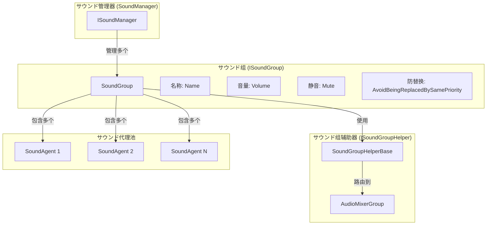
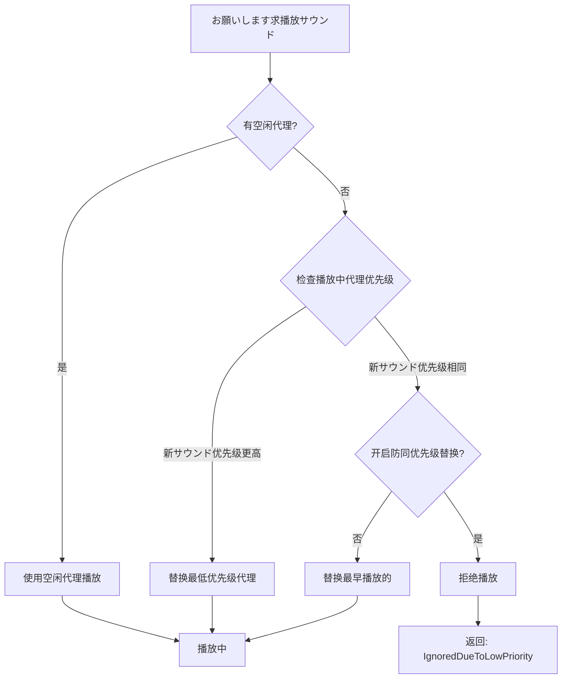

# サウンド组

サウンド组（Sound Group）是 GameFrameX サウンド系统中的コア概念，に使用组织和管理一组関連的音频播放通道。每个サウンド组独立控制其音量、静音ステータス和优先级策略，提供します灵活的音频分クラス播放能力。

## 概要

サウンド组解决了ゲーム开发中常见的音频管理需求：如何区分背景音乐、音效、UIサウンド等不同クラス型的音频，并对其进行独立控制。を通じてサウンド组，開発者可能：

- **分クラス管理**：将不同クラス型的音频分配到不同的组（如BGM、SE、Voice）
- **独立控制**：单独调节每组音量或静音ステータス
- **优先级管理**：を通じて优先级策略控制サウンド替换逻辑
- **混音集成**：を通じて AudioMixerGroup 连接到 Unity 混音系统

サウンド组由多个サウンド代理（Sound Agent）组成，每个代理负责实际播放一个音频。每个サウンド组至少必要一个代理，代理数量决定了该组可能同时播放的サウンド数量上限。

## 架构



### コアコンポーネント

| コンポーネント | 作用 | ファイル位置 |
|------|------|----------|
| `ISoundGroup` | サウンド组インターフェース定义 | [Runtime/Interface/ISoundGroup.cs](https://github.com/GameFrameX/com.gameframex.unity.sound/blob/main/Runtime/Interface/ISoundGroup.cs#L38-L87) |
| `SoundGroup` | サウンド组実装クラス | [Runtime/Sound/Sound/SoundManager.SoundGroup.cs](https://github.com/GameFrameX/com.gameframex.unity.sound/blob/main/Runtime/Sound/Sound/SoundManager.SoundGroup.cs#L43-L324) |
| `ISoundGroupHelper` | 辅助器インターフェース | [Runtime/Interface/ISoundGroupHelper.cs](https://github.com/GameFrameX/com.gameframex.unity.sound/blob/main/Runtime/Interface/ISoundGroupHelper.cs#L38-L40) |
| `SoundGroupHelperBase` | 辅助器基クラス | [Runtime/Sound/SoundGroupHelperBase.cs](https://github.com/GameFrameX/com.gameframex.unity.sound/blob/main/Runtime/Sound/SoundGroupHelperBase.cs#L42-L54) |
| `DefaultSoundGroupHelper` | 默认辅助器実装 | [Runtime/Sound/DefaultSoundGroupHelper.cs](https://github.com/GameFrameX/com.gameframex.unity.sound/blob/main/Runtime/Sound/DefaultSoundGroupHelper.cs#L38-L40) |

## コア機能

### サウンド组プロパティ

```csharp
public interface ISoundGroup
{
    // 取得サウンド组名称
    string Name { get; }

    // 取得サウンド代理数量
    int SoundAgentCount { get; }

    // 是否避免被同优先级サウンド替换
    // 当为 true 时，相同优先级的音频不会相互替换
    bool AvoidBeingReplacedBySamePriority { get; set; }

    // 静音ステータス
    bool Mute { get; set; }

    // 音量 (0.0 - 1.0)
    float Volume { get; set; }

    // サウンド组辅助器
    ISoundGroupHelper Helper { get; }
}
```

> Source: [ISoundGroup.cs](https://github.com/GameFrameX/com.gameframex.unity.sound/blob/main/Runtime/Interface/ISoundGroup.cs#L38-L87)

### 优先级替换策略

サウンド组的コア機能是に基づいて优先级管理サウンド代理的分配。当必要播放新サウンド时，系统会按照以下逻辑选择代理：



具体実装逻辑如下：

```csharp
// サウンド播放时的代理分配逻辑
public ISoundAgent PlaySound(int serialId, object soundAsset, PlaySoundParams playSoundParams, out PlaySoundErrorCode? errorCode)
{
    errorCode = null;
    SoundAgent candidateAgent = null;
    foreach (SoundAgent soundAgent in m_SoundAgents)
    {
        if (!soundAgent.IsPlaying)
        {
            candidateAgent = soundAgent;
            break;
        }

        // 寻找优先级更低或同优先级但播放时间更早的代理
        if (soundAgent.Priority < playSoundParams.Priority)
        {
            if (candidateAgent == null || soundAgent.Priority < candidateAgent.Priority)
            {
                candidateAgent = soundAgent;
            }
        }
        else if (!m_AvoidBeingReplacedBySamePriority && soundAgent.Priority == playSoundParams.Priority)
        {
            if (candidateAgent == null || soundAgent.SetSoundAssetTime < candidateAgent.SetSoundAssetTime)
            {
                candidateAgent = soundAgent;
            }
        }
    }
    // ...
}
```

> Source: [SoundManager.SoundGroup.cs](https://github.com/GameFrameX/com.gameframex.unity.sound/blob/main/Runtime/Sound/Sound/SoundManager.SoundGroup.cs#L175-L228)

### 音量与静音

サウンド组的音量和静音ステータス会自动同步到所有关联的サウンド代理：

```csharp
// 設定静音ステータス时同步到所有代理
public bool Mute
{
    get { return m_Mute; }
    set
    {
        m_Mute = value;
        foreach (SoundAgent soundAgent in m_SoundAgents)
        {
            soundAgent.RefreshMute();  // 刷新静音ステータス
        }
    }
}

// 設定音量时同步到所有代理
public float Volume
{
    get { return m_Volume; }
    set
    {
        m_Volume = value;
        foreach (SoundAgent soundAgent in m_SoundAgents)
        {
            soundAgent.RefreshVolume();  // 刷新音量
        }
    }
}
```

> Source: [SoundManager.SoundGroup.cs](https://github.com/GameFrameX/com.gameframex.unity.sound/blob/main/Runtime/Sound/Sound/SoundManager.SoundGroup.cs#L102-L129)

这种设计确保了音量调节和静音操作的即时性和一致性。

## サウンド组辅助器

### AudioMixerGroup 集成

サウンド组を通じて `SoundGroupHelperBase` 连接到 Unity 的音频混音系统：

```csharp
public abstract class SoundGroupHelperBase : MonoBehaviour, ISoundGroupHelper
{
    [SerializeField] private AudioMixerGroup m_AudioMixerGroup = null;

    /// <summary>
    /// 取得或設定サウンド组辅助器所在的混音组。
    /// </summary>
    public AudioMixerGroup AudioMixerGroup
    {
        get { return m_AudioMixerGroup; }
        set { m_AudioMixerGroup = value; }
    }
}
```

> Source: [SoundGroupHelperBase.cs](https://github.com/GameFrameX/com.gameframex.unity.sound/blob/main/Runtime/Sound/SoundGroupHelperBase.cs#L42-L54)

这个设计允许開発者：
- を通じて Unity Editor 为每个サウンド组分配不同的 AudioMixerGroup
- 利用 Unity 的 AudioMixer 実装复杂的音频处理（EQ、压缩、混响等）
- 对不同クラス型的サウンド应用不同的混音效果

### 自定义辅助器

可能を通じて继承 `SoundGroupHelperBase` 作成自定义辅助器：

```csharp
public class CustomSoundGroupHelper : SoundGroupHelperBase
{
    // 自定义扩展逻辑
    protected override void Start()
    {
        base.Start();
        // 自定义初期化逻辑
    }
}
```

## 使用例

### を通じて SoundComponent 配置サウンド组

在 Unity Editor 中配置サウンド组是最常用的方法：

```csharp
// SoundComponent.cs 中的サウンド组配置クラス
[Serializable]
private sealed class SoundGroup
{
    [SerializeField] private string m_Name = null;                              // サウンド组名称
    [SerializeField] private bool m_AvoidBeingReplacedBySamePriority = false;   // 防同优先级替换
    [SerializeField] private bool m_Mute = false;                                 // 默认静音ステータス
    [SerializeField, Range(0f, 1f)] private float m_Volume = 1f;                  // 默认音量
    [SerializeField] private int m_AgentHelperCount = 1;                        // 代理数量
}
```

> Source: [SoundComponent.SoundGroup.cs](https://github.com/GameFrameX/com.gameframex.unity.sound/blob/main/Runtime/Sound/SoundComponent.SoundGroup.cs#L44-L112)

### 运行时动态作成

在运行时也可能动态添加サウンド组：

```csharp
// 在 SoundComponent 中动态添加サウンド组
public bool AddSoundGroup(string soundGroupName, bool soundGroupAvoidBeingReplacedBySamePriority, bool soundGroupMute, float soundGroupVolume, int soundAgentHelperCount)
{
    if (m_SoundManager.HasSoundGroup(soundGroupName))
    {
        return false;
    }

    var soundGroupHelper = CreateCustomSoundGroupHelper(soundGroupName, soundAgentHelperCount);
    if (!m_SoundManager.AddSoundGroup(soundGroupName, soundGroupAvoidBeingReplacedBySamePriority, soundGroupMute, soundGroupVolume, soundGroupHelper))
    {
        return false;
    }
    return true;
}
```

> Source: [SoundComponent.cs](https://github.com/GameFrameX/com.gameframex.unity.sound/blob/main/Runtime/Sound/SoundComponent.cs#L252-L287)

### 控制サウンド组

取得サウンド组并控制其プロパティ：

```csharp
// 取得サウンド组
var soundGroup = soundComponent.GetSoundGroup("BGM");

// 設定音量
soundGroup.Volume = 0.5f;

// 静音
soundGroup.Mute = true;

// 停止所有播放中的サウンド
soundGroup.StopAllLoadedSounds();

// 带淡出停止
soundGroup.StopAllLoadedSounds(1.0f);
```

## 設定説明

### サウンド组配置参数

| 参数 | クラス型 | 默认值 | 説明 |
|------|------|--------|------|
| Name | string | - | サウンド组名称，必須唯一 |
| AvoidBeingReplacedBySamePriority | bool | false | 是否避免被同优先级サウンド替换 |
| Mute | bool | false | 默认静音ステータス |
| Volume | float | 1.0 | 默认音量 (0.0-1.0) |
| AgentHelperCount | int | 1 | サウンド代理数量，决定同时播放数上限 |

### 典型配置方案

| シーン | 名称 | 代理数 | 优先级策略 | 用途 |
|------|------|--------|------------|------|
| 背景音乐 | BGM | 1-2 | 开启防替换 | 音乐播放 |
| 音效 | SE | 5-10 | 关闭防替换 | 各クラス音效 |
| 语音 | Voice | 2-3 | 开启防替换 | 角色对话 |
| UI音效 | UI | 3-5 | 开启防替换 | 界面反馈 |

## 関連リンク

- [サウンド管理器](./4-core-concepts.1-sound-manager) - サウンド组的上一级管理コンポーネント
- [サウンド代理](./4-core-concepts.3-sound-agent) - サウンド组管理的音频播放单元
- [インターフェース定义](./5-api-reference.1-interfaces) - ISoundGroup 完整インターフェース定义
- [播放参数](./5-api-reference.2-play-sound-params) - サウンド播放参数配置
