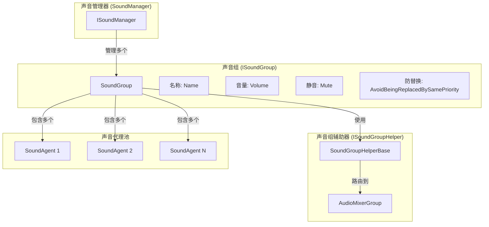
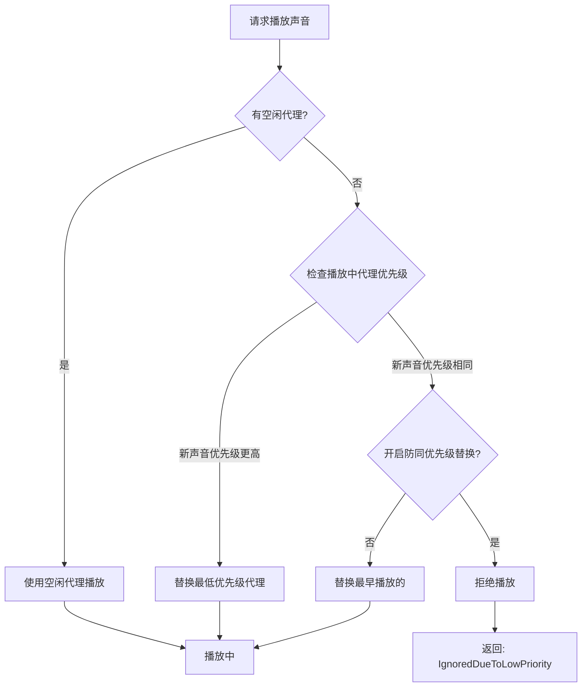

# 声音组

声音组（Sound Group）是 GameFrameX 声音系统中的コアコンセプト，用于组织和管理一组相关的音频再生通道。每个声音组独立控制其音量、静音ステータス和优先级策略，提供します柔軟的音频分类再生能力。

## 概要

声音组解决了游戏开发中常见的音频管理需求：如何区分背景音乐、音效、UI声音等不同タイプ的音频，并对其进行独立控制。通过声音组，開発者〜できます：

- **分类管理**：将不同タイプ的音频分配到不同的组（如BGM、SE、Voice）
- **独立控制**：单独调节每组音量或静音ステータス
- **优先级管理**：通过优先级策略控制声音置換逻辑
- **混音集成**：通过 AudioMixerGroup 连接到 Unity 混音系统

声音组由多个声音代理（Sound Agent）组成，每个代理负责实际再生一个音频。每个声音组至少〜する必要があります一个代理，代理数量决定了该组〜できます同時に再生的声音数量上限。

## アーキテクチャ



### コアコンポーネント

| コンポーネント | 作用 | ファイル位置 |
|------|------|----------|
| `ISoundGroup` | 声音组インターフェース定義 | [Runtime/Interface/ISoundGroup.cs](https://github.com/GameFrameX/com.gameframex.unity.sound/blob/main/Runtime/Interface/ISoundGroup.cs#L38-L87) |
| `SoundGroup` | 声音组実装类 | [Runtime/Sound/Sound/SoundManager.SoundGroup.cs](https://github.com/GameFrameX/com.gameframex.unity.sound/blob/main/Runtime/Sound/Sound/SoundManager.SoundGroup.cs#L43-L324) |
| `ISoundGroupHelper` | 辅助器インターフェース | [Runtime/Interface/ISoundGroupHelper.cs](https://github.com/GameFrameX/com.gameframex.unity.sound/blob/main/Runtime/Interface/ISoundGroupHelper.cs#L38-L40) |
| `SoundGroupHelperBase` | 辅助器基底クラス | [Runtime/Sound/SoundGroupHelperBase.cs](https://github.com/GameFrameX/com.gameframex.unity.sound/blob/main/Runtime/Sound/SoundGroupHelperBase.cs#L42-L54) |
| `DefaultSoundGroupHelper` | デフォルト辅助器実装 | [Runtime/Sound/DefaultSoundGroupHelper.cs](https://github.com/GameFrameX/com.gameframex.unity.sound/blob/main/Runtime/Sound/DefaultSoundGroupHelper.cs#L38-L40) |

## コア機能

### 声音组プロパティ

```csharp
public interface ISoundGroup
{
    // 获取声音组名称
    string Name { get; }

    // 获取声音代理数量
    int SoundAgentCount { get; }

    // 是否避免被同优先级声音替换
    // 当为 true 时，相同优先级的音频不会相互替换
    bool AvoidBeingReplacedBySamePriority { get; set; }

    // 静音状态
    bool Mute { get; set; }

    // 音量 (0.0 - 1.0)
    float Volume { get; set; }

    // 声音组辅助器
    ISoundGroupHelper Helper { get; }
}
```

> Source: [ISoundGroup.cs](https://github.com/GameFrameX/com.gameframex.unity.sound/blob/main/Runtime/Interface/ISoundGroup.cs#L38-L87)

### 优先级置換策略

声音组的コア機能是根据优先级管理声音代理的分配。当〜する必要があります再生新声音时，系统会按照以下逻辑选择代理：



具体実装逻辑如下：

```csharp
// 声音播放时的代理分配逻辑
public ISoundAgent PlaySound(int serialId, object soundAsset, PlaySoundParams playSoundParams, out PlaySoundErrorCode? errorCode)
{
    errorCode = null;
    SoundAgent candidateAgent = null;
    foreach (SoundAgent soundAgent in m_SoundAgents)
    {
        if (!soundAgent.IsPlaying)
        {
            candidateAgent = soundAgent;
            break;
        }

        // 寻找优先级更低或同优先级但播放时间更早的代理
        if (soundAgent.Priority < playSoundParams.Priority)
        {
            if (candidateAgent == null || soundAgent.Priority < candidateAgent.Priority)
            {
                candidateAgent = soundAgent;
            }
        }
        else if (!m_AvoidBeingReplacedBySamePriority && soundAgent.Priority == playSoundParams.Priority)
        {
            if (candidateAgent == null || soundAgent.SetSoundAssetTime < candidateAgent.SetSoundAssetTime)
            {
                candidateAgent = soundAgent;
            }
        }
    }
    // ...
}
```

> Source: [SoundManager.SoundGroup.cs](https://github.com/GameFrameX/com.gameframex.unity.sound/blob/main/Runtime/Sound/Sound/SoundManager.SoundGroup.cs#L175-L228)

### 音量与静音

声音组的音量和静音ステータス会自动同步到所有关联的声音代理：

```csharp
// 设置静音状态时同步到所有代理
public bool Mute
{
    get { return m_Mute; }
    set
    {
        m_Mute = value;
        foreach (SoundAgent soundAgent in m_SoundAgents)
        {
            soundAgent.RefreshMute();  // 刷新静音状态
        }
    }
}

// 设置音量时同步到所有代理
public float Volume
{
    get { return m_Volume; }
    set
    {
        m_Volume = value;
        foreach (SoundAgent soundAgent in m_SoundAgents)
        {
            soundAgent.RefreshVolume();  // 刷新音量
        }
    }
}
```

> Source: [SoundManager.SoundGroup.cs](https://github.com/GameFrameX/com.gameframex.unity.sound/blob/main/Runtime/Sound/Sound/SoundManager.SoundGroup.cs#L102-L129)

这种設計確認してください了音量调节和静音操作的つまり时性和一致性。

## 声音组辅助器

### AudioMixerGroup 集成

声音组通过 `SoundGroupHelperBase` 连接到 Unity 的音频混音系统：

```csharp
public abstract class SoundGroupHelperBase : MonoBehaviour, ISoundGroupHelper
{
    [SerializeField] private AudioMixerGroup m_AudioMixerGroup = null;

    /// <summary>
    /// 获取或设置声音组辅助器所在的混音组。
    /// </summary>
    public AudioMixerGroup AudioMixerGroup
    {
        get { return m_AudioMixerGroup; }
        set { m_AudioMixerGroup = value; }
    }
}
```

> Source: [SoundGroupHelperBase.cs](https://github.com/GameFrameX/com.gameframex.unity.sound/blob/main/Runtime/Sound/SoundGroupHelperBase.cs#L42-L54)

这个設計允许開発者：
- 通过 Unity Editor 为每个声音组分配不同的 AudioMixerGroup
- 利用 Unity 的 AudioMixer 実装複雑的音频処理（EQ、压缩、混响等）
- 对不同タイプ的声音应用不同的混音效果

### 自定義辅助器

〜できます通过継承 `SoundGroupHelperBase` 作成自定義辅助器：

```csharp
public class CustomSoundGroupHelper : SoundGroupHelperBase
{
    // 自定义扩展逻辑
    protected override void Start()
    {
        base.Start();
        // 自定义初始化逻辑
    }
}
```

## 使用例

### 通过 SoundComponent 設定声音组

在 Unity Editor 中設定声音组是最常用的方法：

```csharp
// SoundComponent.cs 中的声音组配置类
[Serializable]
private sealed class SoundGroup
{
    [SerializeField] private string m_Name = null;                              // 声音组名称
    [SerializeField] private bool m_AvoidBeingReplacedBySamePriority = false;   // 防同优先级替换
    [SerializeField] private bool m_Mute = false;                                 // 默认静音状态
    [SerializeField, Range(0f, 1f)] private float m_Volume = 1f;                  // 默认音量
    [SerializeField] private int m_AgentHelperCount = 1;                        // 代理数量
}
```

> Source: [SoundComponent.SoundGroup.cs](https://github.com/GameFrameX/com.gameframex.unity.sound/blob/main/Runtime/Sound/SoundComponent.SoundGroup.cs#L44-L112)

### ランタイム动态作成

在ランタイム也〜できます动态追加声音组：

```csharp
// 在 SoundComponent 中动态添加声音组
public bool AddSoundGroup(string soundGroupName, bool soundGroupAvoidBeingReplacedBySamePriority, bool soundGroupMute, float soundGroupVolume, int soundAgentHelperCount)
{
    if (m_SoundManager.HasSoundGroup(soundGroupName))
    {
        return false;
    }

    var soundGroupHelper = CreateCustomSoundGroupHelper(soundGroupName, soundAgentHelperCount);
    if (!m_SoundManager.AddSoundGroup(soundGroupName, soundGroupAvoidBeingReplacedBySamePriority, soundGroupMute, soundGroupVolume, soundGroupHelper))
    {
        return false;
    }
    return true;
}
```

> Source: [SoundComponent.cs](https://github.com/GameFrameX/com.gameframex.unity.sound/blob/main/Runtime/Sound/SoundComponent.cs#L252-L287)

### 控制声音组

取得声音组并控制其プロパティ：

```csharp
// 获取声音组
var soundGroup = soundComponent.GetSoundGroup("BGM");

// 设置音量
soundGroup.Volume = 0.5f;

// 静音
soundGroup.Mute = true;

// 停止所有播放中的声音
soundGroup.StopAllLoadedSounds();

// 带淡出停止
soundGroup.StopAllLoadedSounds(1.0f);
```

## 設定説明

### 声音组設定パラメータ

| パラメータ | タイプ | デフォルト值 | 説明 |
|------|------|--------|------|
| Name | string | - | 声音组名称，〜しなければなりません唯一 |
| AvoidBeingReplacedBySamePriority | bool | false | 是否避免被同优先级声音置換 |
| Mute | bool | false | デフォルト静音ステータス |
| Volume | float | 1.0 | デフォルト音量 (0.0-1.0) |
| AgentHelperCount | int | 1 | 声音代理数量，决定同時に再生数上限 |

### 典型設定方案

| シーン | 名称 | 代理数 | 优先级策略 | 用途 |
|------|------|--------|------------|------|
| 背景音乐 | BGM | 1-2 | 开启防置換 | 音乐再生 |
| 音效 | SE | 5-10 | 閉じる防置換 | 各类音效 |
| 语音 | Voice | 2-3 | 开启防置換 | 角色对话 |
| UI音效 | UI | 3-5 | 开启防置換 | 界面反馈 |

## 関連リンク

- [声音マネージャー](./4-core-concepts.1-sound-manager) - 声音组的上一级管理コンポーネント
- [声音代理](./4-core-concepts.3-sound-agent) - 声音组管理的音频再生单元
- [インターフェース定義](./5-api-reference.1-interfaces) - ISoundGroup 完全なインターフェース定義
- [再生パラメータ](./5-api-reference.2-play-sound-params) - 声音再生パラメータ設定
