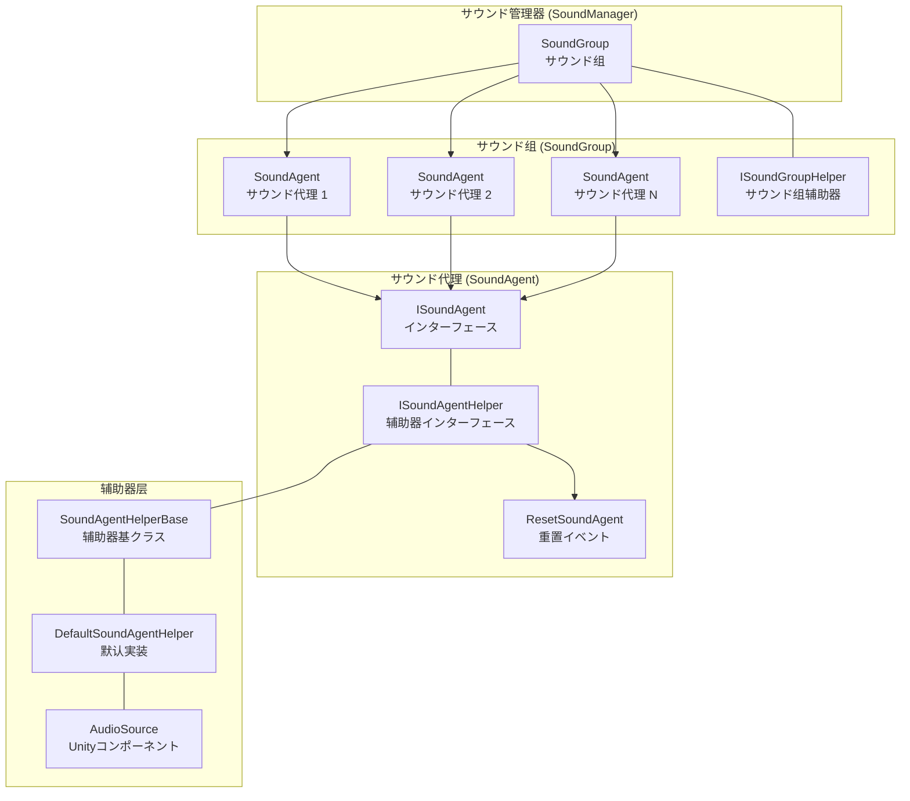
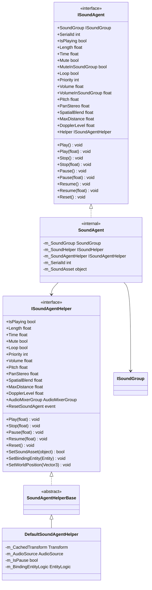
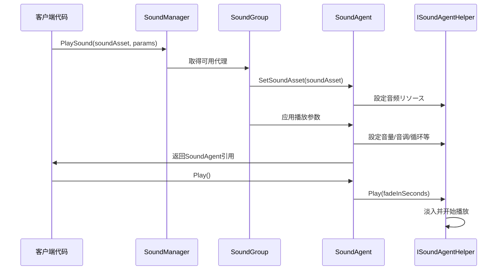
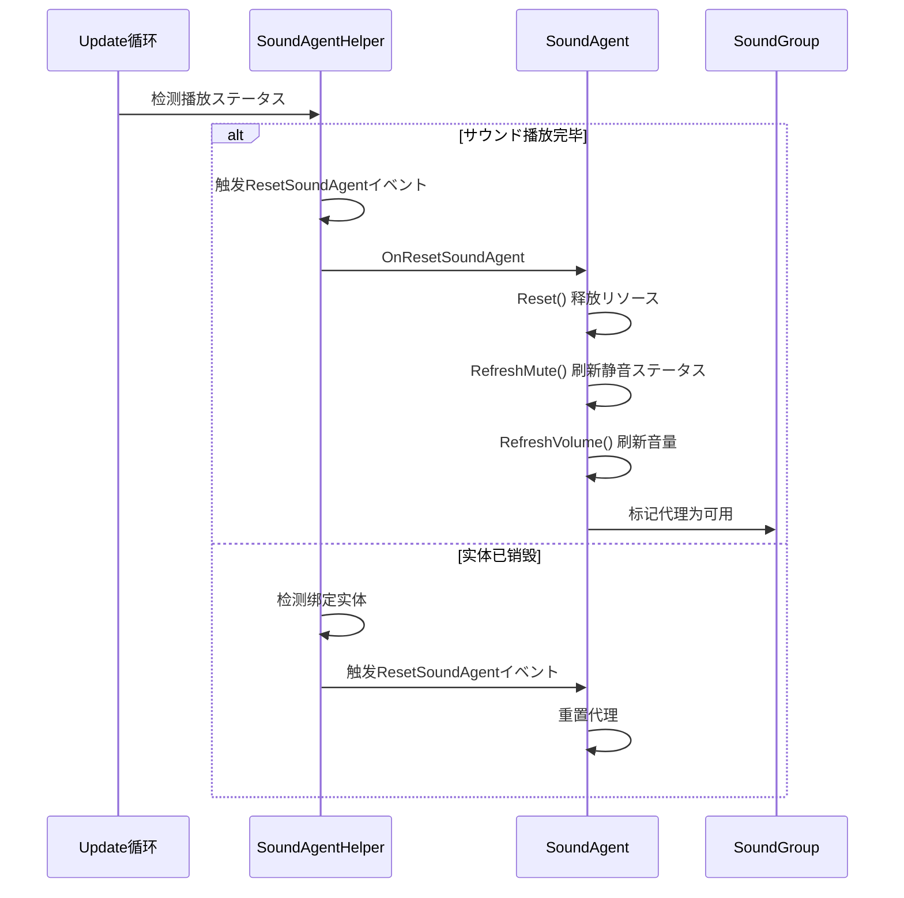

# サウンド代理

サウンド代理（Sound Agent）是 GameFrameX サウンド系统中的最小播放单元，负责管理单个音频インスタンス的播放、控制和ステータス。每个サウンド代理代表一个具体的サウンド播放通道，可能独立控制音量、音调、循环、静音等プロパティ。

## 概要

サウンド代理是サウンド系统架构中的コアコンポーネント，位于サウンド组（SoundGroup）的下一层级。在ゲーム中，当必要播放一个音效或背景音乐时，サウンド系统会从对应的サウンド组中取得一个可用的サウンド代理来执行播放任务。

### 设计意图

サウンド代理的设计采用了代理模式（Proxy Pattern）和オブジェクトプール（Object Pool）思想的结合：

1. **代理模式**：サウンド代理作为上层业务逻辑与底层音频実装之间的中介，を通じて ISoundAgent インターフェース封装了复杂的播放控制逻辑
2. **オブジェクトプール思想**：サウンド组预先作成一定数量的サウンド代理，必要播放サウンド时从池中取得，播放完毕后归还，避免频繁作成销毁带来的性能开销
3. **分层设计**：を通じて ISoundAgentHelper インターフェース隔离 Unity 特定的 AudioSource 実装，便于扩展和替换

### コア职责

サウンド代理的主要职责包括：

- **播放控制**：开始、暂停、恢复、停止サウンド播放
- **参数调节**：实时调整音量、音调、立体声相、空间混合等参数
- **ステータス管理**：跟踪播放ステータス（是否正在播放、播放进度等）
- **リソース管理**：加载和释放音频リソース
- **イベント通知**：在播放结束、实体销毁等イベント发生时通知上层

## 架构

### コンポーネント关系图



### クラス图



## コア機能

### 播放控制

サウンド代理提供します完整的播放控制メソッド，サポート带淡入淡出效果的播放过渡：

```csharp
// 直接播放，使用默认淡入时间
agent.Play();

// 带淡入效果的播放，0.5秒内淡入到目标音量
agent.Play(0.5f);

// 直接停止，使用默认淡出时间
agent.Stop();

// 带淡出效果的停止，1秒内淡出
agent.Stop(1.0f);

// 暂停播放
agent.Pause();

// 带淡出效果的暂停
agent.Pause(0.3f);

// 恢复播放
agent.Resume();

// 带淡入效果的恢复
agent.Resume(0.3f);
```
> Source: [ISoundAgent.cs](https://github.com/GameFrameX/com.gameframex.unity.sound/blob/main/Runtime/Interface/ISoundAgent.cs#L125-L167)

### 音量控制

サウンド代理采用双层音量控制机制：代理自身音量 × サウンド组音量，这种设计允许在不改变单个音效音量的前提下统一调节整个サウンド组的音量：

```csharp
// 設定代理自身音量（0.0 - 1.0）
agent.VolumeInSoundGroup = 0.8f;

// 取得实际生效音量（代理音量 × 组音量）
float actualVolume = agent.Volume;
```
> Source: [SoundManager.SoundAgent.cs](https://github.com/GameFrameX/com.gameframex.unity.sound/blob/main/Runtime/Sound/Sound/SoundManager.SoundAgent.cs#L209-L217)</parameter>

### 空间音频

サウンド代理サポート 3D 空间音频效果，可能に基づいて音源与听者的位置关系自动计算音量衰减：

```csharp
// 設定空间混合量（0 = 2D，1 = 3D）
agent.SpatialBlend = 1.0f;

// 設定最大衰减距离
agent.MaxDistance = 50.0f;

// 設定多普勒效应等级
agent.DopplerLevel = 0.5f;
```
> Source: [ISoundAgent.cs](https://github.com/GameFrameX/com.gameframex.unity.sound/blob/main/Runtime/Interface/ISoundAgent.cs#L105-L118)

### 实体绑定

サウンド代理可能绑定到ゲーム实体，使音源位置跟随实体移动：

```csharp
// を通じて辅助器绑定实体
agent.Helper.SetBindingEntity(entity);

// 設定世界坐标位置
agent.Helper.SetWorldPosition(new Vector3(10, 0, 5));
```
> Source: [DefaultSoundAgentHelper.cs](https://github.com/GameFrameX/com.gameframex.unity.sound/blob/main/Runtime/Sound/DefaultSoundAgentHelper.cs#L295-L323)

### 播放进度控制

```csharp
// 取得サウンド总长度
float length = agent.Length;

// 取得或設定当前播放位置（秒）
agent.Time = 5.0f;  // 跳转到第5秒
float currentTime = agent.Time;

// 取得是否正在播放
if (agent.IsPlaying)
{
    Debug.Log($"播放进度: {agent.Time}/{agent.Length}");
}
```
> Source: [ISoundAgent.cs](https://github.com/GameFrameX/com.gameframex.unity.sound/blob/main/Runtime/Interface/ISoundAgent.cs#L50-L63)

## コアフロー

### サウンド播放フロー



### サウンド结束重置フロー

当サウンド播放完毕后，系统会自动触发重置フロー，释放当前代理以供其他サウンド使用：


> Source: [DefaultSoundAgentHelper.cs](https://github.com/GameFrameX/com.gameframex.unity.sound/blob/main/Runtime/Sound/DefaultSoundAgentHelper.cs#L333-L367)

## 扩展自定义辅助器

可能を通じて继承 `SoundAgentHelperBase` 来実装自定义的サウンド代理辅助器，以サポート不同的音频実装方案（如 FMOD、Wwise 等）：

```csharp
using UnityEngine;
using GameFrameX.Sound.Runtime;

public class CustomSoundAgentHelper : SoundAgentHelperBase
{
    private AudioSource m_AudioSource;
    private AudioClip m_CurrentClip;

    public override bool IsPlaying => m_AudioSource?.isPlaying ?? false;

    public override float Length => m_CurrentClip?.length ?? 0f;

    public override float Time
    {
        get => m_AudioSource?.time ?? 0f;
        set { if (m_AudioSource != null) m_AudioSource.time = value; }
    }

    // ... 其他プロパティ実装

    public override void Play(float fadeInSeconds)
    {
        m_AudioSource.Play();
        // 実装自定义淡入逻辑
    }

    public override bool SetSoundAsset(object soundAsset)
    {
        m_CurrentClip = soundAsset as AudioClip;
        if (m_CurrentClip == null) return false;
        
        m_AudioSource.clip = m_CurrentClip;
        return true;
    }

    // ... 其他メソッド実装
}
```
> Source: [SoundAgentHelperBase.cs](https://github.com/GameFrameX/com.gameframex.unity.sound/blob/main/Runtime/Sound/SoundAgentHelperBase.cs#L38-L162)

## プロパティ説明

| プロパティ | クラス型 | 默认值 | 説明 |
|------|------|--------|------|
| SerialId | int | 0 | サウンド的序列编号，に使用标识本次播放お願いします求 |
| IsPlaying | bool | - | 当前是否正在播放 |
| Length | float | 0 | サウンド总时长（秒） |
| Time | float | 0 | 当前播放位置（秒） |
| Mute | bool | false | 是否静音（只读，由组控制） |
| MuteInSoundGroup | bool | false | 在サウンド组内是否静音 |
| Loop | bool | false | 是否循环播放 |
| Priority | int | 0 | サウンド优先级（数值越大优先级越高） |
| Volume | float | 1.0 | 实际生效音量（代理×组） |
| VolumeInSoundGroup | float | 1.0 | 代理自身的音量 |
| Pitch | float | 1.0 | 音调（0.5-2.0） |
| PanStereo | float | 0 | 立体声相（-1左 → 1右） |
| SpatialBlend | float | 0 | 空间混合量（0=2D → 1=3D） |
| MaxDistance | float | 100 | 3D模式下最大衰减距离 |
| DopplerLevel | float | 1 | 多普勒效应等级 |

> Source: [Constant.cs](https://github.com/GameFrameX/com.gameframex.unity.sound/blob/main/Runtime/Sound/Sound/Constant.cs#L38-L99)

## 関連リンク

- [サウンド管理器](./4-core-concepts.1-sound-manager) - サウンド系统的コア管理器
- [サウンド组](./4-core-concepts.2-sound-group) - 管理多个サウンド代理的组
- [インターフェース定义](./5-api-reference.1-interfaces) - ISoundAgent 和 ISoundAgentHelper インターフェース详情
- [イベント参数](./5-api-reference.3-event-args) - サウンド関連イベント参数説明
