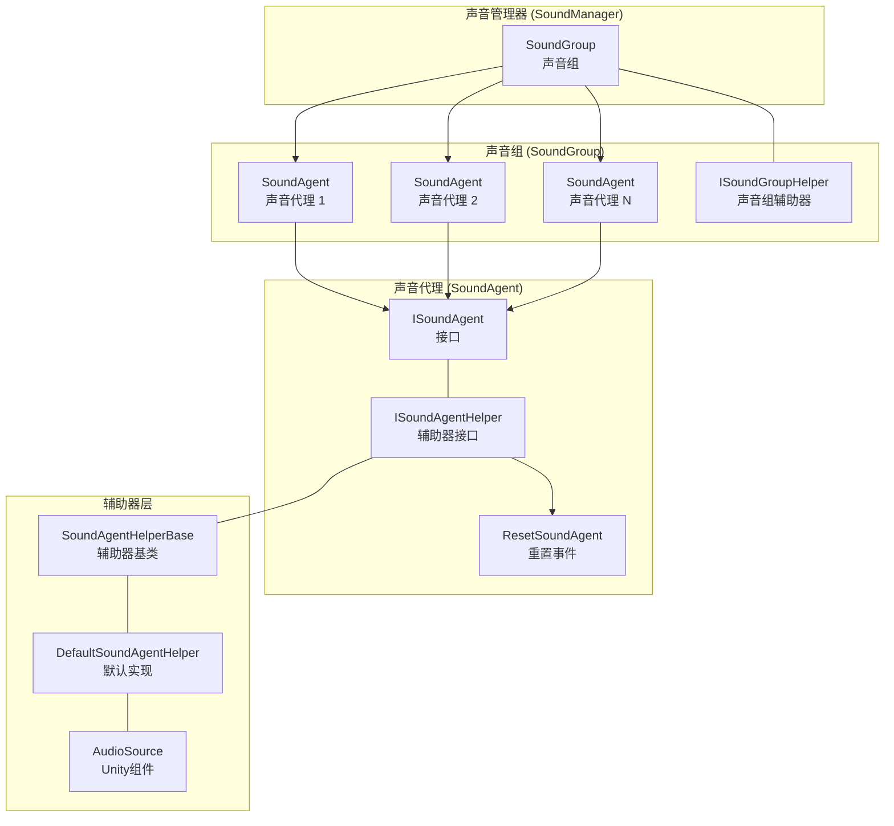
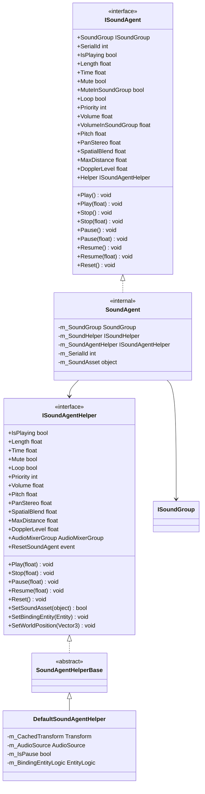
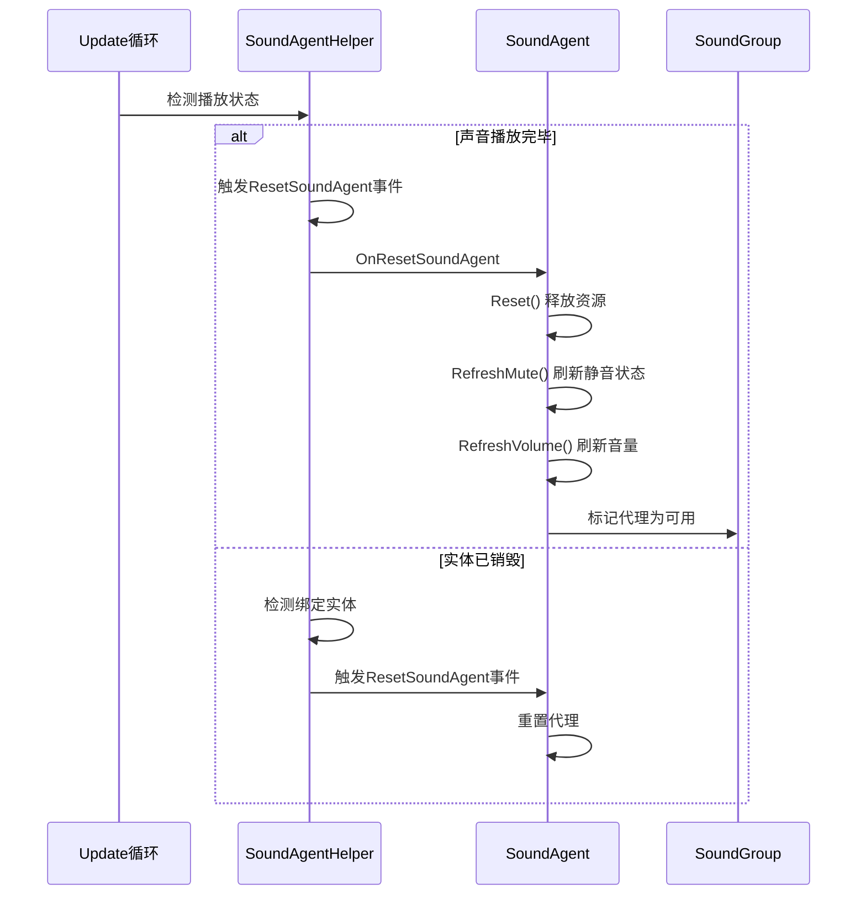

# 声音代理

声音代理（Sound Agent）是 GameFrameX 声音系统中的最小再生单元，负责管理单个音频インスタンス的再生、控制和ステータス。每个声音代理代表一个具体的声音再生通道，〜できます独立控制音量、音调、循环、静音等プロパティ。

## 概要

声音代理是声音系统アーキテクチャ中的コアコンポーネント，位于声音组（SoundGroup）的下一层级。在游戏中，当〜する必要があります再生一个音效或背景音乐时，声音系统会从对应的声音组中取得一个可用的声音代理来执行再生任务。

### 設計意图

声音代理的設計采用了代理モード（Proxy Pattern）和对象池（Object Pool）思想的结合：

1. **代理モード**：声音代理作为上层业务逻辑与底层音频実装之间的中介，通过 ISoundAgent インターフェースカプセル化了複雑的再生控制逻辑
2. **对象池思想**：声音组预先作成一定数量的声音代理，〜する必要があります再生声音时从池中取得，再生完毕后归还，避免频繁作成破棄带来的性能开销
3. **分层設計**：通过 ISoundAgentHelper インターフェース隔离 Unity 特定的 AudioSource 実装，便于拡張和置換

### コア职责

声音代理的主な职责含みます：

- **再生控制**：开始、暂停、恢复、停止声音再生
- **パラメータ调节**：实时调整音量、音调、立体声相、空间混合等パラメータ
- **ステータス管理**：跟踪再生ステータス（是否〜中再生、再生進捗等）
- **リソース管理**：ロード和解放音频リソース
- **イベント通知**：在再生结束、实体破棄等イベント发生时通知上层

## アーキテクチャ

### コンポーネント关系图



### 类图



## コア機能

### 再生控制

声音代理提供します完全な的再生控制メソッド，サポート带淡入淡出效果的再生过渡：

```csharp
// 直接播放，使用默认淡入时间
agent.Play();

// 带淡入效果的播放，0.5秒内淡入到目标音量
agent.Play(0.5f);

// 直接停止，使用默认淡出时间
agent.Stop();

// 带淡出效果的停止，1秒内淡出
agent.Stop(1.0f);

// 暂停播放
agent.Pause();

// 带淡出效果的暂停
agent.Pause(0.3f);

// 恢复播放
agent.Resume();

// 带淡入效果的恢复
agent.Resume(0.3f);
```
> Source: [ISoundAgent.cs](https://github.com/GameFrameX/com.gameframex.unity.sound/blob/main/Runtime/Interface/ISoundAgent.cs#L125-L167)

### 音量控制

声音代理采用双层音量控制机制：代理自身音量 × 声音组音量，这种設計允许在不改变单个音效音量的前提下統一された调节整个声音组的音量：

```csharp
// 设置代理自身音量（0.0 - 1.0）
agent.VolumeInSoundGroup = 0.8f;

// 获取实际生效音量（代理音量 × 组音量）
float actualVolume = agent.Volume;
```
> Source: [SoundManager.SoundAgent.cs](https://github.com/GameFrameX/com.gameframex.unity.sound/blob/main/Runtime/Sound/Sound/SoundManager.SoundAgent.cs#L209-L217)</parameter>

### 空间音频

声音代理サポート 3D 空间音频效果，〜できます根据音源与听者的位置关系自动计算音量衰减：

```csharp
// 设置空间混合量（0 = 2D，1 = 3D）
agent.SpatialBlend = 1.0f;

// 设置最大衰减距离
agent.MaxDistance = 50.0f;

// 设置多普勒效应等级
agent.DopplerLevel = 0.5f;
```
> Source: [ISoundAgent.cs](https://github.com/GameFrameX/com.gameframex.unity.sound/blob/main/Runtime/Interface/ISoundAgent.cs#L105-L118)

### 实体绑定

声音代理〜できます绑定到游戏实体，使音源位置跟随实体移动：

```csharp
// 通过辅助器绑定实体
agent.Helper.SetBindingEntity(entity);

// 设置世界坐标位置
agent.Helper.SetWorldPosition(new Vector3(10, 0, 5));
```
> Source: [DefaultSoundAgentHelper.cs](https://github.com/GameFrameX/com.gameframex.unity.sound/blob/main/Runtime/Sound/DefaultSoundAgentHelper.cs#L295-L323)

### 再生進捗控制

```csharp
// 获取声音总长度
float length = agent.Length;

// 获取或设置当前播放位置（秒）
agent.Time = 5.0f;  // 跳转到第5秒
float currentTime = agent.Time;

// 获取是否正在播放
if (agent.IsPlaying)
{
    Debug.Log($"播放进度: {agent.Time}/{agent.Length}");
}
```
> Source: [ISoundAgent.cs](https://github.com/GameFrameX/com.gameframex.unity.sound/blob/main/Runtime/Interface/ISoundAgent.cs#L50-L63)

## コアフロー

### 声音再生フロー


### 声音结束重置フロー

当声音再生完毕后，系统会自动トリガー重置フロー，解放当前代理以供其他声音使用：


> Source: [DefaultSoundAgentHelper.cs](https://github.com/GameFrameX/com.gameframex.unity.sound/blob/main/Runtime/Sound/DefaultSoundAgentHelper.cs#L333-L367)

## 拡張自定義辅助器

〜できます通过継承 `SoundAgentHelperBase` 来実装自定義的声音代理辅助器，以サポート不同的音频実装方案（如 FMOD、Wwise 等）：

```csharp
using UnityEngine;
using GameFrameX.Sound.Runtime;

public class CustomSoundAgentHelper : SoundAgentHelperBase
{
    private AudioSource m_AudioSource;
    private AudioClip m_CurrentClip;

    public override bool IsPlaying => m_AudioSource?.isPlaying ?? false;

    public override float Length => m_CurrentClip?.length ?? 0f;

    public override float Time
    {
        get => m_AudioSource?.time ?? 0f;
        set { if (m_AudioSource != null) m_AudioSource.time = value; }
    }

    // ... 其他属性实现

    public override void Play(float fadeInSeconds)
    {
        m_AudioSource.Play();
        // 实现自定义淡入逻辑
    }

    public override bool SetSoundAsset(object soundAsset)
    {
        m_CurrentClip = soundAsset as AudioClip;
        if (m_CurrentClip == null) return false;
        
        m_AudioSource.clip = m_CurrentClip;
        return true;
    }

    // ... 其他方法实现
}
```
> Source: [SoundAgentHelperBase.cs](https://github.com/GameFrameX/com.gameframex.unity.sound/blob/main/Runtime/Sound/SoundAgentHelperBase.cs#L38-L162)

## プロパティ説明

| プロパティ | タイプ | デフォルト值 | 説明 |
|------|------|--------|------|
| SerialId | int | 0 | 声音的序列编号，用于标识本次再生请求 |
| IsPlaying | bool | - | 当前是否〜中再生 |
| Length | float | 0 | 声音总时长（秒） |
| Time | float | 0 | 当前再生位置（秒） |
| Mute | bool | false | 是否静音（只读，由组控制） |
| MuteInSoundGroup | bool | false | 在声音组内是否静音 |
| Loop | bool | false | 是否循环再生 |
| Priority | int | 0 | 声音优先级（数值越大优先级越高） |
| Volume | float | 1.0 | 实际生效音量（代理×组） |
| VolumeInSoundGroup | float | 1.0 | 代理自身的音量 |
| Pitch | float | 1.0 | 音调（0.5-2.0） |
| PanStereo | float | 0 | 立体声相（-1左 → 1右） |
| SpatialBlend | float | 0 | 空间混合量（0=2D → 1=3D） |
| MaxDistance | float | 100 | 3Dモード下最大衰减距离 |
| DopplerLevel | float | 1 | 多普勒效应等级 |

> Source: [Constant.cs](https://github.com/GameFrameX/com.gameframex.unity.sound/blob/main/Runtime/Sound/Sound/Constant.cs#L38-L99)

## 関連リンク

- [声音マネージャー](./4-core-concepts.1-sound-manager) - 声音系统的コアマネージャー
- [声音组](./4-core-concepts.2-sound-group) - 管理多个声音代理的组
- [インターフェース定義](./5-api-reference.1-interfaces) - ISoundAgent 和 ISoundAgentHelper インターフェース详情
- [イベントパラメータ](./5-api-reference.3-event-args) - 声音相关イベントパラメータ説明
