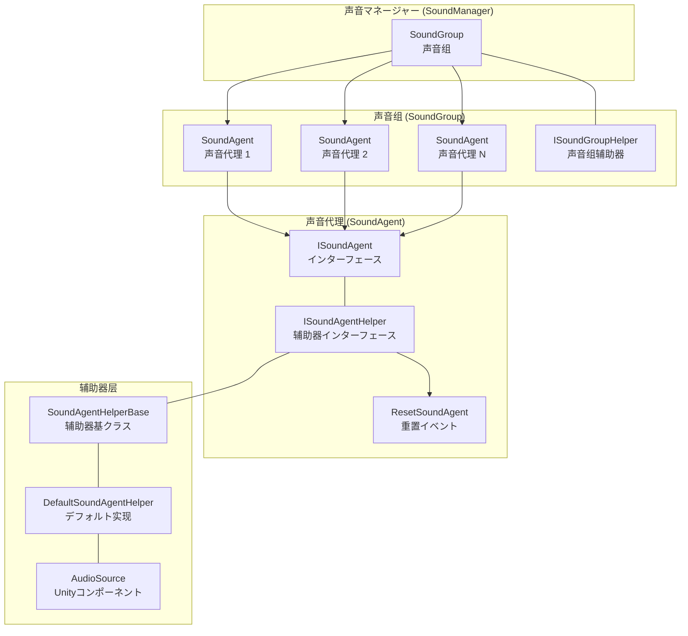
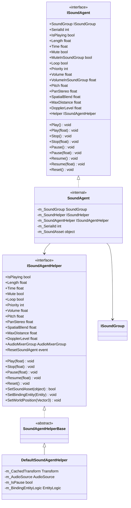
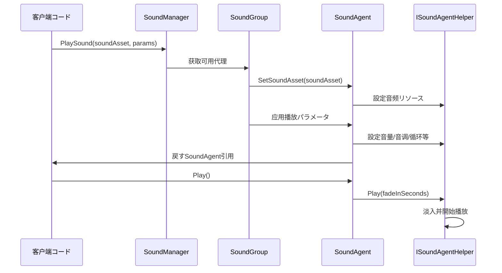
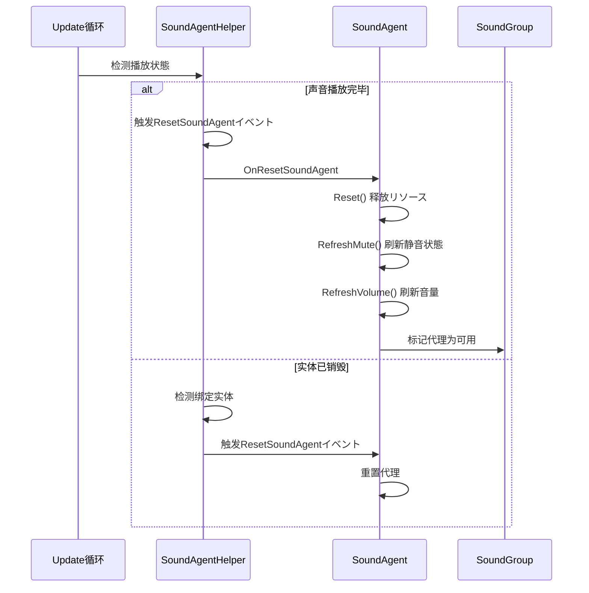

# 

（Sound Agent）は GameFrameX の，の、と。の，、、、プロパティ。

## 

はアーキテクチャのコアコンポーネント，（SoundGroup）の。にゲーム，，のの。

### 

のた（Proxy Pattern）とプール（Object Pool）の：

1. ****：との，をじて ISoundAgent インターフェースたの
2. **プール**：の，プール，，の
3. ****：をじて ISoundAgentHelper インターフェース Unity の AudioSource ，と

### コア

の：

- ****：、、、
- **パラメータ**：、、、パラメータ
- ****：（はに、）
- **リソース**：ロードとリソース
- **イベント**：にた、イベント

## アーキテクチャ

### コンポーネント



### クラス



## コア

### 

たのメソッド，サポートの：

```csharp
// 直接播放，使用デフォルト淡入时间
agent.Play();

// 带淡入效果の播放，0.5秒内淡入到目标音量
agent.Play(0.5f);

// 直接停止，使用デフォルト淡出时间
agent.Stop();

// 带淡出效果の停止，1秒内淡出
agent.Stop(1.0f);

// 暂停播放
agent.Pause();

// 带淡出效果の暂停
agent.Pause(0.3f);

// 恢复播放
agent.Resume();

// 带淡入效果の恢复
agent.Resume(0.3f);
```
> Source: [ISoundAgent.cs](https://github.com/GameFrameX/com.gameframex.unity.sound/blob/main/Runtime/Interface/ISoundAgent.cs#L125-L167)

### 

： × ，にのの：

```csharp
// 設定代理自身音量（0.0 - 1.0）
agent.VolumeInSoundGroup = 0.8f;

// 获取实际生效音量（代理音量 × 组音量）
float actualVolume = agent.Volume;
```
> Source: [SoundManager.SoundAgent.cs](https://github.com/GameFrameX/com.gameframex.unity.sound/blob/main/Runtime/Sound/Sound/SoundManager.SoundAgent.cs#L209-L217)

### 

サポート 3D ，との：

```csharp
// 設定空间混合量（0 = 2D，1 = 3D）
agent.SpatialBlend = 1.0f;

// 設定最大衰减距离
agent.MaxDistance = 50.0f;

// 設定多普勒效应等级
agent.DopplerLevel = 0.5f;
```
> Source: [ISoundAgent.cs](https://github.com/GameFrameX/com.gameframex.unity.sound/blob/main/Runtime/Interface/ISoundAgent.cs#L105-L118)

### 

ゲーム，：

```csharp
// を通じて辅助器绑定实体
agent.Helper.SetBindingEntity(entity);

// 設定世界坐标位置
agent.Helper.SetWorldPosition(new Vector3(10, 0, 5));
```
> Source: [DefaultSoundAgentHelper.cs](https://github.com/GameFrameX/com.gameframex.unity.sound/blob/main/Runtime/Sound/DefaultSoundAgentHelper.cs#L295-L323)

### 

```csharp
// 获取声音总长度
float length = agent.Length;

// 获取或設定当前播放位置（秒）
agent.Time = 5.0f;  // 跳转到第5秒
float currentTime = agent.Time;

// 获取は否正に播放
if (agent.IsPlaying)
{
    Debug.Log($"播放进度: {agent.Time}/{agent.Length}");
}
```
> Source: [ISoundAgent.cs](https://github.com/GameFrameX/com.gameframex.unity.sound/blob/main/Runtime/Interface/ISoundAgent.cs#L50-L63)

## コアフロー

### フロー



### たフロー

，フロー，：


> Source: [DefaultSoundAgentHelper.cs](https://github.com/GameFrameX/com.gameframex.unity.sound/blob/main/Runtime/Sound/DefaultSoundAgentHelper.cs#L333-L367)

## カスタマイズ

をじて `SoundAgentHelperBase` カスタマイズの，サポートの（ FMOD、Wwise ）：

```csharp
using UnityEngine;
using GameFrameX.Sound.Runtime;

public class CustomSoundAgentHelper : SoundAgentHelperBase
{
    private AudioSource m_AudioSource;
    private AudioClip m_CurrentClip;

    public override bool IsPlaying => m_AudioSource?.isPlaying ?? false;

    public override float Length => m_CurrentClip?.length ?? 0f;

    public override float Time
    {
        get => m_AudioSource?.time ?? 0f;
        set { if (m_AudioSource != null) m_AudioSource.time = value; }
    }

    // ... 其他プロパティ实现

    public override void Play(float fadeInSeconds)
    {
        m_AudioSource.Play();
        // 实现カスタマイズ淡入逻辑
    }

    public override bool SetSoundAsset(object soundAsset)
    {
        m_CurrentClip = soundAsset as AudioClip;
        if (m_CurrentClip == null) return false;
        
        m_AudioSource.clip = m_CurrentClip;
        return true;
    }

    // ... 其他メソッド实现
}
```
> Source: [SoundAgentHelperBase.cs](https://github.com/GameFrameX/com.gameframex.unity.sound/blob/main/Runtime/Sound/SoundAgentHelperBase.cs#L38-L162)

## プロパティ

| プロパティ | タイプ | デフォルト |  |
|------|------|--------|------|
| SerialId | int | 0 | の，にリクエスト |
| IsPlaying | bool | - | はに |
| Length | float | 0 | （） |
| Time | float | 0 | （） |
| Mute | bool | false | は（，） |
| MuteInSoundGroup | bool | false | には |
| Loop | bool | false | は |
| Priority | int | 0 | （） |
| Volume | float | 1.0 | （×） |
| VolumeInSoundGroup | float | 1.0 | の |
| Pitch | float | 1.0 | （0.5-2.0） |
| PanStereo | float | 0 | （-1 → 1） |
| SpatialBlend | float | 0 | （0=2D → 1=3D） |
| MaxDistance | float | 100 | 3D |
| DopplerLevel | float | 1 |  |

> Source: [Constant.cs](https://github.com/GameFrameX/com.gameframex.unity.sound/blob/main/Runtime/Sound/Sound/Constant.cs#L38-L99)

## リンク

- [マネージャー](./4-core-concepts.1-sound-manager) - のコアマネージャー
- [](./4-core-concepts.2-sound-group) - の
- [インターフェース](./5-api-reference.1-interfaces) - ISoundAgent と ISoundAgentHelper インターフェース
- [イベント](./5-api-reference.3-event-args) - イベント
