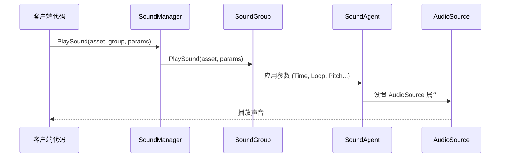

# 再生パラメータ

PlaySoundParams 类用于設定声音再生的各种プロパティ，含みます音量、音调、循环、淡入淡出等パラメータ。这些パラメータ在再生声音时传递给 SoundManager，以控制声音的具体再生方法。

## 概要

PlaySoundParams 是声音系统的コアパラメータ类，它カプセル化了再生声音时所需的所有設定オプション。このクラス実装了 IReference インターフェース，サポート对象池化管理，〜できます重复使用以减少内存分配。

在呼び出し ISoundManager.PlaySound メソッド时，〜できます传入 PlaySoundParams インスタンス来定制化声音的再生行为。もし传入 null 或不传入パラメータ，系统将使用デフォルトパラメータ值。

### 設計意图

PlaySoundParams 采用パラメータ对象モード（Parameter Object Pattern），将多个相关的再生パラメータカプセル化为一个对象。这种設計：

- **簡素化 API**：避免在 PlaySound メソッド中传递大量独立パラメータ
- **提高可读性**：通过命名プロパティ使パラメータ意味清晰明了
- **サポートデフォルト值**：所有パラメータ都有合理的デフォルト值，无需全部設定
- **对象池化**：実装 IReference インターフェース，サポート ReferencePool 回收复用

### パラメータ应用フロー



## パラメータ説明

### 再生控制パラメータ

| パラメータ | タイプ | デフォルト值 | 説明 |
|------|------|--------|------|
| Time | float | 0f | 再生位置（秒），从指定时间开始再生 |
| Loop | bool | false | 是否循环再生 |
| FadeInSeconds | float | 0f | 淡入时间（秒），再生开始时的音量渐变 |

### 声音组パラメータ

| パラメータ | タイプ | デフォルト值 | 説明 |
|------|------|--------|------|
| MuteInSoundGroup | bool | false | 在所属声音组内是否静音 |
| VolumeInSoundGroup | float | 1f | 在所属声音组内的音量（0.0-1.0） |
| Priority | int | 0 | 声音优先级，数值越高优先级越高 |

### 音效パラメータ

| パラメータ | タイプ | デフォルト值 | 説明 |
|------|------|--------|------|
| Pitch | float | 1f | 音调，1.0 为正常速度 |
| PanStereo | float | 0f | 立体声位置，-1 为左声道，1 为右声道 |

### 空间音频パラメータ

| パラメータ | タイプ | デフォルト值 | 説明 |
|------|------|--------|------|
| SpatialBlend | float | 0f | 空间混合量，0 为 2D 声音，1 为 3D 声音 |
| MaxDistance | float | 100f | 最大衰减距离（仅 3D 声音有效） |
| DopplerLevel | float | 1f | 多普勒效应等级，0 为禁用 |

## 詳細パラメータ解释

### Time - 再生位置

設定声音开始再生的位置（以秒为单位）。这对于実装断点续播、预览機能或跳过片头非常有用。

```csharp
var playSoundParams = PlaySoundParams.Create();
playSoundParams.Time = 5.5f; // 从第5.5秒开始播放
await soundManager.PlaySound("bgm_music", "MusicGroup", playSoundParams);
```
> Source: [PlaySoundParams.cs](https://github.com/GameFrameX/com.gameframex.unity.sound/blob/main/Runtime/Sound/Sound/PlaySoundParams.cs#L124-L128)

### Loop - 循环再生

控制声音是否循环再生。对于背景音乐或環境音效通常設定为 true，对于一次性音效設定为 false。

```csharp
// 播放循环背景音乐
var musicParams = PlaySoundParams.Create(isLoop: true);
// 或者
var musicParams = PlaySoundParams.Create();
musicParams.Loop = true;
await soundManager.PlaySound("bgm_forest", "MusicGroup", musicParams);
```
> Source: [PlaySoundParams.cs](https://github.com/GameFrameX/com.gameframex.unity.sound/blob/main/Runtime/Sound/Sound/PlaySoundParams.cs#L142-L146)

### FadeInSeconds - 淡入时间

設定声音开始再生时的淡入时间，使音量从 0 逐渐过渡到目标音量。这对于避免突然的声音爆发非常有用。

```csharp
var playSoundParams = PlaySoundParams.Create();
playSoundParams.FadeInSeconds = 2.0f; // 2秒淡入
await soundManager.PlaySound("ui_click", "UIGroup", playSoundParams);
```
> Source: [PlaySoundParams.cs](https://github.com/GameFrameX/com.gameframex.unity.sound/blob/main/Runtime/Sound/Sound/PlaySoundParams.cs#L169-L173)

### MuteInSoundGroup - 组内静音

控制该声音在其所属声音组内是否静音。注意：つまり使設定为静音，该声音仍然会占用声音组的再生通道。

```csharp
var playSoundParams = PlaySoundParams.Create();
playSoundParams.MuteInSoundGroup = true; // 暂时静音
await soundManager.PlaySound("voice_intro", "VoiceGroup", playSoundParams);
```
> Source: [PlaySoundParams.cs](https://github.com/GameFrameX/com.gameframex.unity.sound/blob/main/Runtime/Sound/Sound/PlaySoundParams.cs#L133-L137)

### VolumeInSoundGroup - 组内音量

設定该声音在其所属声音组内的音量系数。最终音量 = 声音组音量 × 个体音量。

```csharp
var playSoundParams = PlaySoundParams.Create();
playSoundParams.VolumeInSoundGroup = 0.5f; // 50% 音量
await soundManager.PlaySound("effect_explosion", "EffectGroup", playSoundParams);
```
> Source: [PlaySoundParams.cs](https://github.com/GameFrameX/com.gameframex.unity.sound/blob/main/Runtime/Sound/Sound/PlaySoundParams.cs#L160-L164)

### Priority - 优先级

設定声音的优先级。当声音组中没有可用的再生通道时，低优先级的声音会被高优先级的置換。优先级范围お勧め：0-255，数值越高优先级越高。

```csharp
var playSoundParams = PlaySoundParams.Create();
playSoundParams.Priority = 100; // 高优先级
await soundManager.PlaySound("ui_important", "UIGroup", playSoundParams);
```
> Source: [PlaySoundParams.cs](https://github.com/GameFrameX/com.gameframex.unity.sound/blob/main/Runtime/Sound/Sound/PlaySoundParams.cs#L151-L155)

### Pitch - 音调

调整声音的再生速度/音调。1.0 为正常速度，小于 1.0 为慢速/低音调，大于 1.0 为快速/高音调。

```csharp
var playSoundParams = PlaySoundParams.Create();
playSoundParams.Pitch = 0.8f; // 稍微降低音调
await soundManager.PlaySound("npc_voice", "VoiceGroup", playSoundParams);
```
> Source: [PlaySoundParams.cs](https://github.com/GameFrameX/com.gameframex.unity.sound/blob/main/Runtime/Sound/Sound/PlaySoundParams.cs#L178-L182)

### PanStereo - 立体声位置

控制声音在左右声道之间的位置。-1.0 为完全左声道，0.0 为居中，1.0 为完全右声道。

```csharp
var playSoundParams = PlaySoundParams.Create();
playSoundParams.PanStereo = -0.5f; // 偏左
await soundManager.PlaySound("footstep_left", "EffectGroup", playSoundParams);
```
> Source: [PlaySoundParams.cs](https://github.com/GameFrameX/com.gameframex.unity.sound/blob/main/Runtime/Sound/Sound/PlaySoundParams.cs#L187-L191)

### SpatialBlend - 空间混合

控制声音从 2D（立体声）到 3D（空间化）的过渡。0.0 为完全 2D 声音，1.0 为完全 3D 声音。

```csharp
var playSoundParams = PlaySoundParams.Create();
playSoundParams.SpatialBlend = 1.0f; // 完全 3D 声音
playSoundParams.MaxDistance = 50f;
await soundManager.PlaySound("ambient_bird", "WorldGroup", playSoundParams);
```
> Source: [PlaySoundParams.cs](https://github.com/GameFrameX/com.gameframex.unity.sound/blob/main/Runtime/Sound/Sound/PlaySoundParams.cs#L196-L200)

### MaxDistance - 最大距离

設定 3D 声音的最大衰减距离。超过此距离后，声音音量不再继续衰减。

```csharp
var playSoundParams = PlaySoundParams.Create();
playSoundParams.SpatialBlend = 1.0f;
playSoundParams.MaxDistance = 30f; // 30米外听不到
await soundManager.PlaySound("car_engine", "WorldGroup", playSoundParams);
```
> Source: [PlaySoundParams.cs](https://github.com/GameFrameX/com.gameframex.unity.sound/blob/main/Runtime/Sound/Sound/PlaySoundParams.cs#L205-L209)

### DopplerLevel - 多普勒等级

設定 3D 声音的多普勒效应强度。当声源和听者相对移动时，会产生多普勒频移效果。0.0 为禁用，1.0 为正常强度。

```csharp
var playSoundParams = PlaySoundParams.Create();
playSoundParams.SpatialBlend = 1.0f;
playSoundParams.DopplerLevel = 0.5f; // 减弱多普勒效果
await soundManager.PlaySound("car_passing", "WorldGroup", playSoundParams);
```
> Source: [PlaySoundParams.cs](https://github.com/GameFrameX/com.gameframex.unity.sound/blob/main/Runtime/Sound/Sound/PlaySoundParams.cs#L214-L218)

## 使用メソッド

### 作成再生パラメータ

推奨使用静态工厂メソッド `Create()` 作成 PlaySoundParams インスタンス，该メソッド从对象池中取得インスタンス：

```csharp
// 基础用法：使用默认参数
var playSoundParams = PlaySoundParams.Create();

// 带循环参数
var loopParams = PlaySoundParams.Create(isLoop: true);
```
> Source: [PlaySoundParams.cs](https://github.com/GameFrameX/com.gameframex.unity.sound/blob/main/Runtime/Sound/Sound/PlaySoundParams.cs#L233-L239)

### 完全な使用例

```csharp
// 创建播放参数并配置
var playSoundParams = PlaySoundParams.Create();
playSoundParams.Loop = true;                      // 循环播放
playSoundParams.VolumeInSoundGroup = 0.8f;        // 80% 音量
playSoundParams.Priority = 100;                   // 高优先级
playSoundParams.FadeInSeconds = 1.0f;             // 1秒淡入
playSoundParams.Pitch = 1.0f;                      // 正常音调

// 播放声音
int serialId = await soundManager.PlaySound("bgm_battle", "MusicGroup", playSoundParams);
```
> Source: [ISoundManager.cs](https://github.com/GameFrameX/com.gameframex.unity.sound/blob/main/Runtime/Interface/ISoundManager.cs#L165-L167)

### パラメータ到 AudioSource 的映射

PlaySoundParams 中的パラメータ最终会映射到 Unity 的 AudioSource コンポーネント：

| PlaySoundParams | AudioSource | 説明 |
|-----------------|-------------|------|
| Time | time | 再生位置 |
| MuteInSoundGroup | mute × groupMute | 组内静音 |
| Loop | loop | 循环再生 |
| Priority | priority | 优先级 |
| VolumeInSoundGroup | volume × groupVolume | 组内音量 |
| FadeInSeconds | Play() 时渐变 | 淡入时间 |
| Pitch | pitch | 音调 |
| PanStereo | panStereo | 立体声位置 |
| SpatialBlend | spatialBlend | 空间混合 |
| MaxDistance | maxDistance | 最大距离 |
| DopplerLevel | dopplerLevel | 多普勒等级 |

> Source: [SoundManager.SoundGroup.cs](https://github.com/GameFrameX/com.gameframex.unity.sound/blob/main/Runtime/Sound/Sound/SoundManager.SoundGroup.cs#L216-L226)

## 注意事项

1. **对象池管理**：使用 `PlaySoundParams.Create()` 作成的パラメータ在再生完成后会自动解放回对象池，无需手动解放。

2. **もしパラメータ为 null**：呼び出し PlaySound 时传入 null パラメータ，系统会自动作成デフォルトパラメータ的 PlaySoundParams。

3. **优先级与通道**：当声音组的所有通道都被占用时，低优先级的〜中再生的声音会被新来的高优先级声音置換。

4. **音量叠加**：最终音量 = 声音组音量（SoundGroup.Volume）× 个体音量（VolumeInSoundGroup）。

5. **空间音频**：空间相关パラメータ（MaxDistance、DopplerLevel）〜する必要があります将 SpatialBlend 設定为大于 0 的值才能生效。

## 関連リンク

- [インターフェース定義](./5-api-reference.1-interfaces) - ISoundManager 和相关インターフェース
- [イベントパラメータ](./5-api-reference.3-event-args) - 再生イベント相关パラメータ
- [声音マネージャー](./4-core-concepts.1-sound-manager) - 声音マネージャー详解
- [声音组](./4-core-concepts.2-sound-group) - 声音组管理
- [声音代理](./4-core-concepts.3-sound-agent) - 声音代理详解
